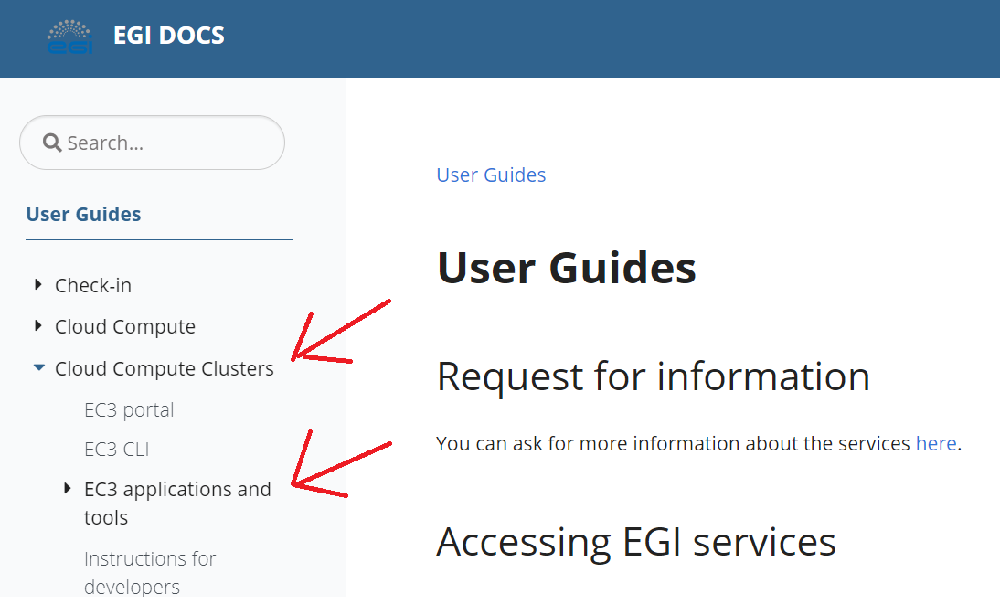
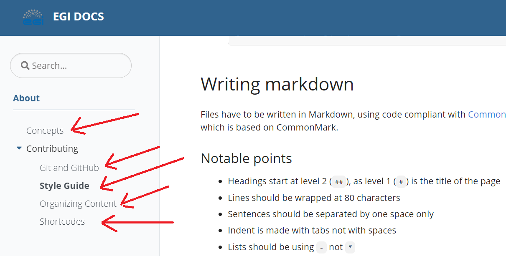
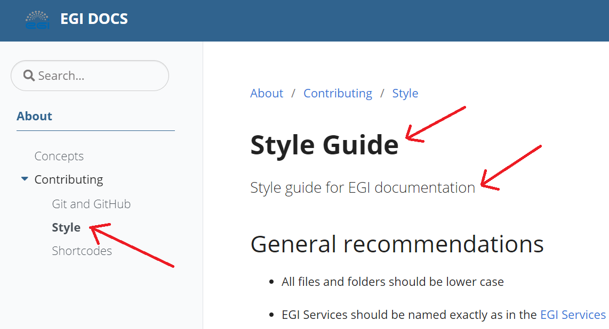

The EGI documentation is a static site built using
[Hugo](https://gohugo.io/getting-started/configuration-markup/)
from Markdown source files. Hugo uses
[goldmark](https://github.com/yuin/goldmark/) to parse and render markdown,
which is compliant with [CommonMark](https://spec.commonmark.org/0.29/) and
[GitHub Flavored Markdown](https://github.github.com/gfm/) (also based
on CommonMark).

The EGI documentation is organized into [sections](#sections) and
[pages](#pages). Read below to understand when to use each of these,
and how to create new sections and add new pages to a section.

{} Avoid using pages in the
documentation for now, create a distinct section for every page, because
currently there is no way to automatically validate links in pages.
{}

## Sections

Sections are those pages that can have subpages. They always appear in
bold in the left-side navigation tree: 

Sections are also pages, meaning that selecting them in the
navigation tree will show their content.

### Creating sections

To create a new section, create a folder under `/content/<language>/`,
add a file named `_index.md` to it, then author content for it as described
[below](#creating-pages).

{} Sections immediately
under `/content/<language>/` can show up in the top-level navigation bar.
See [below](#add-page-to-top-navigation-bar) for details on how to control this.
{}

## Pages

Pages are [Markdown](https://spec.commonmark.org/0.29/) files that contain the
documentation about a specific topic. They hold the content for a section
(in which case are named `_index.md` and the containing folder is the section),
or a stand-alone page that is immediately under a section (the containing
folder is the section).

This is how stand-alone pages appear in the left-side navigation tree:


### Creating pages

Creating a documentation page is done by creating a Markdown file (with
`.md` extension) under the relevant section (in the section's folder).

{} When authoring pages please observe
and adhere to the [Style Guide](../contributing/style).
{}

### Page metadata

Each page needs some metadata that controls where the page appears and how
its content will be rendered. The beginning of the Markdown file contains a
[front matter](https://gohugo.io/content-management/front-matter/) in YAML,
holding the metadata of the page:

```yaml
---
title: "Style"
linkTitle: "Style Guide"
description: "Style guide for EGI documentation"
type: docs
weight: 30
---
```

The parameter `weight` controls the order of the pages on the same level in
the left-side navigation tree. Pages will appear in **ascending** order of their
weight.

The above metadata produces the following result (relevant elements highlighted):


### Add page to top navigation bar

Pages can be added to the top navigation bar by using a front matter like this:

```markdown
---
title: "About"
description: "About EGI Documentation"
type: docs
menu:
  main:
    weight: 50
---
```

Pages will be added to the top navigation bar in **ascending** order of
their menu weight, from left to right.

If you also want to add an icon to the entry in the top navigation bar:

```markdown
---
title: "About"
description: "About EGI Documentation"
type: docs
menu:
  main:
    weight: 50
    pre: <i class='fa fa-info'></i>
---
```

### Embedding images (or other content)

Hugo [organizes](https://gohugo.io/content-management/organization/) content
for each page into a subfolder with the same name as the page's filename.
This allows authors to easily keep track of the resources used by each page.

Let's assume we have a section named **About** with a subpage **Concepts**, using
the following hierarchy of files:

```shell
/documentation
    /content
        /en
            /about
                _index.md
                concepts.md
                map.png
                /concepts
                    metadata.png
```

[Embedding](https://spec.commonmark.org/0.29/#images) an image in the page of
the section (the file `_index.md`) can be done with:

```markdown

```

[Embedding](https://spec.commonmark.org/0.29/#images) an image in a subpage can
be done by editing the Markdown file of the page (`concepts.md` in our case):

```markdown


```

{} For subpages, the (relative) path to
the image already includes a folder with the same name as the file's base name.
{}

### Linking to pages

You can include hyperlinks in the documentation that will
[link](https://spec.commonmark.org/0.29/#links) to any documentation page,
or to external resources.

Assuming we have the same section named **About** with a subpage **Concepts**
as used [above](#embedding-images-or-other-content), and the file `_index.md`
contains this:

```markdown
This is a link to a [page](concepts)
This is another link to the same [page](concepts.md)
```

while the page `concepts.md` contains this:

```markdown
This is link to a [section](../)
This another link to a [section](../../about)
```

the links in these pages exemplify how to link to a different page,
be it a section or a stand-alone page.

{} When linking to a stand-alone page,
if you omit the file extension, `.md` will be assumed.
{}

### Linking to documentation headings

You can also include hyperlinks in the documentation that will
[link](https://spec.commonmark.org/0.29/#links) to any heading (aka chapter)
from any documentation page.

To link to a heading in a documentation page, you need to point the hyperlink
to the anchor created automatically by Markdown for the targeted heading.

{} You can derive the anchor from the
name of the target heading, by converting it to lowercase, removing
non-alphanumeric characters, replacing spaces with dashes, and keeping
exactly one dash separating each subsequent word pair in the anchor.
{}

Below you have an example of a page with sample headings and links to
those headings:

```markdown
This is a link to a [chapter](#some-chapter-title)
This is a link to another [subchapter](#some-subchapter-title)

## Some chapter title
...
### Some subchapter title
...
```

Assuming we have the same section named **About** with a subpage **Concepts**
as used [above](#embedding-images-or-other-content), and the file `_index.md`
contains this:

```markdown
## Section chapter
This is a link to a [page chapter](concepts#page-chapter)
This is another link to the same [page chapter](concepts.md#page-chapter)
```

while the page `concepts.md` contains this:

```markdown
## Page chapter
This s link to a [section chapter](../#section-chapter)
This s link to a [section chapter](../../about#section-chapter)
```

the links in these pages exemplify how to link to headings in a
different page or section.

## Glossary

{} The EGI Glossary is available on the
[EGI Glossary space](http://go.egi.eu/glossary).
{}
