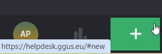
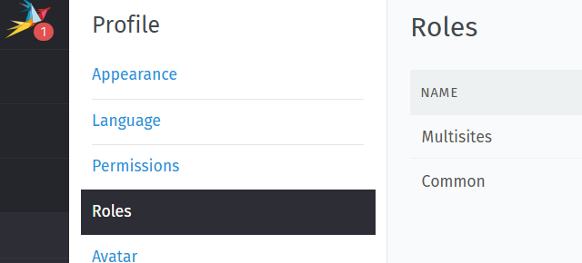

## Access the EGI Helpdesk service

Users can access the [EGI Helpdesk service GGUS](https://helpdesk.egi.eu/) 
with an existing institutional/social account through EGI Check-in.

When you access the service for the first time, you are automatically assigned
a role with minimal privileges by default: in such a situation you can only
create user tickets and can't access tickets created by other users.

In order to create your first ticket, please use the green "+" button in the
lower left part of your screen.

## Roles management

Roles in GGUS define the permissions and capabilities each user has when
interacting with tickets. Proper role assignment ensures that users have
access to the appropriate tools and information they need for their specific
tasks.

**Note: Currently the roles are managed within GGUS; we are planning to move
the roles management to EGI Check-in.**

### How to check your roles

You can check your assigned role by following these steps (not available for
users with the default role):

1. Click on your User Logo in the lower left corner of the screen.
2. Navigate to Profile and select Roles.

