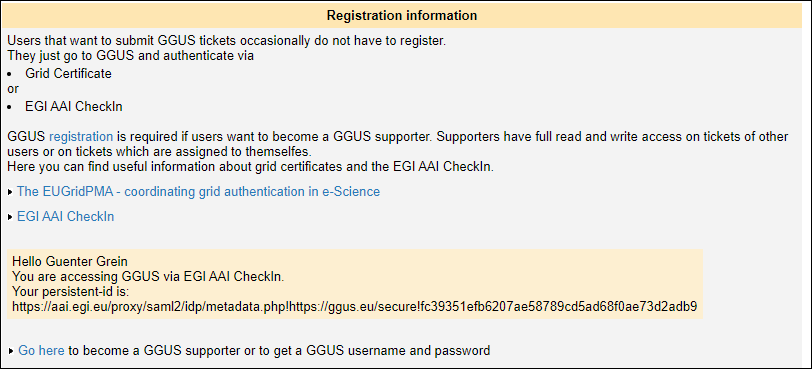
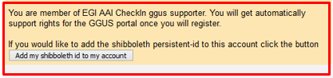
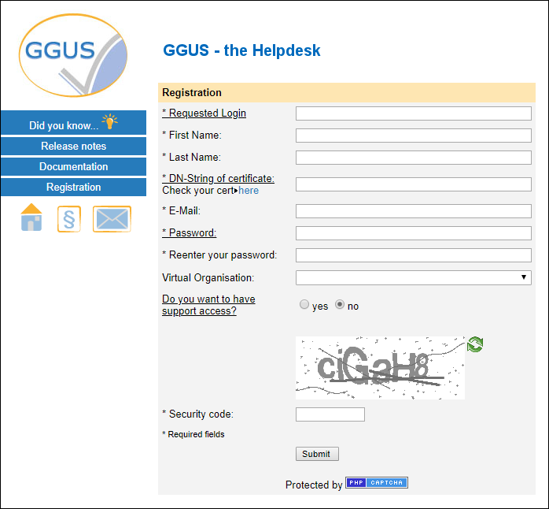

placing some content to move
https://wiki.egi.eu/wiki/FAQ_GGUS-Account
https://wiki.egi.eu/wiki/FAQ_GGUS-Get-Support-Privileges

# GGUS account

## Managing GGUS account data

GGUS users should be able to manage their GGUS account data by themselves.

Information about registration and account management is collected on 
[GGUS registration page](https://ggus.eu/?mode=register_info) 
and could be reached by clicking the "Registration" link on top of 
[GGUS home page](http://ggus.org/).

For managing the GGUS account data the user has to click the link “Check your GGUS account”
at the bottom of this page.

## Updating the personal certificate information

Users should update their certificate information before their old certificate expires.
They can navigate to the [registration page](https://ggus.eu/?mode=register_info),
click the link "Check your GGUS account" and update their data. Modifying the DN field will
result in an additional DN field: the old DN will be kept and the new DN will be added.
Subsequently, the user is identified with the two DNs. If the old DN is not valid anymore
please just clear the DN field and save the change. Once the old certificate has expired
before updating the account data, users can request an update via GGUS ticket against
Helpdesk(GGUS) support unit.

## Linking the EGI SSO persistent ID to the GGUS account

**Pre-requisites: the email address of your EGI SSO account must be equal to the email address registered in GGUS!**

For adding your EGI SSO persistent ID to your account data please do the following:

- login to GGUS using your EGI SSO account
- on GGUS home click the [Registration](https://ggus.eu/?mode=register_info) link

- click the button "Add my shibboleth id to my account" at the bottom of the yellow box.

## I'm member of ggus-supporters.egi.eu group. Why don't I have support privileges in GGUS?

**Pre-requisites: the email address of your EGI SSO account must be equal to the email address registered in GGUS!**

- Case 1: user isn't registered in GGUS yet.

Unregistered users have to register first. On [registration page](https://ggus.eu/?mode=register_info)
you will see this text: “You are member of EGI AAI CheckIn ggus supporter. You will get
automatically support right for the GGUS portal once you will submit this form.“
Support permissions will be granted automatically.

Click on the "Add my ...." button.

- Case 2: user already registered in GGUS with an x509 DN.

You can decide to add the shibboleth id to the existing account and check the updated account.
In case the email addresses are different you may either harmonize your email address in EGI SSO
and GGUS account or create a new account using EGI SSO data.

## Getting supporter privileges

In order to process tickets assigned to the support unit you belong to, or in general tickets submitted
by other users and assigned to other support units, you need to own supporter privileges.
Therefore users need to register an account at GGUS. Registration can be done either using an x509
personal certificate or using the EGI AAI account.

### Registration with an x509 certificate

For registering with an x509 certificate the user should go to [GGUS home](https://ggus.eu/index.php?mode=index)
and click the [registration link](https://ggus.eu/?mode=register_info) in the menu bar at the left.
This link opens the registration information page which gives some additional information about
registration process. Clicking on the [registration link](https://ggus.eu/?mode=register_info) guides
to the form that the user has to fill in. After filling in the registration form, GGUS team will check
whether support privileges can be granted. The user will receive an e-mail from the GGUS team (usually)
confirming their supporter privileges.

### Registration with the EGI AAI account

Users who do not have a valid x509 certificate can access GGUS via the EGI AAI. For getting support
privileges the user needs to be member of the
[ggus-supporters](https://aai.egi.eu/registry/co_petitions/start/coef:69) group in EGI AAI.
However the user has to fill in the [registration form](https://ggus.eu/?mode=register_info) for
creating an account at GGUS. Support privileges will be granted automatically. The user will receive
an automated e-mail from GGUS system confirming their support privileges.

How can I contact the GGUS team?
The GGUS team could be contacted by either using the Contact link in the navigation bar of GGUS
home page or by sending an email to supportatnospamggus.org.

What if I have questions which are not dealt with by this FAQ?
Please submit a GGUS ticket or send your question by mail to supportatnospamggus.org.

