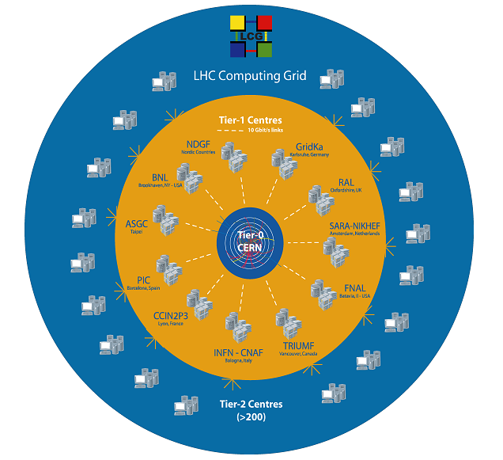
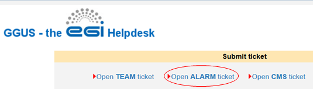
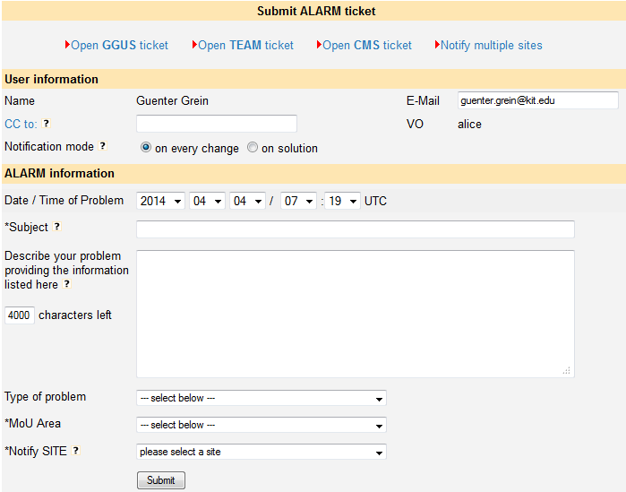
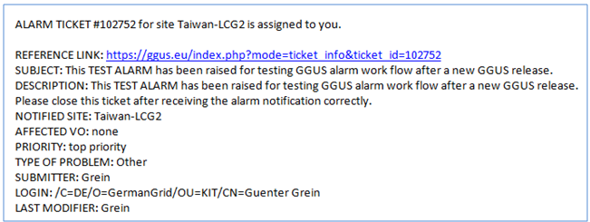
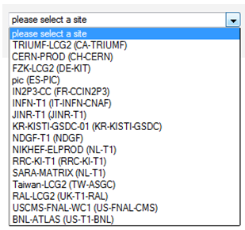

## Introduction: purpose and conditions

- The purpose of ALARM tickets is to notify WLCG Tier-0 and Tier-1
administrators about serious problems of the site at any time, independent from
usual office hours.
- Only experts, nominated by the WLCG VOs are allowed to submit alarm tickets.
They need to have the appropriate permissions in GGUS user database.
- The involved VOs are:
  - Alice
  - Atlas
  - Cms
  - Lhcb
- Only the Tier-0 & Tier-1 sites are involved in the alarm tickets process.
The WLCG Tier-0/Tier-1 site names can be used as well as the relevant GOC DB
site names.
- Alarm tickets are routed to the NGI/ROC the tier site belongs to automatically.
They do not need a routing by the TPM. The NGI/ROC is notified about the ticket in
the usual way. In parallel the site receives an alarm email signed with a GGUS
certificate. This alarm email is processed at the Tier-0/Tier-1 and notifies the
relevant people at any time.
- Alarm email addresses are taken from GOC DB for the EGI sites and from OIM for
the OSG sites. VOMS is used by GGUS as the information source for authorised alarmers.

### Becoming an Alarm-ticket member

People who want to become an alarmer have to

- register in GGUS first
- be added to the appropriate group in a VOMS server.

GGUS system synchronizes its user database once per night with the VOMS servers.
The synchronization is based on the DN string. Please make sure the DN of your GGUS
account is the same than the one registered in VOMS.

Tier-1 site admins can become alarmers for testing the alarm process for their site.
They have to fill in the [registration form](https://ggus.eu/?mode=register) for
supporters. Please add an appropriate comment (e.g. "I'm a xxx tier-1 site admins and
I want to become an alarmer for testing purposes.") in the registration form.

## Technical description
This section describes the workflows of alarm tickets from a technical point of view.

### ALARM ticket submission
Alarm tickets can be submitted using the GGUS web portal. On top of the ticket submit
form in GGUS web portal there is a link to the submit form for alarm tickets.

As alarm ticket submitters are experts who will hopefully provide all necessary
information, the number of fields on the alarm ticket submit form is reduced to a
minimum compared to the number of fields on the user ticket submit form.

Three fields on this form are mandatory:

- Subject
- MoU Area
- Notified Site

All other fields are optional.

### ALARM ticket processing

The processing of a team ticket consists of two main parts: the notification of the
notified site and the routing of the ticket to the NGI/ROC the site belongs to.

#### Tier-1 site notification

In parallel to the creation of an alarm ticket, the GGUS system sends an alarm email
directly to the tier 1 site specified in field “Notify SITE”. This email is sent to a
specific site alarm mail address and signed with the GGUS certificate. The tier-0
alarm mail address is based on the VO name. It is
"voname"-operator-alarm"atnospam"cern.ch. Tier-1 site alarm mail addresses are taken
from the "Emergency Email" field in GOC DB. For tier-1 sites registered in the OSG OIM
DB the alarm email address is taken from field "SMSAddress" of the "Administrative
Contact" in OIM DB. The DN of the GGUS certificate is
/C=DE/O=GermanGrid/OU=KIT/CN=ggusmail/ggus.eu. The alarm mail looks like the following
figure.

#### Ticket routing

Alarm tickets are bypassing the TPMs and routed to the appropriate NGI/ROC automatically.
The decision to which NGI/ROC a ticket has to be routed is done automatically, based on
the value of the “Notify SITE” field. The “Notify SITE” drop-down menu shows both the
tier 1 site names from GOC DB and the tier 1 site names used by WLCG.

#### ALARM confirmation

Once the tier 1 site received the alarm email the receipt should be confirmed. Sending a
reply mail containing the typical GGUS identifier and the ticket ID
“GGUS-Ticket-ID: #00000000” in the subject is sufficient. Such a reply will be added to
the alarm ticket.

#### Working on ALARM tickets

For working on alarm tickets and resolving them please use the GGUS portal. A reference
link to the alarm ticket is given in the alarm email notification.

#### Periodic ALARM ticket testing rules

Alarm ticket testing is documented in
[WLCG twiki](https://twiki.cern.ch/twiki/bin/view/EGEE/SA1_USAG#Periodic_ALARM_ticket_testing_ru).
