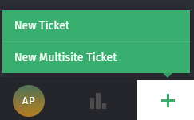
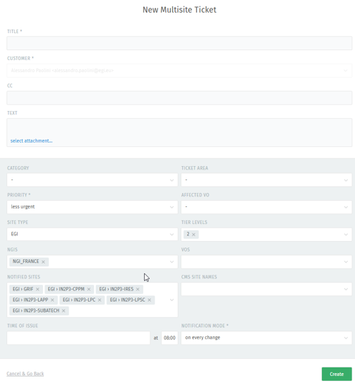
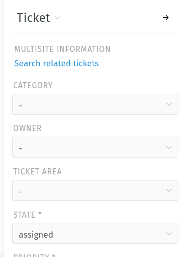

## SITES field

- The list of sites included in the drop-down menu of the "SITES" field is taken
  from GOCDB (EGI sites) and from OIM DB (OSG sites).
  - Sites registered in OIM are only visible if they have certification status
  "enabled".
  - Sites registered in GOC DB are only visible if they have certification status
  "certified".
  - Sites in other statuses (e.g. "suspended") are not visible in the "SITES"
  drop-down list.
- the sites information is synchronized once per night.
- In case a site's status changes, the site disappears from the "SITES"
  drop-down list. Existing GGUS tickets related to this site get the "SITES"
  field flushed. The NGI to which the site belongs inherits the ticket from the
  site and is in charge of further processing this ticket.

## Tickets to multiple sites option: the "Multisite" ticket

- The Multisite ticket is a feature for submitting tickets with the same
  topic against an unlimited number of sites in GGUS. After the submission,
  the ticket is cloned and sent as separate ticket to each of the sites
  selected during the ticket creation.
  - All the sites displayed in GGUS can be notified using this option.
- This feature can be used only by users owning the "Multisites" role.
- There is a specific submit form linked from GGUS ticket submit area. In the
  "Notify SITE" drop-down menu sites can be checked for receiving a ticket.

### Creation of a Multisite ticket

When the users with the “Multisites” role click on the "+" button to create a
ticket, they will see the option "New Multisite Ticket".

By clicking on that option, they will end up in an interface allowing the
submission to multiple sites.

In addition to the usual fields, the users can also select proper values for:

- SITE TYPE: EGI or OSG
- TIER LEVELS
- NGIs

Then the "NOTIFIED SITES" field will be filled automatically based on the
selections made for the aforementioned fields (it is also possible to further
edit manually the values of this field).

When all the necessary fields of the ticket creation form have been filled in
properly, the users can click on the "Create" button to submit the tickets.

At this point, a notification email for each submitted ticket is sent to the
submitter (to be changed in the future to a single email containing all the
created tickets in order to reduce the spam to the submitter). At the same
time, all the selected sites in the list are notified and the tickets are
assigned to the parent NGIs.

The list of submitted tickets is available through the link "Search related
tickets":

