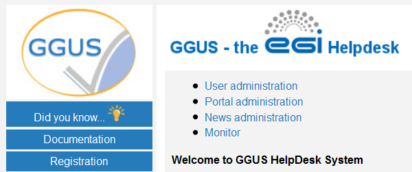
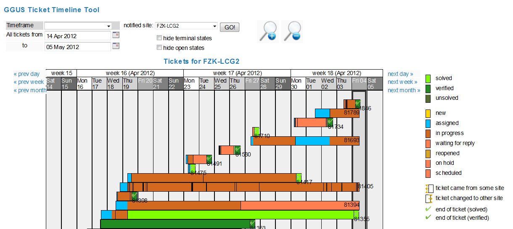

## What’s new in the latest release?
Please see the [Ongoing work list](https://ggus.eu/index.php?mode=release_notes)
for further information.

## Access to GGUS
GGUS is reachable via https://helpdesk.egi.eu/ and https://ggus.eu using a web
browser. Another way for accessing GGUS is using the direct link provided in
the notification emails sent after ticket updates. However either a valid X509
personal certificate or a Check-in account are required for accessing the system.

## Features of GGUS

### GGUS Home
GGUS home provides a quick overview over tickets submitted by the current user,
the latest tickets of other users and a collection of news and links to useful
information. The navigation bar is located on the left side of GGUS pages. It
provides links to:

- Did you know?
- Documentation
- Registration
- My dashboard
- Search Engine
- Submit form
- Support staff pages
- GGUS Home
- Legals
- Contact form

### Did you know

After each release, a major change or new feature is explained in some
sentences here.

### Documentation

In the documentation section there is a collection of links providing useful
information around GGUS system.

### Registration

All information about registration can be found on the
[registration page](https://ggus.eu/index.php?mode=register_info). For
registering as support staff, click the link “Apply” and fill in the registration
form. After registering successfully you will receive a confirmation mail from
GGUS team.

If you want to update your account data, you can do this using the link "Check
your GGUS account" on the registration page. If you can’t access GGUS web
interface due to changed DN string of your personal certificate, you can log into
the system using your Check-in account. Then go to the registration page and
click on Check/update your GGUS account. The system shows you all your user data.
It detects the new DN string of your browser automatically. Just save the changes
by clicking on button Update now. Additional information on GGUS accounts is
available here(link to new location of https://wiki.egi.eu/wiki/FAQ_GGUS-Account).

### Support staff page

Access to the support staff page is restricted to users having support privileges
https://wiki.egi.eu/wiki/FAQ_GGUS-Support-Privileges . Depending on further
privileges people may have there are links to e.g. news administration and other
features. All support staffs can use the GGUS report generator and the GGUS
ticket timeline tool as well as links to other information useful for support
staffs.

#### GGUS ticket timeline tool

The link to the GGUS ticket timeline tool is located on support staff page. The
ticket timeline tool provides a graphical overview of tickets concerning a selected
site and time range. It shows all tickets that have been updated during the
selected time range. When moving the mouse over one of the colored bars some
additional information is displayed. Clicking on the ticket ID opens a new window
showing the ticket details and the modify section of the ticket.

#### GGUS Report Generator

The link to the GGUS Report Generator is located on support staff page and on GGUS
home page in section "GGUS tools/reports". The GGUS Report Generator could be used
for generating statistics and reports for all support units in GGUS. Further
information on the report generator is available on the
https://wiki.egi.eu/wiki/FAQ_Report_Generator_(GGUS) .

### Submit form

Depending on the user's privileges GGUS offers different ticket submit forms:
- common user ticket
- team ticket
- alarm ticket
- CMS ticket (for members of CMS VO)
- notify multiple sites which is a bulk submit for addressing multiple sites about
the same issue.

#### Ticket categories and ticket types

GGUS offers two fields which help to classify various tickets into categories
and types.

##### Ticket categories

The ticket category is for differentiating between issues and service requests.
This distinction is helpful for supporters as well as for the GGUS reporting, e.g.
for excluding test tickets. The ticket category field offers four different values:

- Incident (for issues),
- Change Request (for service requests)
- Documentation
- Test

When submitting a ticket the ticket category field is not visible. It defaults to
“Incident” and is only editable for supporters, not for users. So it is up to the
supporter to check and, if necessary, classify the ticket correctly. Please see
details in section Changing ticket category.

##### Ticket types
The ticket type field is for differentiating between standard user tickets and
tickets for achieving the special requirements of various groups like the LHC VOs or
EGI operations. It can’t be set manually, but is set automatically by the system
based on several rules. The ticket type field could not be changed during ticket
lifetime. Possible ticket types in GGUS are:
- USER
- TEAM,
- ALARM
- OPS.

###### USER tickets

The ticket type USER is the default ticket type. User tickets are the usual tickets
which can be submitted by everyone. They are visible to everybody. They can be
updated either by the submitter himself or by any supporter.

###### TEAM tickets

The purpose of TEAM tickets is to allow a group of people to submit and modify
ticketseditable by the whole group. TEAM tickets can only be submitted by people
who have the appropriate permissions in the GGUS user database. These people belong
to either one of the four LHC VOs (ALICE, ATLAS, CMS, LHCB) or to the BIOMED or
BELLE VO and are nominated by the particular VO management. TEAM tickets are editable
by all members of the VO team (which are the so called VO shifters) regardless own
the ticket. TEAM tickets are visible to everyone. They can be submitted for all tier-1
sites in EGI and are routed to the appropriate NGI/ROC automatically, bypassing the
TPM. Additionally the site is notified by mail about the ticket. By default TEAM
tickets are routed to the appropriate NGI/ROC directly, bypassing TPM. But the
submitter could also choose to route it to the TPM instead. Further information on
TEAM tickets is available in the TEAM tickets FAQs.

###### ALARM tickets

The purpose of ALARM tickets is to notify tier-1 administrators about serious problems
of the site at any time, independent from usual office hours. They can only be submitted
by experts who have the appropriate permissions in the GGUS user database. These people
belong to one of the four LHC VOs (ALICE, ATLAS, CMS, LHCB) and are nominated by the
particular VO management. They are about 3 to 4 people per VO. ALARM tickets are editable
by all members of the VO team (which are the so called VO shifters) regardless they own
the ticket. They are visible to everyone. ALARM tickets can be submitted for all tier-1
sites in EGI and are routed to the appropriate NGI/ROC automatically, bypassing the TPM.
Additionally the tier-1 site is notified by an ALARM email. It is up to the tier-1 site
how to deal with this ALARM email. Further information on TEAM tickets is available in
the ALARM tickets FAQs.

##### OPS tickets

This ticket type is used for operations tickets submitted via the operations portal.

### My dashboard

This dashboard can be used for getting quick access to any ticket of interest. Each
ticket has to be added manually.

### Search Engine

The search engine provides a large number of fields for creating dedicated query
strings. Many of them have additional information hidden behind a question mark icon.
The results of a query are shown in a results list. The default search displays all
open tickets of last week. They were ordered by date of creation in descending manor.
For further details on using the search engine see chapter Searching for tickets.
The result list is showing a color schema reflecting the priority of tickets. The
algorithm used for setting the priority colours is explained in chapter Reminder emails.

### Searching for tickets

Various possibilities of searching tickets in GGUS are described in this FAQ. Please
avoid searching for “all” tickets or “solved” tickets without any time-frame if not
necessary for some reasons as these searches cause heavy load on the machine.

#### Searching via Ticket ID

Searching via ticket ID is the easiest and fastest way to look at a ticket. When searching
via Ticket ID all other search parameters are ignored. Besides searching for all open
tickets this is the recommended kind of search, because it avoids needless workload on the
system. When searching via ticket ID the ticket details are shown in the same window. For
getting back to the main page use the “Back” button of your browser. For Firefox users there
is a nice add-on for adding a customized search for any web page to the browser's search bar
available [here](https://firefox.maltekraus.de/extensions/add-to-search-bar).

#### Searching via parameters
The search parameters can be combined in any way wanted. Description fields “Keyword”,
“Involved supporter” and “Assigned to person” trigger a LIKE search to the database.
Concatenating keywords with “AND” or “OR” is currently not possible. The result of a search
by parameters is shown in the result list. For viewing ticket details just click on the ID.
A new window opens showing ticket details. For getting back to the search result just close
the window with the ticket details.

### Customizing result list
You can customize the result list in various ways. One way to customize the result list is
by checking or un-checking the appropriate boxes in the blue bar. The related columns will
then be added or removed. Another way for customizing the result list is by selecting
another ticket order in field Order tickets by. After changing the result list layout you
have to refresh the search result by clicking the Go! button.

### Exporting search results

Search results can be exported in csv or xml format for further processing. After clicking
on the appropriate link a new window opens showing the results in the specified format.
Out of this window you can save a local copy of this file.

