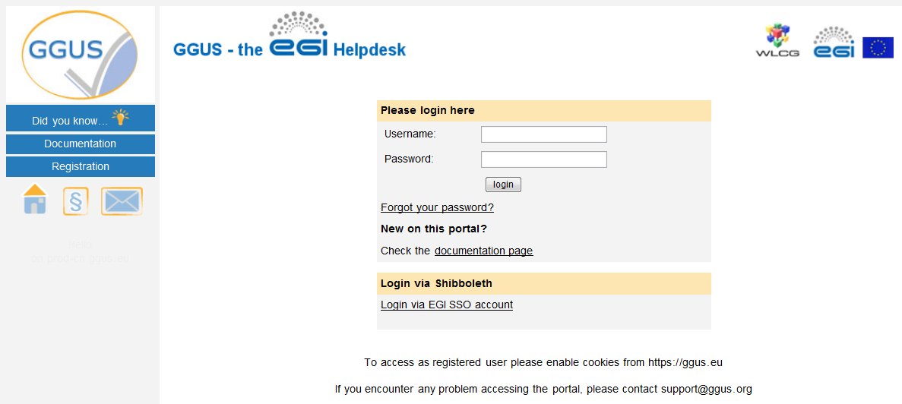

moving the content of https://wiki.egi.eu/wiki/FAQ_GGUS-User_Guide

## Introduction

GGUS is the Helpdesk service of the EGI Infrastructure. Incident and Service request tickets
can be recorded, and their progress is tracked until the solution. The users of the service
should not need to know any of the details of what happens to the ticket in order to get it
from creation to solution. However, an understanding of the operation of the system may be
helpful to explaining what happens when you request help.

Tickets can be created through the GGUS [web interface](https://ggus.eu/), which is described
in section "Accessing the web interface to GGUS" of this note.

Once the ticket has entered GGUS, it is processed by assigning it to the appropriate group to
deal with the issue. The groups are generally addressed via mailing lists, and so GGUS assigns
the ticket to a group, and an e-mail message is sent to people on the appropriate list.
Sometimes, a ticket is simple and it is assigned to the correct group immediately and dealt
with immediately.

## Submitting a ticket using the web interface

Before using this route, it is essential to have either a digital certificate installed in the
appropriate manner in the web browser or an EGI Check-in account.

### Accessing the web interface to GGUS

If the user carries out all of the steps above, but is not registered to use GGUS, then the
home page is like the one shown in the following figure:

If the user faces problems with their certificate, they may get help here:

http://wlcg.web.cern.ch/getting-started/certificates/WLCG-CA/personal
https://wiki.egi.eu/wiki/USG_Getting_Certificate

For accessing GGUS users have to register first. Registration process is described in chapter
Registering at GGUS.

### Registering at GGUS

For getting supporter privileges users need to be registered. For registering at GGUS the user
should go to [GGUS home](https://ggus.eu/index.php?mode=index) and click the
[registration link](https://ggus.eu/index.php?mode=register_info).
This link opens the registration form that the user has to fill in. In addition, there are
some links where the user can find information about X09 personal certificates. Users who do
not have a valid digital certificate can access GGUS via EGI SSO.
After filling in the registration form, the user receives an e-mail from the GGUS team with
his access data to GGUS.

### Accessing GGUS with certificate

Figure 2: 

The primary address of the GGUS portal is: http://ggus.eu. If the user enters this in the browser,
a warning will be displayed by the browser prompting the user to specify which certificate to use
(if the user has not selected to automatically select the certificate in the browser settings).
The reason for this warning is that GGUS has to validate the user in order to allow access.
After that, the user will no longer be asked to identify himself.

The user identifies themselves with their digital certificate. At this point in time, GGUS has
identified the user and displays the start page as shown in the following figure:

Note that in this case, the user's identity is displayed on the page and GGUS has recognized that
this user is registered to submit tickets. If authentication by certificate fails, you will be
taken to the login page.

### Accessing GGUS via EGI Check-in

When choosing "Login via EGI AAI CheckIn" on the login page the user is guided to the EGI AAI
page were the users Identity Provider can be selected. After authenticating there, the user will
be redirected to GGUS.
