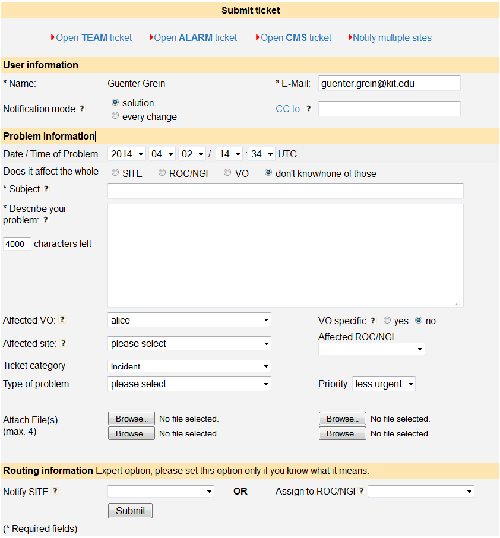

moving the content of https://wiki.egi.eu/wiki/FAQ_GGUS-User_Guide

## Introduction

GGUS is the Helpdesk service of the EGI Infrastructure. Incident and Service request tickets
can be recorded, and their progress is tracked until the solution. The users of the service
should not need to know any of the details of what happens to the ticket in order to get it
from creation to solution. However, an understanding of the operation of the system may be
helpful to explaining what happens when you request help.

Tickets can be created through the GGUS [web interface](https://ggus.eu/), which is described
in section "Accessing the web interface to GGUS" of this note.

Once the ticket has entered GGUS, it is processed by assigning it to the appropriate group to
deal with the issue. The groups are generally addressed via mailing lists, and so GGUS assigns
the ticket to a group, and an e-mail message is sent to people on the appropriate list.
Sometimes, a ticket is simple and it is assigned to the correct group immediately and dealt
with immediately.

## Submitting a ticket using the web interface

Before using this route, it is essential to have either a digital certificate installed in the
appropriate manner in the web browser or an EGI Check-in account.

### Accessing the web interface to GGUS

If the user carries out all of the steps above, but is not registered to use GGUS, then the
home page is like the one shown in the following figure:

If the user faces problems with their certificate, they may get help here:

http://wlcg.web.cern.ch/getting-started/certificates/WLCG-CA/personal
https://wiki.egi.eu/wiki/USG_Getting_Certificate

For accessing GGUS users have to register first. Registration process is described in chapter
Registering at GGUS.

### Registering at GGUS

For getting supporter privileges users need to be registered. For registering at GGUS the user
should go to [GGUS home](https://ggus.eu/index.php?mode=index) and click the
[registration link](https://ggus.eu/index.php?mode=register_info).
This link opens the registration form that the user has to fill in. In addition, there are
some links where the user can find information about X09 personal certificates. Users who do
not have a valid digital certificate can access GGUS via EGI SSO.
After filling in the registration form, the user receives an e-mail from the GGUS team with
his access data to GGUS.

### Accessing GGUS with certificate

The primary address of the GGUS portal is: http://ggus.eu. If the user enters this in the browser,
a warning will be displayed by the browser prompting the user to specify which certificate to use
(if the user has not selected to automatically select the certificate in the browser settings).
The reason for this warning is that GGUS has to validate the user in order to allow access.
After that, the user will no longer be asked to identify himself.

The user identifies themselves with their digital certificate. At this point in time, GGUS has
identified the user and displays the start page as shown in the following figure:

Note that in this case, the user's identity is displayed on the page and GGUS has recognized that
this user is registered to submit tickets. If authentication by certificate fails, you will be
taken to the login page.

### Accessing GGUS via EGI Check-in

When choosing "Login via EGI AAI CheckIn" on the login page the user is guided to the EGI AAI
page were the users Identity Provider can be selected. After authenticating there, the user will
be redirected to GGUS.

### The ticket submit form on web interface

The tickets submit form offers a set of fields which should help the user to describe his issue
as detailed as possible. Most of the fields on the submit form are optional. Only field “Subject”
is required. The submit form consists of three main sections: the **user information**, the
**issue information** and the **routing information**.

1. User information
 
Most fields in the user information section are pre-filled by GGUS system.

- “Name/Login” is taken from the GGUS user database.
- “E-Mail” is also taken from the GGUS user database.
- “Notification mode” defaults to “on solution”. The “Notification mode”
manages the update notifications the user receives. “On solution” means
that the user only gets notified when the ticket status is set to “solved”
or a comment is added to the public diary. Additional information is
available by clicking on the question mark on the right hand side of the
field label.
- “CC to” could be filled with any mail address of people who should be
informed about this ticket. Notifications are sent on every ticket update.
The field content could only be changed by people who have support access.
Additional information is available by clicking on the question mark.

2. Issue information

Although only one field is mandatory in this section, as much fields as
possible should be filled with information.

- “Date/Time of issue” defaults to the submitting time. This field should
be set if the ticket is submitted much later than the issue occurred.
- “Subject” is a mandatory field. It should give a short description of
the issue. This field is limited to 250 characters.
- “Describe your issue…” is limited to 4000 characters. It should be used
for a detailed description of the issue. If the user does not know which
information to add here he could click on the question mark for getting
additional information.
- “Concerned VO” provides a drop-down list of all VOs supported by GGUS.
- “VO specific” is a flag indicating whether an issue is VO specific or not.
It defaults to “no”. This flag could only be set to “yes” in combination
with a VO selected in field “Concerned VO”.
- “Affected Site” The site impacted by the issue. A drop-down list with all
EGI sites registered in GOC DB and OSG sites registered in OIM DB is
available. This is no routing information!
- “Affected ROC/NGI” The NGI/ROC impacted by the issue. A drop-down list of
all NGIs/ROCs integrated in GGUS is provided.
- “Ticket category” provides a drop-down list with possible values. This
field is for categorizing the issue. It defaults to “Incident”.
- “Type of issue” provides a drop-down list with possible values.
This field is for categorizing the issue. It defaults to “Other”.
- “Priority” provides a drop-down list with possible priority values. They
are “less urgent” which is the default, “urgent”, “very urgent” and
“top priority”.
- “Attach file(s)” offers the possibility to upload 4 attachments
(e.g. log files etc.) at a time. Attachments are limited to 2 MB. Please
avoid uploading file formats “.exe”, “.php”, “.htm(l)”.

3. Routing Information

- “Notify SITE” provides a drop-down list with all EGI sites registered in
GOC DB and OSG sites registered in OIM DB. If selecting a site from the list
this site will be notified about this ticket by mail. Additionally the
ticket is assigned to the appropriate NGI/ROC directly, bypassing the TPM
(Some words about TPM). If setting a site value the appropriate NGI/ROC is
set automatically. Choosing an NGI/ROC simultaneously is not possible.
- “Assign to ROC/NGI” provides a drop-down list of all NGIs/ROCs integrated
in GGUS. Choosing a value in this field assigns the ticket to the appropriate
ROC directly, bypassing the TPM. If assigning a ticket to an NGI/ROC choosing
a site value simultaneously is not possible.

After clicking the “Submit” button the user gets a confirmation page showing
the information submitted and the ticket ID.

### Bypassing the TPM
The TPM (Ticket Processing Manager) is the 1st Line Support in GGUS. Users
can bypass the TPM if they have good knowledge about where the problem is.
For this purpose at the bottom of ticket submit form there is a section
"Routing information". Selecting either a site from the "Notify SITE"
drop-down menu or a support unit from the "Assign to support unit" drop-down
menu routes the ticket directly to the selected support unit. If selecting a
site name the NGI/ROC the site belongs to is set automatically. Hence the
ticket is assigned to the relevant NGI/ROC. Additionally the site will
receive a notification about the ticket. Selecting both, the "Notify SITE"
and the "Assign to support unit" is not possible.

Tickets of type TEAM and ALARM are always routed to the relevant NGI/ROC
by default.

