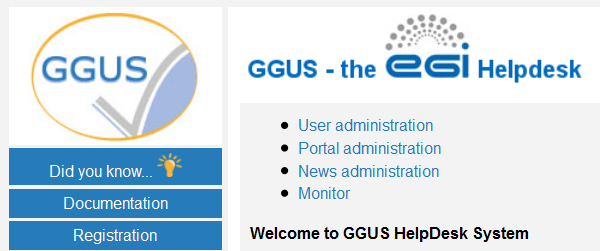
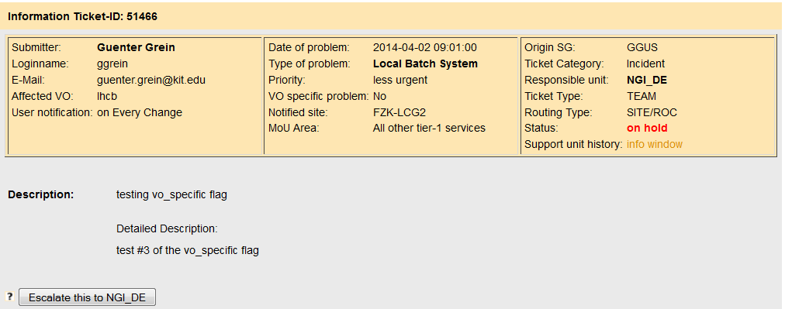
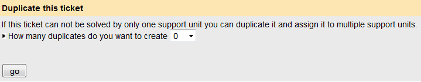
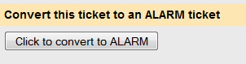
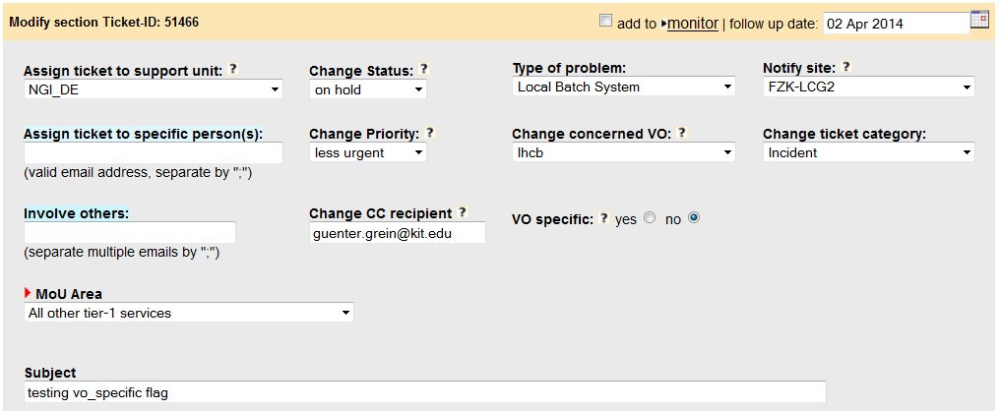
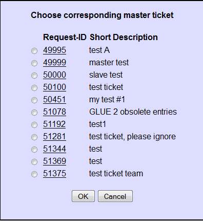
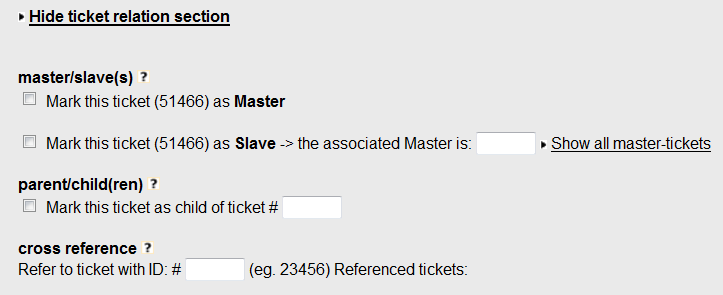
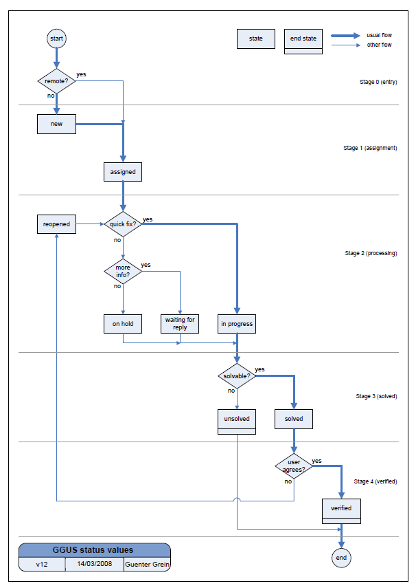

## What’s new in the latest release?

Please see the [release notes](https://ggus.eu/index.php?mode=release_notes) for
further information.

## Access to GGUS

The EGI Helpdesk is reachable via [a welcome page](https://helpdesk.egi.eu).
Another way for accessing [the ticket management interface](https://ggus.eu) is
using the direct link provided in the notification emails sent after ticket
updates. However either a valid X509 personal certificate or a Check-in account
are required for accessing the system.

## Features of GGUS

### GGUS Home

GGUS home provides a quick overview over tickets submitted by the current user,
the latest tickets of other users and a collection of news and links to useful
information. The navigation bar is located on the left side of GGUS pages. It
provides links to:

- Did you know?
- Documentation
- Registration
- My dashboard
- Search Engine
- Submit form
- Support staff pages
- GGUS Home
- Legals
- Contact form

### Did you know

After each release, a major change or new feature is explained in some sentences
here.

### Documentation

In the documentation section there is a collection of links providing useful
information around GGUS system.

### Registration

All information about registration can be found on the
[registration page](https://ggus.eu/index.php?mode=register_info). For
registering as support staff, click the link “Apply” and fill in the
registration form. After registering successfully you will receive a
confirmation mail from GGUS team.

If you want to update your account data, you can do this using the link "Check
your GGUS account" on the registration page. If you can’t access GGUS web
interface due to changed DN string of your personal certificate, you can log
into the system using your Check-in account. Then go to the registration page
and click on Check/update your GGUS account. The system shows you all your user
data. It detects the new DN string of your browser automatically. Just save the
changes by clicking on button Update now. Additional information on GGUS
accounts is available [here](../account-and-privileges).

### Support staff page

Access to the support staff page is restricted to users having
[support privileges](../account-and-privileges). Depending on further privileges
people may have there are links to e.g. news administration and other features.
All support staffs can use the GGUS report generator and the GGUS ticket
timeline tool as well as links to other information useful for support staffs.

#### GGUS ticket timeline tool

The link to the GGUS ticket timeline tool is located on support staff page. The
ticket timeline tool provides a graphical overview of tickets concerning a
selected site and time range. It shows all tickets that have been updated during
the selected time range. When moving the mouse over one of the colored bars some
additional information is displayed. Clicking on the ticket ID opens a new
window showing the ticket details and the modify section of the ticket.

#### GGUS Report Generator

The link to the GGUS Report Generator is located on support staff page and on
GGUS home page in section "GGUS tools/reports". The GGUS Report Generator could
be used for generating statistics and reports for all support units in GGUS.
Further information on the report generator is available on the
[report generator](../features/report-generator).

### Submit form

Depending on the user's privileges GGUS offers different ticket submit forms:

- common user ticket
- team ticket
- alarm ticket
- CMS ticket (for members of CMS VO)
- notify multiple sites which is a bulk submit for addressing multiple sites
  about the same issue.

#### Ticket categories and ticket types

GGUS offers two fields which help to classify various tickets into categories
and types.

##### Ticket categories

The ticket category is for differentiating between incidents and service
requests. This distinction is helpful for supporters as well as for the GGUS
reporting, e.g. for excluding test tickets. Other categories were added over the
time. Currently the following values are available for selection:

- Incident (see the
  [FitSM definition](https://ims.egi.eu/display/EGIG/Incident))
- Service request (see the
  [FitSM definition](https://ims.egi.eu/display/EGIG/Service+request)). List of
  service requests for the
  [internal](https://confluence.egi.eu/display/EGISLM/EGI+Internal+Service+requests)
  and for the
  [external](https://confluence.egi.eu/display/EGISLM/EGI+Service+requests)
  services of the EGI portfolio
- Documentation (used to request creation and update on documentation.)
- Release (used when a new version of the operational tools is ready to be
  tested; see
  [RDM2 Regular release process](https://confluence.egi.eu/display/EGIPP/RDM2+Regular+release+process))
- CMS Internal (for cms VO specific tickets)
- EGI Coordination/Planning (to track activities not falling into the service
  request definition)
- WLCG Coordination/Planning
- Test

When submitting a ticket the ticket category field is not visible. It defaults
to “Incident” and is only editable for supporters, not for users. So it is up to
the supporter to check and, if necessary, classify the ticket correctly. Please
see details in section Changing ticket category.

##### Ticket types

The ticket type field is for differentiating between standard user tickets and
tickets for achieving the special requirements of various groups like the LHC
VOs or EGI operations. It can’t be set manually, but is set automatically by the
system based on several rules. The ticket type field could not be changed during
ticket lifetime. Possible ticket types in GGUS are:

- USER
- TEAM,
- ALARM
- OPS.

###### USER tickets

The ticket type USER is the default ticket type. User tickets are the usual
tickets which can be submitted by everyone. They are visible to everybody. They
can be updated either by the submitter himself or by any supporter.

###### TEAM tickets

The purpose of TEAM tickets is to allow a group of people to submit and modify
ticketseditable by the whole group. TEAM tickets can only be submitted by people
who have the appropriate permissions in the GGUS user database. These people
belong to either one of the four LHC VOs (ALICE, ATLAS, CMS, LHCB) or to the
BIOMED or BELLE VO and are nominated by the particular VO management. TEAM
tickets are editable by all members of the VO team (which are the so called VO
shifters) regardless own the ticket. TEAM tickets are visible to everyone. They
can be submitted for all tier-1 sites in EGI and are routed to the appropriate
NGI/ROC automatically, bypassing the TPM. Additionally the site is notified by
mail about the ticket. By default TEAM tickets are routed to the appropriate
NGI/ROC directly, bypassing TPM. But the submitter could also choose to route it
to the TPM instead. Further information on TEAM tickets is available in the
[TEAM tickets page](../features/team-tickets).

###### ALARM tickets

The purpose of ALARM tickets is to notify tier-1 administrators about serious
problems of the site at any time, independent from usual office hours. They can
only be submitted by experts who have the appropriate permissions in the GGUS
user database. These people belong to one of the four LHC VOs (ALICE, ATLAS,
CMS, LHCB) and are nominated by the particular VO management. They are about 3
to 4 people per VO. ALARM tickets are editable by all members of the VO team
(which are the so called VO shifters) regardless they own the ticket. They are
visible to everyone. ALARM tickets can be submitted for all tier-1 sites in EGI
and are routed to the appropriate NGI/ROC automatically, bypassing the TPM.
Additionally the tier-1 site is notified by an ALARM email. It is up to the
tier-1 site how to deal with this ALARM email. Further information on ALARM
tickets is available in the [ALARM tickets page](../features/alarm-tickets).

##### OPS tickets

This ticket type is used for operations tickets submitted via the operations
portal.

### My dashboard

This dashboard can be used for getting quick access to any ticket of interest.
Each ticket has to be added manually.

### Search Engine

The search engine provides a large number of fields for creating dedicated query
strings. Many of them have additional information hidden behind a question mark
icon. The results of a query are shown in a results list. The default search
displays all open tickets of last week. They were ordered by date of creation in
descending manor. For further details on using the search engine see chapter
Searching for tickets. The result list is showing a color schema reflecting the
priority of tickets. The algorithm used for setting the priority colours is
explained in chapter Reminder emails.

### Searching for tickets

Various possibilities of searching tickets in GGUS are described in this FAQ.
Please avoid searching for “all” tickets or “solved” tickets without any
time-frame if not necessary for some reasons as these searches cause heavy load
on the machine.

#### Searching via Ticket ID

Searching via ticket ID is the easiest and fastest way to look at a ticket. When
searching via Ticket ID all other search parameters are ignored. Besides
searching for all open tickets this is the recommended kind of search, because
it avoids needless workload on the system. When searching via ticket ID the
ticket details are shown in the same window. For getting back to the main page
use the “Back” button of your browser. For Firefox users there is a nice add-on
for adding a customized search for any web page to the browser's search bar
available [here](https://firefox.maltekraus.de/extensions/add-to-search-bar).

#### Searching via parameters

The search parameters can be combined in any way wanted. Description fields
“Keyword”, “Involved supporter” and “Assigned to person” trigger a LIKE search
to the database. Concatenating keywords with “AND” or “OR” is currently not
possible. The result of a search by parameters is shown in the result list. For
viewing ticket details just click on the ID. A new window opens showing ticket
details. For getting back to the search result just close the window with the
ticket details.

### Customizing result list

You can customize the result list in various ways. One way to customize the
result list is by checking or un-checking the appropriate boxes in the blue bar.
The related columns will then be added or removed. Another way for customizing
the result list is by selecting another ticket order in field Order tickets by.
After changing the result list layout you have to refresh the search result by
clicking the Go! button.

### Exporting search results

Search results can be exported in csv or xml format for further processing.
After clicking on the appropriate link a new window opens showing the results in
the specified format. Out of this window you can save a local copy of this file.

### Ticket data

By clicking on the ticket ID of a ticket in the results list of the search
engine you can access the ticket data. The ticket data is divided into 3 main
sections:

- ticket information
- ticket history
- ticket modify section

#### Ticket information

The system shows the information section after clicking on a ticket ID.It
provides an overview of all relevant ticket parameters and could be divided into
5 areas:

- submitter data
- issue data
- ticket data
- description
- solution

Additional features of the ticket information section are:

- export of ticket information data,
- escalate button,
- duplicate ticket and
- convert team to alarm.

##### Duplicate ticket

Figure 5: Ticket duplication Supporters have the opportunity to duplicate an
existing ticket up to 15 times. The duplicate feature is located right below
ticket information. It is useful if a ticket concerns not only one support unit
but has to be handled by several support units. The fields that are copied into
the duplicated tickets are:

- Internal Diary
- Login
- Last Modifier
- Submitter
- Subject

Attachments are not duplicated physically but linked to all duplicated tickets.
The Responsible Unit is set to "TPM" by default.

##### Convert TEAM tickets to ALARM tickets

Figure 3: Convert team to alarm ticket Support staffs with ALARM privileges are
able to convert TEAM tickets to ALARM tickets clicking on a button in the ticket
information section. This feature is only available for the WLCG VOs.

#### Ticket history

The ticket history is located below ticket information. It shows all relevant
changes of the ticket in chronological manner. Changes of these fields lead to a
new entry in ticket history:

- Assign ticket to support unit
- Assign ticket to one person
- Affected Site
- Public Diary
- Change ticket category
- Change status
- Change VO
- Change priority
- Involve others
- Type of issue
- Internal Diary
- Solution
- Related issue
- VO specific

For making the history more readable solution entries and entries in the public
diary are marked with green colour, entries of the internal diary with orange
colour.

#### Ticket modify section

The ticket modification area offers several fields for modifying a ticket. The
fields are described in detail below.

- Assign ticket to support unit is showing all support units involved in GGUS.
- Assign ticket to specific person(s) allows assigning tickets to a dedicated
  person within the current support unit. If a mail address is typed in the
  system generates an email to inform the recipient about the ticket assignment.
  The length is limited to 254 characters.
- Change status is a drop-down-list with all possible status values.
- Change VO is a drop-down-list with all possible VO values.
- Type of issue provides a drop-down-list of possible issue types.
- Change priority provides a drop-down-list of possible priority values.
- Notify site is for specifying the site affected by the issue. For ticket types
  “ALARM” and “TEAM” this field is not editable.
- Change ticket category provides a drop-down list with values “Incident”,
  “Change Request”, “Documentation” and "Test".
- Involve others allows contacting any people who may help to solve an issue.
  Several mail addresses can be typed in separated by “;”. The length is limited
  to 254 characters.
- VO specific is a flag indicating whether a issue is VO specific or not.
  Default is “no”.
- Change CC recipient is for editing the mail addresses specified during ticket
  submit for notifying any person about a ticket.
- MoU Area can only be set for tickets of type “TEAM” or “ALARM”. Possible
  values are documented here.
- Subject is for editing the subject of a ticket.
- Internal Diary can be used for internal remarks. It is only shown to people
  with support privileges and limited to 4000 characters.
- Public Diary updates always trigger an update mail to the submitter. It is
  limited to 4000 characters.
- Click here to insert… expands the solution field.
- Solution can be up to 4000 characters. It is used for explaining the solution.
- Hide solution hides the solution field.
- Reminders feature can be set to “Please send reminder on” if status is changed
  to “on hold” or “waiting for reply”. In this case a date can be selected on
  which a reminder mail was sent. This feature should help supporters not to
  forget tickets which were not worked on for a longer time.
- Related issue can be used to reference any URL. It is limited to 125
  characters.
- Click here to expand … expands the ticket relation section.
- Hide ticket relation section hides ticket relation fields.
- Mark this ticket as Master is described in detail in chapter Master-Slave
  relations.
- Mark this ticket as Slave is described in detail in chapter Master-Slave
  relations.
- Mark this ticket as child this feature is described in detail in chapter
  Parent-Child relations.
- Cross reference is for referencing as much other GGUS tickets as necessary.
  For each ticket referenced here a symmetric link is added to the referenced
  ticket automatically.
- Want to upload attachment? is for adding attachments. Only one attachment can
  be added at a time. The total number of attachments is unlimited.

#### Ticket Participation

GGUS system offers various possibilities for participating in tickets. They are

- the CC field,
- the Involve others field and
- the Subscribe field.

An overview on these fields is given in the table below. Ticket participation
can be done by adding a valid mail address to one of these fields. Please avoid
adding closed mailing lists as such produce a lot of mail errors! Several mail
addresses have to be separated by semicolon.

|                | User submit | User modify | Supporter modify |
| -------------- | ----------- | ----------- | ---------------- |
| CC             | Yes         | No          | Yes              |
| Involve others | No          | No          | Yes              |
| Subscribe      | No          | Yes         | Yes              |

##### The “CC” field

The CC field can be set by the user in the ticket submit form. Updates are only
possible for supporters for correcting or removing invalid mail addresses. Every
ticket update triggers a notification email to the mail address specified in the
“CC” field.

##### The “Involve others” field

The “Involve others” field is only for supporters use. Every ticket update
triggers a notification email to the mail address specified in the “Involve
others” field.

##### Subscribe to this ticket field

This field can be used by any user for participating in tickets at any time. The
user has just to add his mail address. He will receive notifications for updates
of the public diary or the solution for following the whole ticket life cycle.
"Internal Diary" entries never go to the people who subscribed to a ticket.

#### Master-Slave relations

Several tickets describing the same issue can be put into a master-slave
relation. One of them can be marked as master, the other ones as slave. Only the
master ticket has to be dealt with. The slave tickets are set to “on hold”. They
can’t be updated directly as long as they are in a master-slave relation. The
user gets an automated notification if a ticket is marked as slave. All updates
of the master were pushed to the slaves. When solving the master the slaves are
solved to. The master-slave relation is kept after the master is solved.
Nevertheless each ticket can be reopened separately. Updates on reopened slave
tickets are possible. A master-slave relation can be reset manually either by
removing the master ID of a slave ticket or by un-checking the master checkbox
of the master. If a master is unmarked as master all slaves were reset to
“standard” tickets automatically.

##### Selecting slave tickets

Marking a ticket as slave is only possible if there is already a master ticket.
If a ticket is marked as slave a popup window opens showing available master
tickets. For selecting a master just click on the ID. The master ID is set
automatically. Once you have chosen a wrong master ID click Reset Master-Slave
relation and select another one.

##### Showing a master’s slave tickets

To show all related slave tickets click on link “show slaves for this ticket”. A
popup window opens showing the IDs of all slave tickets.

##### Searching for master/slave tickets

If you want to search for master or slave tickets you can do this using field
“Special attributes” of the search engine. The status value for searching is set
to an appropriate value accordingly.

##### Parent-child relations

Parent-child relationships work in reverse to master-slave relationships. The
parent ticket cannot be resolved until all of its child tickets are resolved.
The parent ticket is set to the status "on hold" while the child tickets are
waiting for their solution. For each solved child ticket a note is added to the
parent ticket history including the solution of the child ticket. After the last
open child ticket has been solved the status of the parent ticket changes to “in
progress” automatically. In addition, the system sends a notification mail to
the responsible support unit that all child tickets have been solved now. So the
parent ticket can be “solved” too.

##### Selecting child tickets

A ticket can be selected as child ticket by checking the box “Mark this ticket
as child of ticket” and adding the ticket ID of the parent ticket. A comment is
added to the ticket history automatically stating “This ticket is a child ticket
of GGUS ticket # 18492”. Multiple child tickets can be related to one parent
ticket by repeating this procedure. The parent ticket is flagged as “parent”
automatically. A comment is added to the ticket history automatically stating
“This ticket is a parent ticket. It has to wait the solving of all its child
tickets. GGUS ticket #18493 is a child to this ticket.".

##### Resetting child tickets

For resetting child tickets just remove the tick from the checkbox “Mark this
ticket as child of ticket”.

##### Selecting parent tickets

Selecting a parent ticket explicitly is not possible. The parent tickets are
flagged automatically by the system while the parent ID is specified for a child
ticket.

##### Searching for parent/child tickets

The search for parent or child tickets is similar to the search for master or
slave tickets. It can be done using field “Special attributes” of the search
engine.

## Working on tickets

This section is a description of how the GGUS ticketing system behaves. There
are other documents which describe the system in more detail and include more of
the implementation details. One of the most important fields of the system is
the status field. Many workflows are triggered by status value changes. Please
read the Short Guide for getting information on status values. Tickets are
normally assigned to a support unit. This means that the ticket notification is
sent to a mailing list composed of many supporters. One of these supporters
assigns the ticket to himself and takes responsibility for it; the supporter
changes the status to “in progress”. This person is then in charge of the
ticket. He either solves it or reassigns the ticket to somebody else. The status
of the ticket stays set to “in progress” if the ticket is under the
responsibility of one supporter and until the ticket has been solved.

### User ticketing work flow

A graphical view of the ticket flow in GGUS is shown here:

The GGUS Support is organized with two main lines of support:

1. First line of support gets immediate notification of tickets
2. Second line of support is only notified of tickets by the first line of
   support.

The first line support is provided by an organisation called TPM – Ticket
Processing Manager. The TPM team has members who have very good general grid
knowledge. It is an organisation populated by people provided from the Czech
NGI. This organisation is responsible for the routing and processing of all
active tickets.

The second line support is formed by many support units. Each support unit is
formed from members who are specialists in various areas of grid middleware, or
NGI/ROC supporters for operations problems, or VO specific supporters. The
membership of the support units is maintained on mailing lists. If the user
responds to any email received from GGUS, then the reply is added to the ticket
history. The subject of the email includes metadata to ensure the association of
the response with the ticket.

### Tickets waiting for user input

The workflows for tickets waiting for user input is described in this FAQ.

### Advice for TPMs

The following advice is intended for people working on TPM.

1. Change support unit to “TPM” if you are working on a ticket
2. Just typing a comment into solution field does NOT cause an email to the user
   automatically. Only changing status to “solved” causes an automatic mail. If
   you want to contact the user you can do this using the “Public Diary”.
3. Change status to “waiting for reply” while waiting for the user's reply.
4. Be careful when using the field “Assign ticket to one person”. Please avoid
   using mailing list names, or the mail list address of a remote help-desk
   system. With a mailing list, the mail may not reach the recipient because
   many mailing lists are closed lists and will not accept the message. Sending
   mail to a remote help-desk system can confuse the remote system and lead to
   trouble.
5. Change the ticket category if you think the ticket is not dealing with an
   incident but describing a service request like a documentation update, adding
   someone to a mailing list and so on. See chapter Changing ticket category for
   details.

### Changing ticket category

When submitting a ticket the ticket category field could not be set but default
to “Incident”. It is up to the supporters to decide whether a ticket describes
an “Incident” or a service ticket. Service tickets are tickets that request
something be done like:

- adding someone to a mailing list
- updating documentation
- providing more space for storing data
- etc.

They do not report issues. This differentiation is compliant to ITIL.
Differentiating between incident tickets and service tickets can help supporters
to order tickets they are responsible for by urgency. The GGUS reporting also
relies on the correct setting of the ticket category field as it does ignore
tickets of category "Test".

### Forwarding a ticket to another unit

Tickets assigned to a support unit by error or tickets that need actions from
other support units should be either assigned back to the TPM or assigned to the
relevant support unit directly. In both cases an explanation in the public diary
will avoid confusion.

### Solving a ticket

In this section the usage of the different status values and input fields is
described.

The system offers two groups of meta states, open states and terminal states.

#### Open states

- new: this is the default status for submitted tickets. It is set by the system
  and can’t be selected in the drop-down list menu.
- assigned: this status is set automatically and can't be selected in the
  drop-down list menu. After a ticket is assigned to a support unit, this unit
  is informed via email about the ticket assignment.
- in progress: support staff who work on the ticket should change status to “in
  progress”. This is necessary to announce that somebody is taking care of this
  ticket and is working on it.
- waiting for reply: This status value should be set ONLY by the supporter and
  ONLY when asking the SUBMITTER for further information. The supporter can
  decide whether (s)he wants to be notified about this ticket by the system.
  (S)he can choose any date in the future (s)he wants to be notified and select
  the radio button "Please send reminder on".
- on hold: some tickets are not solvable while needing a software patch or
  something similar for example. The reasons should be explained in field
  “Public Diary”. Additionally a hint in field “Related issue” may be useful.
  The supporter can decide whether he wants to be notified about this ticket by
  the system. He can choose any date in the future he wants to be notified and
  select the radio button “Please send reminder on”.
- reopened: normally this status value is set by the user, if he is not happy
  with the provided solution. It can also be used by supporters if a better
  solution is found for a ticket already solved. In this case status should be
  set to “reopened”, new solution put in and status changed to “solved” again.
  Leaving status as “solved” and just putting in the new solution does not cause
  an automatic solution mail to the user.

#### Terminal states

- solved: If a solution is found and put into the Solution field, status has to
  be set to "solved". Only on status change to "solved" the user receives a
  solution mail automatically. Please put a full explanation in Solution field
  of how the issue was solved. You can use qualification terms like:
  - fixed
  - fixed (workaround)
  - works as designed
  - other
- unsolved: This status is for tickets that can not be solved due to any reason.
  Please add a comment in the solution field explaining why it can't be solved.
  You can use qualification terms like:
  - duplicate
  - invalid
  - wont fix
- verified: This status can only be set by the ticket submitter. TEAM tickets,
  by design, can be 'verified' by all TEAMers in the VO. ALARM tickets can also
  be 'verified' by all the authorized ALARMers in the VO, not only the
  submitter. This status indicates that a user is happy with the provided
  solution. "Verified" tickets cannot be further updated, nor re-opened.
- closed: Solved or unsolved tickets not verified by the submitter are set to
  “closed” automatically after 10 working days.

#### Fields to fill in

Single steps of the solution process can be documented in field “Public Diary”.
Information and comments which should not be visible to the user can be put into
the “Internal diary”. When a solution is found, the modifier types the solution
into the solution field and changes status to "solved". The “Solution” field
provides 4000 characters. If 4000 characters are not sufficient, please add an
attachment. After changing status to “solved” and saving all changes, the
solution is sent to the submitter via mail automatically. Tasks for solving a
ticket:

- change status to “in progress” while working on it,
- fill in the solution fields and the internal diary if necessary,
- change the status to “solved” and you are done.

## Reminder emails

Reminder mails are based on the priority colours. The algorithm of setting
priority colours is described in the following chapters. Reminder mails are sent
with the reply-to address ignored - atnospam - ggus.eu. All mails sent to this
mail box are deleted regularly without reading them.

### What are the priority colours?

Priority colours are:

- Green: default for all new tickets
- Yellow
- Amber
- Red
- Light blue: for all tickets in status unsolved
- Blue: for all solved and verified tickets

Priority colours depend on the expected response time and the expected solution
time of a ticket.

#### Expected response time

The expected response times for support units that did not agree on a dedicated
[quality of service](../features/quality-of-support-levels) are listed in the
relevant FAQ. This means, the status of a ticket should be set to another value
than “assigned” for indicating that the support unit has acknowledged the
ticket.

#### Expected solution time

The expected solution times are driven by the priority values of the tickets.
All values are working days. The higher the priority the shorter is the duration
within which the ticket is expected to be solved. For further details please see
the [Ticket Priority page](../features/ticket-priority).

Ticket follow-up Ticket follow-up is done by a team at KIT (Germany) for all
tickets besides operations tickets. More information on the ticket follow-up
processes are available at the pages about
[DMSU ticket follow-up](https://wiki.egi.eu/wiki/EGI_DMSU_Ticket_Followup) and
[Ticket monitoring](https://wiki.egi.eu/wiki/GGUS:Ticket_monitoring).
