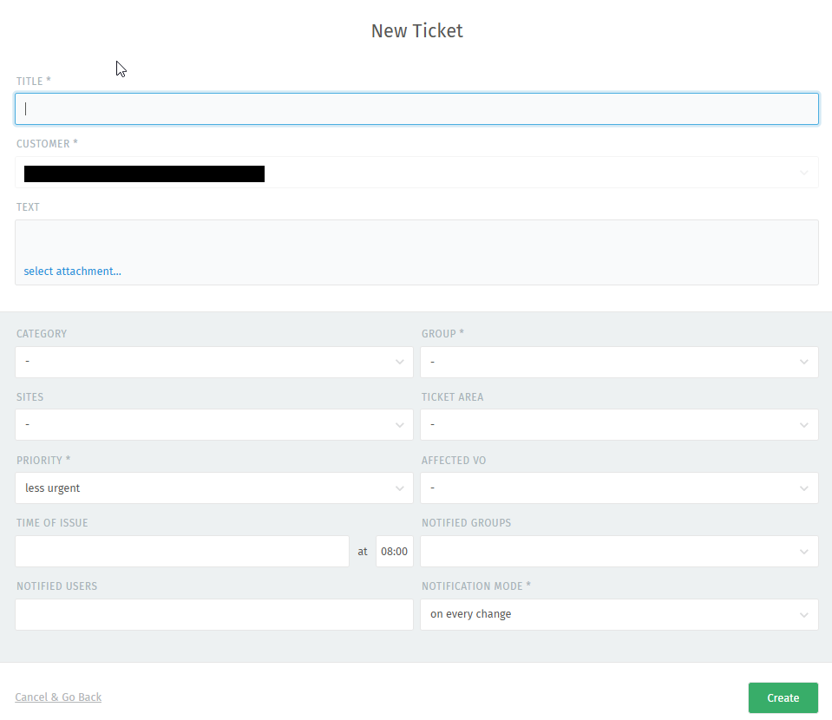
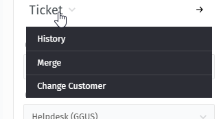

## Introduction

GGUS is the Helpdesk service of the EGI Infrastructure. Incident and Service
request tickets can be recorded, and their progress is tracked until the
solution. The users of the service should not need to know any of the details of
what happens to the ticket in order to get it from creation to solution.
However, an understanding of the operation of the system may be helpful to
explaining what happens when you request help.

Tickets can be created through the GGUS
[web interface](https://helpdesk.ggus.eu/), whose access is described in the
page [Access and roles](../access-and-roles)

Once the ticket has been created in GGUS, it is processed by supporters and
assigned to the appropriate group to deal with the issue. The groups are
generally addressed via mailing lists, so when a ticket is assigned to a support
group, an email message is sent to people included to the associated list.

## Submitting a ticket using the web interface

To submit a ticket through GGUS you first need to login through EGI Check-in, as
explained in the page [Access and roles](../access-and-roles).

After login, you are prompted to the dashboard page:

In the lower left corner, you can find a "+" button:

Click on it and select "New ticket": you will be prompted to the ticket submit
form.

### The ticket submit form on web interface

The tickets submit form offers a set of fields which should help you to
describe the issue you want to record as detailed as possible. Most of the
fields on the submit form are optional.

- “TITLE” is a mandatory field. It should give a short description of the
  issue.
- "CUSTOMER": name and email address of the user creating the ticket
- "TEXT": here you can add a detailed description of the issue.
- “CATEGORY” (mandatory) provides a drop-down list with possible values, like
  Incidents and Service Request. Choose the appropriate value according to the
  issue you are going to record.
- "GROUP": provides a drop-down list of all the support groups enabled in GGUS,
  which are grouped by category: click on the green arrow besides the name
  of each category to see eventual sub-categories and finally the support
  groups. If you already know the name of the support group, you can start to
  type it in the field to display it and then to select it. If you don't know
  whom to address your ticket, you can leave this field unselected, and the
  ticket will be automatically assigned to TPM, the
  [EGI First Level support](https://confluence.egi.eu/display/EGIPP/TPM+-+Ticket+Processing+Manager)
  who will process your ticket and assign it to the most appropriate support
  group.

- “SITE” provides a drop-down list with all the EGI sites registered in GOCDB
  and OSG sites registered in OIM DB. When selecting a site from the list, the
  appropriate NGI/ROC is set automatically, and they will be both notified about
  this ticket by email once created.
- “TICKET AREA” provides a drop-down list with possible values. This field is
  for categorizing the issue. It defaults to “Other”.
  Check "Issue type values" page .
- “PRIORITY” (mandatory) provides a drop-down list with possible priority
  values. They are “less urgent” (which is the default), “urgent”, and “very
  urgent”. See the page
  [Ticket priority](https://docs.egi.eu/internal/helpdesk/features/ticket-priority/)
- “AFFECTED VO” provides a drop-down list of all VOs supported by GGUS.
- “TIME OF ISSUE” defaults to the submitting time.
- "NOTIFIED GROUPS": with this field you can select other support groups that
  might be interested in following the progress of your ticket.
- "NOTIFIED USERS": you can involve other people in the ticket by adding their
  email address into this field.
- "NOTIFICATION MODE" defaults to “on every change”. The Notification mode
  manages the update notifications the user receives. If “On solution” is
  selected, then you only get notified when the ticket status is set to
  “solved”.

After clicking the “Create” button you get a confirmation page showing the
information submitted and the ticket ID.

### Ticket categories

The ticket category is for differentiating between incidents and service
requests. This distinction is helpful for supporters as well as for the GGUS
reporting, e.g. for excluding test tickets. Other categories were added over the
time. Currently the following values are available for selection:

- Incident (see the
  [FitSM definition](https://ims.egi.eu/display/EGIG/Incident)).
- Service request (see the
  [FitSM definition](https://ims.egi.eu/display/EGIG/Service+request)).
  - See the list of service requests for the
    [internal](https://confluence.egi.eu/display/EGISLM/EGI+Internal+Service+requests)
    and for the
    [external](https://confluence.egi.eu/display/EGISLM/EGI+Service+requests)
    services of the EGI portfolio.
- Documentation (used to request creation and update on documentation).
- Release (used when a new version of the EGI Core Services is ready to be
  tested; see the
  [Change, Release, and Deployment Management procedures](https://confluence.egi.eu/x/g4VTEg))
- CMS Internal (for cms VO specific tickets)
- EGI Coordination/Planning (to track activities not falling into the service
  request definition)
- WLCG Coordination/Planning (to track activities not falling into the service
  request definition)
- Test

### Special tickets

Users with special roles can submit special kind of tickets, such as:

- [Multisite tickets](../features/tickets-to-multiple-sites)
- [ALARM tickets](../features/alarm-tickets)
- [TEAM tickets](../features/team-tickets)

## Tickets overview

After the login, you land to the dashboard page as explained above. If you click
on "Overviews" in the menu on the left you will have an overview of the tickets
created in the helpdesk. Several views are available: in each view you can
further filter the list of tickets by GROUP, STATUS, and PRIORITY; besides,
depending on the roles you own, in the displayed lists you will see only the
tickets you are allowed to access.

- "My Tickets": here you have the list of tickets that you created.
- "My Subscribed Tickets": the list of tickets you subscribed to.
- "My Assigned Tickets Open": the list of tickets specifically assigned to you
  in any of the open statuses.
- "My Assigned Tickets All": the list of tickets specifically assigned to you
  in any status.
- "Tickets Open": all the tickets in any open status
- "Tickets All": all the tickets, also the ones that were closed.
- "Alarm Tickets": the list of Alarm tickets.
- "Site Tickets Open": the list of tickets in any of the open statuses where a
  site is involved.
- "EGI Services Tickets Open": the list of tickets in any of the open statuses
  assigned to the GROUPS within the ticket category "EGI Services and Service
  Components"
- "VO Support Tickets Open": the list of tickets in any of the open statuses
  assigned to the GROUPS within the ticket category "VO Support"
- "Second Level Tickets Open": the list of tickets in any of the open statuses
  assigned to the GROUPS within the ticket categories "LifeScience Services",
  "Networking", "Other Middleware", "PITHIA Community", and "WLCG".
- "Other Infrastructures Tickets Open": the list of tickets in any of the open
  statuses assigned to the OSG related groups.
- "Other Projects Tickets Open": the list of tickets in any of the open statuses
  assigned to the GROUPS representing the several middleware products (3rd
  level support).

## Modifying tickets

The easiest way to modify a ticket is to add a response by replying to the email
notification you get when a ticket is modified by someone else: to do this in
the correct way, please pay attention on not to change the subject line of the
email message you received.

The other way is to use the web interface, which allows you to modify also other
aspects of a ticket. When you display a ticket in your web browser, if you
scroll down at the bottom of the page you can find a text box to add your reply
to the ticket.

You also have the opportunity to attach files along with your text reply, in a
similar way as explained in the previous section. When you have completed your
reply, click on the "Update" button in the bottom right corner of the screen to
add your response to the ticket.

If you have a supporter role and you want to share your reply only with the
other supporters following up the ticket, you can click on the *lock* icon on
the left side of the text box to keep your comment as "internal": in this way,
the ticket submitter will not receive any notification related to your reply.

In addition to the reply to the ticket, you can also modify the other fields
associated to it (if you the required permissions associated to the role owned
in the system). Besides the fields that were mentioned in the previous sections,
you can now see also:

- "Owner": (Only if you have a at least supporter role) The given support group
  can appoint one of their members to directly follow-up the ticket.
- "TAGS": you can tag your ticket with a word (useful for example if you want to
  associate tickets per topic without directly linking them, but that topic is
  not included in the "TICKET AREA" field).
- "LINKS": you can link your ticket to another one, using in case the
  PARENT/CHILD relation.
- "RELATED ANSWERS": you can link a page from the Knowledge page if related to
  the topic discussed in the ticket.
- Subscribe button: if you have the rights to see a ticket and you are
  interested in follow its progress, you can subscribe to it: at any update of
  the ticket you will get an email notification.

### Ticket state

Setting the right ticket state is important to say the users if for example the
ticket has been acknowledged by someone or if some feedback from the submitter
is required to progress with the processing of a given ticket. Here is a
description of the different state values and how they should be used.

- assigned: this status is set automatically and can't be selected in the
  drop-down list menu. After a ticket is assigned to a support group, this group
  is notified via email about the ticket assignment.
- in progress: support staff who work on the ticket should change status to “in
  progress” when they acknowledge it. This is necessary to announce that someone
  is taking care of the ticket and is working on it.
- waiting for submitter's reply: this status value should be set ONLY by the
  supporters and ONLY when asking the SUBMITTER for further information.
- on hold: this status should be used in those situations where a solution
  cannot be provided in short times but is planned for a certain point in the
  future because depending for example on the release of a software fix or on
  other related activities that require more time to be completed.
- solved: this state is used to close a ticket when a solution is provided.
  Adding a full explanation of the solution is recommended and will be helpful
  when the given ticket is used as a reference and to create documentation from
  it.
- unsolved: This status is for tickets that can not be solved due to any reason
  (ticket duplicated, topic not valid any longer, won't fix, etc.). Please add a
  comment in the text field explaining why it can't be solved.

## Ticket history

If you click on the word "Ticket" displayed in top-right corner of the page, you
can access the ticket history. It shows all relevant changes of the ticket in
chronological order. Changes of these fields lead to a new entry in ticket history:

- Category
- Group
- Owner
- Ticket Area
- State
- Priority
- Affected VO
- Time of Issue
- Notified Groups
- Notified Users
- Notification Mode
- TAGS
- LINKS
- Related Answers
- Notifications (subscriptions)

## Ticket Participation

As described in the previous sections, GGUS system offers various possibilities
for involving additional people in the tickets. In summary, there are three
ways:

- involve other support groups in the progress of a ticket ("Notified groups"
  field).
- Involve individual people in the progress of a ticket by specifically adding
  their email address in the "NOTIFIED USERS" field.
- Subscribe yourself to a ticket.
