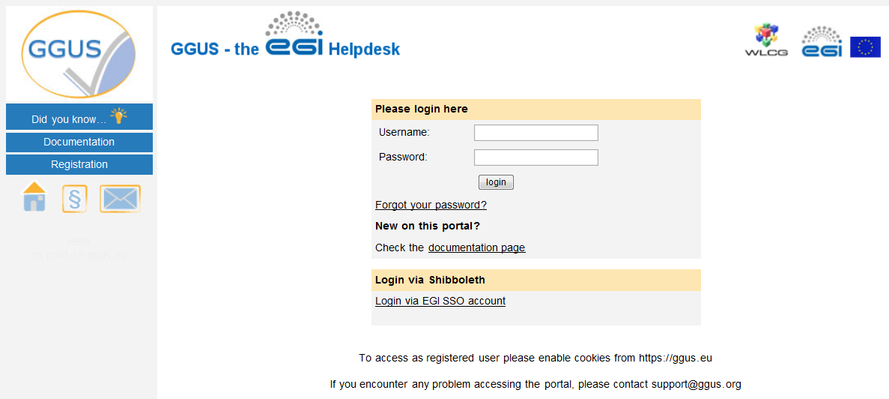
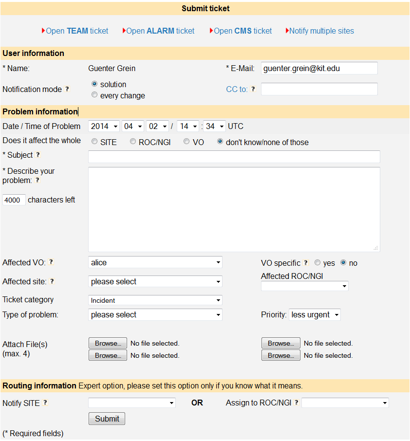
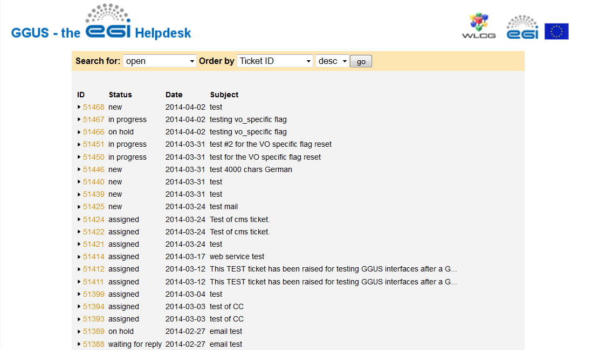
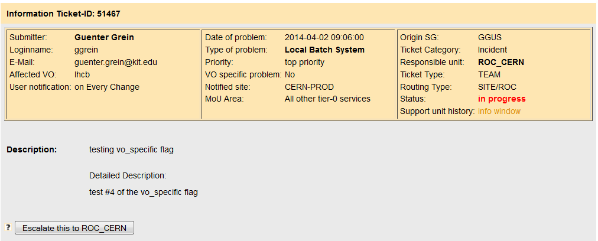
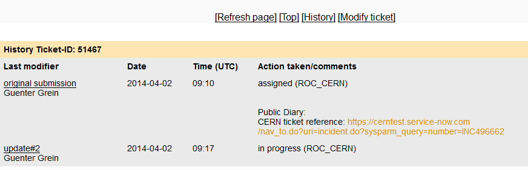
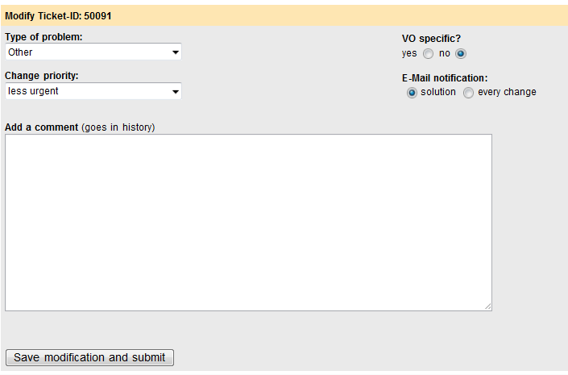
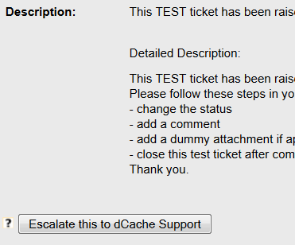
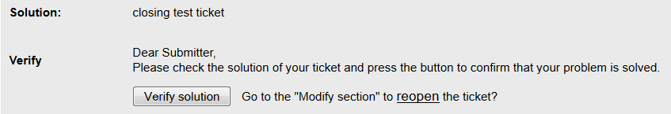
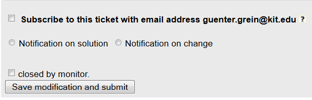
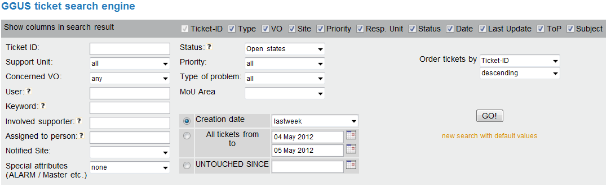

## Introduction

GGUS is the Helpdesk service of the EGI Infrastructure. Incident and Service
request tickets can be recorded, and their progress is tracked until the
solution. The users of the service should not need to know any of the details of
what happens to the ticket in order to get it from creation to solution.
However, an understanding of the operation of the system may be helpful to
explaining what happens when you request help.

Tickets can be created through the GGUS [web interface](https://ggus.eu/), which
is described in section "Accessing the web interface to GGUS" of this note.

Once the ticket has entered GGUS, it is processed by assigning it to the
appropriate group to deal with the issue. The groups are generally addressed via
mailing lists, and so GGUS assigns the ticket to a group, and an email message
is sent to people on the appropriate list. Sometimes, a ticket is simple and it
is assigned to the correct group immediately and dealt with immediately.

## Submitting a ticket using the web interface

Before using this route, it is essential to have either a digital certificate
installed in the appropriate manner in the web browser or an EGI Check-in
account.

### Accessing the web interface to GGUS

If the user carries out all of the steps above, but is not registered to use
GGUS, then the home page is like the one shown in the following figure:

If the user faces problems with their certificate, they may get help at
[wiki.egi.eu: Getting certificate](https://wiki.egi.eu/wiki/USG_Getting_Certificate)

For accessing GGUS users have to register first. Registration process is
described in chapter Registering at GGUS.

### Registering at GGUS

For getting supporter privileges users need to be registered. For registering at
GGUS the user should go to [GGUS home](https://ggus.eu/index.php?mode=index) and
click the [registration link](https://ggus.eu/index.php?mode=register_info).
This link opens the registration form that the user has to fill in. In addition,
there are some links where the user can find information about X509 personal
certificates. Users who do not have a valid digital certificate can access GGUS
via EGI SSO. After filling in the registration form, the user receives an email
from the GGUS team with his access data to GGUS.

### Accessing GGUS with certificate

The primary address of the GGUS portal is: [https://ggus.eu](https://ggus.eu).
If the user enters this in the browser, a warning will be displayed by the
browser prompting the user to specify which certificate to use (if the user has
not selected to automatically select the certificate in the browser settings).
The reason for this warning is that GGUS has to validate the user in order to
allow access. After that, the user will no longer be asked to identify himself.

The user identifies themselves with their digital certificate. At this point in
time, GGUS has identified the user and displays the start page as shown in the
following figure:

Note that in this case, the user's identity is displayed on the page and GGUS
has recognized that this user is registered to submit tickets. If authentication
by certificate fails, you will be taken to the login page.

### Accessing GGUS via EGI Check-in

When choosing "Login via EGI AAI CheckIn" on the login page the user is guided
to the EGI Check-in page were the users Identity Provider can be selected. After
authenticating there, the user will be redirected to GGUS.

### The ticket submit form on web interface

The tickets submit form offers a set of fields which should help the user to
describe his issue as detailed as possible. Most of the fields on the submit
form are optional. Only field “Subject” is required. The submit form consists of
three main sections: the **user information**, the **issue information** and the
**routing information**.

1. User information

Most fields in the user information section are pre-filled by GGUS system.

- “Name/Login” is taken from the GGUS user database.
- “E-Mail” is also taken from the GGUS user database.
- “Notification mode” defaults to “on solution”. The “Notification mode” manages
  the update notifications the user receives. “On solution” means that the user
  only gets notified when the ticket status is set to “solved” or a comment is
  added to the public diary. Additional information is available by clicking on
  the question mark on the right hand side of the field label.
- “CC to” could be filled with any mail address of people who should be informed
  about this ticket. Notifications are sent on every ticket update. The field
  content could only be changed by people who have support access. Additional
  information is available by clicking on the question mark.

1. Issue information

Although only one field is mandatory in this section, as much fields as possible
should be filled with information.

- “Date/Time of issue” defaults to the submitting time. This field should be set
  if the ticket is submitted much later than the issue occurred.
- “Subject” is a mandatory field. It should give a short description of the
  issue. This field is limited to 250 characters.
- “Describe your issue…” is limited to 4000 characters. It should be used for a
  detailed description of the issue. If the user does not know which information
  to add here he could click on the question mark for getting additional
  information.
- “Concerned VO” provides a drop-down list of all VOs supported by GGUS.
- “VO specific” is a flag indicating whether an issue is VO specific or not. It
  defaults to “no”. This flag could only be set to “yes” in combination with a
  VO selected in field “Concerned VO”.
- “Affected Site” The site impacted by the issue. A drop-down list with all EGI
  sites registered in GOC DB and OSG sites registered in OIM DB is available.
  This is no routing information!
- “Affected ROC/NGI” The NGI/ROC impacted by the issue. A drop-down list of all
  NGIs/ROCs integrated in GGUS is provided.
- “Ticket category” provides a drop-down list with possible values. This field
  is for categorizing the issue. It defaults to “Incident”.
- “Type of issue” provides a drop-down list with possible values. This field is
  for categorizing the issue. It defaults to “Other”.
- “Priority” provides a drop-down list with possible priority values. They are
  “less urgent” which is the default, “urgent”, “very urgent” and “top
  priority”.
- “Attach file(s)” offers the possibility to upload 4 attachments (e.g. log
  files etc.) at a time. Attachments are limited to 2 MB. Please avoid uploading
  file formats “.exe”, “.php”, “.htm(l)”.

1. Routing Information

- “Notify SITE” provides a drop-down list with all EGI sites registered in GOC
  DB and OSG sites registered in OIM DB. If selecting a site from the list this
  site will be notified about this ticket by mail. Additionally the ticket is
  assigned to the appropriate NGI/ROC directly, bypassing the TPM (Some words
  about TPM). If setting a site value the appropriate NGI/ROC is set
  automatically. Choosing an NGI/ROC simultaneously is not possible.
- “Assign to ROC/NGI” provides a drop-down list of all NGIs/ROCs integrated in
  GGUS. Choosing a value in this field assigns the ticket to the appropriate ROC
  directly, bypassing the TPM. If assigning a ticket to an NGI/ROC choosing a
  site value simultaneously is not possible.

After clicking the “Submit” button the user gets a confirmation page showing the
information submitted and the ticket ID.

### Bypassing the TPM

The TPM (Ticket Processing Manager) is the 1st Line Support in GGUS. Users can
bypass the TPM if they have good knowledge about where the problem is. For this
purpose at the bottom of ticket submit form there is a section "Routing
information". Selecting either a site from the
["Notify SITE"](https://wiki.egi.eu/wiki/FAQ_GGUS-Notify-Sites) drop-down menu
or a support unit from the "Assign to support unit" drop-down menu routes the
ticket directly to the selected support unit. If selecting a site name the
NGI/ROC the site belongs to is set automatically. Hence the ticket is assigned
to the relevant NGI/ROC. Additionally the site will receive a notification about
the ticket. Selecting both, the "Notify SITE" and the "Assign to support unit"
is not possible.

Tickets of type [TEAM](https://wiki.egi.eu/wiki/FAQ_GGUS-Team-Tickets) and
[ALARM](https://wiki.egi.eu/wiki/FAQ_GGUS-Alarm-Tickets) are always routed to
the relevant NGI/ROC by default.

## Browsing your own tickets

After authenticating themselves the user has access to the GGUS homepage. On
this page they see a list of their own open tickets and a list of the latest
open tickets of all users (Figure 2). Below the list of the user’s own open
tickets there are two links for further browsing possibilities of the user’s own
tickets:

- Show my complete ticket list,
- My Team Tickets.

The system only shows the user tickets which have been created with the same
authentication information the user is currently logged in. This means if a user
submits tickets with different certificates he does not see all of their
tickets. The reason for this is that the DN string of the certificate is stored
in each ticket. Showing all tickets of a user can be done by using the GGUS
search engine. In the GGUS search engine users can search by username amongst
others. This search will show all tickets of a user independent from the
authentication information.

### Show my complete ticket list

This link opens a new window showing tables of all open and closed tickets of
the user and all tickets of other users the user has subscribed to. Information
on how to subscribe to a ticket is available in section "Subscribing to a ticket
of another user."

## Modifying tickets

### Modifying your tickets using the web

For modifying a ticket the user can just click on the ticket ID. He is guided to
another page. On this page are three main sections:

- the ticket information,

- the ticket history,

- the modify section.

The ticket information gives an overview of the personal data the user provided,
the issue description and the ticket status. The ticket history shows all
actions that have been taken to solve the ticket, the date and time these
actions have been taken and the name of the supporter who did them. In the
modify section the user can add some additional information or comment on a
question of a supporter to them. The user can add attachments, change the email
notification behavior of the system and change some other attributes of his
ticket.

#### Escalating a ticket

Between the information section and the ticket history there is a button which
allows the user to escalate a ticket (Figure 9).

Three escalation levels are available in GGUS:

- Escalating ticket to the support unit it is assigned to.
- Escalating the ticket to the support unit and the TPM on shift.
- Escalating the ticket to the support unit, the TPM and the GGUS ticket
  monitoring.

The escalation levels are reached one by one. It is not possible to choose one
of them. Additional information is available by clicking on the little question
mark on the left hand side of the button.

#### Reopen a solved ticket

If a ticket is already closed it could be reopened by adding a comment and
changing the status to “reopened” in the “Modify section” (Figure 8). In this
case the support unit which solved the ticket and the TPM receive an email about
the ticket reopening.

#### Verifying the solution

When a ticket is solved, the user could confirm that the solution has solved
their issue by verifying it. A solution could be verified by either:

- Clicking the “Verify” button in the web portal or
- Replying to the solution mail without changing anything.

Verifying a solution can help to increase the quality of solutions in GGUS.

### Modify your tickets using email

Updating a ticket using email is also possible if one fundamental requirement is
achieved. The mail subject must contain the typical GGUS string “GGUS-Ticket-ID:
\#Ticket-ID” where "Ticket-ID" is the ID of the ticket which should be updated.
The easiest way to do this is to reply to an update notification received from
GGUS. When updating a ticket using email the whole mail body will be added to
the ticket. Changing any other field (e.g. status, priority,…) is impossible

## Ticket Participation

GGUS system offers various possibilities for participating in tickets. They are

- the CC field,
- the Involve others field and
- the Subscribe field.

An overview on these fields is given in the table below. Ticket participation
can be done by adding a valid mail address to one of these fields. Please avoid
adding closed mailing lists as such produce a lot of mail errors! Several mail
addresses have to be separated by semicolon.

|                | User submit | User modify | Supporter modify |
| -------------- | ----------- | ----------- | ---------------- |
| CC             | Yes         | No          | Yes              |
| Involve others | No          | No          | Yes              |
| Subscribe      | No          | Yes         | Yes              |

### The “CC” field

The CC field can be set by the user in the ticket submit form. Updates are only
possible for supporters for correcting or removing invalid mail addresses. Every
ticket update triggers a notification email to the mail address specified in the
“CC” field.

### The “Involve others” field

The “Involve others” field is only for supporters use. Every ticket update
triggers a notification email to the mail address specified in the “Involve
others” field.

### Subscribing to a ticket of another user

Figure 11: Ticket subscribe Every user could subscribe to tickets of other users
if he is interested in the solution of any. For subscribing a valid email
address has to be provided. The user gets a notification once the ticket is
solved. After subscribing to a ticket the user could change the notification
mode or unsubscribe if he wants to (Figure 11). Accessing the system with the
same credentials as used for subscription is necessary for this. Additional
information on subscribing to tickets is available by clicking on the question
mark at the right hand side of the label “Subscribe to this ticket”.

### Who gets what email notification from GGUS?

The ticket "submitter" gets emails according to the "Notification mode" value
(s)he selected when submitting the ticket. If the selected "Notification mode"
value is "on every change" then all updates are sent to the "submitter". "Public
Diary" entries are sent to the submitter regardless the value of the
"Notification mode". "Internal Diary" entries never go to the "submitter". They
are reserved for exchanges amongst supporters.

The email addresses in the "Cc:" field can be entered by the "submitter" and
receive the same notifications as the submitter. "Public Diary" entries are sent
to the addresses in the "Cc:" field. "Internal Diary" entries never go to the
people in the "Cc:" field. They are reserved for exchanges amongst supporters.

The email addresses in the "Involve others:" field can be entered by supporters
only and receive the same notifications as the Support Unit (SU) to which the
ticket is assigned. "Internal Diary" entries are sent to the relevant SU members
AND the people in the "Involve others:" field, as they are supposed to be
experts and contribute to the ticket solution.

The email address in the "Assign to one person:" field can be entered by
supporters only and receive the same notifications as the Support Unit (SU) to
which the ticket is assigned. "Internal Diary" entries are sent to the relevant
SU members AND the people in the "Involve others:" field AND the email address
in the "Assign to one person:" field as they are, all, supposed to be experts
and contribute to the ticket solution.

Every ticket update triggers an email to the addresses in the "Cc:", "Involve
others:" and to ticket subscribers, i.e. GGUS users, unrelated to the specific
ticket, who entered their own email in the "Subscribe to this ticket" field.

GGUS email notifications highlight the fields changed with the specific update.

Please avoid including closed mailing lists, e-groups in these fields as mail
delivery will fail.

## Browsing all tickets

At the bottom of the home page there are additional links for browsing:

- Search ticket database,
- Show all open tickets,

### GGUS search engine

For browsing all tickets the GGUS search engine is a useful tool.

The GGUS search engine can be entered by clicking on link “Search ticket
database”. When accessing the search engine a default search is performed like
shown in Figure 12: GGUS search engine. Searching via Ticket ID is the easiest
and fastest way to look at a ticket. When searching via Ticket ID all other
search parameters were ignored. Besides searching for all open tickets this is
the recommended kind of search, because it avoids needless workload on the
system. When searching via ticket ID the ticket details are shown in the same
window. For getting back to the main page use the "Back" button of your browser.
The various search parameters can be combined in any way wanted except
“Untouched since”. Description fields “Keyword”, “Involved supporter” and
“Assigned to person” trigger a LIKE search to the database. Concatenating
keywords with “AND” or “OR” is currently not possible. The search can either be
started by clicking on "go" or just hitting the return key. The result of a
search by parameters is shown in the result list. For viewing ticket details
just click on the ID. A new window opens showing ticket details. For getting
back to the search result just close the window with the ticket details.

### Showing all open tickets

Clicking on this link shows all open tickets that are currently in the system.
Unlike “Showing all open tickets” the default search in GGUS search engine uses
a timeframe of one week for showing open tickets.

## Contacting the GGUS team

Users can click on the “Envelope” icon in the menu bar for sending an email to
the GGUS team with any comments. Note: This must not be used for submitting
support requests as it does not create a ticket in the system!

## GGUS development plans

On GGUS home page there are a couple of links where users can get more
information on the
[GGUS development plans](https://ggus.eu/index.php?mode=development) as well as
submit own feature requests. Feature requests are collected in the GGUS shopping
lists in JIRA (only for users having a CERN account) and EGI RT.

## Operation of GGUS

The GGUS system is running on servers located at Karlsruhe Institute of
Technology (KIT), Germany. Besides the GGUS production system a backup system is
in place. Switching from production system to backup system currently needs
manual interaction. An automatic switch in case of fail-over will be
implemented. GGUS staffs at Karlsruhe are not providing support apart from
requests concerning GGUS system itself. They can be contacted by email to
support "at" ggus.eu. Usual office hours for GGUS staffs are from 07:00 to 15:00
o’clock (UTC).

### TPM

TPM (Ticket Processing Manager) is the most important part of the support system
for the grid. The purpose of TPM is:

- closing simple trouble tickets,
- ensuring that other tickets are sent to the correct place for processing,
- reacting to alarms that tickets have not been processed,

The TPM teams consist of people with a broad knowledge of the Grid.

### Ticket Monitoring

Besides developing and maintaining GGUS system the GGUS team is also doing the
ticket monitoring. The ticket monitoring team is responsible for:

- [reminding users](../workflows/waiting-for-submitter) in case their input is
  required for further ticket processing
- [reminding supporters](https://wiki.egi.eu/wiki/FAQ_GGUS-Waiting-For-PT-Process)
  in case tickets are not processed
- assisting in any problem during ticket processing
