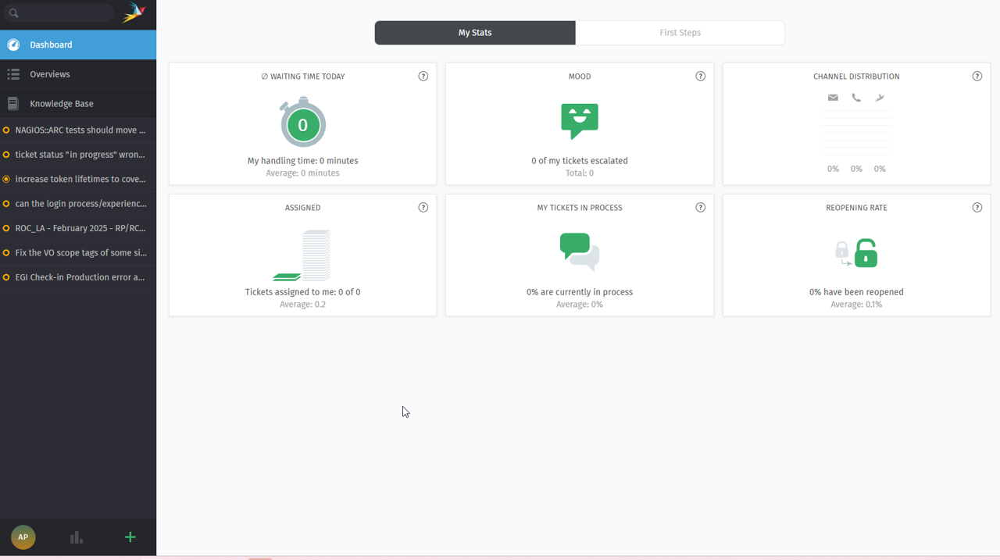
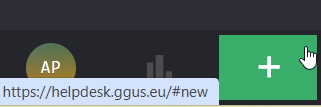
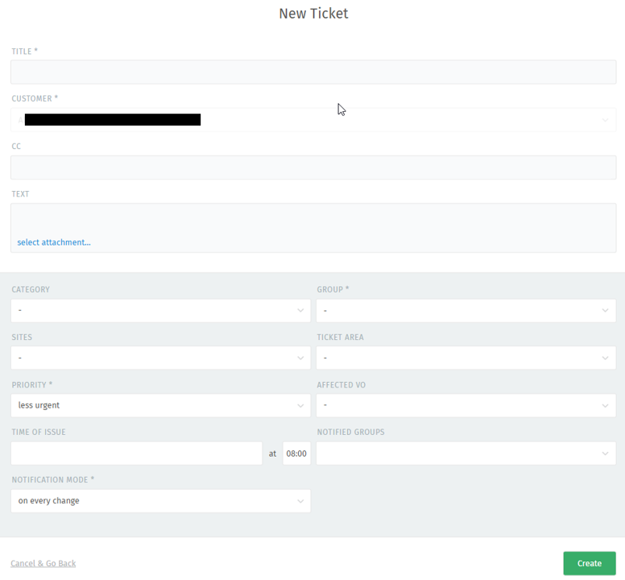
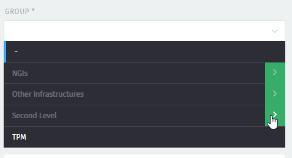
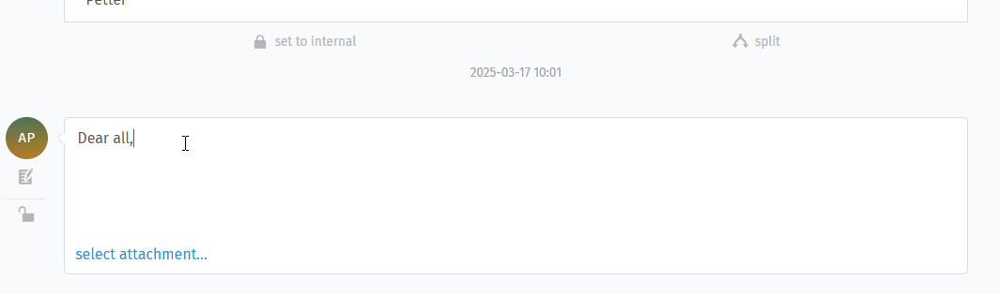
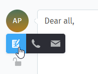
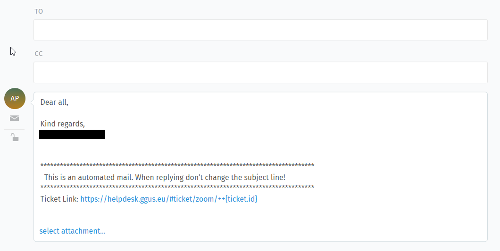
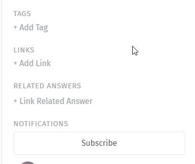

## Introduction

GGUS is the Helpdesk service of the EGI Infrastructure. Incident and Service
request tickets can be recorded, and their progress is tracked until the
solution. The users of the service should not need to know any of the details of
what happens to the ticket in order to get it from creation to solution.
However, an understanding of the operation of the system may be helpful to
explaining what happens when you request help.

Tickets can be created through the GGUS
[web interface](https://helpdesk.ggus.eu/), whose access is described in the
page [Access and roles](../access-and-roles)

Once the ticket has been created in GGUS, it is processed by supporters and
assigned to the appropriate group to deal with the issue. The groups are
generally addressed via mailing lists, so when a ticket is assigned to a support
group, an email message is sent to people included to the associated list.

## Submitting a ticket using the web interface

To submit a ticket through GGUS you first need to login through EGI Check-in, as
explained in the page [Access and roles](../access-and-roles).

After login, you are prompted to the dashboard page:

In the lower left corner, you can find a "+" button:

Click on it and select "New ticket": you will be prompted to the ticket submit
form.

### The ticket submit form on web interface

The tickets submit form offers a set of fields which should help you to
describe the issue you want to record as detailed as possible. Most of the
fields on the submit form are optional. 

- “TITLE” is a mandatory field. It should give a short description of the
  issue.
- "CUSTOMER": name and email address of the user creating the ticket
- "CC": you can notify other people about the ticket creation by adding their
  email address into this field
- "TEXT": here you can add a detailed description of the issue.
- “CATEGORY” (mandatory) provides a drop-down list with possible values, like
  Incidents and Service Request. Choose the appropriate value according to the
  issue you are going to record.
- "GROUP": provides a drop-down list of all the support groups enabled in GGUS,
  which are grouped by category: click on the green arrow besides the name
  of each category to see eventual sub-categories and finally the support
  groups. If you already know the name of the support group, you can start to
  type it in the field to display it and then to select it. If you don't know
  whom to address your ticket, you can leave this field unselected, and the
  ticket will be automatically assigned to TPM, the
  [EGI First Level support](https://confluence.egi.eu/display/EGIPP/TPM+-+Ticket+Processing+Manager)
  who will process your ticket and assign it to the most appropriate support
  group.

- “SITE” provides a drop-down list with all the EGI sites registered in GOCDB
  and OSG sites registered in OIM DB. When selecting a site from the list, the
  appropriate NGI/ROC is set automatically, and they will be both notified about
  this ticket by email once created.
- “TICKET AREA” provides a drop-down list with possible values. This field is
  for categorizing the issue. It defaults to “Other”.
  Check "Issue type values" page .
- “PRIORITY” (mandatory) provides a drop-down list with possible priority
  values. They are “less urgent” (which is the default), “urgent”, and “very
  urgent”. See the page
  [Ticket priority](https://docs.egi.eu/internal/helpdesk/features/ticket-priority/)
- “AFFECTED VO” provides a drop-down list of all VOs supported by GGUS.
- “TIME OF ISSUE” defaults to the submitting time.
- "NOTIFIED GROUPS": with this field you can select other support groups that
  might be interested in following the progress of your ticket.
- "NOTIFICATION MODE" defaults to “on every change”. The Notification mode
  manages the update notifications the user receives. If “On solution” is
  selected, then you only get notified when the ticket status is set to
  “solved”.

After clicking the “Create” button you get a confirmation page showing the
information submitted and the ticket ID.

### Special tickets

Users with special roles can submit special kind of tickets, such as:
- ["Multisite tickets"](../features/tickets-to-multiple-sites)
- [ALARM tickets](../features/alarm-tickets)
- [TEAM tickets](../features/team-tickets)

## Tickets overview

After the login, you land to the dashboard page as explained above. If you click
on "Overviews" in the menu on the left you will have an overview of the tickets
created in the helpdesk. Several views are available: in each view you can
further filter the list of tickets by GROUP, STATUS, and PRIORITY; besides,
depending on the roles you own, in the displayed lists you will see only the
tickets you are allowed to access.

- "My Tickets": here you have the list of tickets that you created.
- "My Subscribed Tickets": the list of tickets you subscribed to.
- "My Assigned Tickets Open": the list of tickets specifically assigned to you
  in any of the open statuses.
- "My Assigned Tickets All": the list of tickets specifically assigned to you
  in any status.
- "Tickets Open": all the tickets in any open status
- "Tickets All": all the tickets, also the ones that were closed.
- "Alarm Tickets": the list of Alarm tickets.
- "Site Tickets Open": the list of tickets in any of the open statuses where a
  site is involved.
- "EGI Services Tickets Open": the list of tickets in any of the open statuses
  assigned to the GROUPS within the ticket category "EGI Services and Service
  Components"
- "VO Support Tickets Open": the list of tickets in any of the open statuses
  assigned to the GROUPS within the ticket category "VO Support"
- "Second Level Tickets Open": the list of tickets in any of the open statuses
  assigned to the GROUPS within the ticket categories "LifeScience Services",
  "Networking", "Other Middleware", "PITHYA Community", and "WLCG".
- "Other Infrastructures Tickets Open": the list of tickets in any of the open
  statuses assigned to the the OSG related groups
- "Other Projects Tickets Open": the list of tickets in any of the open statuses
  assigned to the GROUPS representing the several middleware products (3rd
  level support).

## Modifying tickets

The easiest way to modify a ticket is to add a response by replying to the email
notification you get when a ticket is modified by someone else: to do this in
the correct way, please pay attention on not to change the subject line of the
email message you received.

The other way is to use the web interface, which allows you to modify also other
aspects of a ticket. When you display a ticket in your webbrowser, if you scroll
down at the bottom of the page you can find a text box to add your reply to the
ticket.

You also have the opportunity to attache files along with your text reply, in a
similar way as explained in the previous section. When you have completed your
reply, click on the "Update" button in the bottom right corner of the screen to
add your response to the ticket.

If you click on the copybook icon on the left side of the text box, it will
appear also a mail envelope icon:

Clicking on this icon will offer you the option to send your answer also to
other recipients not directly involved in the ticket: two new fields will be
displayed ("TO" and "CC") where you can add their email address. **Note: in this
way only your answer will be sent to those additional recipients**.

If you are have a supporter role and you want to share your reply only with the
other supporters following up the ticket, you can click on the *lock* icon to
keep your comment as "internal": in this way the ticket submitter will not
receive any notification related to your reply.

In addition to the reply to the ticket, you can also modify the other fields
associated to it (if you the required permissions associated to the role owned
in the system). Besides the fields that were mentioned in the previous sections,
you can now see also:

- "Owner": (Only if you have a at least supporter role) The given support group
  can appoint one of their members to directly follow-up the ticket.
- "TAGS": you can tag your ticket with a word (useful for example if you want to
  associate tickets per topic without directly linking them, but that topic is
  not included in the "TICKET AREA" field).
- "LINKS": you can link your ticket to another one, using in case the PARENT/CHILD
  relation
- "RELATED ANSWERS": you can link a page from the Knowledge page if related to
  the topic discussed in the ticket.
- Subscribe button: if you have the rights to see a ticket and you are
  interested in follow its progress, you can subscribe to it: at any update of
  the ticket you will get an email notification.

## Ticket Participation

GGUS system offers various possibilities for participating in tickets. They are

- the CC field,
- the Involve others field and
- the Subscribe field.

An overview on these fields is given in the table below. Ticket participation
can be done by adding a valid mail address to one of these fields. Please avoid
adding closed mailing lists as such produce a lot of mail errors! Several mail
addresses have to be separated by semicolon.

|                | User submit | User modify | Supporter modify |
| -------------- | ----------- | ----------- | ---------------- |
| CC             | Yes         | No          | Yes              |
| Involve others | No          | No          | Yes              |
| Subscribe      | No          | Yes         | Yes              |

### The “CC” field

The CC field can be set by the user in the ticket submit form. Updates are only
possible for supporters for correcting or removing invalid mail addresses. Every
ticket update triggers a notification email to the mail address specified in the
“CC” field.

### The “Involve others” field

The “Involve others” field is only for supporters use. Every ticket update
triggers a notification email to the mail address specified in the “Involve
others” field.

### Subscribing to a ticket of another user

Figure 11: Ticket subscribe Every user could subscribe to tickets of other users
if he is interested in the solution of any. For subscribing a valid email
address has to be provided. The user gets a notification once the ticket is
solved. After subscribing to a ticket the user could change the notification
mode or unsubscribe if he wants to (Figure 11). Accessing the system with the
same credentials as used for subscription is necessary for this. Additional
information on subscribing to tickets is available by clicking on the question
mark at the right hand side of the label “Subscribe to this ticket”.

### Who gets what email notification from GGUS?

The ticket "submitter" gets emails according to the "Notification mode" value
(s)he selected when submitting the ticket. If the selected "Notification mode"
value is "on every change" then all updates are sent to the "submitter". "Public
Diary" entries are sent to the submitter regardless the value of the
"Notification mode". "Internal Diary" entries never go to the "submitter". They
are reserved for exchanges amongst supporters.

The email addresses in the "Cc:" field can be entered by the "submitter" and
receive the same notifications as the submitter. "Public Diary" entries are sent
to the addresses in the "Cc:" field. "Internal Diary" entries never go to the
people in the "Cc:" field. They are reserved for exchanges amongst supporters.

The email addresses in the "Involve others:" field can be entered by supporters
only and receive the same notifications as the Support Unit (SU) to which the
ticket is assigned. "Internal Diary" entries are sent to the relevant SU members
AND the people in the "Involve others:" field, as they are supposed to be
experts and contribute to the ticket solution.

The email address in the "Assign to one person:" field can be entered by
supporters only and receive the same notifications as the Support Unit (SU) to
which the ticket is assigned. "Internal Diary" entries are sent to the relevant
SU members AND the people in the "Involve others:" field AND the email address
in the "Assign to one person:" field as they are, all, supposed to be experts
and contribute to the ticket solution.

Every ticket update triggers an email to the addresses in the "Cc:", "Involve
others:" and to ticket subscribers, i.e. GGUS users, unrelated to the specific
ticket, who entered their own email in the "Subscribe to this ticket" field.

GGUS email notifications highlight the fields changed with the specific update.

Please avoid including closed mailing lists, e-groups in these fields as mail
delivery will fail.

## Browsing all tickets

At the bottom of the home page there are additional links for browsing:

- Search ticket database,
- Show all open tickets,

### GGUS search engine

For browsing all tickets the GGUS search engine is a useful tool.

The GGUS search engine can be entered by clicking on link “Search ticket
database”. When accessing the search engine a default search is performed like
shown in Figure 12: GGUS search engine. Searching via Ticket ID is the easiest
and fastest way to look at a ticket. When searching via Ticket ID all other
search parameters were ignored. Besides searching for all open tickets this is
the recommended kind of search, because it avoids needless workload on the
system. When searching via ticket ID the ticket details are shown in the same
window. For getting back to the main page use the "Back" button of your browser.
The various search parameters can be combined in any way wanted except
“Untouched since”. Description fields “Keyword”, “Involved supporter” and
“Assigned to person” trigger a LIKE search to the database. Concatenating
keywords with “AND” or “OR” is currently not possible. The search can either be
started by clicking on "go" or just hitting the return key. The result of a
search by parameters is shown in the result list. For viewing ticket details
just click on the ID. A new window opens showing ticket details. For getting
back to the search result just close the window with the ticket details.

### Showing all open tickets

Clicking on this link shows all open tickets that are currently in the system.
Unlike “Showing all open tickets” the default search in GGUS search engine uses
a timeframe of one week for showing open tickets.

## Contacting the GGUS team

Users can click on the “Envelope” icon in the menu bar for sending an email to
the GGUS team with any comments. Note: This must not be used for submitting
support requests as it does not create a ticket in the system!

## GGUS development plans

On GGUS home page there are a couple of links where users can get more
information on the
[GGUS development plans](https://ggus.eu/index.php?mode=development) as well as
submit own feature requests. Feature requests are collected in the GGUS shopping
lists in JIRA (only for users having a CERN account) and EGI RT.

## Operation of GGUS

The GGUS system is running on servers located at Karlsruhe Institute of
Technology (KIT), Germany. Besides the GGUS production system a backup system is
in place. Switching from production system to backup system currently needs
manual interaction. An automatic switch in case of fail-over will be
implemented. GGUS staffs at Karlsruhe are not providing support apart from
requests concerning GGUS system itself. They can be contacted by email to
support "at" ggus.eu. Usual office hours for GGUS staffs are from 07:00 to 15:00
o’clock (UTC).

### TPM

TPM (Ticket Processing Manager) is the most important part of the support system
for the grid. The purpose of TPM is:

- closing simple trouble tickets,
- ensuring that other tickets are sent to the correct place for processing,
- reacting to alarms that tickets have not been processed,

The TPM teams consist of people with a broad knowledge of the Grid.

### Ticket Monitoring

Besides developing and maintaining GGUS system the GGUS team is also doing the
ticket monitoring. The ticket monitoring team is responsible for:

- [reminding users](../workflows/waiting-for-submitter) in case their input is
  required for further ticket processing
- reminding supporters in case tickets are not processed
- assisting in any problem during ticket processing
