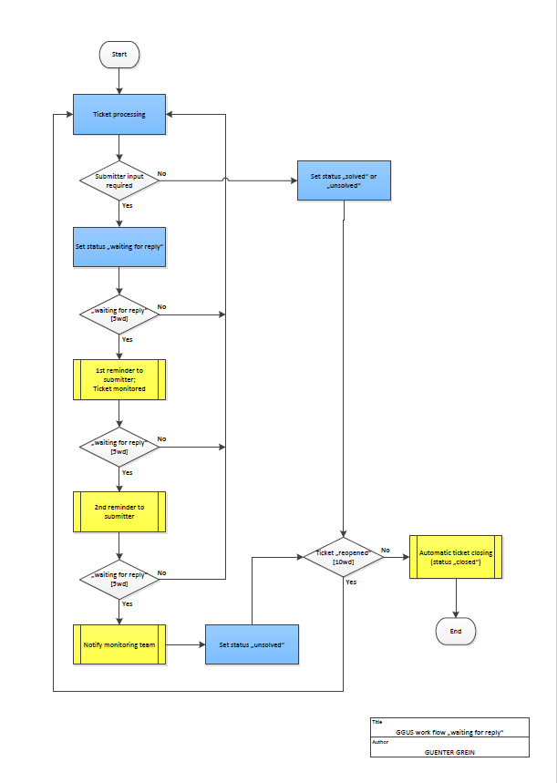

## Introduction

After discussions in the [GGUS-AB](https://indico.egi.eu/event/1265/) and the
[OMB](https://indico.egi.eu/event/1234/) meetings, members agreed on
implementing a work flow for closing tickets waiting for submitter input after a
reasonable amount of time. This work flow was also presented at the
[UCB](https://indico.egi.eu/indico/categoryDisplay.py?categId=21) meeting.

## Status value "waiting for reply"

The status value "waiting for reply" should only be used when input from the
ticket submitter is required. Setting the ticket status to "waiting for reply"
in GGUS triggers an email notification to the submitter's email address
registered in the ticket. After the submitter has replied either by

- sending an email using the same sender mail address as registered in the
  ticket or by
- updating the ticket in web portal using the same credentials/certificate used
  for submitting the ticket,

the ticket status changes to "in progress" automatically. Updates on the ticket
done using different credentials/certificates or email addresses than registered
in the ticket will not be recognized as reply by the system and hence have no
impact on the work flow. The status value "waiting for reply" must not be used
in case of waiting for input of any other person involved in the solving
process.

## Workflow

### First action

5 working days after setting the ticket status to "waiting for reply" the first
reminder is sent to the ticket submitter requesting input. The ticket will also
be added to the
[ticket monitoring dashboard](https://ggus.eu/index.php?mode=ticket_monitor).
The ticket monitoring team will make sure that the status value "waiting for
reply" is used in a correct sense.

### Second action

In case the submitter does not reply, the second reminder is sent to the ticket
submitter requesting input after 5 more working days.

### Third action

In case the submitter does not reply after another 5 more working days the
ticket monitoring team gets notified. The monitoring team will check the ticket
for any updates by the submitter not recognized by the system and set the ticket
status to "unsolved" if none. The ticket will follow the usual process for
"solved"/"unsolved" tickets and be closed after 10 working days without
re-opening the ticket again.

| Action | Ticket Status     | Working Days | Work Flow                                                                   |
| ------ | ----------------- | ------------ | --------------------------------------------------------------------------- |
| 1      | waiting for reply | 5            | first reminder to submitter; adding ticket to monitoring dashboard          |
| 2      | waiting for reply | 5            | second reminder to submitter                                                |
| 3      | waiting for reply | 5            | notification to monitoring team; the monitoring team sets status "unsolved" |
| 4      | unsolved          | 10           | manuel status change to "closed" by ticket monitoring team                  |

### Summary

In this workflow there is always a human intervention before closing a ticket.
The submitter has 15 working days in total for replying to a ticket.
Additionally, they have 10 more working days for re-opening the ticket in case
they do not agree with setting the ticket to "unsolved".

### Workflow graph

