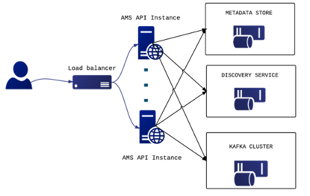

## What is it?

The EGI Messaging Service is powered by ARGO Messaging Service (AMS), a
real-time messaging service that allows the user to send and receive messages
between independent applications. It's a Publish/Subscribe Service implementing
the Google PubSub protocol.

It provides an HTTP API that enables Users/Systems to implement message oriented
service using the Publish/Subscribe Model over plain HTTP.

In the Publish/Subscribe paradigm, Publishers are users/systems that can send
messages to named-channels called Topics. Subscribers are users/systems that
create Subscriptions to specific topics and receive messages.

This central service is used by other EGI central services in order to exchange
messages, like for sending information about accounting or resources available
at a cloud site. More specifically, the services that use the Messaging service
are:

- _AAI Federation Registry (beta)_: It uses the AMS Service to exchange
  information with the different deployers (ex, SimpleSamlPhp, Mitre Id,
  Keycloak).
- _Operations Portal_: Reads the alarms from predefined topics, stores them in a
  database and displays them in the operations portal.
- _Accounting_: Use of AMS as a transport layer for collecting accounting data
  from the Sites. The accounting information is gathered from different
  collectors into a central accounting repository where it is processed to
  generate statistical summaries that are available through the EGI Accounting
  Portal.
- _FedCloud_: Use of AMS as a transport layer of the cloud information system.
  It makes use of the ams-authN. The entry point for users, topics and
  subscriptions is GOCDB.
- _ARGO Availability and Reliability Monitoring Service_: It uses the AMS
  service to send the messages from the monitoring engine to other components.

{} Documentation for the ARGO Messaging
Service is available on
[the ARGO documentation site](https://argoeu.github.io/guides/messaging/).
{}

## Architecture

Instead of focusing on a single Messaging service specification for handling the
logic of publishing/subscribing to the broker network the service focuses on
creating nodes of Publishers and Subscribers as a Service. In the
Publish/Subscribe paradigm, Publishers are users/systems that can send messages
to named-channels called Topics. Subscribers are users/systems that create
Subscriptions to specific topics and receive messages. As shown in Figure below,
the current deployment of messaging service comprises a haproxy server, which
acts as a load balancer for the 3 AMS servers running in the backend.

## Features

- _Ease of use_: It supports an HTTP API and a python library so as to easily
  integrate with the AMS.
- _Push Delivery_: ΑΜS instantly pushes asynchronous event notifications when
  messages are published to the message topic. Subscribers are notified when a
  message is available.
- _Replay messages_: replay messages that have been acknowledged by seeking a
  timestamp.
- _Schema Support_: on demand mechanism that enables a) the definition of the
  expected payload. schema, b) the definition of the expected set of attributes
  and values and c) the validation for each message if the requirements are met
  and immediately notify the client.
- _Replicate messages on multiple topics_: Republisher script that consumes and
  publishes messages for specific topics (e.g. SITES).

It supports both push and pull message delivery. In push delivery, the Messaging
Service initiates requests to your subscriber application to deliver messages.
In pull delivery, your subscription application initiates requests to the server
to retrieve messages.

Apart from the main service a number of valuable components are also supported.
These components are extensively used by the connected services.

- _Argo-ams-library_: A simple library written in python to interact with the
  ARGO Messaging Service.
- _Argo-AuthN_: Argo-authn is a new Authentication Service. This service
  provides the ability to different services to use alternative authentication
  mechanisms without having to store additional user info or implement new
  functionalities.The AUTH service holds various information about a service’s
  users, hosts, API urls, etc, and leverages them to provide its functionality.
- _AMS Metrics_: Metrics about the service
