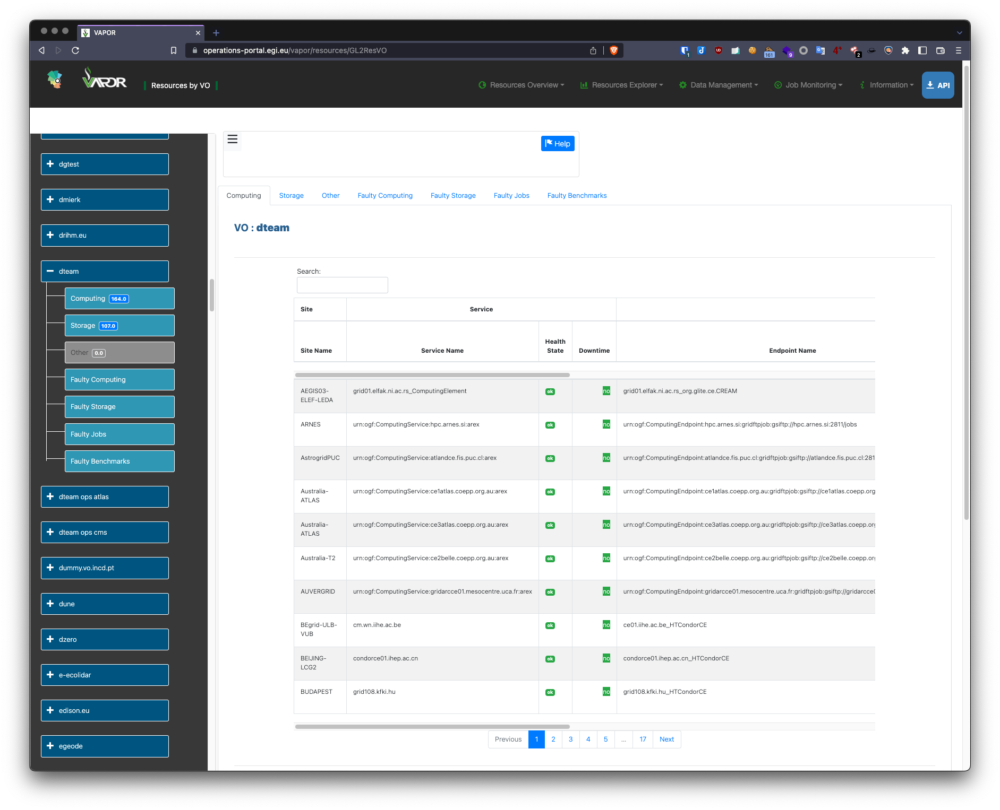
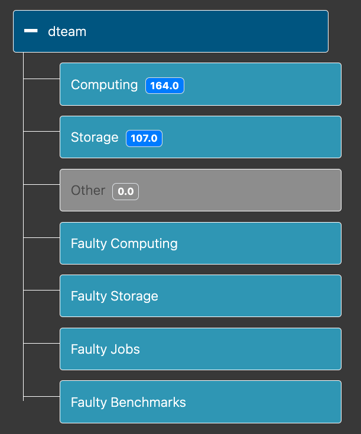
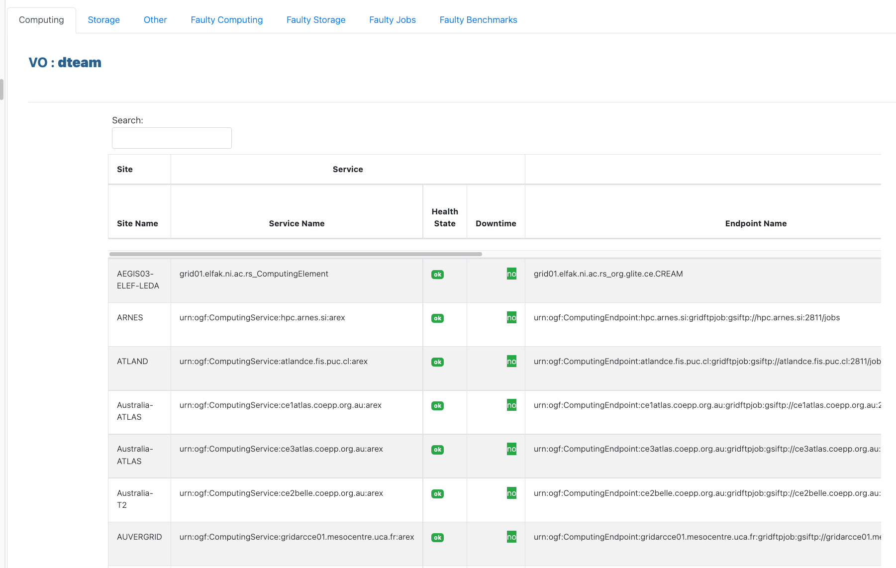

## What is it?

VAPOR is a component of the Operations Portal allowing to query the information
system, aggregating information from Top BDII and
[EGI Configuration Database](../../configuration-database).

## Using VAPOR to query resources using a graphical interface

[VAPOR](https://operations-portal.egi.eu/vapor/), a component of the
[Operations Portal](../../../internal/operations-portal), provides a graphical
resources explorer.

It can be used as an alternative to querying the Top BDII using `ldapsearch`.

Using the left menu you can select a VO and filter the different resources
types.

VAPOR will list the matching resources.

