This page contains information about connecting services to
[EGI Check-in](https://www.egi.eu/service/check-in/) in order to allow user
login through Check-in and to receive users' attributes. Check-in is connected
to a wide range of academic and social Identity Providers that users can choose
from in order to access your service.

## Services eligible for integration

EGI Operations, as owner of the Check-in service, must approve every request for
integration of new services with Check-in. The approval (or non-approval) is
based on some prerequisites, the relevance of the service for the EGI community
and the available resources to support the integration. The prerequisites are
described in the following sections.

**EGI at any time can prevent a service provider to access the Check-in
service**

### Services federated in EGI

All the services that are operated by Resource Providers federated in EGI
federation and that abide to the RC OLA, and consequently to the relevant
security policies of EGI, can be connected with Check-in. Fulfilling all the
relevant EGI policies makes the service eligible in receiving attributes
released by Check-in.

### Services not federated in EGI

A service not part of the EGI federation can be integrated with Check-in if the
organisation providing the service complies with the EGI security requirements
relevant to the service providers.

By accepting the policies a service provider assures that they will operate the
service in good faith, without deliberately exposing the user to security risks,
without claiming intellectual property on the data owned by the user, and
protecting sensitive data generated by the interaction of the user with the
service.

The policies that the service provider will have to accept are available in the
[EGI Policies and procedures page](https://go.egi.eu/policies-and-procedures)
and specifically are:

1. [EGI Security Policy](https://documents.egi.eu/document/3015)
1. [Service Operations Security Policy](https://documents.egi.eu/document/3601)
1. [Traceability and Logging Policy](https://documents.egi.eu/document/2934)
1. [Security Incident Response Policy](https://documents.egi.eu/document/2935)
1. [Policy on the Processing of Personal Data](https://documents.egi.eu/document/2732)

## Service Provider integration workflow

To integrate your Service Provider with the EGI Check-in service, you need to
create a registration request using the
[EGI Federation Registry Portal](https://aai.egi.eu/federation). You can also
use the Federation Registry portal to request the reconfiguration or
deregistration of an existing deployed service. Service registration requests
typically require approval by an administrator. Please refer to the
[Federation Registry Documentation](https://federation.rciam.grnet.gr/docs) for
more information.

The integration follows a two-step process:

1. Register your Service Provider and test integration with the **demo**
   instance of EGI Check-in by selecting the "Demo" integration environment
   during registration through the EGI Federation Registry Portal. Service
   registration requests require approval by an administrator. The review
   process for the demo environment involves primarily the technical aspects of
   the service configuration. However, moving the service to production requires
   compliance with all the
   [eligibility criteria](#services-eligible-for-integration) (see Step 2). The
   demo instance allows for testing authentication and authorisation through the
   academic and social Identity Providers connected to Check-in without
   affecting the production Check-in service. Note that while the demo instance
   has identical functionality to the production instance, no information is
   shared between the two systems.
   - You can also test new features of Check-in that are not available in
     production yet, by registering your Service Provider and testing
     integration with the **development** instance of Check-in. In the
     development instance service requests can be self-reviewed without the need
     to wait for approval from an administrator. As with the demo instance, the
     development instance allows for testing authentication and authorisation
     without affecting the production Check-in service. **NB: the list of
     supported Identity Providers in the development instance is limited.
     Therefore, we recommend using any of the social identity providers or the
     [EGI SSO](https://sso.egi.eu/admin/) to test the login workflow when using
     the development instance.**
1. Register your Service Provider with the **production** instance of EGI
   Check-in by selecting the "Production" integration environment during
   registration through the EGI Federation Registry Portal. The production
   instance allows access to your service through the academic and social
   Identity Providers connected to Check-in. This requires that your service
   meets all the [eligibility criteria](#services-eligible-for-integration) and
   that integration has been thoroughly tested during Step 1.

## General Information

EGI Check-in supports two authentication and authorisation protocols that you
can choose from:

1. [Security Assertion Markup Language (SAML) 2.0](http://docs.oasis-open.org/security/saml/Post2.0/sstc-saml-tech-overview-2.0.html)
1. [OpenID Connect](https://openid.net/specs/openid-connect-core-1_0.html) - an
   extension to [OAuth 2.0](https://tools.ietf.org/html/rfc6749)

> Service providers should ensure that a proper authorisation model is put in
> place: if [low assurance](#identity-assurance) accounts, like those coming
> from social media identity providers, are granted access without any vetting,
> it may lead to an abuse of their service.

Regardless of which of the two protocols you are going to use, you need to
provide the following information to connect your service to EGI Check-in:

1. Name of the service (in English and optionally in other languages supported
   by the service)
1. Short description of the service
1. Site (URL) for localised information about the service; the content found at
   the URL SHOULD provide more complete information than what provided by the
   description
1. Contact information of the following types:
   - Helpdesk/Support contact information (for redirecting user)
   - Administrative
   - Technical
   - Security/incident response
1. Privacy statement URL: The privacy policy is used to document the data
   collected and processed by the service. You can use the
   [Privacy Policy template](https://docs.google.com/document/d/1ZU7VjH3g7qcfWcz0Z8TTv-vQiVoRA_wOsuMyJaz28Og/edit)
1. Logo URL (optional for showing in catalogues); if provided, logos SHOULD:
   - use a transparent background where appropriate to facilitate the usage of
     logos within a user interface
   - use PNG, or GIF (less preferred), images
   - use HTTPS URLs in order to avoid mixed-content warnings within browsers
   - have a size larger than 40000 and smaller than 50000 characters when
     encoded in base64
1. Country of the service
1. Compliance with the [EGI Policies](https://go.egi.eu/policies-and-procedures)
   and the
   [REFEDS Data Protection Code of Conduct](https://wiki.refeds.org/display/CODE/Data+Protection+Code+of+Conduct+Home)

The most important URLs for each environment are listed in the table below but
more information can be found in the protocol-specific sections that follow.





| Protocol       | Production environment                                                |
| -------------- | --------------------------------------------------------------------- |
| SAML           | <https://aai.egi.eu/proxy/saml2/idp/metadata.php>                     |
| OpenID Connect | <https://aai.egi.eu/auth/realms/egi/.well-known/openid-configuration> |





| Protocol       | Demo environment                                                           |
| -------------- | -------------------------------------------------------------------------- |
| SAML           | <https://aai-demo.egi.eu/proxy/saml2/idp/metadata.php>                     |
| OpenID Connect | <https://aai-demo.egi.eu/auth/realms/egi/.well-known/openid-configuration> |





| Protocol       | Development environment                                                   |
| -------------- | ------------------------------------------------------------------------- |
| SAML           | <https://aai-dev.egi.eu/proxy/saml2/idp/metadata.php>                     |
| OpenID Connect | <https://aai-dev.egi.eu/auth/realms/egi/.well-known/openid-configuration> |





## SAML Service Provider

To enable federated access to a web-based application, you can connect to the
EGI Check-in IdP as a SAML Service Provider (SP). Users of the application will
be redirected to Check-in in order to log in, and Check-in can authenticate them
using any of the supported backend authentication mechanisms, such as
institutional IdPs registered with eduGAIN or Social Providers. Once the user is
authenticated, EGI Check-in will return a SAML assertion to the application
containing information about the authenticated user.

### Metadata registration

SAML authentication relies on the use of metadata. Both parties (you as a SP and
the EGI Check-in IdP) need to exchange metadata in order to know and trust each
other. The metadata include information such as the location of the service
endpoints that need to be invoked, as well as the certificates that will be used
to sign SAML messages. The format of the exchanged metadata should be based on
the XML-based
[SAML 2.0 specification](https://docs.oasis-open.org/security/saml/v2.0/saml-metadata-2.0-os.pdf).
Usually, you will not need to manually create such an XML document, as this is
automatically generated by all major SAML 2.0 SP software solutions (e.g.,
Keycloak, Shibboleth, SimpleSAMLphp, and `mod_auth_mellon`). It is important
that you serve your metadata over HTTPS using a browser-friendly SSL
certificate, i.e. issued by a trusted certificate authority.

You can get the metadata of the EGI Check-in IdP Proxy on a dedicated URL that
depends on the integration environment being used:





| Production environment                            |
| ------------------------------------------------- |
| <https://aai.egi.eu/proxy/saml2/idp/metadata.php> |





| Instance                        | Demo environment                                                   |
| ------------------------------- | ------------------------------------------------------------------ |
| Legacy EGI Check-in IdP         | <https://aai-demo.egi.eu/proxy/saml2/idp/metadata.php>             |
| Keycloak-based EGI Check-in IdP | <https://aai-demo.egi.eu/auth/realms/egi/protocol/saml/descriptor> |





| Instance                        | Development environment                                           |
| ------------------------------- | ----------------------------------------------------------------- |
| Legacy EGI Check-in IdP         | <https://aai-dev.egi.eu/proxy/saml2/idp/metadata.php>             |
| Keycloak-based EGI Check-in IdP | <https://aai-dev.egi.eu/auth/realms/egi/protocol/saml/descriptor> |





To register your SAML SP, you must submit a service registration request at
[Federation Registry](https://aai.egi.eu/federation). Your request should
include the general information about your service (see
[General Information](#general-information)) and the SP's metadata and entity
ID.

### Metadata

Metadata provided by your SP should contain a descriptive name of the service
that your SP represents in at least English. It is recommended to also provide
the name in other languages which are commonly used in the geographic scope of
the deployment. The name should be placed in the `<md:ServiceName>` in the
`<md:AttributeConsumingService>` container.

It is recommended that your SP metadata contains:

- an `<md:SPSSODescriptor>` role element containing
  - an `AuthnRequestsSigned` and an `WantAssertionsSigned` attribute set to
    `true`
  - at least one `<md:AssertionConsumerService>` endpoint element
  - at least one `<md:KeyDescriptor>` element whose use attribute is omitted or
    set to encryption
  - an `<md:Extensions>` element at the role level containing
    - an `<mdui:UIInfo>` extension element containing the child elements
      `<mdui:DisplayName>`, `<mdui:Logo>`, and `<mdui:PrivacyStatementURL>`
    - an `<mdattr:EntityAttributes>` extension element for signaling Subject
      Identifier requirements with previously prescribed content
  - an `<md:ContactPerson>` element with a contactType of `support` and/or a
    `<md:ContactPerson>` element with a contactType of `technical`. The
    `<md:ContactPerson>` element(s) should contain at least one
    `<md:EmailAddress>`. The support address may be used for generic support
    questions about the service, while the technical contact may be contacted
    regarding technical interoperability problems. The technical contact must be
    responsible for the technical operation of the service represented by your
    SP.

If the SP supports the Single Logout profile, then its metadata **MUST** contain
(within its `<md:SPSSODescriptor>` role element):

- at least one `<md:KeyDescriptor>` element whose use attribute is omitted or
  set to signing
- at least one `<md:SingleLogoutService>` endpoint element (this MAY be omitted
  if the SP solely issues `<samlp:LogoutRequest>` messages containing the
  `<aslo:Asynchronous>` extension
  [SAML2ASLO](http://docs.oasis-open.org/security/saml/Post2.0/saml-async-slo/v1.0/cs01/saml-async-slo-v1.0-cs01.pdf))

### Attributes

The EGI Check-in IdP is guaranteed to release a minimal subset of the
[REFEDS R&S](https://refeds.org/category/research-and-scholarship) attribute
bundle to connected Service Providers without administrative involvement,
subject to user consent. The following attributes constitute a minimal subset of
the R&S attribute bundle:

- Community User Identifier (CUID) which is a globally unique, opaque,
  persistent and non-reassignable identifier identifying the user
  (`voPersonID`). For users whose community identity is managed by Check-in,
  this identifier is of the form `<uniqueID>@egi.eu`. The `<uniqueID>` portion
  is an opaque identifier issued by Check-in.
- Email address (`mail`)
- Display name (`displayName`) OR (`givenName` AND `sn`)

A more extensive list of all the attributes that may be made available to
Service Providers is included in the [User Attribute](#user-attributes) section.

### Attribute-based authorisation

> As mentioned in [the General Information](#general-information), omitting
> authorisation checks may lead to abuse of the service.

EGI Check-in provides information about the authenticated user that may be used
by Service Providers in order to control user access to resources. This
information is provided by the EGI Check-in IdP in the
[SAML attribute assertion](#attributes). The table below lists the SAML
attributes that are relevant for user authorisation:

| Description                                                                                     | SAML Attribute         |
| ----------------------------------------------------------------------------------------------- | ---------------------- |
| [VO/group membership/roles of the authenticated user](#vogroup-membership-and-role-information) | `eduPersonEntitlement` |
| [Capabilities](#capabilities)                                                                   | `eduPersonEntitlement` |
| [GOCDB roles](#gocdb-roles)                                                                     | `eduPersonEntitlement` |
| [Identity Assurance](#identity-assurance)                                                       | `eduPersonAssurance`   |

### Service Provider Migration to Keycloak

The migration guide below applies to SAML Service Providers (SPs) registered in
the **Development** and **Demo** environments of Check-in.

**Development and Demo**: Beginning March 9, 2023, clients using the legacy
Check-in IdP metadata will no longer be supported.

#### How to Migrate your Service to Keycloak

All the SPs that were registered to the legacy EGI Check-in IdP in the **Demo**
environment have been moved to Keycloak, so you do not need to re-register your
Service.

{} If your SAML SP relies on
experimental features of Check-in which are only available in the
**Development** environment, you will need to re-register your SP through the
[Federation Registry](https://aai.egi.eu/federation) using the "Copy Service"
functionality.{}

##### New Identity Provider Metadata

The first thing you need to do is to update the IdP metadata URL in the SP
configuration, according to the [Metadata registration](#metadata-registration)
section.

##### New Attributes

Some attributes will not be supported when moving your SP to the Keycloak-based
EGI Check-in IdP. These attributes will be replaced by new ones, as described in
the table below:

| Deprecated Attributes        | New Attributes                |
| ---------------------------- | ----------------------------- |
| `eduPersonScopedAffiliation` | `voPersonExternalAffiliation` |
| `eduPersonUniqueId`          | `voPersonID`                  |

{} The values of the deprecated attributes
will remain the same. Only the name of the attributes is changed.{}

You need to update the SP configuration to map the values the new attribute
names.

##### NameID

NameID formats control how the users at IdPs are mapped to users at SPs during
single sign-on. The SPs need to advertise in their metadata which of the
following formats they support, otherwise Keycloak will assign the unspecified
(`urn:oasis:names:tc:SAML:1.1:nameid-format:unspecified`) NameID to the SP.

- Transient (`urn:oasis:names:tc:SAML:2.0:nameid-format:transient`)
- Persistent (`urn:oasis:names:tc:SAML:2.0:nameid-format:persistent`)
- Email address (`urn:oasis:names:tc:SAML:1.1:nameid-format:emailAddress`)
- Unspecified (`urn:oasis:names:tc:SAML:1.1:nameid-format:unspecified`)

### References

- [Keycloak Service Provider Documentation](https://www.keycloak.org/docs/latest/server_admin/#saml-v2-0-identity-providers)
- [Shibboleth Service Provider Documentation](https://shibboleth.atlassian.net/wiki/spaces/SP3/overview)
- [SimpleSAMLphp Service Provider QuickStart](https://simplesamlphp.org/docs/stable/simplesamlphp-sp.html)
- [Simple SAML 2.0 service provider with mod_auth_mellon Apache module](https://github.com/latchset/mod_auth_mellon)

### Example SAML Service Provider Configurations

#### Keycloak

If you are using Keycloak as an SAML Service Provider, then you need to follow
the steps below in order to register EGI Check-in as an Identity Provider:

1. Access the administrator console of your Keycloak instance and navigate to
   "Identity Providers" and then select "SAML v2.0"

   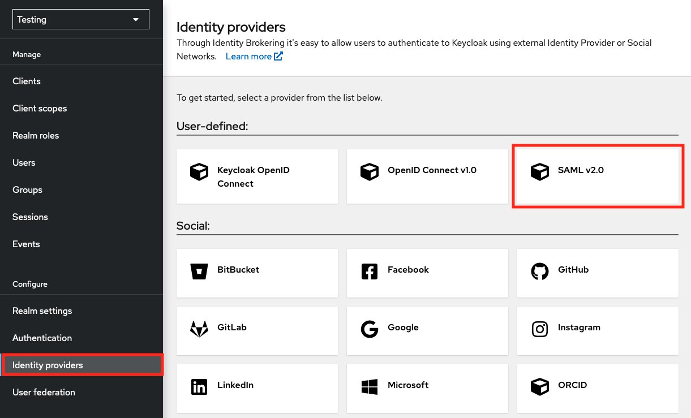

1. In the next page, complete the following fields:

   - Alias: `egi-check-in-saml`
   - Display name: `EGI Check-in`

   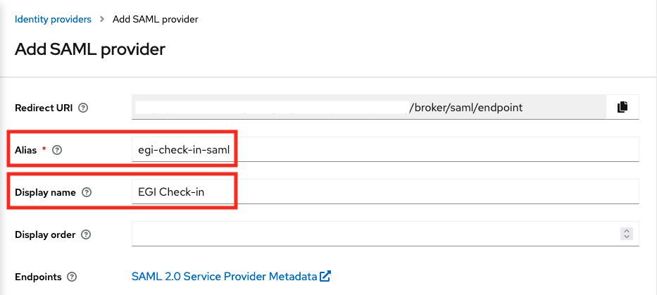

   Scroll down, and complete the rest options:

   - SAML entity descriptor: `https://aai.egi.eu/proxy/saml2/idp/metadata.php`

   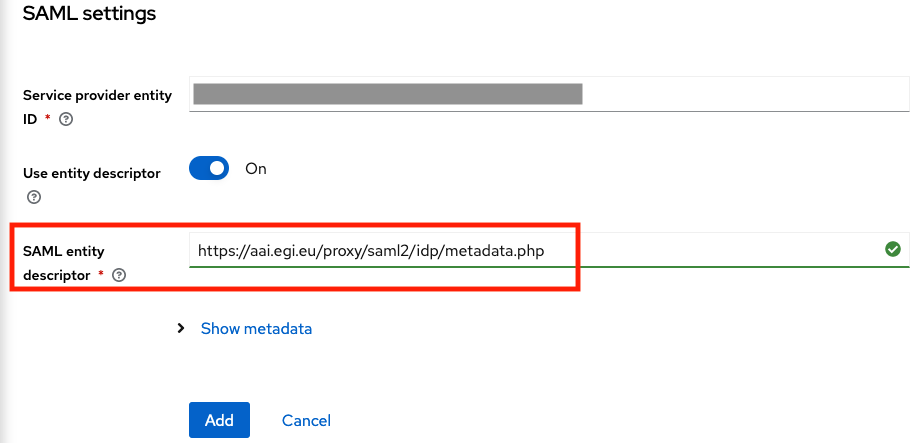

   And then click on the "Add" button.

1. After adding EGI Check-in IdP, scroll down to the "SAML settings" section and
   edit the following options:

   - Principal type: `Attribute [Name]`
   - Principal attribute: `urn:oid:1.3.6.1.4.1.25178.4.1.6`
   - HTTP-POST binding response: `On`
   - Want AuthnRequests signed: `On`

   {} `urn:oid:1.3.6.1.4.1.25178.4.1.6` is
   the OID presentation of voPersonID attribute.{}

   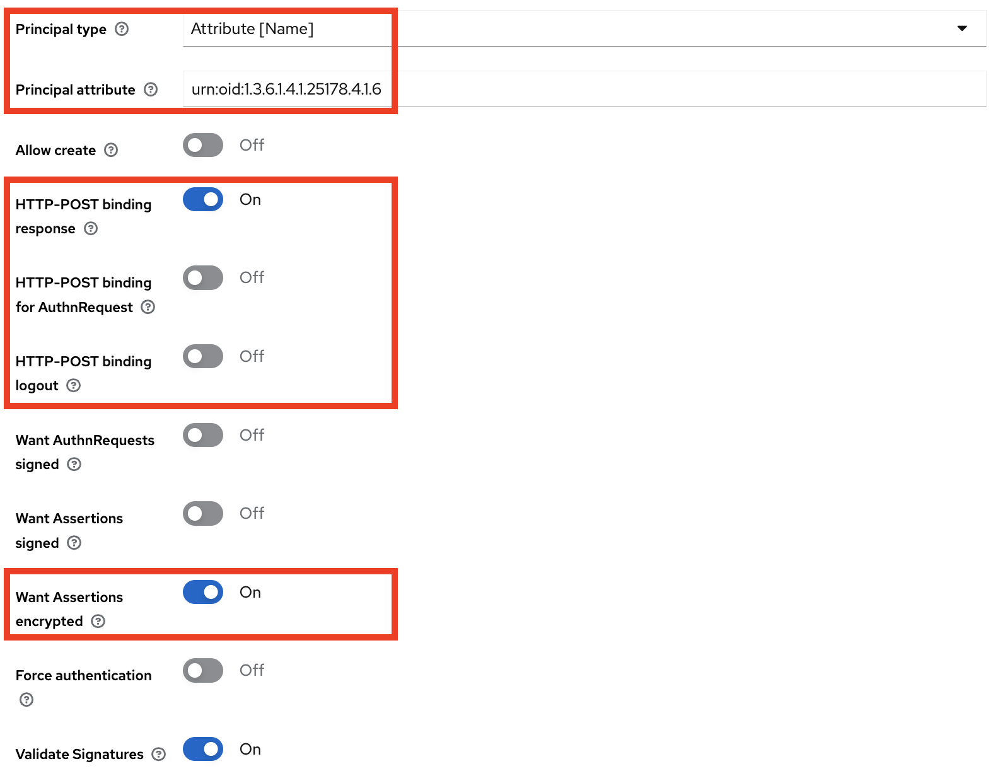

1. Then, scroll down to the "Advanced settings" section and enable the "Trust
   Email" option and click on "Save".

   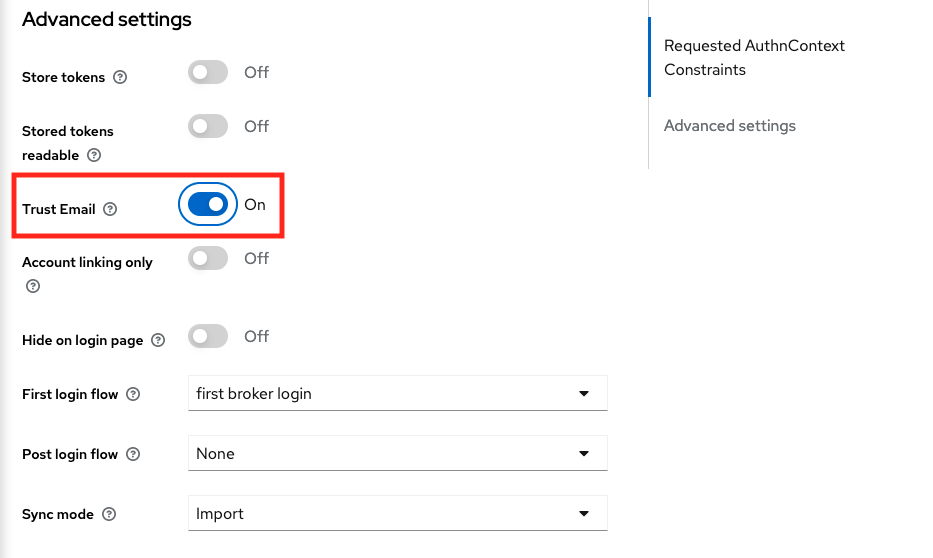

1. Next, you will need to create a mapper for each attribute that your Service
   Provider will request from EGI Check-in Proxy. Go to the "Mappers" tab and
   then click on "Add Mapper".

   For the `voPersonID` attribute you will need to add the following options:

   - Name: `voPersonID`
   - Sync Mode Override: `import`
   - Mapper Type: `Attribute Importer`
   - Attribute Name: `urn:oid:1.3.6.1.4.1.25178.4.1.6`
   - Friendly Name: `voPersonID`
   - Name Format: `ATTRIBUTE_FORMAT_URI`
   - User Attribute Name: `voPersonID`

   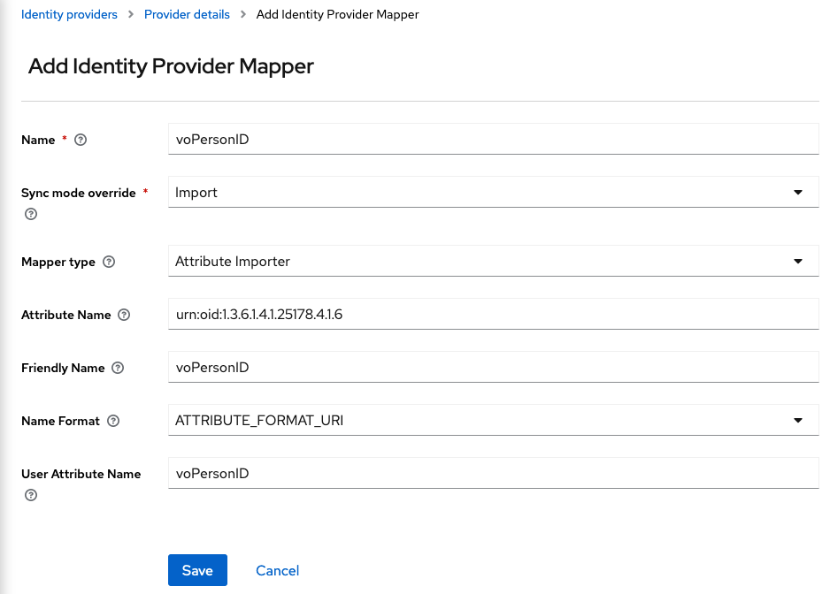

   And for the `eduperson_entitlement` claim:

   - Name: `eduPersonEntitlement`
   - Sync Mode Override: `Inherit`
   - Mapper Type: `Attribute Importer`
   - Attribute Name: `urn:oid:1.3.6.1.4.1.5923.1.1.1.7`
   - Friendly Name: `eduPersonEntitlement`
   - Name Format: `ATTRIBUTE_FORMAT_URI`
   - User Attribute Name: `eduPersonEntitlement`

   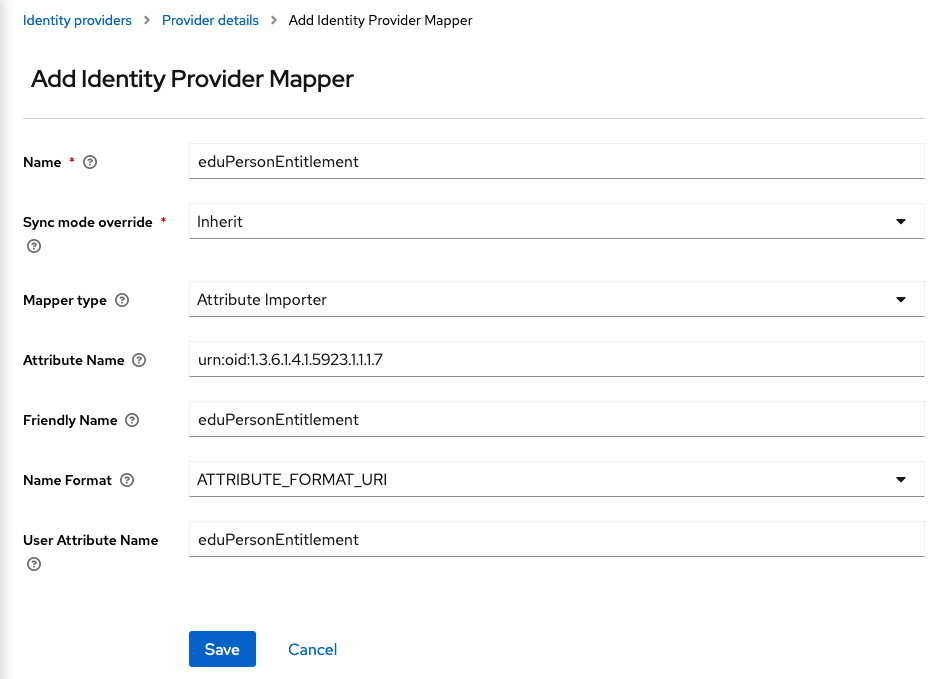

   {} For other
   [attributes](#user-attributes), create a mapper similar to the
   `eduPersonEntitlement` mapper.{}

## OpenID Connect Service Provider

Service Providers can be integrated with EGI Check-in using OpenID Connect
(OIDC) as an alternative to the SAML2 protocol. To allow this, the EGI Check-in
IdP provides an OpenID Connect (OAuth2) API based on
[Keycloak](https://www.keycloak.org), which has been
[certified by the OpenID Foundation](http://openid.net/certification/).
Interconnection with the EGI Check-in OpenID Provider allows users to sign in
using any of the supported backend authentication mechanisms, such as
institutional IdPs registered with eduGAIN or Social Providers. Once the user
has signed in, EGI Check-in can return OIDC Claims containing information about
the authenticated user.

{} The EGI Check-in OpenID Provider
will be migrated to Keycloak. Please check
[OIDC Client Migration to Keycloak](#client-migration-to-keycloak) for more
details {}

### Client registration

Before your service can use the EGI Check-in OpenID Provider for user login, you
must submit a service registration request using
[Federation Registry](https://aai.egi.eu/federation) in order to obtain OAuth
2.0 credentials. The client configuration should include the general information
about your service, as described in [General Information](#general-information)
section.

#### Obtaining OAuth 2.0 credentials

You need OAuth 2.0 credentials, which typically include a client ID and client
secret, to authenticate users through the EGI Check-in OpenID Provider.

You can specify the client ID and secret when creating/editing your client or
let them being automatically generated during registration (_recommended_).

To find the ID and secret of your client, do the following:

1. Select your client from the
   [Manage Services Page](https://aai.egi.eu/federation).
1. Look for the **Client ID** in the **Protocol** tab.
1. Select the **Display/edit client secret:** option from the **Protocol** tab.

{} You can copy these values using the
green copy button next to the desired field.{}

### Redirection URIs

OpenID Connect Services **MUST** pre-register one or more Redirection URI(s) to
which authentication responses from EGI Check-in will be sent. EGI Check-in
utilises exact matching of the redirect URI specified in an authentication
request against the pre-registered URIs
[OAuth2-BCP](https://datatracker.ietf.org/doc/html/draft-ietf-oauth-security-topics#section-4.1),
with the matching performed as described in
[RFC3986](https://www.rfc-editor.org/rfc/rfc3986#section-6.2.1) (Simple String
Comparison). Redirection URIs **MUST** use the schemata defined in Section
3.1.2.1 of the
[OIDC-Core](https://openid.net/specs/openid-connect-core-1_0.html#AuthRequest)
specification. Note that the Redirection URI **MUST** use the `https` scheme;
the use of `http` Redirection URIs is only allowed in the development
environment.

### Claims

The EGI Check-in UserInfo Endpoint is an OAuth 2.0 Protected Resource that
returns specific information about the authenticated end user as Claim Values.
To obtain the requested Claims about the end user, the Client makes a request to
the UserInfo Endpoint using an Access Token obtained through OpenID Connect
Authentication. The scopes associated with the Access Token used to access the
EGI Check-in UserInfo Endpoint will determine what Claims will be released.
These Claims are represented by a JSON object that contains a collection of name
and value pairs for the Claims.

The following scope values can be used to request Claims from the EGI Check-in
UserInfo Endpoint:

<!-- markdownlint-disable no-inline-html -->

| Scope                          | Claims                                                                                                                                                                                            |
| ------------------------------ | ------------------------------------------------------------------------------------------------------------------------------------------------------------------------------------------------- |
| `openid`                       | `sub`                                                                                                                                                                                             |
| `profile`                      | <ul><li>`name`</li><li>`given_name`</li><li>`family_name`</li><li>`preferred_username`</li></ul>                                                                                                  |
| `email`                        | <ul><li>`email`</li><li>`email_verified`</li><li>`voperson_verified_email`</li></ul>                                                                                                              |
| `aarc`                         | <ul><li>`name`</li><li>`given_name`</li><li>`family_name`</li><li>`preferred_username`</li><li>`email`</li><li>`email_verified`</li><li>`voperson_verified_email`</li><li>`voperson_id`</li></ul> |
| `eduperson_entitlement`        | `eduperson_entitlement`                                                                                                                                                                           |
| `eduperson_scoped_affiliation` | `eduperson_scoped_affiliation`                                                                                                                                                                    |
| `voperson_id`                  | `voperson_id`                                                                                                                                                                                     |

<!-- markdownlint-enable no-inline-html -->

A more extensive list of all the attributes that may be made available to
Service Providers is included in the [User Attribute](#user-attributes) section.

### Grant Types

Check-in supports the following OpenID Connect/OAuth2 grant types:

- Authorization Code: used by Web Apps executing on a server.
- Token Exchange: used by clients to request and obtain security tokens in
  support of delegated access to resources.
- Device Code: used by devices that lack a browser to perform a user-agent based
  OAuth flow.
- Client credentials: used by clients to obtain an access token outside of the
  context of a user. Such an access token is typically used by clients to access
  resources about themselves rather than to access a user's resources.

#### Authorization Code

The Authorization Code Flow returns an Authorization Code to the Client, which
can then exchange it for an ID Token and an Access Token directly. This provides
the benefit of not exposing any tokens to the User Agent and possibly other
malicious applications with access to the User Agent. The Authorization Server
can also authenticate the Client before exchanging the Authorization Code for an
Access Token. The Authorization Code flow is suitable for Clients that can
securely maintain a Client Secret between themselves and the Authorization
Server.

##### Authorization Code Flow Steps

The Authorization Code Flow goes through the following steps.

1. Client prepares an Authentication Request containing the desired request
   parameters.
1. Client sends the request to the Authorization Server.
1. Authorization Server Authenticates the end user.
1. Authorization Server obtains end user Consent/Authorization.
1. Authorization Server sends the end user back to the Client with an
   Authorization Code.
1. Client requests a response using the Authorization Code at the Token
   Endpoint.
1. Client receives a response that contains an ID Token and Access Token in the
   response body.
1. Client validates the ID token and retrieves the end user's Subject
   Identifier.

##### Authentication Request

The request parameters of the Authorization Endpoint are:

- `client_id`: ID of the client that ask for authentication to the Authorization
  Server.
- `redirect_uri`: URI to which the response will be sent.
- `scope`: A list of attributes that the application requires.
- `state`: Opaque value used to maintain state between the request and the
  callback.
- `response_type`: value that determines the authorization processing flow to be
  used. For **Authorization Code** grant set `response_type=code`. This way the
  response will include an Authorization Code.

Example request:

```http
  HTTP/1.1 302 Found
  Location: ${AUTHORIZATION_ENDPOINT}?
    response_type=code
    &scope=openid%20profile%20email
    &client_id=s6BhdRkqt3
    &state=af0ifabcd
    &redirect_uri=https%3A%2F%2Fclient.example.org%2Fcb
```

{} You can find the
`AUTHORIZATION_ENDPOINT` in the [Endpoints](#endpoints) table.{}

Example response:

```http
  HTTP/1.1 302 Found
  Location: https://client.example.org/cb?
    code=SplxlOBeZQQYbYS6WxSbIA
    &state=af0ifabcd
```

##### Token Request

A Client makes a Token Request by presenting its Authorization Grant (in the
form of an Authorization Code) to the Token Endpoint using the `grant_type`
value `authorization_code`, as described in Section 4.1.3 of OAuth 2.0
[RFC6749](https://www.rfc-editor.org/rfc/rfc6749#section-4.1.3). If the Client
is a Confidential Client, then it **MUST** authenticate to the Token Endpoint
using the authentication method registered for its `client_id`. The Client sends
the parameters to the Token Endpoint using the HTTP `POST` method and the Form
Serialization.

The parameters that are present in the token request are described in the table
below:

| Parameter      | Presence | Values                                                                                             |
| -------------- | -------- | -------------------------------------------------------------------------------------------------- |
| `grant_type`   | Required | `authorization_code`                                                                               |
| `code`         | Required | The value of the code in the response from Authorization Endpoint                                  |
| `redirect_uri` | Required | URI to which the response will be sent (must be the same as the request to Authorization Endpoint) |

Example request:

```shell
$ curl -X POST "${TOKEN_ENDPOINT}" \
    -H 'Content-Type: application/x-www-form-urlencoded' \
    -u "${CLIENT_ID}":"${CLIENT_SECRET}" \
    -d "grant_type=authorization_code" \
    -d "code=SplxlOBeZQQYbYS6WxSbIA" \
    -d "redirect_uri=https%3A%2F%2Fclient.example.org%2Fcb" | python -m json.tool
```

{} You can find the `TOKEN_ENDPOINT` in the
[Endpoints](#endpoints) table.{}

Example response:

```json
{
  "access_token": "SlAV32hkKG...",
  "expires_in": 3600,
  "id_token": "eyabcdGciOiJSUzI1N...",
  "token_type": "Bearer"
}
```

#### Proof Key for Code Exchange (PKCE)

The Proof Key for Code Exchange (PKCE, pronounced pixie) extension
([RFC 7636](https://tools.ietf.org/html/rfc7636)) describes a technique for
public clients (clients without `client_secret`) to mitigate the threat of
having the Authorization Code intercepted. The technique involves the client
first creating a secret, and then using that secret again when exchanging the
Authorization Code for an access token. This way if the code is intercepted, it
will not be useful since the token request relies on the initial secret.

##### Client configuration

To enable PKCE you need to go to the
[Manage Services Page](https://aai.egi.eu/federation) and create/edit a client.
In "Protocol" tab under "Token Endpoint Authentication Method" select "No
authentication" and in "Crypto" tab under "Proof Key for Code Exchange (PKCE)
Code Challenge Method" select "SHA-256 hash algorithm".

##### Protocol Flow

Because the PKCE-enhanced Authorization Code Flow builds upon the standard
Authorization Code Flow, the steps are very similar.

First, the client creates and records a secret named the `code_verifier`. The
`code_verifier` is a high-entropy cryptographic random STRING using the
unreserved characters [A-Z] / [a-z] / [0-9] / "-" / "." / "\_" / "~", with a
minimum length of 43 characters and a maximum length of 128 characters. Then the
client creates a `code_challenge` derived from the `code_verifier` by using one
of the following transformations on the code verifier:

- `plain` code_challenge = code_verifier
- `S256` code_challenge = BASE64URL-ENCODE(SHA256(ASCII(code_verifier)))

If the client is capable of using `S256`, it MUST use `S256`. Clients are
permitted to use `plain` only if they cannot support `S256` for some technical
reason.

{} There are various tools that generate
these values such as <https://tonyxu-io.github.io/pkce-generator/>
{}

Then the `code_challenge` is sent in the Authorization Request along with the
transformation method (`code_challenge_method`).

Example request:

```http
  HTTP/1.1 302 Found
  Location: ${AUTHORIZATION_ENDPOINT}?
      client_id=${CLIENT_ID}
      &scope=openid%20profile%20email
      &redirect_uri=${REDIRECT_URI}
      &response_type=code
      &code_challenge=${CODE_CHALLENGE}
      &code_challenge_method=S256
```

{} You can find the
`AUTHORIZATION_ENDPOINT` in the [Endpoints](#endpoints) table.{}

The Authorization Endpoint responds as usual but records `code_challenge` and
the `code_challenge_method`.

Example response:

```http
  HTTP/1.1 302 Found
  Location: ${REDIRECT_URI}?code=fgtLHT
```

The client then sends the Authorization Code in the Access Token Request as
usual but includes the `code_verifier` secret generated in the first request.

Example request:

```shell
$ curl -X POST "${TOKEN_ENDPOINT}" \
    -d "grant_type=authorization_code" \
    -d "code=${CODE}" \
    -d "client_id=${CLIENT_ID}" \
    -d "redirect_uri=${REDIRECT_URI}" \
    -d "code_verifier=${CODE_VERIFIER}" | python -m json.tool
```

{} You can find the `TOKEN_ENDPOINT` in the
[Endpoints](#endpoints) table.{}

The Authorization Server transforms `code_verifier` and compares it to
`code_challenge` from the first request. Access is denied if they are not equal.

Example response:

```json
{
  "access_token": "eyJraWQiOiJvaWRjIiwiYWxnIjoiUlMyNTYifQ...",
  "expires_in": 3599,
  "id_token": "eyJraWQiOiJvaWRjIiwiYWxnIjoiUlMyNTYifQ...",
  "scope": "openid email profile",
  "token_type": "Bearer"
}
```

#### Refresh flow

The following request allows obtaining an access token from a refresh token
using the `grant_type` value `refresh_token`:

| Parameter       | Presence | Values                                        |
| --------------- | -------- | --------------------------------------------- |
| `client_id`     | Required | The identifier of the client.                 |
| `client_secret` | Required | The secret value of the client.               |
| `grant_type`    | Required | `refresh_token`                               |
| `refresh_token` | Required | `The value of the refresh token`              |
| `scope`         | Required | This parameter should contain openid at least |

Example request:

```shell
$ curl -X POST "${TOKEN_ENDPOINT}" \
    -u "${CLIENT_ID}":"${CLIENT_SECRET}" \
    -d "grant_type=refresh_token" \
    -d "refresh_token=${REFRESH_TOKEN}" \
    -d "scope=openid%20email%20profile" | python -m json.tool;
```

{} You can find the `TOKEN_ENDPOINT` in the
[Endpoints](#endpoints) table.{}

Example response:

```json
{
  "access_token": "eyJraWQiOiJvaWRjIiwiYWx...",
  "expires_in": 3599,
  "id_token": "eyJraWQiOiJvaWRjIiwiYW...",
  "refresh_token": "eyabcdGciOiJub25...",
  "scope": "openid profile email",
  "token_type": "Bearer"
}
```

##### Refresh Request when using PKCE

To combine the refresh token grant type with PKCE you need to make the following
request:

```shell
$ curl -X POST "${TOKEN_ENDPOINT}" \
    -d "client_id=${CLIENT_ID}" \
    -d "grant_type=refresh_token" \
    -d "refresh_token=${REFRESH_TOKEN}" \
    -d "scope=openid%20email%20profile" | python -m json.tool;
```

{} You can find the `TOKEN_ENDPOINT` in the
[Endpoints](#endpoints) table.{}

#### Token Exchange

To get a token from client B using a token issued for client A, the parameters
of the request are:

| Parameter            | Presence | Values                                                                                                    |
| -------------------- | -------- | --------------------------------------------------------------------------------------------------------- |
| `grant_type`         | Required | `urn:ietf:params:oauth:grant-type:token-exchange`                                                         |
| `audience`           | Optional | Define the logical name of the service that the token will be used for                                    |
| `subject_token`      | Required | The value of the access token                                                                             |
| `subject_token_type` | Required | `urn:ietf:params:oauth:token-type:access_token` (because this feature accepts access tokens only)         |
| `scope`              | Optional | Define one or more scopes that are contained in the original token; otherwise all scopes will be selected |

Example request:

```shell
$ curl -X POST "${TOKEN_ENDPOINT}" \
    -u "${CLIENT_B_ID}":"${CLIENT_B_SECRET}" \
    -d "grant_type=urn:ietf:params:oauth:grant-type:token-exchange" \
    -d "subject_token=${ACCESS_TOKEN_A}" \
    -d "subject_token_type=urn:ietf:params:oauth:token-type:access_token" \
    -d "scope=openid%20profile%20offline_access" | python -m json.tool;
```

{} You can find the `TOKEN_ENDPOINT` in the
[Endpoints](#endpoints) table.{}

Example response:

```json
{
  "access_token": "eyJraWQiOiJvaWRjIiwiYWxnIjoiUl...",
  "expires_in": 3599,
  "id_token": "eyJraWQiOiJvaWRjIiwiYWxnIjoiUl...",
  "refresh_token": "eyabcdGciOiJub25lIn0.eyJleHAiO...",
  "scope": "openid profile offline_access",
  "token_type": "Bearer"
}
```

#### Device Code

The device code flow enables OAuth clients on (input-constrained) devices to
obtain user authorisation for accessing protected resources without using an
on-device user-agent, provided that they have an internet connection.

##### 1. Device Authorization Request

The client initiates the authorisation flow by requesting a set of verification
codes from the Authorization Server by making an HTTP "POST" request to the
device Authorization Endpoint. The client constructs the request with the
following parameters:

| Parameter   | Presence | Values                                                                                                    |
| ----------- | -------- | --------------------------------------------------------------------------------------------------------- |
| `client_id` | Required | The identifier of the client                                                                              |
| `scope`     | Optional | Define one or more scopes that are contained in the original token; otherwise all scopes will be selected |

Example request:

```shell
$ curl -X POST "${DEVICE_AUTHORIZATION_ENDPOINT}" \
    -H "Content-Type: application/x-www-form-urlencoded" \
    -d "client_id=${CLIENT_ID}" \
    -d "client_secret=${CLIENT_SECRET}" \
    -d "scope=openid%20email%20profile" | python -m json.tool
```

{} You can find the
`DEVICE_AUTHORIZATION_ENDPOINT` in the [Endpoints](#endpoints)
table.{}

Example response:

```json
{
  "device_code": "HvtHOpSah_Anupq-0dtzvN7cb-wcnwxytiMzpBZBN6E",
  "expires_in": 600,
  "interval": 5,
  "user_code": "NMEM-SDPK",
  "verification_uri": "https://aai.egi.eu/auth/realms/egi/device",
  "verification_uri_complete": "https://aai.egi.eu/auth/realms/egi/device?user_code=NMEM-SDPK"
}
```

##### 2. User Interaction

After receiving a successful Authorization Response, the client displays or
otherwise communicates the `user_code` and the `verification_uri` to the end
user and instructs them to visit the URI in a user agent on a secondary device
(for example, in a browser on their mobile phone), and enter the user code.

##### 3. Device Access Token Request

After displaying instructions to the user, the client makes an Access Token
Request to the token endpoint. The request contains the following parameters:

| Parameter       | Presence | Values                                                                                                    |
| --------------- | -------- | --------------------------------------------------------------------------------------------------------- |
| `grant_type`    | Required | `urn:ietf:params:oauth:grant-type:device_code`                                                            |
| `device_code`   | Required | The device verification code, `device_code` from the Device Authorization Response                        |
| `client_id`     | Required | The identifier of the client                                                                              |
| `client_secret` | Required | The secret value of the client                                                                            |
| `scope`         | Optional | Define one or more scopes that are contained in the original token; otherwise all scopes will be selected |

Example request:

```shell
$ curl -X POST "${TOKEN_ENDPOINT}" \
    -H "Content-Type: application/x-www-form-urlencoded" \
    -d "grant_type=urn%3Aietf%3Aparams%3Aoauth%3Agrant-type%3Adevice_code" \
    -d "device_code=${DEVICE_CODE}" \
    -d "client_id=${CLIENT_ID}" \
    -d "client_secret=${CLIENT_SECRET}" \
    -d "scope=openid%20profile" | python -m json.tool
```

{} You can find the `TOKEN_ENDPOINT` in the
[Endpoints](#endpoints) table.{}

Example response:

```json
{
  "access_token": "eyJraWQiOiJyc2ExIiwiYWxnIjoiUlMyNTYifQ.eyJzdWIiOiJhZG1pbiIs...",
  "expires_in": 3599,
  "id_token": "eyJraWQiOiJyc2ExIiwiYWxnIjoiUlMyNTYifQ.eyJzdWIiOiI5MDM0Mi...",
  "scope": "openid profile",
  "token_type": "Bearer"
}
```

##### Device Code with PKCE

To combine Device Code flow with PKCE you need to make the following requests:

1 - Device Authorization Request:

```shell
$ curl -X POST "${DEVICE_AUTHORIZATION_ENDPOINT}" \
    -H "Content-Type: application/x-www-form-urlencoded" \
    -d "client_id=${CLIENT_ID}" \
    -d "client_secret=${CLIENT_SECRET}" \
    -d "scope=openid%20email%20profile" \
    -d "code_challenge=${CODE_CHALLENGE}" \
    -d "code_challenge_method=S256" | python -m json.tool
```

{} You can find the
`DEVICE_AUTHORIZATION_ENDPOINT` in the [Endpoints](#endpoints)
table.{}

2 - Device Access Token Request

```shell
$ curl -X POST "${TOKEN_ENDPOINT}" \
    -H "Content-Type: application/x-www-form-urlencoded" \
    -d "grant_type=urn%3Aietf%3Aparams%3Aoauth%3Agrant-type%3Adevice_code" \
    -d "device_code=${DEVICE_CODE}" \
    -d "client_id=${CLIENT_ID}" \
    -d "client_secret=${CLIENT_SECRET}" \
    -d "code_verifier=${CODE_VERIFIER}" | python -m json.tool
```

{} You can find the `TOKEN_ENDPOINT` in the
[Endpoints](#endpoints) table.{}

#### Client credentials

The parameters that are used in the Client Credentials flow are:

| Parameter    | Presence | Values                     |
| ------------ | -------- | -------------------------- |
| `grant_type` | Required | `client_credentials`       |
| `scope`      | Optional | Define scope(s) to request |

Example request:

```shell
$ curl -X POST "${TOKEN_ENDPOINT}" \
    -u "${CLIENT_ID}":"${CLIENT_SECRET}" \
    -H "Content-Type: application/x-www-form-urlencoded" \
    -d "grant_type=client_credentials" \
    -d "scope=openid%20email%20profile%20eduperson_entitlement%20voperson_id" | python -m json.tool;
```

{} You can find the `TOKEN_ENDPOINT` in the
[Endpoints](#endpoints) table.{}

Example response:

```json
{
  "access_token": "eyJraWQiOiJvaWRjIiwiYWxnIjoiUl...",
  "expires_in": 3599,
  "id_token": "eyJraWQiOiJvaWRjIiwiYWxnIjoiUl...",
  "not-before-policy": 0,
  "refresh_expires_in": 0,
  "scope": "openid eduperson_entitlement voperson_id profile email",
  "token_type": "Bearer"
}
```

Example Access Token (decoded payload):

```json
{
  "azp": "1deb9fbd-44a3-4dff-ab4a-49e092e7f566",
  "clientAddress": "xxx.xxx.xxx.xxx",
  "clientHost": "xxx.xxx.xxx.xxx",
  "client_id": "1deb9fbd-44a3-4dff-ab4a-49e092e7f566",
  "exp": 1674473629,
  "iat": 1674470029,
  "iss": "https://aai.egi.eu/auth/realms/egi",
  "jti": "bdf15737-01ba-4e61-b5bc-3304d637e2b6",
  "scope": "openid eduperson_entitlement voperson_id profile email",
  "sub": "253b69f3-2325-4fd5-a26d-95e26b42bbaf@egi.eu",
  "typ": "Bearer",
  "voperson_id": "253b69f3-2325-4fd5-a26d-95e26b42bbaf@egi.eu"
}
```

### Endpoints

The most important OIDC/OAuth2 endpoints are listed below:

<!-- markdownlint-disable no-inline-html -->





| Endpoints               | Production environment                                                        |
| ----------------------- | ----------------------------------------------------------------------------- |
| Provider configuration  | <https://aai.egi.eu/auth/realms/egi/.well-known/openid-configuration>         |
| Issuer                  | <https://aai.egi.eu/auth/realms/egi>                                          |
| Authorization           | <https://aai.egi.eu/auth/realms/egi/protocol/openid-connect/auth>             |
| Token                   | <https://aai.egi.eu/auth/realms/egi/protocol/openid-connect/token>            |
| Device Authorization    | <https://aai.egi.eu/auth/realms/egi/protocol/openid-connect/auth/device>      |
| JSON Web Key Sets(JWKS) | <https://aai.egi.eu/auth/realms/egi/protocol/openid-connect/certs>            |
| UserInfo                | <https://aai.egi.eu/auth/realms/egi/protocol/openid-connect/userinfo>         |
| Introspection           | <https://aai.egi.eu/auth/realms/egi/protocol/openid-connect/token/introspect> |
| Logout                  | <https://aai.egi.eu/auth/realms/egi/protocol/openid-connect/logout>           |





| Endpoints               | Demo environment                                                                   |
| ----------------------- | ---------------------------------------------------------------------------------- |
| Provider configuration  | <https://aai-demo.egi.eu/auth/realms/egi/.well-known/openid-configuration>         |
| Issuer                  | <https://aai-demo.egi.eu/auth/realms/egi>                                          |
| Authorization           | <https://aai-demo.egi.eu/auth/realms/egi/protocol/openid-connect/auth>             |
| Token                   | <https://aai-demo.egi.eu/auth/realms/egi/protocol/openid-connect/token>            |
| Device Authorization    | <https://aai-demo.egi.eu/auth/realms/egi/protocol/openid-connect/auth/device>      |
| JSON Web Key Sets(JWKS) | <https://aai-demo.egi.eu/auth/realms/egi/protocol/openid-connect/certs>            |
| UserInfo                | <https://aai-demo.egi.eu/auth/realms/egi/protocol/openid-connect/userinfo>         |
| Introspection           | <https://aai-demo.egi.eu/auth/realms/egi/protocol/openid-connect/token/introspect> |
| Logout                  | <https://aai-demo.egi.eu/auth/realms/egi/protocol/openid-connect/logout>           |





| Endpoints               | Development environment                                                           |
| ----------------------- | --------------------------------------------------------------------------------- |
| Provider configuration  | <https://aai-dev.egi.eu/auth/realms/egi/.well-known/openid-configuration>         |
| Issuer                  | <https://aai-dev.egi.eu/auth/realms/egi>                                          |
| Authorization           | <https://aai-dev.egi.eu/auth/realms/egi/protocol/openid-connect/auth>             |
| Token                   | <https://aai-dev.egi.eu/auth/realms/egi/protocol/openid-connect/token>            |
| Device Authorization    | <https://aai-dev.egi.eu/auth/realms/egi/protocol/openid-connect/auth/device>      |
| JSON Web Key Sets(JWKS) | <https://aai-dev.egi.eu/auth/realms/egi/protocol/openid-connect/certs>            |
| UserInfo                | <https://aai-dev.egi.eu/auth/realms/egi/protocol/openid-connect/userinfo>         |
| Introspection           | <https://aai-dev.egi.eu/auth/realms/egi/protocol/openid-connect/token/introspect> |
| Logout                  | <https://aai-dev.egi.eu/auth/realms/egi/protocol/openid-connect/logout>           |





<!-- markdownlint-enable no-inline-html -->

#### Authorization Endpoint

The Authorization Endpoint performs Authentication of the end user. This is done
by sending the User Agent to the Authorization Server\'s Authorization Endpoint
for Authentication and Authorisation, using request parameters defined by OAuth
2.0 and additional parameters and parameter values defined by OpenID Connect.

For more information please check the
[Authorization Code Flow](#authorization-code).

#### Token Endpoint

To obtain an Access Token, an ID Token, and optionally a Refresh Token, the
Client sends a Token Request to the Token Endpoint.

This endpoint is used in the following flows:

- [Authorization Code](#authorization-code)
- [Refresh Token](#refresh-flow)
- [Token Exchange](#token-exchange)
- [Device Code](#device-code)
- [Client Credentials](#client-credentials)

#### Device Authorization Endpoint

This endpoint has been introduced in the OAuth 2.0 Device Authorization Grant
specification [RFC8628](https://www.rfc-editor.org/rfc/rfc8628#section-3.1) and
it is used in Device Code Flow.

The OAuth client on the device interacts with the authorization server directly
without presenting the request in a user agent, and the end user authorizes the
request on a separate device. This interaction is defined as follows.

For more information please check the [Device Code Flow](#device-code).

#### JSON Web Key Sets Endpoint

This URL points to the Authorization Server's JWK Set
[JWK](https://www.rfc-editor.org/info/rfc7517) document. The referenced document
contains the signing key(s) the client uses to validate signatures from the
authorization server.

#### UserInfo Endpoint

The UserInfo Endpoint is an OAuth 2.0 Protected Resource that returns Claims
about the authenticated end user. To obtain the requested Claims about the end
user, the Client makes a request to the UserInfo Endpoint using an Access Token
obtained through OpenID Connect Authentication. These Claims are normally
represented by a JSON object that contains a collection of name and value pairs
for the Claims.

##### UserInfo Request

The Client sends the UserInfo Request using either HTTP `GET` or HTTP `POST`.
The Access Token obtained from an OpenID Connect Authentication Request must be
sent as a Bearer Token, per Section 2 of
[OAuth 2.0 Bearer Token Usage (RFC6750)](https://www.rfc-editor.org/rfc/rfc6750#section-2).

It is recommended that the request use the HTTP `GET` method and the Access
Token be sent using the Authorization header field.

Example request:

```shell
$ curl -X GET "${USERINFO_ENDPOINT}"
    -H "Content-type: application/json"
    -H "Authorization: Bearer ${ACCESS_TOKEN}" | python -m json.tool;
```

{} You can find the `USERINFO_ENDPOINT` in
the [Endpoints](#endpoints) table.{}

Example response:

```json
{
  "eduperson_assurance": [
    "https://refeds.org/assurance/IAP/low",
    "https://aai.egi.eu/LoA#Substantial"
  ],
  "eduperson_entitlement": [
    "urn:mace:egi.eu:group:demo.fedcloud.egi.eu:members:role=member#aai.egi.eu",
    "urn:mace:egi.eu:group:demo.fedcloud.egi.eu:role=member#aai.egi.eu",
    "urn:mace:egi.eu:group:demo.fedcloud.egi.eu:vm_operator:role=member#aai.egi.eu"
  ],
  "email": "jdoe@example.org",
  "email_verified": true,
  "family_name": "John",
  "given_name": "Doe",
  "name": "John Doe",
  "preferred_username": "jdoe",
  "sub": "1234567890123456789012345678901234567890123456789012345678901234@egi.eu",
  "voperson_id": "1234567890123456789012345678901234567890123456789012345678901234@egi.eu",
  "voperson_verified_email": ["jdoe@example.org"]
}
```

#### Introspection Endpoint

The introspection endpoint is an OAuth 2.0 endpoint that takes a parameter
representing an OAuth 2.0 token and returns a JSON document representing the
meta information surrounding the token, including whether this token is
currently active.

##### Introspection Request

The protected resource calls the introspection endpoint using an HTTP `POST`
request with parameters sent as `application/x-www-form-urlencoded`.

Example request:

```shell
$ curl -X POST "${INTROSPECTION_ENDPOINT}" \
    -u "${CLIENT_ID}":"${CLIENT_SECRET}" \
    -H "Content-Type: application/x-www-form-urlencoded" \
    -d "token=${ACCESS_TOKEN}" | python -m json.tool;
```

{} You can find the
`INTROSPECTION_ENDPOINT` in the [Endpoints](#endpoints) table.{}

Example response:

```json
{
  "active": true,
  "auth_time": 1668613335,
  "authenticating_authority": "https://idp.admin.grnet.gr/idp/shibboleth",
  "azp": "token-portal",
  "client_id": "token-portal",
  "eduperson_assurance": [
    "https://refeds.org/assurance/IAP/low",
    "https://aai.egi.eu/LoA#Substantial"
  ],
  "eduperson_entitlement": [
    "urn:mace:egi.eu:group:demo.fedcloud.egi.eu:members:role=member#aai.egi.eu",
    "urn:mace:egi.eu:group:demo.fedcloud.egi.eu:role=member#aai.egi.eu",
    "urn:mace:egi.eu:group:demo.fedcloud.egi.eu:vm_operator:role=member#aai.egi.eu"
  ],
  "email": "jdoe@example.org",
  "email_verified": true,
  "exp": 1668616935,
  "iat": 1668613335,
  "iss": "https://aai.egi.eu/auth/realms/egi",
  "jti": "fecaf906-8578-4155-9783-f2083900b93c",
  "nonce": "30ccf6777eb726aae4f71fc72684c07c",
  "scope": "openid eduperson_entitlement voperson_id profile email",
  "session_state": "dc0feb13-8a3d-4b91-86c6-039ee27503df",
  "sid": "dc0feb13-8a3d-4b91-86c6-039ee27503df",
  "sub": "1234567890123456789012345678901234567890123456789012345678901234@egi.eu",
  "typ": "Bearer",
  "voperson_id": "1234567890123456789012345678901234567890123456789012345678901234@egi.eu",
  "voperson_verified_email": ["jdoe@example.org"]
}
```

#### Logout Endpoint

The OpenID Connect protocol supports global logout (like the Single Logout in
SAML). EGI Check-in OpenID Provider supports the
[OpenID Connect RP-Initiated Logout](https://openid.net/specs/openid-connect-rpinitiated-1_0.html)
specification where the logout starts by redirecting the user to a specific
endpoint at the OpenID Provider.

This endpoint is normally obtained via the `end_session_endpoint` element of the
OP's Configuration page and the parameters that are used in the logout request
at the Logout Endpoint are defined below:

- `id_token_hint`: ID Token previously issued by the OP to the Relying Party
  passed to the Logout Endpoint as a hint about the end user's current
  authenticated session with the Client. This is used as an indication of the
  identity of the end user that the RP is requesting be logged out by the OP.
- `client_id`: OAuth 2.0 Client Identifier valid at the Authorization Server.
  This parameter is needed to specify the Client Identifier when
  `post_logout_redirect_uri` is used but `id_token_hint` is not. Using this
  parameter, a confirmation dialog will be presented to the end user.
- `post_logout_redirect_uri`: URI to which the RP is requesting that the end
  user's browser be redirected after a logout has been performed. This URI
  should use the HTTPS scheme and the value must have been previously registered
  in the configuration of the Service in
  [EGI Federation Registry](https://aai.egi.eu/federation). Note that you need
  to include either the `client_id` or `id_token_hint` parameter in case the
  `post_logout_redirect_uri` is included.

##### Example Request

```http
  HTTP/1.1 302 Found
  Location: ${LOGOUT_ENDPOINT}?
    id_token_hint=${ID_TOKEN}
```

{} You can find the `LOGOUT_ENDPOINT` in
the [Endpoints](#endpoints) table.{}

##### Example Request with redirection

```http
  HTTP/1.1 302 Found
  Location: ${LOGOUT_ENDPOINT}?
    post_logout_redirect_uri=${POST_LOGOUT_REDIRECT_URI}
    &client_id=${CLIENT_ID}
```

{} You can find the `LOGOUT_ENDPOINT` in
the [Endpoints](#endpoints) table.{}

### Claims-based authorisation

> As mentioned in [the General Information](#general-information), omitting
> authorisation checks may lead to abuse of the service.

EGI Check-in provides information about the authenticated user that may be used
by Service Providers in order to control user access to resources. This
information is provided by the EGI Check-in OpenID Provider in the form of
[OIDC claims](#claims). The table below lists the claims that are relevant for
user authorisation:

| Description                                                                                     | OIDC Claim              |
| ----------------------------------------------------------------------------------------------- | ----------------------- |
| [VO/group membership/roles of the authenticated user](#vogroup-membership-and-role-information) | `eduperson_entitlement` |
| [Capabilities](#capabilities)                                                                   | `eduperson_entitlement` |
| [GOCDB roles](#gocdb-roles)                                                                     | `eduperson_entitlement` |
| [Identity Assurance](#identity-assurance)                                                       | `eduperson_assurance`   |

### Example OIDC Client Configurations

#### Keycloak

If you are using Keycloak as an OIDC Relying Party, then you need to follow the
steps below in order to register EGI Check-in as an Identity Provider:

1. Access the administrator console of your Keycloak instance and navigate to
   "Identity Providers" and then select "OpenID Connect v1.0"

   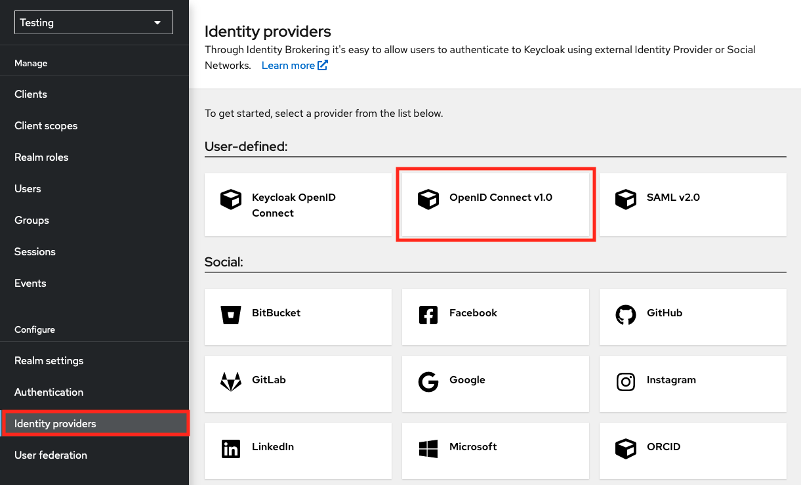

1. In the next page, complete the following fields:

   - Alias: `egi-check-in-oidc`
   - Display name: `EGI Check-in`

   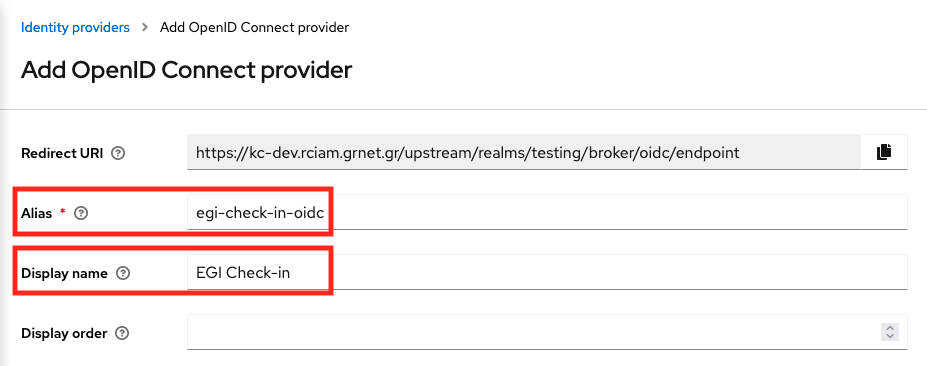

   Scroll down, and complete the rest options:

   - Discovery endpoint:
     `https://aai.egi.eu/auth/realms/egi/.well-known/openid-configuration`
   - Client ID: `<YOUR_CLIENT_ID>`
   - Client Secret: `<YOUR_CLIENT_SECRET>`

   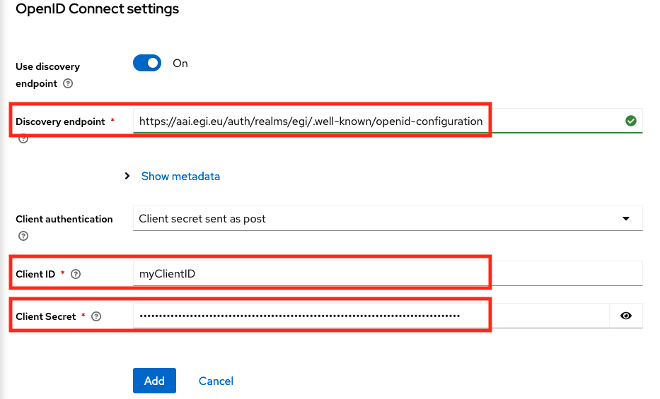

   And then click on the "Add" button.

1. After adding EGI Check-in IdP, scroll down to the "OpenID Connect settings"
   section and expand the "Advanced" option and then add the scopes that the
   Service needs. For example:

   Scopes: `openid voperson_id email profile eduperson_entitlement`

   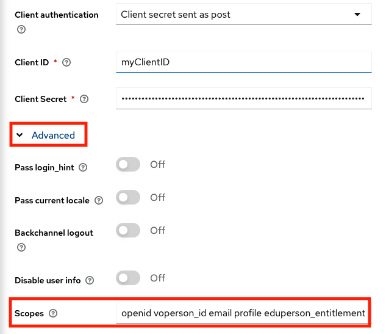

1. Then, scroll down to the "Advanced settings" section and enable the "Trust
   Email" option and click on "Save" button.

   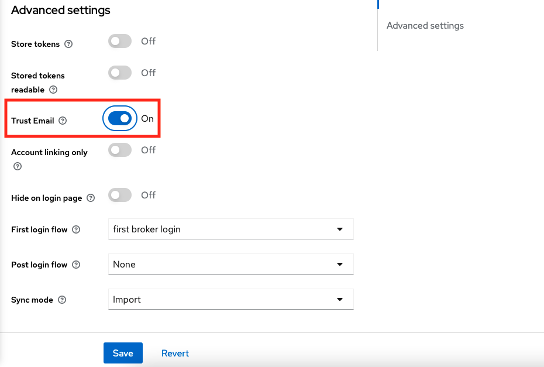

1. Next, you will need to add two mappers to store the `voperson_id` and the
   `eduperson_entitlement` claims because Keycloak can map only the
   [standard claims](https://openid.net/specs/openid-connect-core-1_0.html#StandardClaims).
   Go to the "Mappers" tab and then click on "Add Mapper".

   For the `voperson_id` claim you will need to add the following options:

   - Name: `voPersonID`
   - Sync Mode Override: `import`
   - Mapper Type: `Username Template Importer`
   - Template: `${CLAIM.voperson_id}`
   - Target: `LOCAL`

   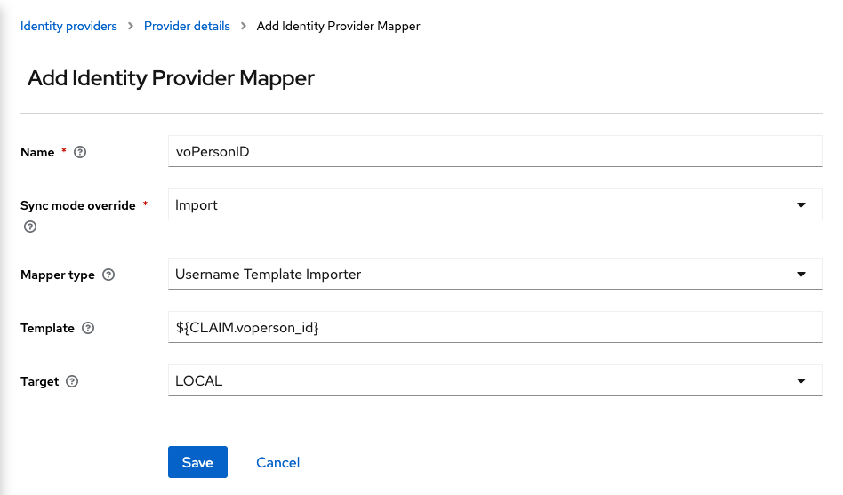

   And for the `eduperson_entitlement` claim:

   - Name: `eduPersonEntitlement`
   - Sync Mode Override: `Inherit`
   - Mapper Type: `Attribute Importer`
   - Claim: `eduperson_entitlement`
   - User Attribute Name: `eduPersonEntitlement`

   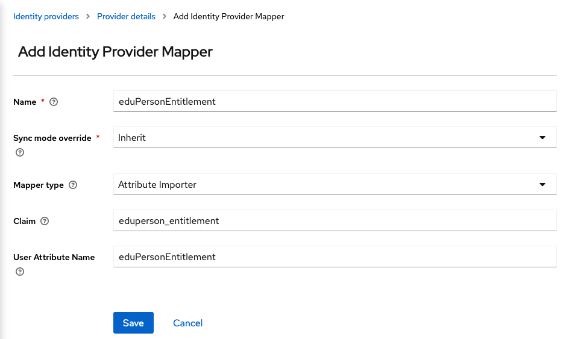

   {} For other
   [attributes](#user-attributes), create a mapper similar to the
   `eduPersonEntitlement` mapper.{}

#### simple-oidc-client-php

In this guide we will demonstrate how to install and configure a
[Simple OIDC Client](https://github.com/rciam/simple-oidc-client-php).

##### Install simple-oidc-client-php

This guide assumes the Apache HTTP server has been installed and the document
root is `/var/www/html`

Move to the apache document root and download and extract
[simple-oidc-client-php.tar.gz](https://github.com/rciam/simple-oidc-client-php/releases/download/v2.0.0/simple-oidc-client-php.tar.gz).

##### Configure Client

Login to the [EGI Federation Registry](https://aai.egi.eu/federation)

Then create a new service or edit your existing service. In `General` tab fill
all the required fields. For `Integration Environment` select `Demo`. In
`Protocol Specific` tab select as Protocol the `OIDC Service` and then in the
`Redirect URI(s)` insert your simple-oidc-client-php URL (e.g.
`http://localhost/simple-oidc-client-php/refreshtoken.php`). This URL must link
to `refreshtoken.php` which is located in simple-oidc-client-php directory.
Next, in `Scope` select the scopes that your service needs. Then, submit the
form and self approve it. Finally you should get a pair of `Client ID` and
`Client Secret`.

##### Configure simple-oidc-client-php

Now that you have everything you need, you can configure your login settings. Go
to your terminal and open `config.php` with your favourite text editor.

Example:

```shell
$ vi simple-oidc-client-php/config.php
```

Let's go quickly through the settings:

- `title` required, the title on the navigation bar
- `img` required, the source of the logo
- `scope_info` optional, a message that informs the user for the application
  requirements
- `issuer` required, the base URL of our IdentityServer instance. This will
  allow oidc-client to query the metadata endpoint so it can validate the tokens
- `client_id` required, the ID of the client we want to use when hitting the
  Authorization Endpoint
- `client_secret` optional, a value the offers better security to the message
  flow
- `pkceCodeChallengeMethod` optional, a string that defines the code challenge
  method for PKCE. Choose between `plain` or `S256`.
- `redirect_url` required, the redirect URL where the client and the browser
  agree to send and receive correspondingly the code
- `scopesDefine` required, defines the scopes the client supports
- `refresh_token_note` optional, info for the refresh token
- `access_token_note` optional, info for the access token
- `manage_token_note` optional, message the informs the user where can manage
  his tokens
- `manageTokens` optional, URL of the manage tokens service
- `sessionName` required, define the name of the cookie session
- `sessionLifetime` required, define the duration of the session. This must be
  equal to the validity time of the access token.

You must change the followings options based on your Service configuration you
setup earlier:

- `issuer`
- `client_id`
- `client_secret`
- `redirect_url`
- `scopesDefine`
- `sessionName` (based on the installation path of the portal)

An example configuration follows:

```php
<?php
// index.php interface configuration
$title = "Generate Tokens";
$img = "https://clickhelp.co/images/feeds/blog/2016.05/keys.jpg";
$scope_info = "This service requires the following permissions for your account:";

// Client configuration
$issuer = "https://aai-demo.egi.eu/auth/realms/egi";
$client_id = "CHANGE_ME";
$client_secret = "CHANGE_ME";  // comment if you are using PKCE
// $pkceCodeChallengeMethod = "S256";   // uncomment to use PKCE
$redirect_url = "http://localhost/simple-oidc-client-php/refreshtoken.php";
// add scopes as keys and a friendly message of the scope as value
$scopesDefine = array(
    'openid' => 'log in using your identity',
    'email' => 'read your email address',
    'profile' => 'read your basic profile info',
);
// refreshtoken.php interface configuration
$refresh_token_note = "NOTE: New refresh tokens expire in 12 months.";
$access_token_note = "NOTE: New access tokens expire in 1 hour.";
$manage_token_note = "You can manage your refresh tokens in the following link: ";
$manageTokens = $issuer . "manage/user/services";
$sessionName = "simple-oidc-client-php";
$sessionLifetime = 60*60;  // must be equal to access token validation time in seconds
```

### Client Migration to Keycloak

The migration guide below applies to OIDC clients registered in the
**Development**, **Demo** and **Production** environments of Check-in.

**Development and Demo**: Beginning June 24, 2022, clients using the legacy
Check-in OIDC endpoints will no longer be supported.

**Production**: Beginning October 21, 2022, clients using the legacy Check-in
OIDC endpoints will no longer be supported.

{} For OpenStack Services please read the
OpenStack specific migration guide on
[Cloud Compute documentation](../../cloud-compute/openstack/aai.md#client-migration-to-keycloak).
{}

#### How to Migrate your Service to Keycloak

All the clients that were registered in MITREid Connect have been moved to
Keycloak preserving all the options (Client ID, Client Secret, Redirect URIs
etc.), so you do not need to re-register your Service.

##### New Endpoints

The first thing you need to do is to update the OIDC endpoints according to the
[Endpoints](#endpoints) table. If the Application/Library supports Dynamic
Discovery, then you need to update on the `issuer`. Otherwise, you need to
update all the Endpoints separately.

##### Size of the Tokens

The size of the Access/Refresh Tokens that are issued by Keycloak is larger of
the respective Tokens created by MITREid Connect. For example, the size of an
Access Token is around 1400 characters, depending on the information that are
included in the payload of the JWT. So make sure that your OIDC implementation
can handle larger Tokens.

##### Logout

The Redirect URI query parameter in the logout request has been changed from
`redirect` to `post_logout_redirect_uri` and must be URL encoded. Also, the
value of the `post_logout_redirect_uri` must be defined in the **Valid Redirect
URIs** of the Service configuration in the EGI Federation Registry.

##### Token Introspection

The Token Introspection is available to all the clients that are using any
authentication method (`client_secret_basic`, `client_secret_post`,
`client_secret_jwt` or `private_key_jwt`) (Confidential Clients) to the Token
Endpoint. Public Clients (clients that do not use any authentication method)
will not be able to get a successful response from the Introspection Endpoint.
Saying that, the "Introspection" option in the EGI Federation Registry will be
removed.

##### PKCE

If you are **not** using PKCE (Proof Key for Code Exchange), please make sure to
**disable** the "PKCE Code Challenge Method" in the Service configuration in
[EGI Federation Registry](https://aai.egi.eu/federation), otherwise you will get
the following HTTP response during the authentication flow:

```http
error=invalid_request&error_description=Missing parameter: code_challenge_method
```

##### Device Code Grant

If you are using a confidential client with the Device Code grant, please make
sure that the `client_secret` is present in the request to the Device Code
Endpoint either as HTTP Basic or HTTP POST parameter (see
[Device Authorization Request](#1-device-authorization-request)).

##### Token Exchange Grant

If you are using the Token Exchange grant, please make sure that the `audience`
(Optional) defines the logical name of the service that the token will be used
for; when specified, it must match the client ID of a client registered in
Check-in otherwise an `invalid_client` error is returned
(`"description": "audience not found"`)

##### Client Credentials Grant

If you are using the Client Credentials grant, there is a minor change in the
responses from UserInfo and Introspection Endpoints. The **Client ID** of the
client is **not** released as the `sub` claim any more and has replaced with by
the `client_id` claim. The `sub` contains the identifier of the client which is
unique, non-reassignable and scoped `@egi.eu`.

##### Obtain Refresh Tokens

If you have obtained an Refresh Token from EGI Check-in Token Portal or
oidc-agent issued by the MITREid Connect instance, you will need to replace them
by creating new Refresh Tokens issued by Keycloak.

- If you have obtained Refresh Tokens using the EGI Check-in Token Portal,
  please check the following table:

  | Environment | URL                             |
  | ----------- | ------------------------------- |
  | Production  | <https://aai.egi.eu/token>      |
  | Demo        | <https://aai-demo.egi.eu/token> |
  | Development | <https://aai-dev.egi.eu/token>  |

- If you have obtained Refresh Tokens using the oidc-agent, please use the
  following command:

  ```shell
  $ oidc-gen --pub --issuer <ISSUER> --scope ...
  ```

  {} You can find the `ISSUER` in the
  [Endpoints](#endpoints) table.{}

#### Common issues

##### Error messages referring to missing `code_challenge`, `code_challenge_method` or `code_verifier` HTTP parameter

If you get error messages containing the PKCE HTTP parameters, probably the PKCE
mode is enabled in your Service Configuration but the Application is not
performing the PKCE mode.

To solve this, you need to follow the steps below:

1. Login to [Federation Registry](https://aai.egi.eu/federation)
1. Open your Service Configuration
1. Click on the “Protocol Specific” tab and scroll down to “Proof Key for Code
   Exchange (PKCE) Code Challenge Method” and select “PKCE will not be used for
   this service”
1. Click on “Submit” to apply the reconfiguration request

##### Error messages referring to `invalid_code`

If you try to perform the Authorization Code flow and you get an `invalid_code`
error message, probably the Application sends the Authorization Request to the
Authorization Endpoint of the Keycloak based EGI Check-in OP and then sends the
`code` to the Token Endpoint of the MITREid Connect based EGI Check-in OP or
vice versa.

To fix this you need to verify that you have updated all the OIDC Endpoints with
the Keycloak ones. You can find all the OIDC Endpoints of Keycloak in the
[Endpoint](#endpoints) table.

##### Error messages referring to the `redirect_uri`

If you try to perform the Authorization Code flow and you get an
`invalid_redirect_uri` error, probably the `redirect_uri` in the Authorization
Request mismatches with the Allowed Redirect URIs in the Service Configuration.

To solve this, you need to follow the steps below:

1. Login to [Federation Registry](https://aai.egi.eu/federation)
1. Open your Service Configuration
1. Click on the “Protocol Specific” tab and in the “Redirect URI(s)” edit the
   URI.
1. Click on “Submit” to apply the reconfiguration request

##### UserInfo `invalid_token` or `401 Unauthorized` error response

If you are trying to make a request to the UserInfo Endpoint and the response
contains the `invalid_token` error message, probably you are using an invalid
Token or the UserInfo Endpoint is wrong.

To solve this, please make sure the that:

1. You have obtained an Keycloak issued Access Token and you make a request to
   the Keycloak based UserInfo Endpoint
1. You have added the Access Token to the Authorization header of the request

##### `502 Bad Gateway` error after redirecting back to the Service

If you are using NGINX as a Reverse Proxy, and you are getting the following
error message in the logs:

> upstream sent too big header while reading response header from upstream

Then you need to increase the size of the buffer by adding the following options
in the vhost configuration:

```nginx
proxy_buffers 4 256k;
proxy_buffer_size 128k;
proxy_busy_buffers_size 256k;
```

## Integrating Science Gateways with RCauth for obtaining (proxy) certificates

In order for Science Gateways (VO portals) to obtain RFC proxy certificates
derived from **personal** end-entity certificates, an EGI Science Gateway can
make use of the IGTF-approved IOTA-type RCauth.eu online CA. The actual
integration goes via an intermediary service, called a Master Portal. EGI is
running two Master Portal instances, one development, one production instance.





| Endpoint                | Production environment                                              |
| ----------------------- | ------------------------------------------------------------------- |
| Provider configuration  | <https://aai.egi.eu/mp-oa2-server/.well-known/openid-configuration> |
| Client registration     | <https://aai.egi.eu/mp-oa2-server/register>                         |
| Authorization           | <https://aai.egi.eu/mp-oa2-server/authorize>                        |
| Token                   | <https://aai.egi.eu/mp-oa2-server/token>                            |
| JSON Web Key Sets(JWKS) | <https://aai.egi.eu/mp-oa2-server/certs>                            |
| UserInfo                | <https://aai.egi.eu/mp-oa2-server/userinfo>                         |





| Endpoint                | Development environment                                                                |
| ----------------------- | -------------------------------------------------------------------------------------- |
| Provider configuration  | <https://masterportal-pilot.aai.egi.eu/mp-oa2-server/.well-known/openid-configuration> |
| Client registration     | <https://masterportal-pilot.aai.egi.eu/mp-oa2-server/register>                         |
| Authorization           | <https://masterportal-pilot.aai.egi.eu/mp-oa2-server/authorize>                        |
| Token                   | <https://masterportal-pilot.aai.egi.eu/mp-oa2-server/token>                            |
| JSON Web Key Sets(JWKS) | <https://masterportal-pilot.aai.egi.eu/mp-oa2-server/certs>                            |
| UserInfo                | <https://masterportal-pilot.aai.egi.eu/mp-oa2-server/userinfo>                         |





### Registering a client at the Master Portal

In order to register a new client for your VO portal go to:

- EGI Development instance:
  <https://masterportal-pilot.aai.egi.eu/mp-oa2-server/register>
- EGI Production instance: <https://aai.egi.eu/mp-oa2-server/register>

{} Make sure to store the `client_id` and
`client_secret` in a secure place {}

In order to get the client approved, send an email to the administrator of the
EGI Master Portal using `checkin-support` `<AT>` `mailman.egi.eu`.

#### Detailed information

For further and detailed instructions on the integration flow, see the generic
[RCAuth.eu MasterPortal VOPortal integration guide](https://wiki.nikhef.nl/grid/RCauth.eu_and_MasterPortal_VOPortal_integration_guide)

#### SSH key authentication for proxy retrieval

The EGI MasterPortal also allows users to authenticate using _SSH key pair_, in
order to retrieve proxy certificates from the MasterPortal. Users need to first
upload the public key via a self-service portal, <https://aai.egi.eu/sshkeys/>.
About once a week they need to follow a web-flow to ensure a long-lived proxy
certificate is present in MasterPortal, e.g. by going to
<https://aai.egi.eu/vo-portal/>. They can then obtain a proxy certificate by
doing

```shell
$ ssh proxy@ssh.aai.egi.eu
```

and storing the output in `/tmp/x509up_u$(id -u)`

Generic information for users on how to do this can be found at
[Instructions for end users on how to use the SSH key authN for proxy retrieval](https://wiki.nikhef.nl/grid/RCauth.eu_and_MasterPortal_SSH_Key_Portal).
Alternatively VO portals could implement such functionality themselves by using
the API described at the
[Master Portal sshkey endpoint description](https://wiki.nikhef.nl/grid/Master_Portal_sshkey_endpoint).

## User attributes

This section defines the attributes that can be made available to services
connected to Check-in.

<!-- markdownlint-disable no-inline-html -->

### 1. Community User Identifier

|          attribute name | Community User Identifier                                                                                                                                                                                                                                                                                                                                                                                                                                                                            |
| ----------------------: | :--------------------------------------------------------------------------------------------------------------------------------------------------------------------------------------------------------------------------------------------------------------------------------------------------------------------------------------------------------------------------------------------------------------------------------------------------------------------------------------------------- |
|         **description** | The User’s Community Identifier is a globally unique, opaque, persistent and non-reassignable identifier identifying the user. For users whose community identity is managed by Check-in, this identifier is of the form `<uniqueID>@egi.eu`. The `<uniqueID>` portion is an opaque identifier issued by Check-in                                                                                                                                                                                    |
|   **SAML Attribute(s)** | <ul><li>`urn:oid:1.3.6.1.4.1.25178.4.1.6` (voPersonID)</li><li>`urn:oid:1.3.6.1.4.1.5923.1.1.1.13` (eduPersonUniqueId)</li></ul>                                                                                                                                                                                                                                                                                                                                                                     |
|          **OIDC scope** | <ul><li>`voperson_id`</li><li>`aarc`</li><li>`openid`</li></ul>                                                                                                                                                                                                                                                                                                                                                                                                                                      |
|       **OIDC claim(s)** | <ul><li>`voperson_id`</li><li>`sub`</li></ul>                                                                                                                                                                                                                                                                                                                                                                                                                                                        |
| **OIDC claim location** | <ul><li>ID token</li><li>UserInfo Endpoint</li><li>Introspection Endpoint</li></ul>                                                                                                                                                                                                                                                                                                                                                                                                                  |
|              **origin** | The Community User Identifier is assigned by Check-in or an external AAI service managing the community identity of the user                                                                                                                                                                                                                                                                                                                                                                         |
|             **changes** | No                                                                                                                                                                                                                                                                                                                                                                                                                                                                                                   |
|        **multiplicity** | No                                                                                                                                                                                                                                                                                                                                                                                                                                                                                                   |
|        **availability** | Always                                                                                                                                                                                                                                                                                                                                                                                                                                                                                               |
|             **example** | `ef72285491ffe53c39b75bdcef46689f5d26ddfa00312365cc4fb5ce97e9ca87@egi.eu`                                                                                                                                                                                                                                                                                                                                                                                                                            |
|               **notes** | Use **Community User Identifier** within your application as the unique-identifier key for the user. Obtaining the Community User Identifier from the `sub` claim using the `openid` scope for OIDC Relying Parties or from `eduPersonUniqueId` for SAML Service Providers will be deprecated. OIDC RPs should request either the `voperson_id` or `aarc` scope to obtain the Community User Identifier. SAML PRs should request the `voPersonID` attribute to obtain the Community User Identifier. |
|              **status** | Stable                                                                                                                                                                                                                                                                                                                                                                                                                                                                                               |

### 2. Display Name

|          attribute name | Display Name                                      |
| ----------------------: | :------------------------------------------------ |
|         **description** | The user's full name, in a displayable form       |
|   **SAML Attribute(s)** | `urn:oid:2.16.840.1.113730.3.1.241` (displayName) |
|          **OIDC scope** | <ul><li>`profile`</li><li>`aarc`</li></ul>        |
|       **OIDC claim(s)** | `name`                                            |
| **OIDC claim location** | UserInfo Endpoint                                 |
|              **origin** | Provided by user's Identity Provider              |
|             **changes** | Yes                                               |
|        **multiplicity** | Single-valued                                     |
|        **availability** | Always                                            |
|             **example** | `John Doe`                                        |
|               **notes** | -                                                 |
|              **status** | Stable                                            |

### 3. Given Name

|          attribute name | Given Name                                 |
| ----------------------: | :----------------------------------------- |
|         **description** | The user's first name                      |
|   **SAML Attribute(s)** | `urn:oid:2.5.4.42` (givenName)             |
|          **OIDC scope** | <ul><li>`profile`</li><li>`aarc`</li></ul> |
|       **OIDC claim(s)** | `given_name`                               |
| **OIDC claim location** | UserInfo Endpoint                          |
|              **origin** | Provided by user's Identity Provider       |
|             **changes** | Yes                                        |
|        **multiplicity** | Single-valued                              |
|        **availability** | Always                                     |
|             **example** | `John`                                     |
|               **notes** | -                                          |
|              **status** | Stable                                     |

### 4. Family Name

|          attribute name | Family Name                                |
| ----------------------: | :----------------------------------------- |
|         **description** | The user's last name                       |
|   **SAML Attribute(s)** | `urn:oid:2.5.4.4` (sn)                     |
|          **OIDC scope** | <ul><li>`profile`</li><li>`aarc`</li></ul> |
|       **OIDC claim(s)** | `family_name`                              |
| **OIDC claim location** | UserInfo Endpoint                          |
|              **origin** | Provided by user's Identity Provider       |
|             **changes** | Yes                                        |
|        **multiplicity** | Single-valued                              |
|        **availability** | Always                                     |
|             **example** | `Doe`                                      |
|               **notes** | -                                          |
|              **status** | Stable                                     |

### 5. Username

|          attribute name | Username                                                                            |
| ----------------------: | :---------------------------------------------------------------------------------- |
|         **description** | The username by which the user wishes to be referred to                             |
|   **SAML Attribute(s)** | `urn:oid:0.9.2342.19200300.100.1.1` (uid)                                           |
|          **OIDC scope** | <ul><li>`profile`</li><li>`aarc`</li></ul>                                          |
|       **OIDC claim(s)** | `preferred_username`                                                                |
| **OIDC claim location** | <ul><li>ID token</li><li>UserInfo Endpoint</li><li>Introspection Endpoint</li></ul> |
|              **origin** | Check-in assigns this attribute on user registration                                |
|             **changes** | No                                                                                  |
|        **multiplicity** | Single-valued                                                                       |
|        **availability** | Always                                                                              |
|             **example** | `jdoe`                                                                              |
|               **notes** | The Service Provider **MUST NOT** rely upon this value being unique                 |
|              **status** | Stable                                                                              |

### 6. Email Address

|          attribute name | Email Address                                                               |
| ----------------------: | :-------------------------------------------------------------------------- |
|         **description** | The user's email address                                                    |
|   **SAML Attribute(s)** | `urn:oid:0.9.2342.19200300.100.1.3` (mail)                                  |
|          **OIDC scope** | <ul><li>`email`</li><li>`aarc`</li></ul>                                    |
|       **OIDC claim(s)** | `email`                                                                     |
| **OIDC claim location** | <ul><li>UserInfo Endpoint</li><li>Introspection Endpoint</li></ul>          |
|              **origin** | Provided by user's Identity Provider                                        |
|             **changes** | Yes                                                                         |
|        **multiplicity** | Single-valued                                                               |
|        **availability** | Always                                                                      |
|             **example** | `john.doe@example.org`                                                      |
|               **notes** | This **MAY NOT** be unique and is **NOT** suitable for use as a primary key |
|              **status** | Stable                                                                      |

### 7. Verified email flag

|          attribute name | Verified email flag                                                 |
| ----------------------: | :------------------------------------------------------------------ |
|         **description** | True if the user's email address has been verified; otherwise false |
|   **SAML Attribute(s)** | See [Verified email list](#8-verified-email-list)                   |
|          **OIDC scope** | <ul><li>`email`</li><li>`aarc`</li></ul>                            |
|       **OIDC claim(s)** | `email_verified`                                                    |
| **OIDC claim location** | <ul><li>UserInfo Endpoint</li><li>Introspection Endpoint</li></ul>  |
|              **origin** | Check-in assigns this attribute on user registration                |
|             **changes** | Yes                                                                 |
|        **multiplicity** | Single-valued                                                       |
|        **availability** | Always                                                              |
|             **example** | `true`                                                              |
|               **notes** | This claim is available only in OpenID Connect                      |
|              **status** | Stable                                                              |

### 8. Verified email list

|          attribute name | Verified email list                                                 |
| ----------------------: | :------------------------------------------------------------------ |
|         **description** | A list of user's email addresses that have been verified            |
|   **SAML Attribute(s)** | `urn:oid:1.3.6.1.4.1.25178.4.1.14` (voPersonVerifiedEmail)          |
|          **OIDC scope** | <ul><li>`email`</li><li>`aarc`</li></ul>                            |
|       **OIDC claim(s)** | `voperson_verified_email`                                           |
| **OIDC claim location** | <ul><li>UserInfo Endpoint</li><li>Introspection Endpoint</li></ul>  |
|              **origin** | Check-in or the user's Identity Provider                            |
|             **changes** | Yes                                                                 |
|        **multiplicity** | Multi-valued                                                        |
|        **availability** | Not always                                                          |
|             **example** | <ul><li>`john.doe@example.org`</li><li>`jdoe@example.com`</li></ul> |
|               **notes** | -                                                                   |
|              **status** | Experimental                                                        |

### 9. Affiliation

|          attribute name | Affiliation                                                                                                                                                |
| ----------------------: | :--------------------------------------------------------------------------------------------------------------------------------------------------------- |
|         **description** | The user's affiliation within a particular security domain (scope)                                                                                         |
|   **SAML Attribute(s)** | <ul><li>`urn:oid:1.3.6.1.4.1.5923.1.1.1.9` (eduPersonScopedAffiliation)</li><li>`urn:oid:1.3.6.1.4.1.25178.4.1.11` (voPersonExternalAffiliation)</li></ul> |
|          **OIDC scope** | `eduperson_scoped_affiliation`                                                                                                                             |
|       **OIDC claim(s)** | `eduperson_scoped_affiliation`                                                                                                                             |
| **OIDC claim location** | <ul><li>UserInfo Endpoint</li><li>Introspection Endpoint</li></ul>                                                                                         |
|              **origin** | Check-in assigns this attribute on user registration                                                                                                       |
|             **changes** | Yes                                                                                                                                                        |
|        **multiplicity** | Multi-valued                                                                                                                                               |
|        **availability** | Always                                                                                                                                                     |
|             **example** | <ul><li>`member@example.org`</li><li>`faculty@example.org`</li></ul>                                                                                       |
|               **notes** | Service Providers are encouraged to validate the scope of this attribute                                                                                   |
|              **status** | Stable                                                                                                                                                     |

### 10. Groups

|          attribute name | Groups                                                                                                                                 |
| ----------------------: | :------------------------------------------------------------------------------------------------------------------------------------- |
|         **description** | The user's group/VO membership/role information expressed as entitlements                                                              |
|   **SAML Attribute(s)** | `urn:oid:1.3.6.1.4.1.5923.1.1.1.7` (eduPersonEntitlement)                                                                              |
|          **OIDC scope** | `eduperson_entitlement`                                                                                                                |
|       **OIDC claim(s)** | `eduperson_entitlement`                                                                                                                |
| **OIDC claim location** | <ul><li>UserInfo Endpoint</li><li>Introspection Endpoint</li></ul>                                                                     |
|              **origin** | Group memberships are managed by group administrators                                                                                  |
|             **changes** | Yes                                                                                                                                    |
|        **multiplicity** | Multi-valued                                                                                                                           |
|        **availability** | Not always                                                                                                                             |
|             **example** | <ul><li>`urn:mace:egi.eu:aai.egi.eu:member@fedcloud.egi.eu`</li><li>`urn:mace:egi.eu:aai.egi.eu:vm_operator@fedcloud.egi.eu`</li></ul> |
|               **notes** | -                                                                                                                                      |
|              **status** | Stable                                                                                                                                 |

### 11. Capabilities

|          attribute name | Capabilities                                                                                                                                                                                                                              |
| ----------------------: | :---------------------------------------------------------------------------------------------------------------------------------------------------------------------------------------------------------------------------------------- |
|         **description** | This attribute describes the resource or child-resource a user is allowed to access, optionally specifying certain actions the user is entitled to perform, as described in [AARC-G027](https://aarc-community.org/guidelines/aarc-g027/) |
|   **SAML Attribute(s)** | `urn:oid:1.3.6.1.4.1.5923.1.1.1.7` (eduPersonEntitlement)                                                                                                                                                                                 |
|          **OIDC scope** | `eduperson_entitlement`                                                                                                                                                                                                                   |
|       **OIDC claim(s)** | `eduperson_entitlement`                                                                                                                                                                                                                   |
| **OIDC claim location** | <ul><li>UserInfo Endpoint</li><li>Introspection Endpoint</li></ul>                                                                                                                                                                        |
|              **origin** | Capabilities are managed by Check-in                                                                                                                                                                                                      |
|             **changes** | Yes                                                                                                                                                                                                                                       |
|        **multiplicity** | Multi-valued                                                                                                                                                                                                                              |
|        **availability** | Not always                                                                                                                                                                                                                                |
|             **example** | <ul><li>`urn:mace:egi.eu:res:rcauth#aai.egi.eu`</li><li>`urn:mace:egi.eu:res:gocdb#aai.egi.eu`</li></ul>                                                                                                                                  |
|               **notes** | -                                                                                                                                                                                                                                         |
|              **status** | Stable                                                                                                                                                                                                                                    |

### 12. GOCDB Roles

|          attribute name | GOCDB Roles                                                                                                                                                                                |
| ----------------------: | :----------------------------------------------------------------------------------------------------------------------------------------------------------------------------------------- |
|         **description** | The user's GOCDB role information expressed as entitlements                                                                                                                                |
|   **SAML Attribute(s)** | `urn:oid:1.3.6.1.4.1.5923.1.1.1.7` (eduPersonEntitlement)                                                                                                                                  |
|          **OIDC scope** | `eduperson_entitlement`                                                                                                                                                                    |
|       **OIDC claim(s)** | `eduperson_entitlement`                                                                                                                                                                    |
| **OIDC claim location** | <ul><li>UserInfo Endpoint</li><li>Introspection Endpoint</li></ul>                                                                                                                         |
|              **origin** | The roles are managed in GOCDB                                                                                                                                                             |
|             **changes** | Yes                                                                                                                                                                                        |
|        **multiplicity** | Multi-valued                                                                                                                                                                               |
|        **availability** | Not always                                                                                                                                                                                 |
|             **example** | <ul><li>`urn:mace:egi.eu:goc.egi.eu:100453G0:GRIDOPS-CheckIn:Site+Administrator@egi.eu`</li><li>`urn:mace:egi.eu:goc.egi.eu:92503G08:GRIDOPS-MON:Site+Operations+Manager@egi.eu`</li></ul> |
|               **notes** | -                                                                                                                                                                                          |
|              **status** | Stable                                                                                                                                                                                     |

### 13. Assurance

|          attribute name | Assurance                                                                                                                                                                                                                                                                                                                                                                                                                                                                                                                                                                                                                                                                                                                                                                                                                                                 |
| ----------------------: | :-------------------------------------------------------------------------------------------------------------------------------------------------------------------------------------------------------------------------------------------------------------------------------------------------------------------------------------------------------------------------------------------------------------------------------------------------------------------------------------------------------------------------------------------------------------------------------------------------------------------------------------------------------------------------------------------------------------------------------------------------------------------------------------------------------------------------------------------------------- |
|         **description** | Assurance of the identity of the user, following [REFEDS Assurance Framework (RAF)](https://refeds.org/assurance) and the [EGI AAI Assurance Profiles](https://docs.egi.eu/providers/check-in/sp/#level-of-assurance). The following RAF values are qualified and automatically set for all Community identities:<ul><li>$PREFIX$</li><li>$PREFIX$/ID/unique</li><li>$PREFIX$/ID/eppn-unique-no-reassign</li><li>$PREFIX$/IAP/low</li><li>$PREFIX$/ATP/ePA-1m</li><li>$PREFIX$/ATP/ePA-1d</li></ul>Following RAF values are set if the currently used authentication provider asserts (or otherwise qualifies to) them:</br><ul><li>$PREFIX$/IAP/medium</li><li>$PREFIX$/IAP/high</li></ul>The following compound profiles are asserted if the user qualifies to them</br><ul><li>$PREFIX$/profile/cappuccino</li><li>$PREFIX$/profile/espresso</li></ul> |
|   **SAML Attribute(s)** | `urn:oid:1.3.6.1.4.1.5923.1.1.1.11` (eduPersonAssurance)                                                                                                                                                                                                                                                                                                                                                                                                                                                                                                                                                                                                                                                                                                                                                                                                  |
|          **OIDC scope** | `eduperson_assurance`                                                                                                                                                                                                                                                                                                                                                                                                                                                                                                                                                                                                                                                                                                                                                                                                                                     |
|       **OIDC claim(s)** | `eduperson_assurance`                                                                                                                                                                                                                                                                                                                                                                                                                                                                                                                                                                                                                                                                                                                                                                                                                                     |
| **OIDC claim location** | <ul><li>UserInfo Endpoint</li><li>Introspection Endpoint</li></ul>                                                                                                                                                                                                                                                                                                                                                                                                                                                                                                                                                                                                                                                                                                                                                                                        |
|              **origin** | Check-in assigns this attribute on user registration                                                                                                                                                                                                                                                                                                                                                                                                                                                                                                                                                                                                                                                                                                                                                                                                      |
|             **changes** | Yes                                                                                                                                                                                                                                                                                                                                                                                                                                                                                                                                                                                                                                                                                                                                                                                                                                                       |
|        **multiplicity** | Multi-valued                                                                                                                                                                                                                                                                                                                                                                                                                                                                                                                                                                                                                                                                                                                                                                                                                                              |
|        **availability** | Not always                                                                                                                                                                                                                                                                                                                                                                                                                                                                                                                                                                                                                                                                                                                                                                                                                                                |
|             **example** | <ul><li>`https://aai.egi.eu/LoA#Low`</li><li>`https://refeds.org/assurance/IAP/low`</li></ul>                                                                                                                                                                                                                                                                                                                                                                                                                                                                                                                                                                                                                                                                                                                                                             |
|               **notes** | -                                                                                                                                                                                                                                                                                                                                                                                                                                                                                                                                                                                                                                                                                                                                                                                                                                                         |
|              **status** | Stable                                                                                                                                                                                                                                                                                                                                                                                                                                                                                                                                                                                                                                                                                                                                                                                                                                                    |

### 14. CertEntitlement

|          attribute name | CertEntitlement                                                                                                                                                                      |
| ----------------------: | :----------------------------------------------------------------------------------------------------------------------------------------------------------------------------------- |
|         **description** | Provides information about the user's certificate subject(s) and the associated VO(s)                                                                                                |
|   **SAML Attribute(s)** | **Not available**                                                                                                                                                                    |
|          **OIDC scope** | `cert_entitlement`                                                                                                                                                                   |
|       **OIDC claim(s)** | `cert_entitlement`                                                                                                                                                                   |
| **OIDC claim location** | <ul><li>UserInfo Endpoint</li><li>Introspection Endpoint</li></ul>                                                                                                                   |
|              **origin** | VO/group management tools integrated with Check-in                                                                                                                                   |
|             **changes** | Yes                                                                                                                                                                                  |
|        **multiplicity** | Multi-valued                                                                                                                                                                         |
|        **availability** | Not always                                                                                                                                                                           |
|             **example** | `[{"cert_subject_dn": "/C=GR/O=HellasGrid/...","cert_iss": "/C=GR/O=HellasGrid/...","eduperson_entitlement": "urn:mace:egi.eu:group:checkin-integration:role=VO-Admin#aai.egi.eu"}]` |
|               **notes** | This is available only for DIRAC                                                                                                                                                     |
|              **status** | Stable                                                                                                                                                                               |

### 15. SSH Public Key

|          attribute name | SSH Public Key                                                                                                                                    |
| ----------------------: | :------------------------------------------------------------------------------------------------------------------------------------------------ |
|         **description** | Provides information about the user's SSH public key(s)                                                                                           |
|   **SAML Attribute(s)** | `urn:oid:1.3.6.1.4.1.24552.500.1.1.1.13` (sshPublicKey)                                                                                           |
|          **OIDC scope** | `ssh_public_key`                                                                                                                                  |
|       **OIDC claim(s)** | `ssh_public_key`                                                                                                                                  |
| **OIDC claim location** | UserInfo Endpoint                                                                                                                                 |
|              **origin** | Added SSH public key(s) in user's Check-in Profile                                                                                                |
|             **changes** | Yes                                                                                                                                               |
|        **multiplicity** | Multi-valued                                                                                                                                      |
|        **availability** | Not always                                                                                                                                        |
|             **example** | <ul><li>`ssh-rsa AAAAB3NzaC...qxxEEipdnZ jdoe@grnet-hq.admin.grnet.gr`</li><li>`ssh-rsa AAAA4xzdIf...fxgsRDfgAt jdoe@example.org`</li></ul> |
|               **notes** | -                                                                                                                                                 |
|              **status** | Experimental                                                                                                                                      |

<!-- textlint-disable -->

### 16. ORCID iD

|          attribute name | ORCID iD                                               |
| ----------------------: | :----------------------------------------------------- |
|         **description** | Provides information about the user's ORCID iD         |
|   **SAML Attribute(s)** | `urn:oid:1.3.6.1.4.1.5923.1.1.1.16` (eduPersonOrcid)   |
|          **OIDC scope** | `orcid`                                                |
|       **OIDC claim(s)** | `orcid`                                                |
| **OIDC claim location** | UserInfo Endpoint                                      |
|              **origin** | ORCID Identity Provider                                |
|             **changes** | No                                                     |
|        **multiplicity** | Single-valued                                          |
|        **availability** | Not always                                             |
|             **example** | `https://orcid.org/XXXX-XXXX-XXXX-XXXX`                |
|               **notes** | The attribute is available when logging in using ORCID |
|              **status** | Experimental                                           |

<!-- textlint-enable -->
<!-- markdownlint-enable no-inline-html -->

## User authorisation

The following information about the authenticated user can be provided by EGI
Check-in in order to control user access to resources:

1. VO/group membership and role information about the authenticated user
1. Capabilities
1. Identity Assurance
1. GOCDB roles

### VO/group membership and role information

#### Background

VO/group membership and role information is encoded in entitlements
(`eduPersonEntitlement` attribute values in SAML or `eduperson_entitlement`
claim in OIDC). These entitlements are typically used to indicate access rights
to protected resources. Entitlements are multi-valued, with each value formatted
as a URN.

#### Syntax

An entitlement value expressing group membership and role information has the
following syntax (components enclosed in square brackets are OPTIONAL):

```text
urn:mace:egi.eu:group:<GROUP>[:<SUBGROUP>*][:role=<ROLE>]#<GROUP-AUTHORITY>
```

where:

- `<GROUP>` is the name of a VO, research collaboration or a top level arbitrary
  group. `<GROUP>` names are unique within the `urn:mace:egi.eu:group`
  namespace;
- zero or more `<SUBGROUP>` components represent the hierarchy of subgroups in
  the `<GROUP>`; specifying sub-groups is optional
- the optional `<ROLE>` component is scoped to the rightmost (sub)group; if no
  group information is specified, the role applies to the VO
- `<GROUP-AUTHORITY>` is a non-empty string that indicates the authoritative
  source for the entitlement value. For example, it can be the FQDN of the group
  management system that is responsible for the identified group membership
  information

**Example:**

```text
urn:mace:egi.eu:group:fedcloud.egi.eu:role=vm_operator#aai.egi.eu
```

### Capabilities

#### Background

The user's capability information is encoded in entitlements
(`eduPersonEntitlement` attribute values in SAML or `eduperson_entitlement`
claim in OIDC). These entitlements are typically used to indicate access rights
to protected resources. Entitlements are multi-valued, with each value formatted
as a URN following the syntax defined in
[AARC-G027](https://aarc-community.org/guidelines/aarc-g027/).

#### Syntax

An entitlement value expressing a capability has the following syntax
(components enclosed in square brackets are OPTIONAL):

```text
<NAMESPACE>:res:<RESOURCE>[:<CHILD-RESOURCE>]...[:act:<ACTION>[,<ACTION>]...]#<AUTHORITY>
```

where:

- `<NAMESPACE>` is controlled by the e-infrastructure, research infrastructure
  or research collaboration that manages the capability. The `<NAMESPACE>` of
  capabilities managed by Check-in is set to `urn:mace:egi.eu`, while,
  generally, it is in the form of
  `urn:<NID>:<DELEGATED-NAMESPACE>[:<SUBNAMESPACE>]...` where:

  - `<NID>` is the namespace identifier associated with a URN namespace
    registered with IANA2, ensuring global uniqueness. Implementers SHOULD use
    one of the existing registered URN namespaces, such as
    `urn:mace`[[MACE](https://incommon.org/community/mace-registries/mace-urn-registry/)].

  - `<DELEGATED-NAMESPACE>` is a URN sub-namespace delegated from one of the
    IANA registered NIDs to an organisation representing the e-infrastructure,
    research infrastructure or research collaboration. It is RECOMMENDED that a
    publicly accessible URN value registry for each delegated namespace be
    provided.

- The literal string `"res"` indicates that this is a resource-specific
  entitlement as opposed to, for example, an entitlement used for expressing
  group membership
  [AARC-G002](https://aarc-community.org/guidelines/aarc-g002/).

- `<RESOURCE>` is the name of the resource. Whether the name should be unique is
  an implementation decision.

- An optional list of colon-separated `<CHILD-RESOURCE>` components represents a
  specific branch of the hierarchy of resources under the identified
  `<RESOURCE>`.

- An optional list of comma-separated `<ACTION>`s MAY be included, which, if
  present, MUST be prefixed with the literal string “act”. This component MAY be
  used for further specifying the actions a user is entitled to do at a given
  resource. Note that the list of `<ACTION>`s is scoped to the rightmost
  child-resource; if no child-resource information is specified, actions apply
  to the top level resource. The interpretation of a capability without actions
  specified is an implementation detail.

- `<AUTHORITY>` is a mandatory and non-empty string that indicates the
  authoritative source of the capability. This SHOULD be used to further specify
  the exact issuing instance. For example, it MAY be the FQDN of the service
  that issued that specific capability. The `<AUTHORITY>` is specified in the
  f-component [RFC8141](https://tools.ietf.org/html/rfc8141) of the URN; thus,
  it is introduced by the number sign ("#") character and terminated by the end
  of the URN. All characters must be encoded according to
  [RFC8141](https://tools.ietf.org/html/rfc8141). Hence, the `<AUTHORITY>` MUST
  NOT be considered when determining equivalence (Section 3 in
  [RFC8141](https://tools.ietf.org/html/rfc8141)) of URN-formatted capabilities.
  The `<AUTHORITY>` of capabilities managed by Check-in is typically set to
  `aai.egi.eu`.

**Example:**

```text
urn:mace:egi.eu:res:rcauth#aai.egi.eu
```

### Identity Assurance

Based on the authentication method selected by the user, the EGI proxy assigns a
Identity Assurance, which is conveyed to the SP through both the
`eduPersonAssurance` attribute and the Authentication Context Class
(`AuthnContextClassRef`) of the SAML authentication response. EGI Check-in uses
Assurance Profiles which distinguish between three Identity Assurance levels,
similarly to the
[eID Assurance Framework (eIDAF)](http://eur-lex.europa.eu/legal-content/EN/TXT/?uri=OJ:JOL_2015_235_R_0002).
Each level is represented by a URI as follows:

- **Low**: Authentication through a social identity provider or other low
  identity assurance provider: `https://aai.egi.eu/LoA#Low`
- **Substantial**: Password/X.509 authentication at the user\'s home IdP:
  `https://aai.egi.eu/LoA#Substantial`
- **High**: Substantial + multi-factor authn (not yet supported, TBD):
  `https://aai.egi.eu/LoA#High`

Moreover, EGI Check-in follows the
[REFEDS Assurance framework (RAF)](https://wiki.refeds.org/display/ASS/REFEDS+Assurance+Framework+ver+1.0).
The EGI Check-in conveys any RAF values provided by the IdP directly to the SP,
through the aforementioned methods. Furthermore, Check-in will append into the
User's profile any additional LoA, if the user is eligible for it. For example,
a user having a Verified Email is eligible for the RAF value
`https://refeds.org/assurance/IAP/low`

Some EGI SPs have been configured to provide limited access (or not to accept at
all) credentials with the Low LoA.

Note: When logging in through the EGI SSO IdP, the LoA is determined based on
the selected authentication mechanism as follows:

- Username/password credentials → Low
- X.509 certification → Substantial

### GOCDB Roles

#### Background

GOCDB roles, as per
[GOCDB documentations](https://wiki.egi.eu/wiki/GOCDB/PI/get_user_method), are
encoded (`eduPersonEntitlement` attribute values in SAML or
`eduperson_entitlement` claim in OIDC). These entitlements are typically used to
indicate access rights to protected resources. Entitlements are multi-valued,
with each value formatted as a URN.

#### Syntax

An entitlement value expressing GOCDB roles has the following syntax (components
enclosed in square brackets are OPTIONAL):

```text
urn:mace:egi.eu:goc.egi.eu:<PRIMARY_KEY>:<ON_ENTITY>:<USER_ROLE>@egi.eu
```

where:

- `<PRIMARY_KEY>` is the primary key for the user role, e.g. "123G0"
- `<ON_ENTITY>` is the name of the entity on which the user role applies to,
  e.g. "GRIDOPS-GOCDB"
- `<USER_ROLE>` is the user's role, e.g. "Site Operations Manager"

**Example:**

```text
urn:mace:egi.eu:goc.egi.eu:100453G0:GRIDOPS-CheckIn:Site+Administrator@egi.eu
```
