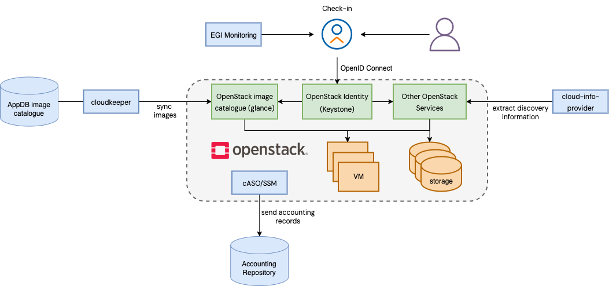

This manual provides information on how to set up a Resource Centre providing
cloud resources in the EGI infrastructure. Integration with FedCloud requires a
_working OpenStack installation_ as a pre-requirement. EGI supports any recent
[OpenStack version](http://releases.openstack.org) (tested from OpenStack
Mitaka).

EGI expects the following OpenStack services to be available and accessible from
outside your site:

- Keystone
- Nova
- Cinder
- Glance
- Neutron
- Swift (if providing Object Storage)

FedCloud components are distributed through
[CMD (Cloud Middleware Distribution)](https://confluence.egi.eu/display/EGIBG/Cloud+Middleware+Distribution)
These docker containers come pre-packaged and ready to use in the EGI FedCloud
Appliance so you do not need to install any extra components on your site but
just run a VM and configure it appropriately to interact with your services.

The integration is performed by a set of EGI components that interact with the
OpenStack services APIs:



- Authentication of EGI users into your system is performed by configuring the
  native OpenID Connect support of Keystone. Support for legacy VOs using VOMS
  requires the installation of the **Keystone-VOMS Authorization plugin** to
  allow users with a valid VOMS proxy to obtain tokens to access your OpenStack
  deployment.
- **cASO** collects accounting data from OpenStack and uses **SSM** to send the
  records to the central accounting database on the EGI Accounting service
  ([APEL](https://apel.github.io/))
- **cloud-info-provider** registers the RC configuration and description through
  the [Messaging service](../../../internal/messaging) to facilitate service
  discovery
- **cloudkeeper** (and **cloudkeeper-os**) synchronises with
  [EGI AppDB](https://appdb.egi.eu/browse/cloud) so new or updated images can be
  provided by the RC to user communities (VO).

Not all EGI components need to share the same credentials. They are individually
configured, you can use different credentials and permissions if desired.

## Installation options

EGI distributes the integration components as:

- A Virtual Appliance (VA) that uses Docker containers to bundle all of the
  components in a single VM and just needs minor configuration to get started
- RPM and DEB Packages in the
  [CMD distribution](https://confluence.egi.eu/display/EGIBG/Cloud+Middleware+Distribution)

### FedCloud Virtual Appliance

The EGI FedCloud Appliance is available at
[AppDB](https://appdb.egi.eu/store/vappliance/fedcloud.integration.appliance.openstack)
as an OVA file. You can easily extract the VMDK disk by untaring and optionally
converting it to your preferred format with qemu-img:

```shell
# get image and extract VMDK
$ curl $(curl "https://appdb.egi.eu/store/vm/image/fc90d1aa-b0ae-46a0-b457-96f6f7a7d446:7875/json?strict" \
    | jq -r .url) \
    | tar x "*.vmdk"
# convert to qcow2
$ qemu-img convert -O qcow2 FedCloud-Appliance.Ubuntu.*.vmdk fedcloud-appliance.qcow2
```

The appliance running at your OpenStack must:

- Have a host certificate to send the accounting information to the accounting
  repository. DN of the host certificate must be registered in GOCDB with
  service type `eu.egi.cloud.accounting`. The host certificate and key in PEM
  format are expected in `/etc/grid-security/hostcert.pem` and
  `/etc/grid-security/hostkey.pem` respectively.
- Have enough disk space for handling the VM image replication (\~ 100GB for
  `fedcloud.egi.eu` VO). By default these are stored at /image_data. You can
  mount a volume at that location.

### Upgrading the OpenStack Appliance

#### From 2018.05.07 or newer to 2021.03.12

Configuration changes:

- Removes BDII, service is no longer in use
- A cloud-info-provider cron is added
- Uses AMS for pushing accounting records. New configuration file for ssmsend is
  available

#### From 2017.08.09 to 2018.05.07

Configuration changes:

- This upgrade moves the `voms.json` file to the respective `caso` and
  `cloudkeeper-os` directories under `/etc/`
- No other changes in configuration are needed

#### From 20160403 to 2017.08.09

There are several major changes between these versions, namely:

- atrope has been deprecated and cloudkeeper is used instead. The configuration
  cannot be reused directly and the new services need to be configured as
  described above
- caso is upgraded to version 1.1.1, the configuration file has some
  incompatible changes.
- A new bdii.service is available for managing the process is available.

### CMD Packages

The CMD-OS repository provides packages that have gone through a quality
assurance process for the supported distributions. Packages are available via
the [EGI repository](https://repository.egi.eu).

## Open Ports

The following **services** must be accessible to allow access to an
OpenStack-based FedCloud site (default ports listed below, can be adjusted to
your installation)

<!-- markdownlint-disable line-length -->

| Port         | Application            | Note                              |
| ------------ | ---------------------- | --------------------------------- |
| **5000**/TCP | **OpenStack**/Keystone | Authentication to your OpenStack. |
| **8776**/TCP | **OpenStack**/cinder   | Block Storage management.         |
| **8774**/TCP | **OpenStack**/nova     | VM management.                    |
| **9696**/TCP | **OpenStack**/neutron  | Network management.               |
| **9292**/TCP | **OpenStack**/glance   | VM Image management.              |

<!-- markdownlint-enable line-length -->

### Outgoing ports

The EGI Cloud components require the following outgoing connections open:

<!-- markdownlint-disable line-length -->

| Port         | Host                    | Note                                                            |
| ------------ | ----------------------- | --------------------------------------------------------------- |
| **443**/TCP  | `msg.argo.grnet.gr`     | ARGO Messaging System (used to send accounting records by SSM). |
| **8443**/TCP | `msg.argo.grnet.gr`     | AMS authentication (used to send accounting records by SSM).    |
| **443**/TCP  | `vmcaster.appdb.egi.eu` | AppDB image lists (used by cloudkeeper).                        |
| **8080**/TCP | `cephrgw01.ifca.es`     | Swift server hosting EGI images (used by cloudkeeper).          |

<!-- markdownlint-enable line-length -->

Images listed in AppDB may be hosted in other servers besides
`cephrgw01.ifca.es`. Check the specific VO-wide image lists for details.

## Permissions

This is an overview of the expected account permissions used in an OpenStack
site, these accounts can be merged as needed for your deployment:

<!-- markdownlint-disable line-length -->

| Component    | Permission                                                                                   |
| ------------ | -------------------------------------------------------------------------------------------- |
| cloud-info   | Member of all projects supporting EGI VOs                                                    |
| accounting   | Member of all projects and able to list users (allowed to `identity:list_users` in keystone) |
| cloud-keeper | Permission to manage the images for all the projects supporting EGI VOs                      |
| Other users  | Automatically created by Keystone and permission set as configured in the mappings           |

<!-- markdownlint-enable line-length -->
