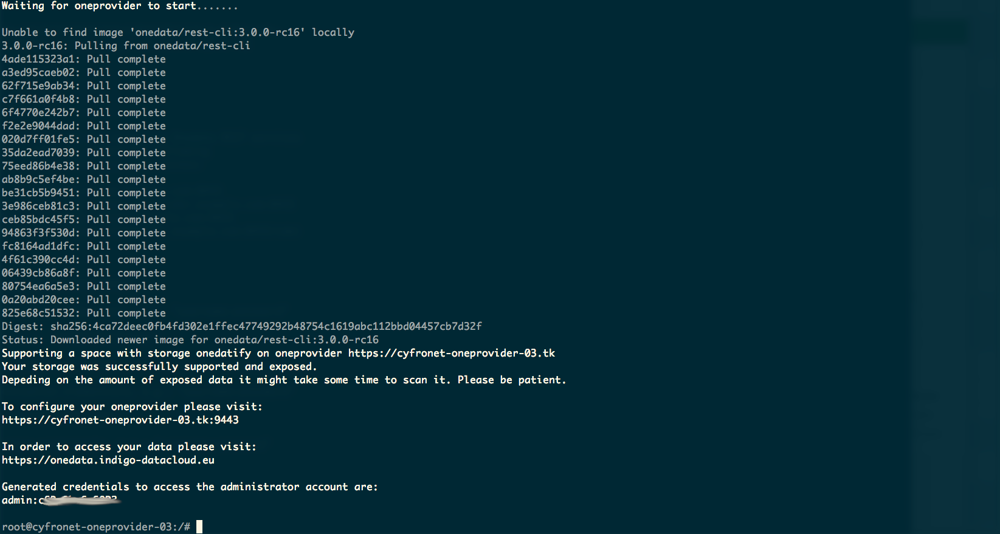

This documentation covers how to install and configure a OneData OneProvider in
order to join a new or existing EGI DataHub space. In particular two types of
installations are available, depending if the provider wants to support the
space with an empty storage or if existing data should be exposed via the
Oneprovider.

## Requirements for production installation

- Oneprovider
  - RAM: 32GB
  - CPU: 8 vCPU
  - Disk: 50GB SSD
  - To be adjusted for the dataset and usage scenario
- For high Input/Output operations per second (IOPS)
  - High performance backend storage (CEPH)
  - Low latency network

### Network Requirements

- The following ports need to be open on the local and site firewall:
  - 80, 443, 9443, 6665 (for data transfer)

{}

The Oneprovider installation includes also a Memcached server running on
port 11211. Please ensure that this port and other unused ports are not open to
the internet by setting up proper local firewall rules.

{}

## Installation and attach empty storage to the EGI DataHub

The installation of a new Oneprovider is performed using the `onedatify`
installation script which will setup the components using Docker and
Docker-compose.

This simple installation script can be generated from the EGI DataHub interface.

Firstly, you need to login to the EGI DataHub and using the `Data` menu you
either select an existing space or create a new one.

Secondly, you can select on the space menu the `Providers` section and click on
the `Add Support` button on the top right corner.


You should then select on the page the tab: `Deploy your own provider`

In order to obtain the `PROVIDER_REGISTRATION_TOKEN` that is part of the
preconfigured command, you need to contact the
[EGI HelpDesk](https://ggus.eu/?mode=ticket_submit), selecting DataHub as
support unit.

Please include in the request the following info:

- Use case for the installation of a Oneprovider connected to the EGI DataHub
- Name and the email of the Oneprovider admin
- domain name of the Oneprovider


### Run the command on the host

With the obtained `PROVIDER_REGISTRATION_TOKEN`, paste the copied command in the
terminal on the Oneprovider machine as superuser.

If necessary, the Onedatify script will ask for permission to install all
necessary dependencies including Docker and Docker Compose.

After the dependency installation is complete, the script will ask several
questions and suggest default settings:


The progress can be monitored on a separate terminal using the following
command:

```shell
onedatify logs
```

After the deployment is complete, a message will be shown, including connection
details for the administration panel of the Oneprovider:



This administration panel at port `9443` can be used to administer the
Oneprovider.

## Installation and expose existing data to the EGI DataHub

The installation of a new OneProvider to expose existing datasets to an EGI
DataHub space is similar to the installation with an empty storage.

When adding support to an existing or new space you should select from the EGI
DataHub user interface the tab : `Expose Existing dataset`.

Please refer to the steps described in the
[Installation and attach empty storage to the EGI DataHub](#installation-and-attach-empty-storage-to-the-egi-datahub)
section to request a `PROVIDER_REGISTRATION_TOKEN`.

Once obtained, you will have to copy the command already configured with the
correct parameters for the Onezone (`datahub.egi.eu`) and the space to join.


### Run the command on the host

Paste the copied command in the terminal on the Oneprovider machine as
superuser, and follow the instructions as for the case of an empty storage.

The only difference is that at the end of the installation and configuration
process the existing files will be automatically imported to the OneProvider.

You can monitor the import activity from the administration panel at port 9443.


## Additional configuration for EGI DataHub

After completing the installation it might be necessary to add some specific
configuration depending on the use case.

### Storage Import

Storage import function is used to import files located on a storage and not
added or modified directly by DataHub API, client or web interface. For example
if another application access the storage directly as, for example in an NFS
share. The file registration process creates the necessary metadata so that
files that are added, removed or modified directly on the storage are reflected
and accessible in the corresponding space. It is possible to configure the
storage to automatically detect changes made on the storage using the continuous
scan option or by manually triggering scans.

In general, there are three basic space usage scenarios to be considered before
deciding to enable the automatic scan of the storage or to perform a single
scan:

1. An initially empty space, modified only via DataHub -> no need to enable the
   auto-scan or to perform a manual scan.
1. A space with some initial data that has been imported once and then the space
   is only modified via DataHub -> In this case the auto scan is not needed
   however it needs to somehow guard the storage from external modifications
   otherwise it will desynchronise with the space. E.g.: all changes should be done
   trough API, DataHub client or the web interface.
1. A space that exposes a dataset from a storage that later is still dynamically
   changing outside of DataHub (when it is assumed that some modification can
   happen at some point) -> in this case continuous scan is needed.

Every storage import scan causes additional load on the Oneprovider. If the
space is large and changes very often outside of Onedata, it might have a
visible impact on the overall performance - but we are talking millions of files
and hundreds of changes per second. Otherwise, having the continuous scan run in
the background at the default value, with interval of 60 seconds should not
cause any issues. Depending on the specific needs however, if the loads becomes
too high or if the changes need to be applied timely it is possible to increase
or decrease this interval respectively.

In the following screenshot is shown how to access the configuration for the
storage import:


This configuration page is located under the "CLUSTER" tab in the main page.
There we should select the cluster that is providing the space that we need to
configure, Spaces and select the specific space that need to be configured. In
the example shown, the "Auto storage import configuration" menu has been
expanded and continuos scan enabled.
