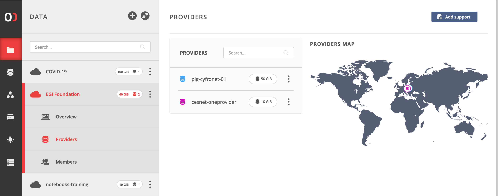
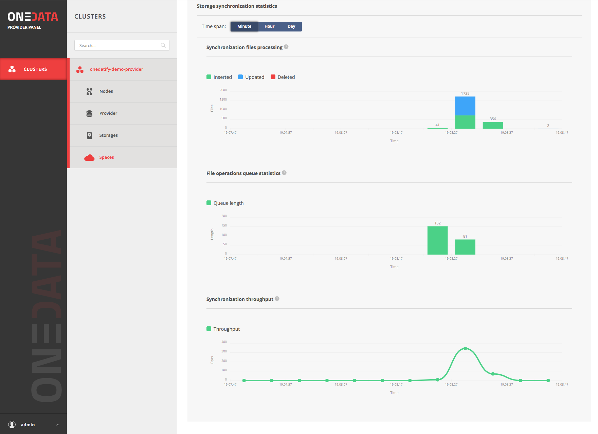

This documentation covers how to install and configure a OneData OneProvider in
order to join a new or existing EGI DataHub space. In particular two types of
installations are available, depending if the provider wants to support the
space with an empty storage or if existing data should be exposed via the
OneProvider.

## Requirements for production installation

- OneProvider
  - RAM: 32GB
  - CPU: 8 vCPU
  - Disk: 50GB SSD
  - To be adjusted for the dataset and usage scenario
- For high Input/Output operations per second (IOPS)
  - High performance backend storage (CEPH)
  - Low latency network

### Network Requirements

- The following ports need to be open on the local and site firewall:
  - 80, 443, 9443, 6665 (for data transfer)

## Installation and attach empty storage to the EGI DataHub

The installation of a new OneProvider is performed using the `onedatify`
installation script which will setup the components using Docker and
Docker-compose.

This simple installation script can be generated from the EGI DataHub interface.

Firstly, you need to login to the EGI DataHub and using the `Data` menu you
either select an existing space or create a new one.

Secondly, you can select on the space menu the `Providers` section and click on
the `Add Support` button on the top right corner.



You should then select on the page the tab: `Deploy your own provider` and there
you will have to copy the command already configured with the correct parameters
for the OneZone to use (`datahub.egi.eu`) and the space to join.


### Run the command on the host

Paste the copied command in the terminal on the OneProvider machine as
superuser.

If necessary, the Onedatify script will ask for permission to install all
necessary dependencies including Docker and Docker Compose.

After the dependency installation is complete, the script will ask several
questions and suggest default settings:


The progress can be monitored on a separate terminal using the following
command:

```shell
onedatify logs
```

After the deployment is complete, a message will be shown, including connection
details for the administration panel of the OneProvider:


This administration panel at port `9443` can be used to administer the
OneProvider.

## Installation and expose existing data to the EGI DataHub

The installation of a new OneProvider to expose existing datasets to an EGI
DataHub space is similar to the installation with an empty storage.

When adding support to an existing or new space you should select from the EGI
DataHub user interface the tab : `Expose Existing dataset` and there you will
have to copy the command already configured with the correct parameters for the
OneZone (`datahub.egi.eu`) and the space to join.


### Run the command on the host

Paste the copied command in the terminal on the OneProvider machine as
superuser, and follow the instructions as for the case of an empty storage.

The only difference is that at the end of the installation and configuration
process the existing files will be automatically imported to the OneProvider.

You can monitor the import activity from the administration panel at port 9443.




