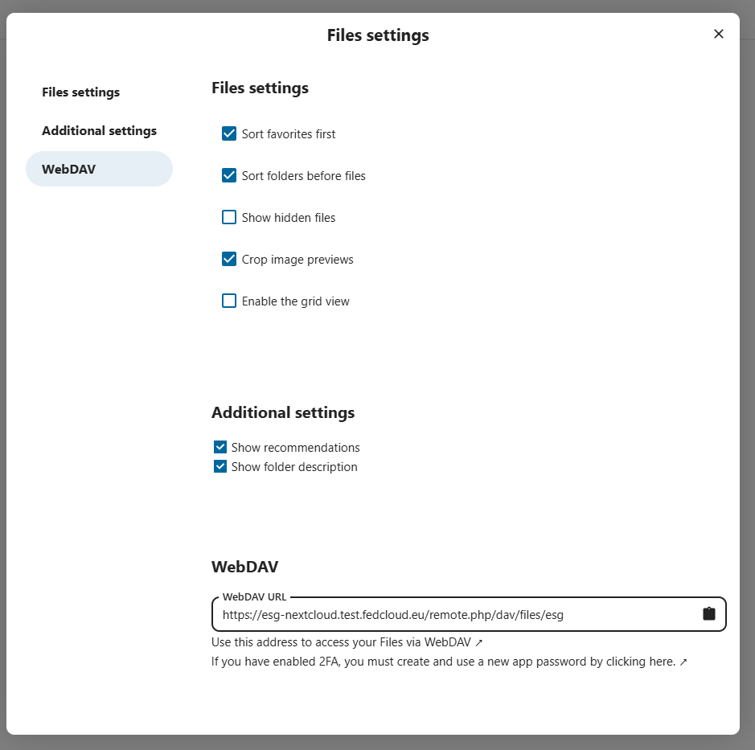

This documentation covers how to configure a OneData OneProvider with a WebDAV backend as an existing storage. This configuration has been tested with Nextcloud and XrootD.

## Requirements

- An existing installation of DataHub and one provider
- An existing installation of WebDAV to be used as backend storage with access credentials

### Network Requirements

- The WebDAV storage should be accessible from the OneProvider instalation
  - 443 port should be available for access and data transfer

## Configuration of WebDAV

In this example an installation of Nextcloud has been used. In particular, once logged in the web interface we need to check the WebDAV section on the "File settings". The "Files settings" section can be accessed from the bottom lef of the web interface.

This opens the Files settings where we can check and copy the URL to access the WebDAV interface as show in the following screenshot:

## Configuration of OneProvider

On the DataHub interface on the "Storage backends" section of the Cluster configuration associated to the Space that we want to configure click on the "Add storage backend". This will open the following configuration:

Where we can select the "Type" as "WebDAV", the endpoint as the URL copied from Nextcloud in the previous steps and the credential to access NextCloud as "Credential type" basic and "login:password"

{}

At this strage if we try to add the storage backend we will see the following error:

This is because of a limitation on the WebDAV implementation of Nextcloud. In particular it does not have "Range write support" while OneData, by design supports only this way of writing as it is expected to write large amount of data. Selecting the "Read only" option allow to complete the configuration. Going back to the Files section we can then browse the files present on the imported WebDAV storage.

{}

A similar procedure can be used and has been tested for XrootD however in this case as the Nextcloud tests, the "Range write support" was not available on the instance tested and the readonly access was possible.
