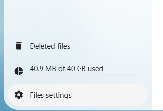
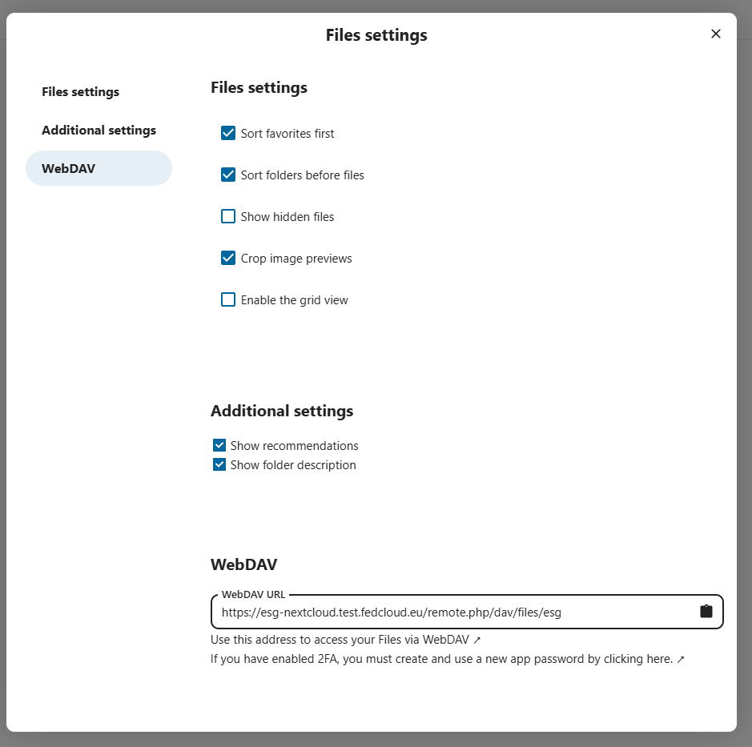
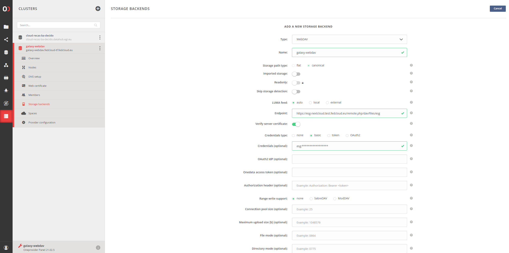
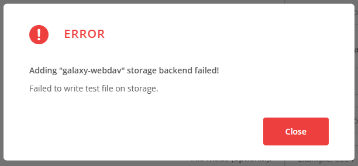
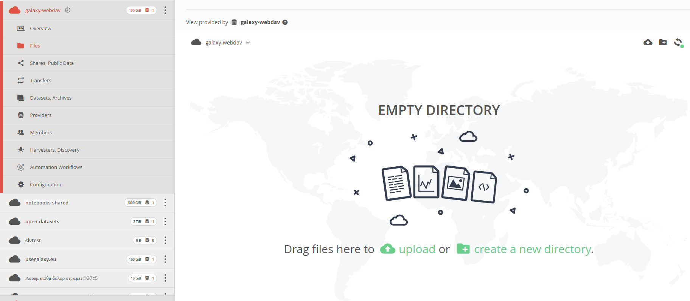
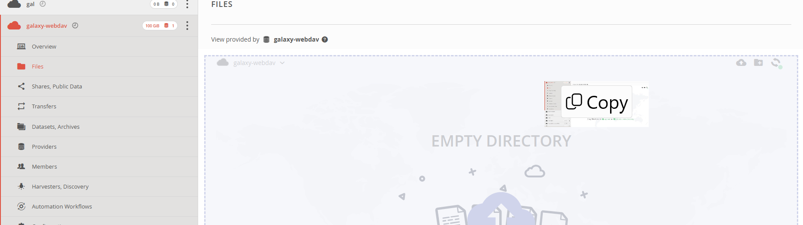

This documentation covers how to configure a OneData OneProvider with a WebDAV backend as an existing storage. This configuration has been tested with Nextcloud and SabreDAV.

## Requirements

- An existing installation of DataHub and one provider
- An existing installation of WebDAV to be used as backend storage with access credentials

### Network Requirements

- The WebDAV storage should be accessible from the OneProvider installation
  - the port used to access the service should be available for access and data transfer

## Configuration of WebDAV

In this documentation an installation of Nextcloud and SabreDAV have been used. In particular. On the Nextcloud web interface, once logged in, we need to check the WebDAV section on the "File settings". The "Files settings" section can be accessed from the bottom lef of the web interface. For the SabreDAV implementation is simply the URL or IP of the server.

This opens the Files settings where we can check and copy the URL to access the WebDAV interface as show in the following screenshot:

## Configuration of OneProvider

On the DataHub interface on the "Storage backends" section of the Cluster configuration associated to the Space that we want to configure click on the "Add storage backend". This will open the following configuration:

Where we can select the "Type" as "WebDAV", the endpoint as the URL copied from Nextcloud in the previous steps and the credential to access NextCloud as "Credential type" basic and "login:password"

{}

At this stage if we try to add the Nextcloud storage backend we will see the following error:

For this operation to succeed we need an implementation of WebDAV that has "Range write support" which is not supported by Nextcloud.
If we try to use that we would be presented the following warning and although the data would be accessible, the storage would be in readonly mode:

OneData, by design supports only this way of writing as it is expected to write large amount of data.
{}

[SabreDAV](https://sabre.io/) has "Range write support" and can be successfully configured with read and write support.
After the configuration is completed like shown it the previous steps we can access it is possible to access the content of the storage

If the backend configured is for example SabreDAV it is possible to perform all the operation and upload files from the web interface as shown in the following screenshot:

