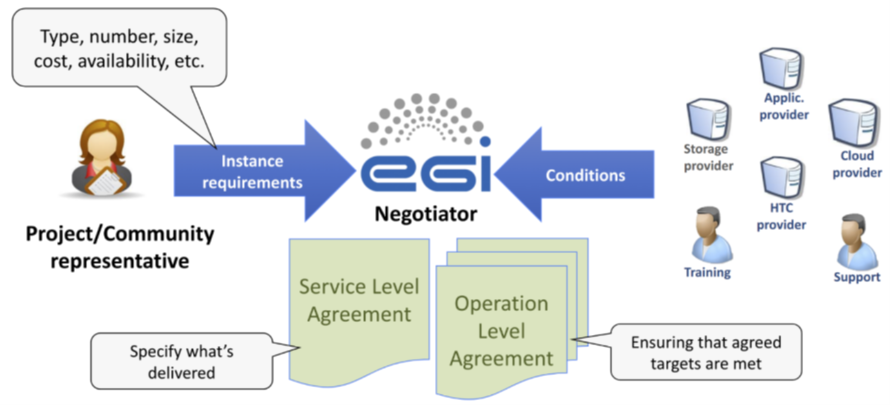

## Introduction

A Resource Centre (RC) is the smallest resource administration domain in the EGI
Federation. It can be either localised or geographically distributed and
provides a minimum set of local or remote IT Services compliant with
well-defined IT Capabilities (HTC, Cloud, Storage, etc.) necessary to make
resources accessible to Users. EGI is a Resource Infrastructure federating RCs
to constitute a homogeneous operational domain.

## Registration and certification

In order to join the EOSC Compute platform, a RC needs to present the request to
the Research Infrastructure Provider (RP) existing in its country. A RP is a
legal organisation, part of large Resource Infrastructures like EGI, responsible
for managing and operating a number of operational services at national level
supporting RCs and user communities that contribute to such RIs. Please have a
look at the [Operations Start Guide](../../../operations_start_guide) to get
familiar with the terms mentioned above and to have a complete picture of the
several actors participating in our landscape.

The RP operators are going to guide and support the RC during the registration
and certification procedures. First, the RC will be asked to read, understand,
and accept:

- the [“RCs Operational Level Agreement”](https://documents.egi.eu/document/31),
  an agreement made between the RC and its RP that defines the minimum set of
  operational services and the respective quality parameters that a Resource
  Centre is required to provide in EGI;
- the [Security Policies](https://confluence.egi.eu/x/9wbSB) defined in EGI to
  guarantee that all the security aspects with the service delivery are
  fulfilled and enforced.

The next step is registering the RC in the EGI
[Configuration Database](https://goc.egi.eu/): the provided information, from
the generic contacts and roles of people to the service endpoints details will
be needed to trigger the daily operations of other services and activities
provided by the EGI Infrastructure such as the Monitoring of the resources, the
Accounting, the Support, and the security activities.

Once the entry in the Configuration Database is complete, the RP changes the RC
status from “Candidate” to “Uncertified”, and the certification procedure can
start: it comprises a series of technical controls to verify that the provided
services work according to the expectations in the RC OLA. Any identified issue
is notified by the RP operators to the RC and investigated until its solution.

When all the certification controls are successfully passed, the RC status is
changed to “Certified” meaning that the RC is included in the production
infrastructure and its resources can be consumed by the users of the
infrastructure.

## Setting up agreements with customers

Once moved to the production infrastructure, a RC is ready to deliver its
resources to any of the users’ communities consuming the infrastructure. Here
the Service Level Management (SLM) process intervenes as a matchmaker between
service expectations and needs of the Virtual Organisations (VOs)17 and the
capabilities of the RCs. During the selection of the providers for service
provisioning, technical requirements collected from the customer are used by EGI
to launch a call open to all of the providers. The Expression of Interests
(EoIs) collected during the negotiation phase will be used to identify the
provider(s) that best match the customer's requirements and expectations. From a
technical perspective, several aspects will be considered during the negotiation
phase including the geographical location of the customer, national roadmap and
priority of the providers, and costs of the service provisioning in case of a
pay-for-use model.

In case the negotiation phase ends positively, the selected provider(s) will:

- Define a VO Operational Level Agreement(s) (OLA) with EGI Foundation for
  providing the services through the EGI Portfolio to support the user
  community. EGI Foundation will share with the RCs a draft of the document(s)
  based on a predefined template and customised with the details of the specific
  Agreement(s), such as:
  - the main contacts to be used for communications related to the service(s);
  - the duration of the Agreement;
  - conditions for operating the service (service hours and exceptions);
  - Service Level Targets;
  - if the resources are exclusively allocated or are subject to local
    availability;
  - the payment mode;
  - responsibility in case of violations and complaints;
  - any limitations and constraints (if any);
  - the frequency of service performance reports.
- Configure the service(s) in the scope of the Agreement(s) enabling the support
  of the Customer's VO and activating the monitoring of the services/resources.

At the same time, EGI Foundation sets up a VO Service Level Agreement (SLA) with
the given user community for the provisioning of the requested service. The EGI
VO SLA is secured with related EGI VO OLAs and is agreed on a case-by-case basis
(Fig.3).

Once approved, the Agreement is automatically renewed, as long as the
provider(s) does (do) not express a decision to terminate the Agreement at least
a month before the expiration date. In case of termination of the Agreement, the
provider must remove the support of the customer. The Agreement can also be
terminated by the customer.

## Managing service orders

Customers can request access to the services of the EOSC Compute Platform
through the EOSC Portal Marketplace. Access to the services is either fully
open, or behind service-specific authentication and authorisation steps.

Depending on the nature of the service ordered, different levels of technical
support are requested to the service providers including the activation of a new
Virtual Organisation (VO), or the customization of the service with dedicated
set-up to meet the customer's expectations. Service providers receive
notifications about services orders via
[SOMBO](https://opsportal.eosc-portal.eu/login/) and with the support and
oversight of the EGI Foundation they deal with them.

## Incidents and service requests

Providing support is a fundamental part of the daily activity of a provider
participating in a large research infrastructure like EGI. The support is meant
not only towards the users accessing the resources but also towards those who
are involved in the management and oversight of the infrastructure. As defined
in the RC OLA, the RC will handle
[incidents](https://confluence.egi.eu/display/EGIG/Incident) and
[service requests](https://confluence.egi.eu/display/EGIG/Service+request)
registered as tickets in the EGI Helpdesk service, with the expectation to
acknowledge and process any notified issue within the agreed response time
associated with the priority of the ticket. The response time is defined by the
Quality of [Support levels](https://confluence.egi.eu/x/ygCrB), and for the RCs
the level will be Medium, meaning that there will 4 priorities for the incidents
(requiring for example up to 5 working days for the “less urgent” tickets and up
to 1 working day for the “top priority” ones), while any service request will be
processed as “less urgent” ticket.

## Performance reports: enforcing OLAs

As defined in the RCs OLA, the performance of the delivered services should meet
the Service Level Targets: the monthly performance of the RCs is monitored, and
when the targets are not achieved for three consecutive months, the affected RCs
are notified through a ticket about the OLA violation and requested to provide
within 10 working days an explanation for the low performance and a plan for
improvement. The RCs not providing a satisfactory explanation or not replying at
all are eligible for suspension. In order to re-join the EGI Infrastructure, any
suspended RC should undergo a new certification procedure. The “Suspended”
status cannot last for more than 4 months, after which a RCs is either in
production again or definitely closed.

Besides the Targets defined in the RCs OLA which are enforced to guarantee the
permanence of the RC in the infrastructure, also the targets promised to the
users in the VO SLAs should be met on a monthly basis: also in this case, when a
violation occurs, the RC is requested to provide a justification and a plan for
improving the quality of the provided services. If repeated violations occur,
the SLA can be renegotiated with the customer, either by changing the Service
Level Targets, or by choosing a different RCs as a provider.

## Dealing with security incidents and vulnerabilities

The security posture of the infrastructure is framed by the set of policies
constituting the [Security Policies](https://go.egi.eu/security-policies). Those
policies cover different complementary activities including the operation of
services, the processing of personal data and the management of security
incidents and vulnerabilities.

### Dealing with security incidents

The
[Security Incident Response Policy](https://go.egi.eu/security-incident-response-policy)
aims at ensuring that all incidents are investigated as fully as possible, and
that Resource Centres promptly report intrusions. In particular, security
incidents are to be treated as serious matters and their investigation must be
resourced appropriately.

In case of the suspected security incidents, Resources Centres report it to
their Operations Centre Security Officer and to EGI Computer Security Incident
Response Team (CSIRT) within 4 hours of discovery. This initial step will start
the coordination of the incident response as documented in the procedure
[SEC01 EGI CSIRT Security Incident Handling Procedure](https://go.egi.eu/sec01).
This procedure has been implemented according to the Security Incident Response
Policy, to minimise the impact of security incidents affecting the Resource
Centres part of the infrastructure. This procedure covers guidance on how the
incident response should be coordinated, describing the responsibilities of the
various parties, and encourages post-mortem analysis and promotes cooperation
between Resource Centres.

### Handling of vulnerabilities

The handling of vulnerabilities is a very formal process involving many
different entities, as presented below.

Anyone can report a software vulnerability via a
[form](https://csirt.egi.eu/report-vulnerability/) or by email contacting the
Software Vulnerability Group.

The report will trigger an assessment, following the
[SEC02 Software Vulnerability Issue Handling](https://go.egi.eu/sec02)
procedure, by the Software Vulnerability Group (SVG), of the risk level
associated with this vulnerability in the context of the activities of the EGI
Infrastructure.

Once a vulnerability has been identified as presenting a risk to the
infrastructure, it will be decided if an advisory should be prepared and
circulated to the security contacts of the sites. After an agreed period of time
and depending on their confidentiality, advisories are made public.

Vulnerabilities identified as critical are handled according to the procedure
[SEC03 EGI-CSIRT Critical Vulnerability Handling](https://go.egi.eu/sec03). When
applicable, this usually involves developing a custom
[security monitoring probe](https://github.com/ARGOeu/secmon-probes/) created to
identify on High Throughput Compute RCs if their resources are vulnerable to the
vulnerability. The status is closely monitored by the security team and
accessible to the affected RCs.

Using this information correlated with the one from
[Pakiti](https://pakiti.egi.eu/) (the patch management service collecting
information about the patches deployed at the various High Throughput Compute
RCs), the Incident Response Task Force (IRTF) on duty security officer will open
tickets against the impacted sites according to the
[WI07 Security Vulnerability Handling](https://go.egi.eu/wi07) procedure.

The EGI Service Delivery and Information Security (SDIS) team of the EGI
Foundation will follow up with the resource provider to work on resolving the
ticket. The first duty of the resource provider is to acknowledge the
vulnerability and then work on a prompt resolution as suggested in the ticket.
In case a satisfactory resolution is not reached in due time, or a sign of
active progress on addressing the vulnerability is not visible, the specific
resource centre may be suspended.
