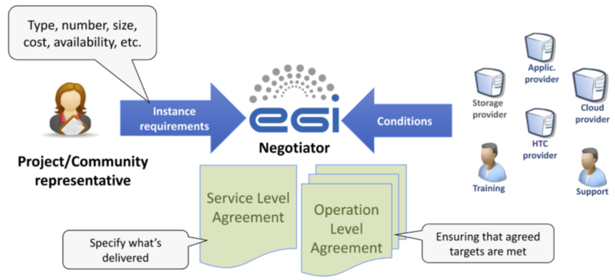

## Introduction

A Resource Centre (RC) is the smallest resource administration domain in the EGI
Federation. It can be either localised or geographically distributed and
provides a minimum set of local or remote IT Services compliant with
well-defined IT Capabilities (HTC, Cloud, Storage, etc.) necessary to make
resources accessible to Users. EGI is a Resource Infrastructure federating RCs
to constitute a homogeneous operational domain.

## Registration and certification

{} Related procedure:
[PROC09 Resource Centre Registration and Certification](https://go.egi.eu/proc09)
{}

In order to join the EGI Infrastructure, a RC needs to present the request to
the Research Infrastructure Provider (RP) existing in its country. A RP is a
legal organisation, part of the EGI Resource Infrastructure, responsible for
managing and operating a number of operational services at national level,
supporting EGI RCs and user communities. Please have a look at the
[Operations Start Guide](../../operations-manuals/operations-start-guide/) to get familiar with the
terms mentioned above, and to have a complete picture of the several actors
participating in our landscape.

The RP operators are going to guide and support the RC during the registration
and certification procedures.

Firstly, the RC will be asked to read, understand, and accept:

- the
  [RCs Operational Level Agreement (OLA)](https://documents.egi.eu/document/31),
  an agreement made between the RC and its RP that defines the minimum set of
  operational services and the respective quality parameters that a Resource
  Centre is required to provide in EGI;
- the [Security Policies](https://go.egi.eu/policies_procedures) defined in EGI
  to guarantee that all the security aspects with the service delivery are
  fulfilled and enforced.

Secondly, the RC should be registered in the EGI
[Configuration Database](../../../internal/configuration-database): the
provided information, from the generic contacts and roles of people to the
service endpoints details, is needed to trigger the daily operations of other
services and activities provided by the EGI Infrastructure such as the
[Monitoring](../../../internal/monitoring) of the resources, the
[Accounting](../../../internal/accounting), the
[Support](../../../internal/helpdesk), and the
[Security](../../../internal/security-coordination) activities.

Once the entry in the Configuration Database is complete, the RP changes the RC
status from “Candidate” to “Uncertified”, and the certification procedure can
start: it comprises a
[series of technical controls](../../operations-manuals/howto04_site_certification_manual_tests/)
to verify that the provided services work according to the expectations defined
in the RC OLA. Any identified issue is notified by the RP operators to the RC
and investigated until its solution.

When all the certification controls are successfully passed, the RC status is
changed to “Certified” meaning that the RC is included in the EGI production
infrastructure and its resources can be consumed by the users of the
infrastructure.

## Resource Centres responsibilities

### Incidents and service requests

Providing support is a fundamental part of the daily activity of a provider
participating in a large research infrastructure such as EGI. The support is not
only for the users accessing the resources but also for those who are involved
in the management and oversight of the infrastructure.

As defined in the RC OLA, the RC will handle
[incidents](https://confluence.egi.eu/display/EGIG/Incident) and
[service requests](https://confluence.egi.eu/display/EGIG/Service+request)
registered as tickets in the [EGI Helpdesk](../../../internal/helpdesk)
service, with the expectation to acknowledge and process any notified issue,
within the agreed response time associated with the priority of the ticket.

The response time is defined by the Quality of
[Support levels](https://confluence.egi.eu/display/EGISLM/Service+Level+Target+-+Quality+of+Support),
and for the RCs the level will be Medium, meaning that there will 4 priorities
for the incidents (requiring for example up to 5 working days for the “less
urgent” tickets and up to 1 working day for the “top priority” ones), while any
service request will be processed as “less urgent” ticket.

### Security topics

The security posture of the infrastructure is framed by the set of policies
constituting the [Security Policies](https://go.egi.eu/security-policies). Those
policies cover different complementary activities including the operation of
services, the processing of personal data and the management of security
incidents and vulnerabilities.

#### Dealing with security incidents

The
[Security Incident Response Policy](https://go.egi.eu/security-incident-response-policy)
aims at coordinating the incident response across the infrastructure, ensuring
that that incidents are promptly reported, and that all incidents are
investigated as fully as possible.

> Security incidents are to be treated as serious matters and their
> investigation must be resourced appropriately.

Resources Centres must report suspected security incidents to their RP Security
Officer and to
[EGI Computer Security Incident Response Team (CSIRT)](https://confluence.egi.eu/display/EGIBG/CSIRT)
within 4 hours of discovery. This initial step will start the coordination of
the incident response as documented in the procedure
[SEC01 EGI CSIRT Security Incident Handling Procedure](https://go.egi.eu/sec01).

- This procedure has been implemented according to the Security Incident
  Response Policy, to minimise the impact of security incidents affecting the
  Resource Centres part of the infrastructure
- It covers guidance on how the incident response should be coordinated,
  describing the responsibilities of the various parties, and encourages
  post-mortem analysis and promotes cooperation between Resource Centres.

#### Handling of vulnerabilities

The handling of vulnerabilities is a very formal process involving many
different entities.

Anyone can report a software vulnerability via a
[form](https://csirt.egi.eu/report-vulnerability/) or by email contacting the
[Software Vulnerability Group (SVG)](https://confluence.egi.eu/display/EGIBG/SVG).

The report will trigger an assessment, following the
[SEC02 Software Vulnerability Issue Handling](https://go.egi.eu/sec02)
procedure, by the Software Vulnerability Group, of the risk level associated
with this vulnerability in the context of the activities of the EGI
Infrastructure.

Once a vulnerability has been identified as presenting a risk to the
infrastructure, it will be decided if an advisory should be prepared and
circulated to the security contacts of the sites. After an agreed period of
time, and depending on their confidentiality, advisories are made public.

Vulnerabilities identified as critical are handled according to the procedure
[SEC03 EGI-CSIRT Critical Vulnerability Handling](https://go.egi.eu/sec03). When
applicable, this usually involves developing a custom
[security monitoring probe](https://github.com/ARGOeu/secmon-probes/) created to
identify on High Throughput Compute RCs if their resources are vulnerable to the
vulnerability. The status is closely monitored by the security team and
accessible to the affected RCs.

Using this information correlated with the one from
[Pakiti](../../../internal/security-coordination/monitoring/pakiti), the
patch management service collecting information about the patches deployed at
the various High Throughput Compute RCs, the Incident Response Task Force (IRTF)
on duty Security Officer will open tickets against the impacted sites according
to the [WI07 Security Vulnerability Handling](https://go.egi.eu/wi07) procedure.

The EGI Service Delivery and Information Security (SDIS) team of the EGI
Foundation, formerly known as the EGI Operations team, will follow up with the
resource provider to work on resolving the ticket. The first duty of the
resource provider is to acknowledge the vulnerability and then work on a prompt
resolution as suggested in the ticket. In case a satisfactory resolution is not
reached in due time, or a sign of active progress on addressing the
vulnerability is not visible, the specific Resource Centre may be suspended.

## Serving user communities

Once part of the production infrastructure, the RC is ready to deliver its
resources to any of the users’ communities consuming the infrastructure.

The RC can continue serving local user communities, and at the same time deliver
capacity for international user communities that approach EGI and therefore
reach the federated RCs.

International communities reach EGI through the following channels:

- The EGI site where they can
  [request access to services](https://www.egi.eu/services/research/).
- The [EGI-ACE Call for Use Cases](https://www.egi.eu/egi-ace-open-call/).
- The [Marketplace](https://marketplace.eosc-portal.eu/) of the European Open
  Science Cloud.

### Service and Operation Level Agreements (SLAs, OLAs)

The User Community Support team of the EGI Foundation receives these requests
and negotiates the details of access, with the involvement of relevant and
‘fit-for-purpose’ RCs. This Service Level Management (SLM) process intervenes as
a matchmaker between service expectations and needs of the user communities,
acting as ‘customers’, and the capabilities of the RCs. Customers are enabled
access to the resources in the form of
[Virtual Organisations (VOs)](https://confluence.egi.eu/display/EGIG/Virtual+organisation).

In order to select providers for provisioning services to a given customer,
technical requirements are collected from the customer then transferred to
relevant providers. The Expression of Interests for support (EoIs) are collected
from the interested providers during the negotiation phase, resulting in the
best match with customer’s requirements and expectations (both technical and
financial). Several aspects are considered during the negotiation phase,
including the geographical location of the customer, national roadmap and
priority of the providers, and costs of the service provisioning in case of a
pay-for-use model.

The result of the negotiation is a ‘Service Level Agreement’ (SLA), and several
‘Operation Level Agreements’ (OLA), one with each contributing provider. (See
[SLAs-OLAs examples](https://documents.egi.eu/public/ListBy?topicid=65).)

SLAs and OLAs are typically signed for at least 1 year, and are automatically
renewed, as long as the provider(s) or the customer do not express a decision to
terminate the Agreement at least a month before the expiration date.

## Performance reports: enforcing OLAs

As defined in the RCs OLA, the performance of the delivered services should meet
the Service Level Targets: the monthly performance of the RCs is monitored, and
when the targets are not achieved for three consecutive months, the affected RCs
are notified through a ticket about the OLA violation and requested to provide
within 10 working days an explanation for the low performance and a plan for
improvement.

> The RCs not providing a satisfactory explanation or not replying at all are
> eligible for suspension.

In order to re-join the EGI Infrastructure, any suspended RC should undergo a
new certification procedure. The “Suspended” status cannot last for more than 4
months, after which a RCs is either in production again or definitely closed.

Besides the Targets defined in the RCs OLA, which are enforced to guarantee the
permanence of the RC in the infrastructure, the targets promised to the users in
the VO SLAs should also be met on a monthly basis: when a violation occurs, the
RC is requested to provide a justification and a plan for improving the quality
of the provided services.

> If repeated violations occur, the SLA can be renegotiated with the customer,
> either by changing the Service Level Targets, or by choosing a different RCs
> as a provider.
