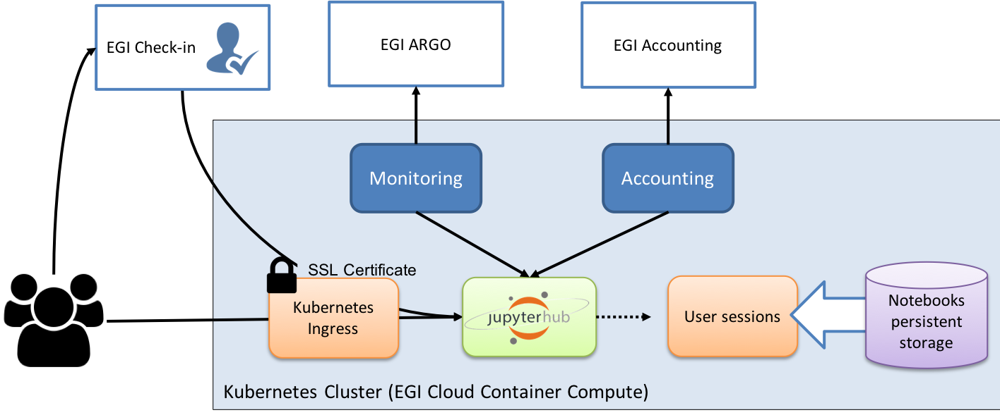

The EGI Notebooks service relies on the following technologies to provide its
functionality:

- [JupyterHub](https://github.com/jupyterhub/jupyterhub) with custom
  [EGI Check-in oauthentication](https://github.com/enolfc/oauthenticator)
  configured to spawn pods on Kubernetes.
- [Kubernetes](https://kubernetes.io/) as container orchestration platform
  running on top of EGI Cloud resources. Within the service it is in charge of
  managing the allocated resources and providing the right abstraction to deploy
  the containers that build the service. Resources are provided by EGI Federated
  Cloud providers, including persistent storage for users notebooks.
- CA authority to allocate recognised certificates for the HTTPS server
- [Prometheus](https://prometheus.io/) for monitoring resource consumption.
- Specific EGI hooks for
  [monitoring](https://github.com/EGI-Federation/egi-notebooks-monitoring),
  [accounting](https://github.com/EGI-Federation/egi-notebooks-accounting) and
  [backup](https://github.com/EGI-Federation/egi-notebooks-backup).
- VO-Specific storage/Big data facilities or any pluggable tools into the
  notebooks environment can be added to community specific instances.

## Kubernetes

A Kubernetes (k8s) cluster deployed into a resource provider is in charge of
managing the containers that will provide the service. On this cluster there
are:

- 1 master node that manages the whole cluster
- Support for load balancer or alternatively 1 or more edge nodes with a public
  IP and corresponding public DNS name (e.g. notebooks.egi.eu) where a k8s
  ingress HTTP reverse proxy redirects requests from user to other components of
  the service. The HTTP server has a valid certificate from one CA recognised at
  most browsers (e.g. Let\'s Encrypt).
- 1 or more nodes that host the JupyterHub server, the notebooks servers where
  the users will run their notebooks. Hub is deployed using the
  [JupyterHub helm charts](https://jupyterhub.github.io/helm-chart/). These
  nodes should have enough capacity to run as many concurrent user notebooks as
  needed. Main constraint is usually memory.
- Support for
  [Kubernetes PersistentVolumeClaims](https://kubernetes.io/docs/concepts/storage/persistent-volumes/)
  for storing the persistent folders. Default EGI-Notebooks installation uses
  NFS, but any other volume type with ReadWriteOnce capabilities can be used.
- Prometheus installation to monitor the usage of resources so accounting
  records are generated.

All communication with the user goes via HTTPS and the service only needs a
publicly accessible entry point (public IP with resolvable name)

Monitoring and accounting are provided by hooking into the respective monitoring
and accounting EGI services.

There are no specific hardware requirements and the whole environment can run on
commodity virtual machines.

## EGI Customisations

EGI Notebooks is deployed as a set of customisations of the
[JupyterHub helm charts](https://jupyterhub.github.io/helm-chart/).



### Authentication

EGI Check-in can be easily configured as a OAuth2.0 provider for
[JupyterHub\'s oauthenticator](https://github.com/jupyterhub/oauthenticator).
See below a sample configuration for the helm chart using Check-in production
environment:

```yaml
hub:
  extraEnv:
    OAUTH2_AUTHORIZE_URL: https://aai.egi.eu/auth/realms/egi/protocol/openid-connect/auth
    OAUTH2_TOKEN_URL: https://aai.egi.eu/auth/realms/egi/protocol/openid-connect/token
    OAUTH_CALLBACK_URL: https://<your host>/hub/oauth_callback

auth:
  type: custom
  custom:
    className: oauthenticator.generic.GenericOAuthenticator
    config:
      login_service: "EGI Check-in"
      client_id: "<your client id>"
      client_secret: "<your client secret>"
      oauth_callback_url: "https://<your host>/hub/oauth_callback"
      username_key: "sub"
      token_url: "https://aai.egi.eu/auth/realms/egi/protocol/openid-connect/token"
      userdata_url: "https://aai.egi.eu/auth/realms/egi/protocol/openid-connect/userinfo"
      scope: ["openid", "profile", "email", "eduperson_scoped_affiliation", "eduperson_entitlement"]
```

To simplify the configuration and to add refresh capabilities to the
credentials, we have created a new
[EGI Check-in authenticator](https://github.com/enolfc/oauthenticator) that can
be configured as follows:

```yaml
auth:
  state:
    enabled: true
    cryptoKey: <some unique crypto key>
  type: custom
  custom:
    className: oauthenticator.egicheckin.EGICheckinAuthenticator
    config:
      client_id: "<your client id>"
      client_secret: "<your client secret>"
      oauth_callback_url: "https://<your host>/hub/oauth_callback"
      scope:
      - openid
      - profile
      - email
      - offline_access
      - eduperson_scoped_affiliation
      - eduperson_entitlement
```

The `auth.state` configuration allows to store refresh tokens for the users that
will allow to get up-to-date valid credentials as needed.

### Accounting

{}

This is Work in progress, expect changes! {}

[Accounting module](https://github.com/EGI-Federation/egi-notebooks-accounting)
generates VM-like accounting records for each of the notebooks started at the
service. It\'s available as a
[helm chart](https://EGI-Federation.github.io/egi-notebooks-chart/) that can be
deployed in the same namespace as the JupyterHub chart. The only needed
configuration for the chart is an IGTF-recognised certificate for the host
registered in GOCDB as accounting.

```yaml
ssm:
  hostcert: |-
    <hostcert>
  hostkey: |-
    <hostkey>
```

### Monitoring

[Monitoring](https://github.com/EGI-Federation/egi-notebooks-monitoring) is
performed by trying to execute a user notebook every hour. This is accomplished
by registering a new service in the hub that has admin permissions. Monitoring
is then deployed as a
[helm chart](https://EGI-Federation.github.io/egi-notebooks-chart/) that must be
deployed in the same namespace as the JupyterHub chart. Configuration of
JupyterHub must include this section:

```yaml
hub:
  services:
    status:
       url: "http://status-web/"
       admin: true
       apiToken: "<a unique API token>"
```

Likewise the monitoring chart is configured as follows:

```yaml
service:
  api_token: "<same API token as above>"
```

### Docker images

Our service relies on custom images for the hub and the single-user notebooks.
Dockerfiles are available at
[EGI Notebooks images](https://github.com/EGI-Federation/egi-notebooks-images)
git repository and automatically build for every commit pushed to the repository to
[eginotebooks @ dockerhub](https://hub.docker.com/u/eginotebooks).

#### Hub image

Builds from the
[JupyterHub k8s-hub image](https://hub.docker.com/r/jupyterhub/k8s-hub) and
adds:

- EGI and D4Science authenticators
- EGISpawner
- EGI look and feel for the login page

#### Single-user image

Builds from
[Jupyter datasicence-notebook](https://hub.docker.com/r/jupyter/datascience-notebook)
and adds a wide range of libraries as requested by users of the services. We are
currently looking into alternatives for better managing this image with CVMFS as
a possible solution.

### Sample helm configuration

If you want to build your own EGI Notebooks instance, you can start from the
following sample configuration and adapt to your needs by setting:

- secret tokens (for `proxy.secretToken`, `hub.services.status.api_token`,
  `auth.state.cryptoKey`). They can be generated with `openssl rand -hex 32`.
- A valid hostname (`<your notebooks host>` below) that resolves to your
  Kubernetes Ingress
- Valid EGI Check-in client credentials, these can be obtained by creating a new
  Service for the demo instance of Check-in through the
  [EGI Federation Registry](https://aai.egi.eu/federation). When moving to EGI
  Check-in production environment, make sure to remove the
  `hub.extraEnv.EGICHECKIN_HOST` variable.

```yaml
---
proxy:
  secretToken: "<some secret>"
  service:
    type: NodePort

ingress:
  enabled: true
  annotations:
    kubernetes.io/tls-acme: "true"
  hosts: [<your notebooks host>]
  tls:
  - hosts:
    - <your notebooks host>
    secretName: acme-tls-notebooks
    enabled: true
    hosts: [<your notebooks host>]

singleuser:
  storage:
    capacity: 1Gi
    dynamic:
      pvcNameTemplate: claim-{userid}{servername}
      volumeNameTemplate: vol-{userid}{servername}
      storageAccessModes: ["ReadWriteMany"]
  memory:
    limit: 1G
    guarantee: 512M
  cpu:
    limit: 2
    guarantee: .02
  defaultUrl: "/lab"
  image:
    name: eginotebooks/single-user
    tag: c1b2a2a

hub:
  image:
    name: eginotebooks/hub
    tag: c1b2a2a
  extraConfig:
    enable-lab: |-
      c.KubeSpawner.cmd = ['jupyter-labhub']
    volume-handling: |-
      from egispawner.spawner import EGISpawner
      c.JupyterHub.spawner_class = EGISpawner
  extraEnv:
    JUPYTER_ENABLE_LAB: 1
    EGICHECKIN_HOST: aai-demo.egi.eu
  services:
    status:
       url: "http://status-web/"
       admin: true
       api_token: "<monitor token>"

auth:
  type: custom
  state:
    enabled: true
    cryptoKey: "<a unique crypto key>"
  admin:
    access: true
    users: [<list of EGI Check-in users with admin powers>]
  custom:
    className: oauthenticator.egicheckin.EGICheckinAuthenticator
    config:
      client_id: "<your egi checkin_client_id>"
      client_secret: "<your egi checkin_client_secret>"
      oauth_callback_url: "https://<your notebooks host>/hub/oauth_callback"
      enable_auth_state: true
      scope:
      - openid
      - profile
      - email
      - offline_access
      - eduperson_scoped_affiliation
      - eduperson_entitlement
```
