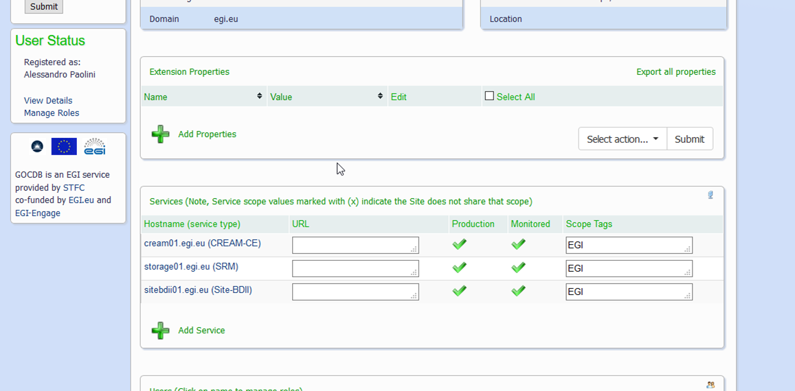
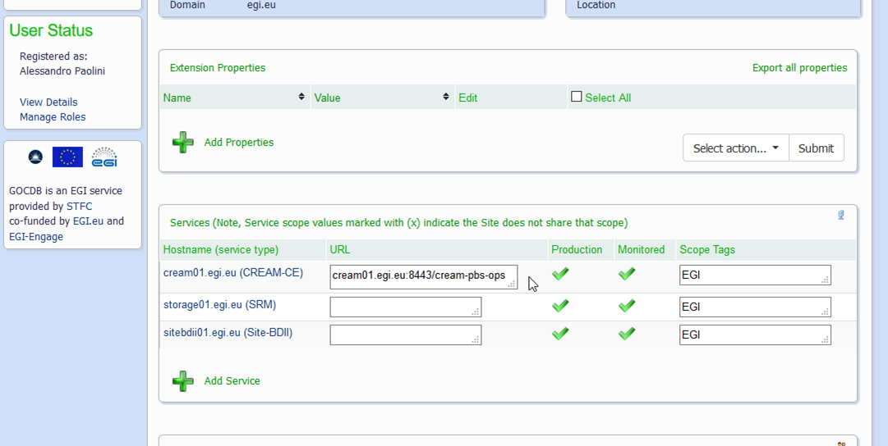

For monitoring purposes, each service endpoints registered into GOC-DB with the
flags _production_ and _monitored_ should include the endpoint URL information
in order to be contacted by the relative nagios probe.

**Important: currently these steps are required only for the sites under
certification. For sites in production, EGI Monitoring is retrieving from the
Top BDII these information**

The information needed for service type are:

- _CREAM-CE_: the queue URL where the ops VO is enabled. This is the value of
  the attribute `GlueCEUniqueID` published in the BDII (e.g.
  `cream.egi.eu:8443/cream-pbs-ops`).
- _SRM_: the value of the attribute `GlueServiceEndpoint` published in the BDII
  (e.g. `httpg://se.egi.eu:8444/srm/managerv2`)
- Cloud:
  - _org.openstack.nova_: The _endpoint URL_ must contain the Keystone v3 URL:
    `https://hostname:port/url/v3`
  - _org.openstack.swift_:The _endpoint URL_ must contain the Keystone v3 URL:
    `https://hostname:port/url/v3`
  - _eu.egi.cloud.accounting_: for the host sending the records to the
    accounting repositority
- Other service types: the value of the attribute `GlueServiceEndpoint`
  published in the BDII

It is also possible registering additional endpoints for each service: by
setting also the "Monitored" flag, ARGO will monitor them.

For having more information about managing the Service endpoints in the
Configuration Database, please consult the relative
[documentation](https://wiki.egi.eu/wiki/GOCDB/Input_System_User_Documentation#Service_Endpoints).

## Get the information

For retrieving the queue URL from the BDII, you can simply use the command
`lcg-infosites` executed from an UI. Be sure to query a production Top BDII: you
can either set the one provided by your Operations Centre or choose one from
[the Configuration Database](https://goc.egi.eu/portal/index.php?Page_Type=Service_Group&id=1205)

For example:

```shell
$ export LCG_GFAL_INFOSYS=egee-bdii.cnaf.infn.it:2170

$ lcg-infosites --vo ops ce | grep nikhef
  5680      15          0            0       0 dissel.nikhef.nl:2119/jobmanager-pbs-infra
  5680      17          1            1       0 gazon.nikhef.nl:8443/cream-pbs-infra
  5680      15          0            0       0 juk.nikhef.nl:8443/cream-pbs-infra
  5680      15          0            0       0 klomp.nikhef.nl:8443/cream-pbs-infra
  5680      16          0            0       0 stremsel.nikhef.nl:8443/cream-pbs-infra
```

For getting the `GlueServiceEndpoint` URL of your SRM service, you can launch a
ldap query to your Site BDII (or also directly to the SRM service):

```shell
$ ldapsearch -x -LLL -H <ldap://sbdii01.ncg.ingrid.pt:2170> \
  -b "mds-vo-name=NCG-INGRID-PT,o=grid" \
  '(&(objectClass=GlueService)(GlueServiceType=SRM))' \
  GlueServiceEndpoint

dn: GlueServiceUniqueID=httpg://srm01.ncg.ingrid.pt:8444/srm/managerv2,Mds-Vo-name=NCG-INGRID-PT,o=grid
GlueServiceEndpoint: httpg://srm01.ncg.ingrid.pt:8444/srm/managerv2
```

In a similar way, by just changing the value of `GlueServiceType`, you can get
the endpoint URLs of other services.

An alternative way for retrieving the `GlueServiceEndpoint` URL is using the
GLUE2 information browser provided by
[VAPOR](https://operations-portal.egi.eu/vapor/resources/GL2ResNGISites): select
your NGI, then your site and hence the Storage service; click on the _endpoint
details_ button for finding the URL associated to the SRM interface.

## Fill in the information

### URLs information are completely missing

#### Editing the services information

##### Site overview

This is the home page regarding your site. You need to fill in the URL
information.

> Click on a service for displaying its page (e.g. the CREAM-CE).



##### Editing a service

> Click on the EDIT button on the top right corner


##### Adding a Service URL

> fill in the _Service URL_ field with the queue URL


##### Reviewing the site

Now the CREAM-CE service endpoint contains the required queue information.

> Proceed in a similar way for the other services.



### Additional endpoints information

In case you need to register an additional endpoint for a service, go on the
service summary page and add the proper information. In the example below it is
shown the case of a computing element.

|                                                                                                                                                                                                                       |                  |
| --------------------------------------------------------------------------------------------------------------------------------------------------------------------------------------------------------------------- | ---------------- |
| this is the service summary page. You need to click on the _Add endpoint_ button for registering additional endpoint URLs.                                                                                            | TBD: add picture |
| Fill in the proper information and don't forget to select the "Monitored" flag for making nagios to detect the new endpoint.                                                                                          | TBD: add picture |
| The summary page of the endpoint just added should look like this one.                                                                                                                                                | TBD: add picture |
| And this is the summary page of the service reporting the information about all its endpoints registered: the first one in the _Grid Information_ section and the additional ones in the _Service Endpoints_ section. | TBD: add picture |

## Examples

### webdav

In order to properly monitor your webdav endpoint:

- you should register a new service endpoint with the webdav service type,
  separated from the SRM one;
- fill in the webdav URL containing also the VO ops folder, for example:
  `https://darkstorm.cnaf.infn.it:8443/webdav/ops` or
  `https://hepgrid11.ph.liv.ac.uk/dpm/ph.liv.ac.uk/home/ops/`
  - it corresponds to the value of GLUE2 attribute `GLUE2EndpointURL`
    (containing the used port and without the VO folder);
- verify that the webdav url (for example:
  `https://darkstorm.cnaf.infn.it:8443/webdav`) is properly accessible.

### GridFTP

In order to properly monitor your gridftp endpoint for ops VO

- register a new service endpoint, associating the storage element host name to
  the service type `globus-GRIDFTP`, with the "production" flag disabled;
- in the “Extension Properties” section of the service endpoint page, fill in
  the following fields:
  - Name: SE_PATH
  - Value: `/dpm/ui.savba.sk/home/ops` (this is an example, set the proper path)
- check if the tests are OK (it might take some hours for detecting the new
  service endpoint) and then switch the production flag to "yes"

### SURL value for SRM

The SURL value needed by the SRM monitoring probes is the following structure:

`srm://<hostname>:<port>/srm/managerv2?SFN=<GlueSAPath or GlueVOInfoPath>`

For example:

`srm://ccsrm.in2p3.fr:8443/srm/managerv2?SFN=/pnfs/in2p3.fr/data/dteam/`

- As explained in previous sections, you can retrieve the port number from the
  `GlueServiceEndpoint` URL information.
- If your SE provides `GlueSAPath` information, use that. To retrieve it:

```shell
$ ldapsearch -x -LLL -H <ldap://sbdii01.ncg.ingrid.pt:2170> \
  -b "mds-vo-name=NCG-INGRID-PT,o=grid" \
  '(&(objectClass=GlueSA)(GlueSAAccessControlBaseRule=VO:ops))' \
  GlueSAPath GlueChunkKey

dn: GlueSALocalID=opsdisk:replica:online,GlueSEUniqueID=srm01.ncg.ingrid.pt,Mds-Vo-name=NCG-INGRID-PT,o=grid
GlueChunkKey: GlueSEUniqueID=srm01.ncg.ingrid.pt
GlueSAPath: /gstore/t2others/ops
```

- if your SE doesn't provide `GlueSAPath` information, use instead the
  `GlueVOInfoPath` one:

```shell
$ ldapsearch -x -LLL -H <ldap://ntugrid5.phys.ntu.edu.tw:2170> \
  -b "Mds-Vo-name=TW-NTU-HEP,o=grid" \
  (&(objectClass=GlueVOInfo)(GlueVOInfoAccessControlBaseRule=VO:ops)) \
  GlueVOInfoLocalID GlueChunkKey

dn: GlueVOInfoLocalID=ops:SRR,GlueSALocalID=SRR:SR:replica:*****,GlueSEUniqueID=ntugrid6.phys.ntu.edu.tw,Mds-Vo-name=TW-NTU-HEP,o=grid
GlueVOInfoPath: /dpm/phys.ntu.edu.tw/home/ops
GlueChunkKey: GlueSALocalID=SRR:SR:replica:*****
GlueChunkKey: GlueSEUniqueID=ntugrid6.phys.ntu.edu.tw
GlueVOInfoLocalID: ops:SRR

dn: GlueVOInfoLocalID=ops:data01,GlueSALocalID=data01:replica:online,GlueSEUniqueID=ntugrid6.phys.ntu.edu.tw,Mds-Vo-name=TW-NTU-HEP,o=grid
GlueVOInfoPath: /dpm/phys.ntu.edu.tw/home/ops
GlueChunkKey: GlueSALocalID=data01:replica:online
GlueChunkKey: GlueSEUniqueID=ntugrid6.phys.ntu.edu.tw
GlueVOInfoLocalID: ops:data01
```

- Pay attention to use the storage path for the ops VO
- On GOCDB, in the “Extension Properties” section of the SRM service endpoint
  page, fill in the following fields:
  - Name: SURL
  - Value: the actual SURL value, for example:
    `srm://srm01.ncg.ingrid.pt:8444/srm/managerv2?SFN=/gstore/t2others/ops`
