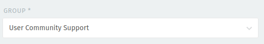

Support for EGI services is available through the
[EGI Helpdesk](https://helpdesk.egi.eu/). To get started
with the EGI Helpdesk check out the
[documentation](../internal/helpdesk/access-and-roles/).

Every ticket in the Helpdesk is assigned to a **Support Unit**.
If you are unsure about what Support Unit to choose, the
ticket will be assigned to the default, first-level *TPM*
Support Unit (*Ticket Processing Manager*). Then TPM will
reassign the ticket to the relevant, second-level Support Unit.
In order to speed up response time we suggest to choose the
*User Community Support* Unit when opening your ticket. For that,
please search for User Community Support in the *Group* box as
show in the image below:

{} Support is also available by contacting
us at `support` `<at>` `egi.eu`.
{}
