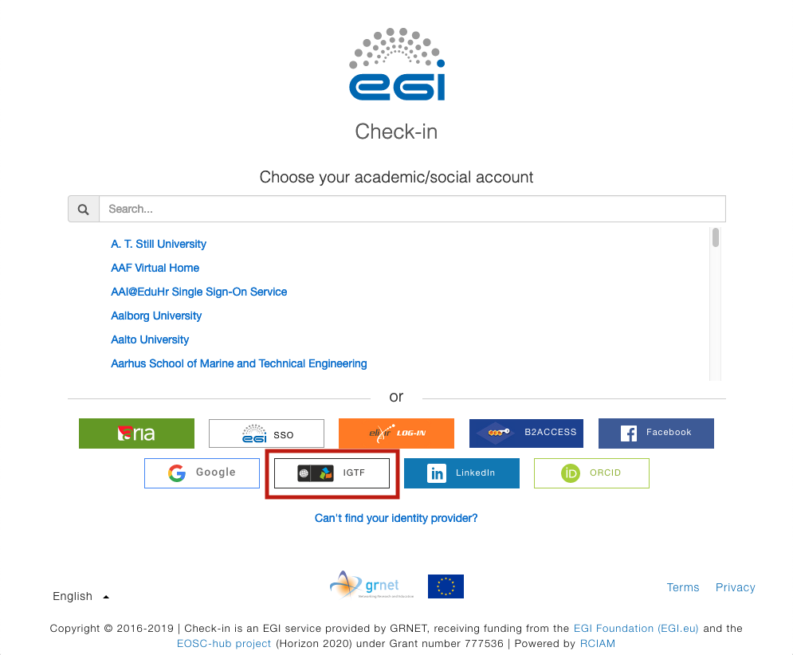

## Connect to Check-in an IdP federated in an hub and spoke federations

<!-- markdownlint-disable line-length -->

### I get an error similar to: "Error - EGI Check-in Service not accessible through your institution" (SURFconext example)

<!-- markdownlint-enable line-length -->

In case of a "hub and spoke" federation the federation coordinator may require
that the IdP administrators explicitly request to connect to a SP and let their
users to authenticate on these SP.

In most of the cases this is not a configuration problem neither for the
Check-in service nor for the Identity provider. The connection needs to be
implemented in the hub and spoke IdP Proxy.

One example of such federation is SURFconext, the national IdP federation for
research and education in the Netherlands operated by SURFnet. If you are using
credentials from a Dutch IdP in eduGAIN, the SURFconext administrator of your
institute needs to request the connection.

## Authentication error with ADFS-based Identity Providers

### Why do I get the error below after successfully authenticating at my Home IdP?

```plaintext
opensaml::FatalProfileException at (https://aai.egi.eu/registry.sso/SAML2/POST)
SAML response reported an IdP error.
Error from identity provider:
Status: urn:oasis:names:tc:SAML:2.0:status:Responder
```

The Responder error status is typically returned from ADFS-based IdP
implementations (notably Microsoft ADFS 2.0 and ADFS 3.0) that cannot properly
handle
[Scoping elements](https://docs.microsoft.com/en-za/azure/active-directory/develop/active-directory-single-sign-on-protocol-reference#scoping>).
Check-in can be configured to omit the scoping element from the authentication
requests sent to such IdPs in order to allow successful logins. Please send an
email to the Check-in Support team using `checkin-support` `<AT>`
`mailman.egi.eu` and include a screenshot of your error.

<!-- markdownlint-disable line-length -->

## I have linked an IGTF X.509 certificate to my Check-in identity but the information is inaccurate or incomplete

<!-- markdownlint-enable line-length -->

### What can I do?

To update your certificate information, follow these steps to log into your
Check-in profile page using your IGTF certificate:

1. Click
   [here](https://aai.egi.eu/proxy/saml2/idp/SingleLogoutService.php?ReturnTo=https%3A%2F%2Faai.egi.eu%2Fregistry%2Fauth%2Flogin)
   to access your profile page

{} This may log you out of any
service you have accessed with Check-in on this browser! {} 2. On
the Check-in identity provider discovery page, select **IGTF**

{} If prompted to log in with a
different identity provider, click **CHOOSE ANOTHER ACCOUNT** and then select
**IGTF**. Alternatively, you can click
[here](https://aai.egi.eu/registry/auth/login?idphint=https%3A%2F%2Fedugain-proxy.igtf.net%2Fsimplesaml%2Fsaml2%2Fidp%2Fmetadata.php)
for your convenience {}


