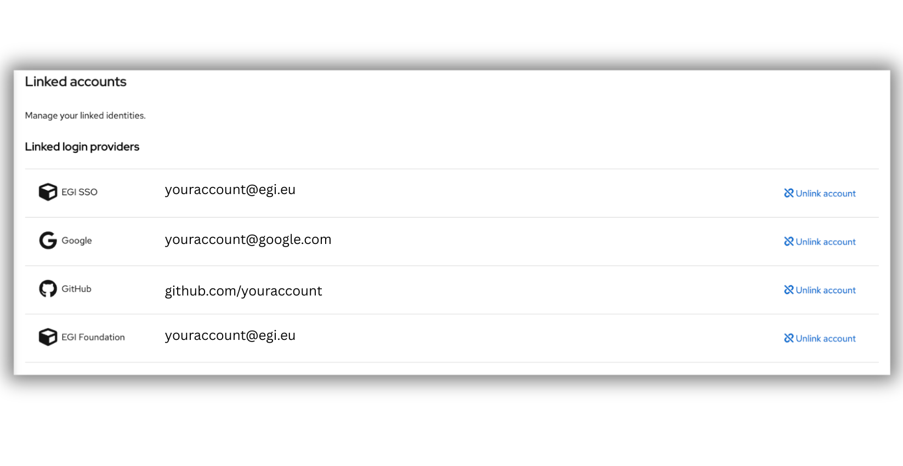

<!--
// jscpd:ignore-start
-->

## What does identity linking mean?

Linking identities allows you to associate multiple login methods — such as your university account, ORCID, a Google account, or a certificate — with a single EGI Check-in account.
This means that no matter which identity you use to log in, you will access the same EGI profile, with the same permissions, group memberships, and project access.

## What Happens When Your Identities Are Linked?
- You can log in with any linked identity and always reach the same services and projects.

- You only need to manage one identity no matter how many login options you have.

- If one identity becomes unavailable (e.g., your university account expires), you can still access your work using another linked identity.

- You have a more consistent and secure experience across platforms.

{} Important: While your EGI profile remains the same, access to specific services may depend on the identity assurance level of the login option used. Some services require identities with higher levels of assurance (e.g., issued by academic institutions). If you log in with an identity that does not meet these requirements, access to those services may be restricted. {}

## What Happens If You Don’t Link Them?

- Each login creates a separate EGI account, treated as a different person.

- You may not have access to the projects, roles, or services you used under your other login.

- Services and collaborators won’t recognize you if you log in a different way.

- If one identity is lost, you might lose access completely or need support to recover it.

## Step by step guide

1. Enter the following URL in a browser: <https://aai.egi.eu/auth/realms/id/account/#/security/linked-accounts>

2. Click **Login** and authenticate using any of the login credentials _already_
   linked to your EGI account

3. You will see the EGI Check-in profile management. Select “Linked Identities” under the Account security section.

   

4. Under the **"Account security"** section of your profile page, expand
   **Linked identities** menu. 

   

5. Search for your desired identity. In case you cannot see it at first glance, you can use the search box. 

6. Click on the “Link account” blue link on the right side of the identity to link it. 
7. You will be taken into the identity login page. Proceed with the login, it will take you back directly to the EGI Check-in site once done. 
8. Once done, your new login will be listed under “Linked accounts”.

   
   {} You will need to sign in using the login credentials from the
   institutional/social identity provider you want to link to your account. {}

9. After successful authentication, the new Identity Provider will be available
   under the Organizational Identities tab and you'll be able to access EGI
   resources with your existing personal EGI ID using the login credentials of
   the identity provider you selected. 

## Linking your certificate to your EGI Account

Certificate linking allows you to add the subject DN of your certificate to your
existing personal EGI ID. For this you need to import your certificate to your
browser.

To link a subject DN to your EGI account:

1. Make sure your certificate is already imported in your browser. 

2. Follow the same steps as above: go to "Account Security" and click on "Linked identities". 

3. You will need to link the **IGTF Certificate Proxy** service. Find it and click "Link Account".

   {} It is very important to escape
   the identity provider selection, cached in the discovery page, before picking
   the new one. {}

4. Then select the certificate you want to link to your account from the popup
   window.

   

5. After successful authentication you will be redirected back to your EGI
   Account. Also, you'll be able to access EGI resources with your existing
   personal EGI ID using **IGTF Certificate Proxy** and your certificate.

<!--
// jscpd:ignore-end
-->
