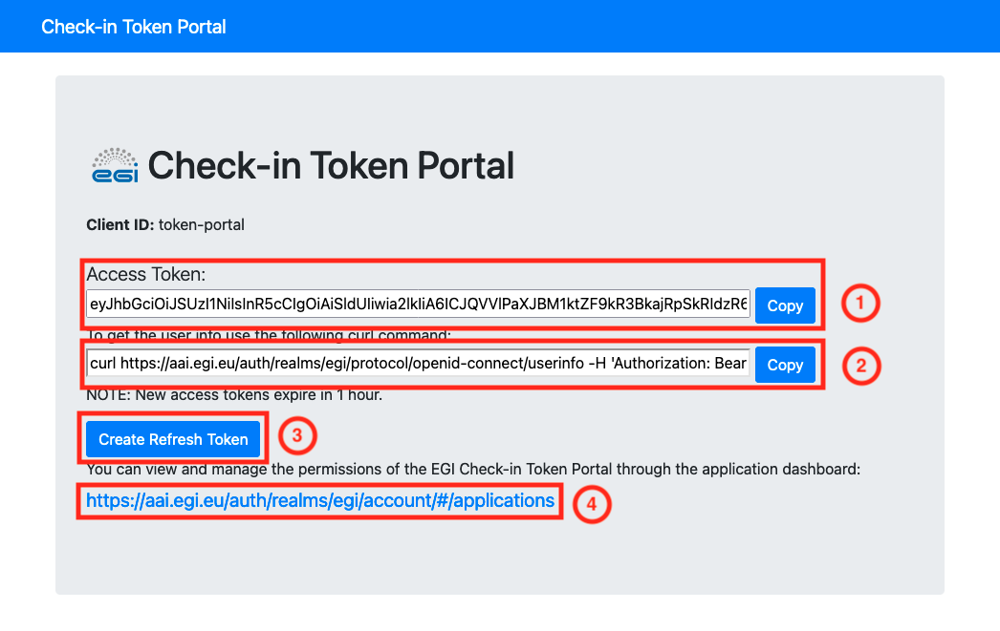
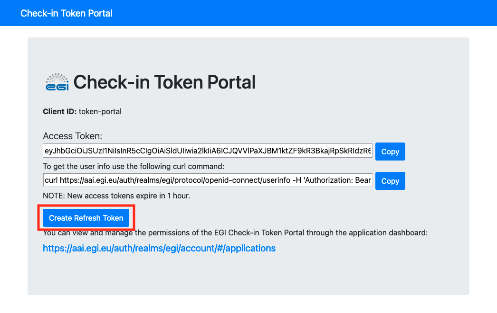

The EGI Check-in Token Portal allows users to create Access and Refresh Tokens.

## Obtain an Access Token

In order to obtain an Access Token from EGI Check-in Token Portal, please follow
the steps below:

1. Go to <https://aai.egi.eu/token> and click on "Authorise" to authenticate
   yourself. 
2. After logging in you will obtain an Access Token as it is shown below:
   
   1. The value of the Access Token
   2. The command to get user's information from userinfo endpoint
   3. Obtain a Refresh Token (more info in
      [Obtain a Refresh Token](#obtain-a-refresh-token) section)
   4. Manage your active Access/Refresh Tokens

## Obtain a Refresh Token

In order to obtain an Refresh Token from EGI Check-in Token Portal, please
follow the steps below:

1. Go to <https://aai.egi.eu/token> and click on "Authorise" to authenticate
   yourself. 
2. After logging in click on "Create Refresh Token":
   
3. Then you will be redirected back to EGI Check-in Token Portal and you will
   have obtained a Refresh Token:
   
   1. The value of the Refresh Token
   2. The command to generate new Access Token using the Refresh Token

## EGI Check-in OpenID Provider Migration

Currently we are migrating EGI Check-in OpenID Provider to a new Authorization
Server, as result the Refresh Tokens, that was issued by the legacy
Authorization Server, will not be accepted by the new one and you won't be able
to generate new Access Tokens. In this case you will need to create a new
Refresh Token using the dedicated instance of EGI Check-in Token Portal, which
is integrated with the new EGI Check-in OpenID Provider. In the following table
you can find the URLs of each instance of EGI Check-in Token Portal:

| EGI Check-in OpenID Provider Instances | EGI Check-in Token Portal Instances |
| -------------------------------------- | ----------------------------------- |
| EGI Check-in OpenID Provider - New     | <https://aai.egi.eu/token-keycloak> |
| EGI Check-in OpenID Provider - Legacy  | <https://aai.egi.eu/token>          |
