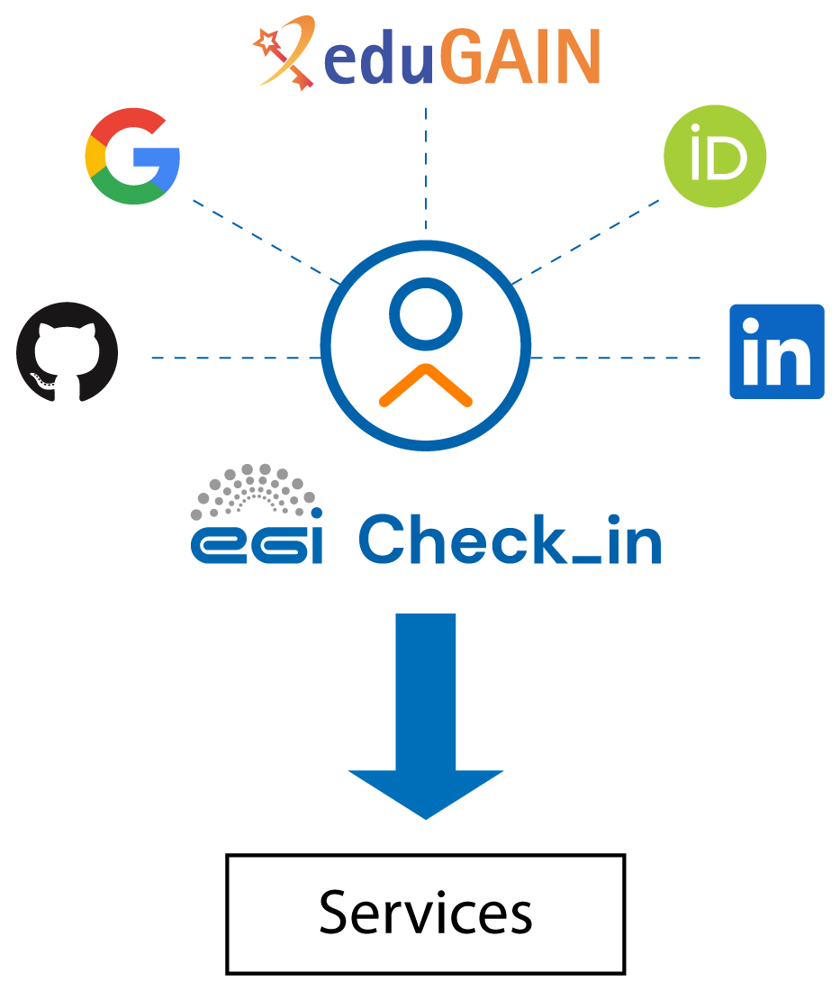

## Why do I have to sign up? 

Before accessing EGI services, you’ll first need an account through EGI Check-in, which is the Identity and Access Management (IAM) system used by EGI. An Identity Manager (or IAM system) is a secure layer that handles who you are, how you log in, and what you’re allowed to access across all participating platforms and services.

 

Instead of creating a new username and password for every service, EGI Check-in allows you to log in using an existing identity you already trust — like your institutional account, ORCID, Google, or even an X.509 certificate. It does this by acting as a central gateway that connects your trusted login with the services and resources you need across the European research ecosystem.

This approach offers major benefits:
- You don’t need to remember another password.
- You can access multiple services with a single, consistent profile.
- Your permissions and roles are automatically applied based on your identity.
- If you later switch institutions or accounts, you can still retain your access (especially if you link identities, which will be discussed later on).

## How do I sign up?

Signing up is simple. You don’t create a new account from scratch — instead, you sign in once using an identity provider (IdP) you already have, and EGI Check-in creates a secure profile for you.

1. Go to https://aai.egi.eu/auth/realms/id/account/#/
2. Choose your identity provider: You’ll see a list of login options — such as “University of X,” “ORCID,” “Google,” and many others. You can use the search bar to find your institution or provider.

   
3. Enter your login credentials to authenticate yourself with your Home
   Organisation

4. After successful authentication, you may be prompted by your Home
   Organisation to consent to the release of personal information to the **EGI
   AAI Service Provider Proxy**.

5. After successful authentication, you will be redirected to the EGI account
   registration form. On the introductory page, click **Sign up** to start the
   registration process.

6.    {} EGI requires some basic information from you, depending on the attributes
   released by your Identity Provider, you may need to provide the values of the
   missing attributes. {}

7. On the registration form, click **Review Terms and Conditions**
   ([Acceptable Use Policy and Conditions of Use - EGI AUP](https://aai.egi.eu/auth/realms/id/theme-info/terms-of-use))

8. If you agree to the Terms of Use, select the **I Agree** option.

9. Finally, click **Submit** to submit your request.

   {} You wont be able to
   submit your request until you agree to the terms. {}

10. You will receive an email to confirm your new identity linked to EGI Check-in. Confirm your identity to continue: 

   
  
  
   {}- You do not need a new password for EGI Check-in — it always uses your existing account's login system. 
- If you don’t see your institution in the list, check whether they are part of the eduGAIN federation, or consider using ORCID or another supported identity.
- If you plan to use certificates, make sure they are installed in your browser before logging in. {}

## Viewing user profile information

The profile includes all the information related to the user. This information
can be categorised as follows:

### Basic profile

Includes the basic information about your profile:

- Name
- Identifiers
- Email addresses

### VO/Group membership and roles

Includes information about the Virtual Organisations (VOs) and groups the user is
member of and the roles assigned to the user within those VOs.
Check the [guide about VOs](../vos) for more details.

### Linked identities

Information about linked identities to your account. Check the
[guide for linking accounts](../linking) for more information.

## Next steps

Once your Check-in account is ready you can check
[how to link it with different identities](../linking) or
[how to join an existing Virtual Organisation (VO)](../vos/#how-to-join-a-virtual-organisation).
