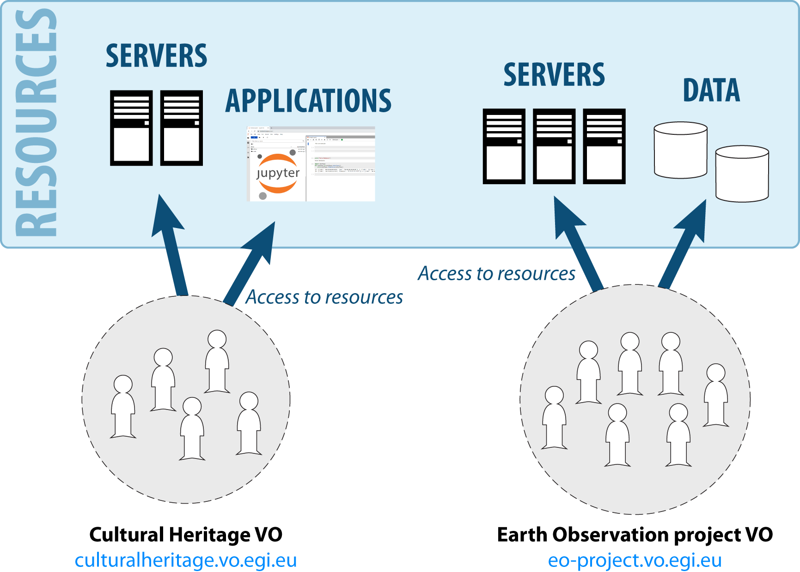
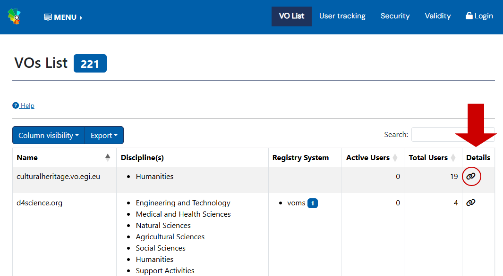
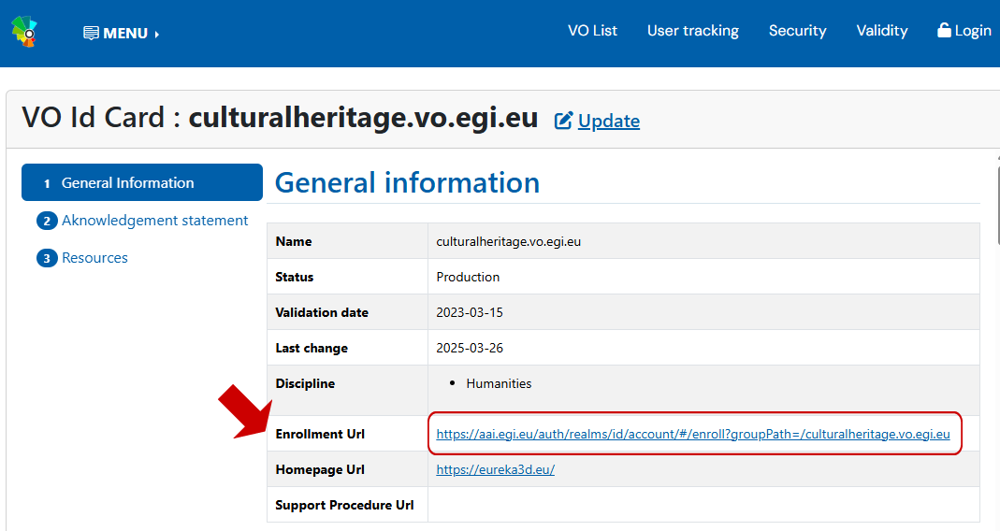

A [Virtual Organisation](https://ims.egi.eu/display/EGIG/Virtual+organisation)
(VO) represents a research community and, in practice, it is just **a group of
users**. VOs are created to organise a community of researchers, who can share
resources across the EGI Federation and other services to achieve a common goal,
as part of a scientific collaboration.

## See the list of Virtual Organisations

Existing VOs can be found in the
[EGI Operations Portal](https://operations-portal.egi.eu/vo/a/list).

Click on the icon under the “Details” column to access more detailed information
of the VO.

{.img-screenshot}

## How to join a Virtual Organisation

There are different ways to join a VO:

- Contact the administrators of the VO (the VO Managers). They can send you an
  invitation or a link to apply for membership in a VO.
- Some community services provide a link on their Websites to grant access to
  their respective VOs.
- Use the enrolment URL that can be found in the detailed information of the
  specific VO, in the
  [EGI Operations Portal](https://operations-portal.egi.eu/vo/a/list).

{.img-screenshot}

Often, your request to apply for VO membership will be evaluated by a VO Manager
before you are accepted in the VO.

## How to create your own Virtual Organisation

To register a new VO, access the
[VO registration page](https://operations-portal.egi.eu/vo/registration) of the
Operations Portal. You will need to log in via Check-in and fill in the **VO ID
card**, which is the basic information for the VO.

The VO registration process is detailed in the procedure
[PROC14 VO Registration](https://confluence.egi.eu/display/EGIPP/PROC14+VO+Registration).

The person registering a VO is considered the administrator of the VO, also
known as **VO Manager**. Additional VO Managers do not need to be included at
the time of the VO creation, they
[can be added later](keycloak/admins#adding-administrators-to-a-group).

## Manage a Virtual Organisation

A VO is managed by its VO Managers. VOs can have more than one administrator,
and they are responsible for the correct operation of the VO. The functions of
the VO Managers include:

- Evaluate membership requests and approve or reject them. This is an important
  point, since membership in a VO may grant access to data or resources, so
  normally a VO Manager should not accept members arbitrarily.
- Attend security recommendations, provide information requested by the EGI
  security teams and maintain the resources and users of the VO secure.
- Provide information about the VO activities for EGI and for VO members (to
  both people and sites).

VOs can be structured in **groups**, to organise the different permissions that
users have inside a community. For example, inside a VO there can be a group for
users that will manage cloud infrastructure, another group for users that access
a specific application, other group for users that will attend a workshop and
need access to Notebooks, etc.

Check-in offers two tools to organise a community:

- [Keycloak](keycloak).
- [Perun](perun).

Follow the links for detailed information on how to manage VO groups.
