This page contains information about using Check-in for managing your Virtual
Organisation (VO). For joining a VO please look at
[Joining Virtual Organisation](../joining-virtual-organisation).

## Background

In simple terms a Virtual Organisation (VO) is just a group of users. In EGI VOs
are created to group researchers who aim to share resources across the EGI
Federation to achieve a common goal as part of a scientific collaboration. For a
more formal definition of VO please look at the
[EGI Glossary](https://ims.egi.eu/display/EGIG/Virtual+organisation).

You can browse existing VOs in the
[EGI Operations Portal](https://operations-portal.egi.eu/vo/a/list). For each VO
you can click on the _Details_ link to get more information. You can join an
existing VO either using the _enrollment URL_ or emailing VO managers.

If you are interested in creating your own VO, please see instructions in the
section [below](#vo-management).

## VO management

VOs in Check-in are represented as groups that go beyond simple collections of users, providing structured membership management and advanced enrollment workflows tailored for complex access needs. VOs can also be organised in a hierarchical structure for creating groups or subgroups within a VO.

### Registering your VO

Any person who can authenticate to the
[Operations Portal](https://operations-portal.egi.eu/) using their EGI Check-in
account can register a new VO.

The person initiating the registration is called the **VO manager**. After the VO is set up and operational, the VO manager is the person who is primarily responsible for the operation of the VO and for providing sufficient information about VO activities for EGI and for VO members (to both people and sites).

A step-by-step guide for the VO registration process is provided in the procedure 
[PROC14 VO Registration](https://confluence.egi.eu/display/EGIPP/PROC14+VO+Registration).

## VO Group Management

### Group Admins 
Groups are managed by Group Admins, who have several key responsibilities:

- [**Managing roles**](#view-group-details-and-manage-group-roles) for specific permissions within the Group.
- [**Managing member roles**](#manage-group-member-roles) to users based on their needs or requests.
- [**Extending memberships**](#extend-group-member-membership) for continued access.
- [**Suspending or activating memberships**](#suspend-or-activate-group-member) to control user access as required.
- [**Managing enrollment configurations**](#manage-enrollment-configurations) to define how users can join the Group.
- [**Creating**](#create-sub-group)/[**Deleting**](#delete-sub-group) Sub Groups within the Group hierarchy.

> **Note:** *Group Admin* is not a role within the Group; it is a separate administrative designation. Group Admins have the ability to manage all aspects of the Group, as well as any sub-groups in the hierarchy, including roles, memberships, and configurations.

### Group Roles

Members of Groups are assigned roles upon joining. Users can join a Group in one of two ways:

- **By accepting an invitation**: Users receive the roles specified by the inviting administrator.
- **By submitting an enrollment request**: Users can select their preferred roles from the options available, as defined by the Group’s enrollment configuration.

Each assigned role includes an entitlement attribute, which grants authorization to specific resources. This flexible approach to role assignment allows Group administrators to control access while offering users the ability to select roles when available.

> **Note:** *Entitlement* values can be found on the [**Group Details Tab**](#view-group-details-and-manage-group-roles)

### Membership Status

Members of a Group can have different statuses that affect their access and entitlements:

- **Active**: The membership is fully active, and the user receives all entitlements associated with the roles they hold in the Group.

- **Suspended**: Administrators can suspend a user’s membership for security reasons, such as suspicious activity. While suspended, the user retains membership but loses all entitlements tied to their roles. Administrators can later revoke the suspension and [reactivate the membership](#suspend-or-activate-group-member).

- **Pending**: A user’s membership can have a future start date based on the enrollment configuration used during joining. This scheduled membership will activate automatically on the specified start date. Administrators also have the option to [activate the membership manually](#suspend-or-activate-group-member) if needed.

> **Note:** **Suspension/Activation** of a member will also affect all memberships in Sub Groups of target group

Each status provides Group administrators with flexible control over user access and helps ensure security within the Group.

### Membership Expiration 

Memberships in Groups come with a defined duration, which may be set to indefinite if allowed by the Group’s configuration settings. However, the duration of any membership is also affected by the Group's position within the Group hierarchy. Membership in a higher-level Group imposes a duration limit on all memberships in its subordinate Groups. As a result, the expiration date for any membership in a lower-level Group cannot exceed the duration limit set by the higher-level Group.

#### Understanding Expiration Dates in Group Memberships

When viewing members within a Group, you will encounter two types of expiration dates:

- **Direct Membership Expiration**: This date indicates the expiration of membership specifically for the Group you are currently viewing. It applies only to that Group and not to any other Group within the hierarchy.
  
- **Effective Membership Expiration**: If relevant, this reflects the actual expiration date imposed by a higher-level Group. If a higher-level Group has an earlier expiration date than the Direct Membership Expiration, the Effective Membership Expiration will take precedence, overriding the direct expiration date for the current Group.

For example, if a user’s Direct Membership Expiration in a lower-level Group is set to indefinite (or a date beyond 2024), but the Effective Membership Expiration from a higher-level Group is November 12, 2024, the user’s membership will expire on November 12, 2024, in line with the higher Group’s restrictions.

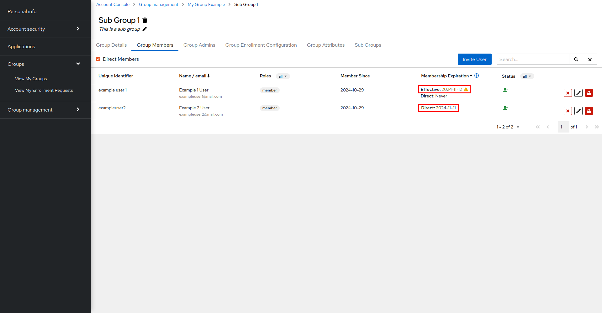

This hierarchical approach to managing memberships allows for simplified administration and ensures consistent access policies are maintained across different Group levels.

#### Pending Memberships with Future Start Dates

Some enrollment flows or invitations may specify a starting date in the future. In these cases, users who accept the invitation or submit an enrollment request will have a **pending membership** status until the specified start date. Once the start date arrives, the membership will automatically activate, transitioning from pending to active status.

### View Group Details and Manage Group Roles
The **Group Details Tab** provides essential information and management options, including:

- **Available Group Roles**: Lists roles within the Group and displays the entitlements granted to users with these roles.
- **Group Path**: Shows the hierarchical path of the Group within the overall structure.
- **Enrollment Discovery Page URL**: Provides a link to the [Enrollment Discovery Page](#enrollment-discovery-page), allowing users to access relevant enrollment options.

1. Log in to the [Keycloak Account Console](https://aai.egi.eu/auth/realms/id/account/#/) using any of your login credentials linked to your account.
2. Go to the [Group Management Page](https://aai.egi.eu/auth/realms/id/account/#/groups/admingroups) and select the target group to access its Group Configuration Page.
   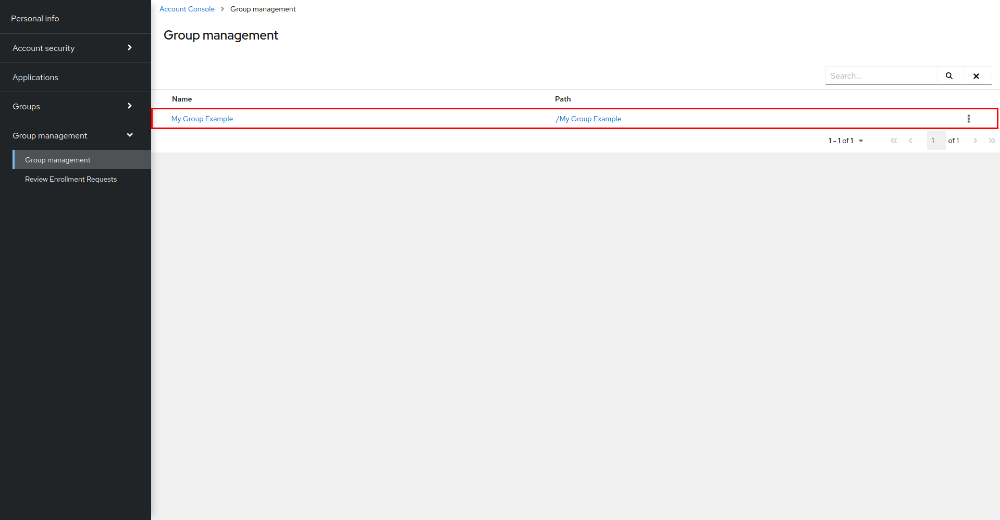
3. View Group Details 
    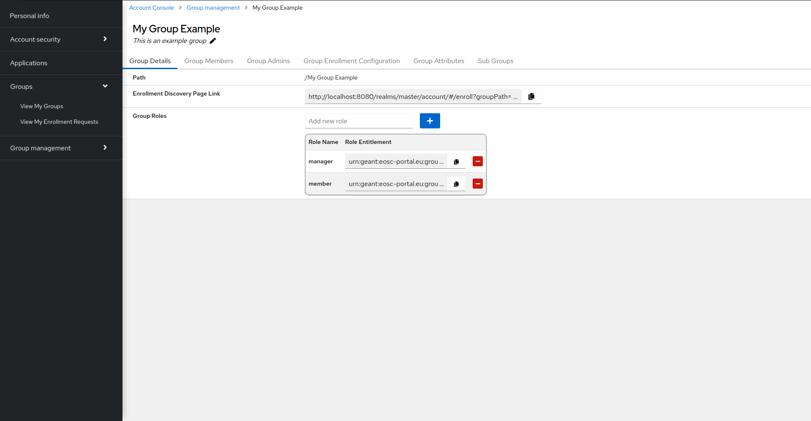
#### Create Group Role
4. To add a new role, enter the role name in the text input field and click the plus button to create it.  
    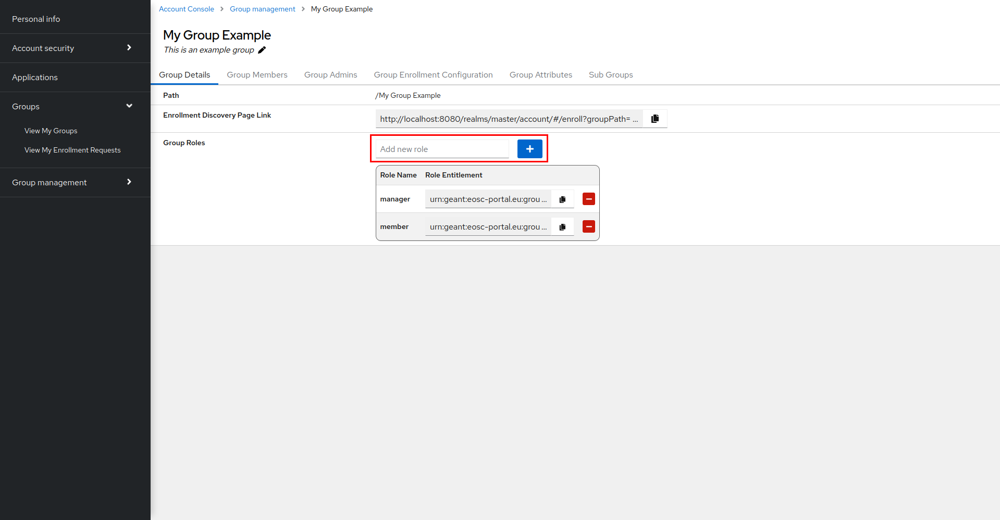
#### Delete Group Role

> **Note:**  A role cannot be deleted from a group if it is assigned to any members.

4. Locate the role you want to remove and use the minus button next to it to delete it.
    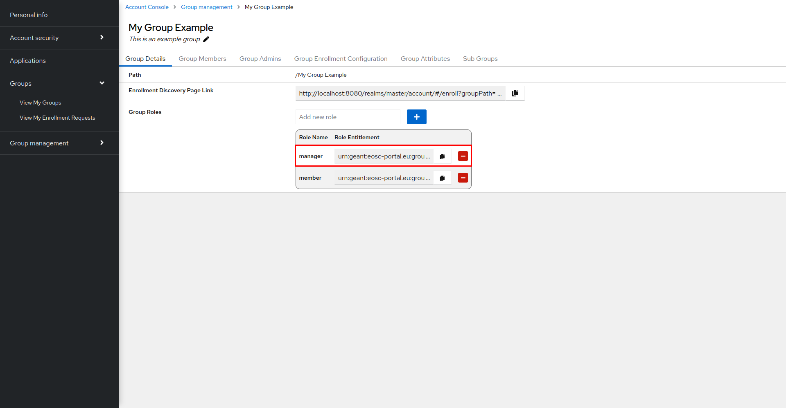

### Create Sub Group
There are two ways to create a subgroup within the platform:
#### A) Through the [Group Management Page](https://aai.egi.eu/auth/realms/id/account/#/groups/admingroups)

1. Log in to the [Keycloak Account Console](https://aai.egi.eu/auth/realms/id/account/#/) using any of your login credentials linked to your account.
2. Go to the [Group Management Page](https://aai.egi.eu/auth/realms/id/account/#/groups/admingroups) to locate your target group.
   
3. Click on the more options menu next to your group, then select **"Create Subgroup"** from the available options.
   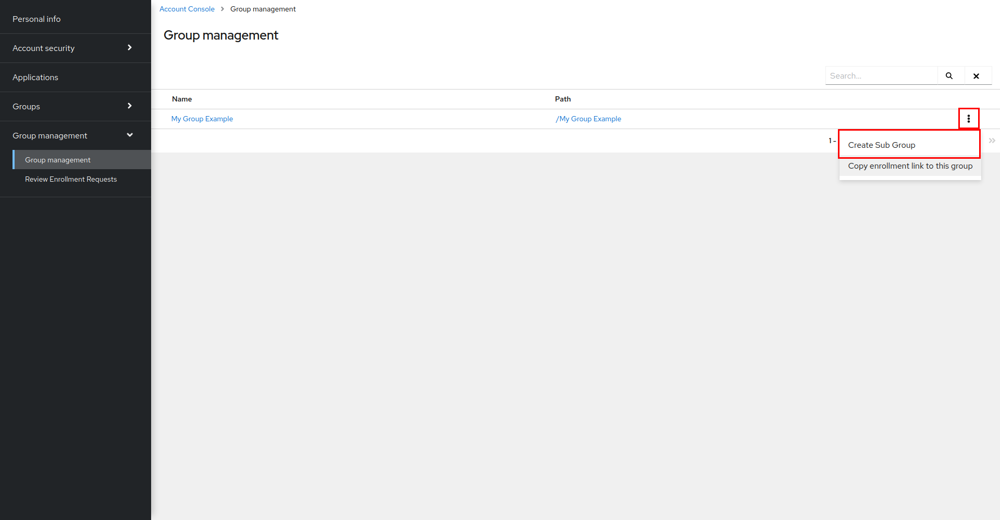

#### B) Using the Sub Groups Tab in the Group Configuration Page
1. Log in to the [Keycloak Account Console](https://aai.egi.eu/auth/realms/id/account/#/) using any of your login credentials linked to your account.
2. Go to the [Group Management Page](https://aai.egi.eu/auth/realms/id/account/#/groups/admingroups) and select the target group to access its Group Configuration Page.
   
3. Navigate to the **Sub Groups** tab to view existing subgroups within this Group.
   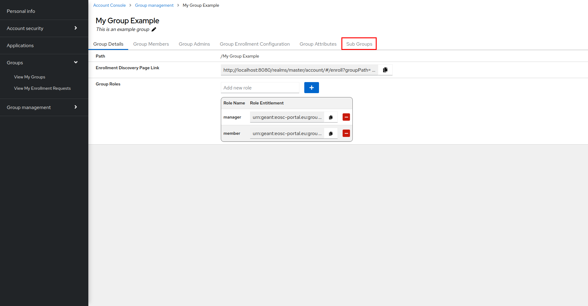
4. To create a new subgroup, click the **plus button (+)** at the top of the Sub Groups tab. Alternatively, you can click the **more options menu** next to an existing subgroup and select the option to create a subgroup within that subgroup.
   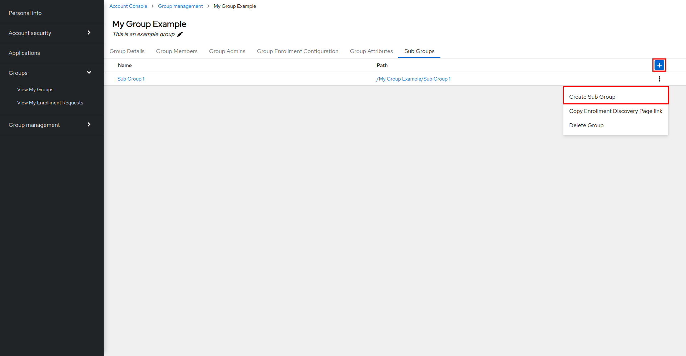

### Delete Sub Group 

> **Note:** Top-level Groups and Sub-Groups that contain additional Sub-Groups cannot be deleted.

#### A) Through the Group Configuration Page 
1. Log in to the [Keycloak Account Console](https://aai.egi.eu/auth/realms/id/account/#/) using any of your login credentials linked to your account.
2. Go to the [Group Management Page](https://aai.egi.eu/auth/realms/id/account/#/groups/admingroups) and select the target group to access its Group Configuration Page.
   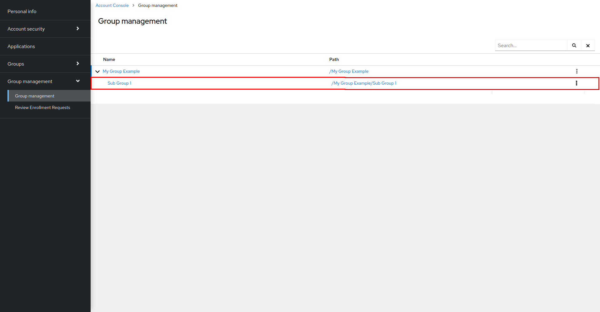
3. Click the trash icon to delete group 
    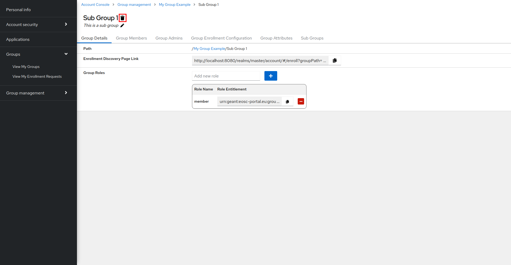

#### B) Through the Higher Level Group
1. Log in to the [Keycloak Account Console](https://aai.egi.eu/auth/realms/id/account/#/) using any of your login credentials linked to your account.
2. Go to the [Group Management Page](https://aai.egi.eu/auth/realms/id/account/#/groups/admingroups) and select the target group to access its Group Configuration Page.
   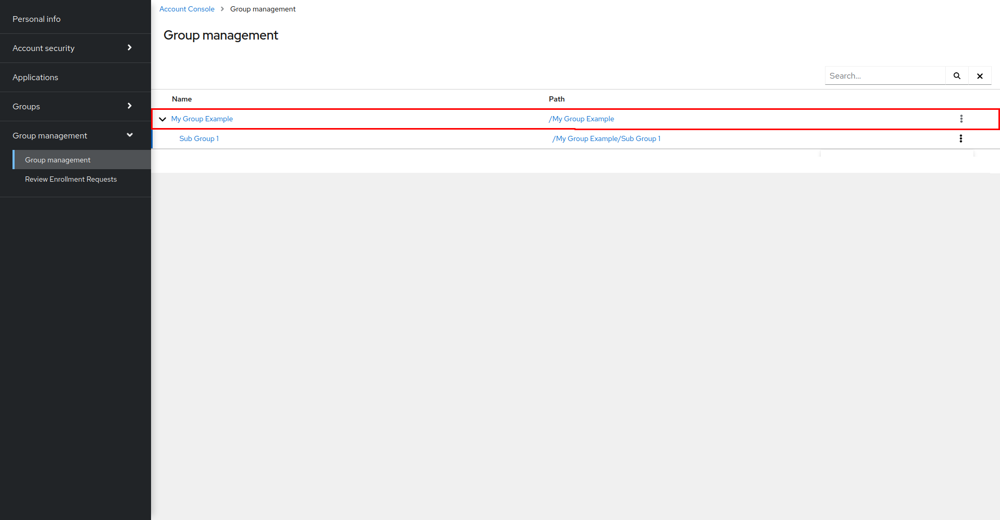
3. Navigate to the **Sub Groups** tab to view existing subgroups within this Group.
   
4. To delete a subgroup, click the **more options menu** next to the subgroup you wish to delete and select the option to delete that.
   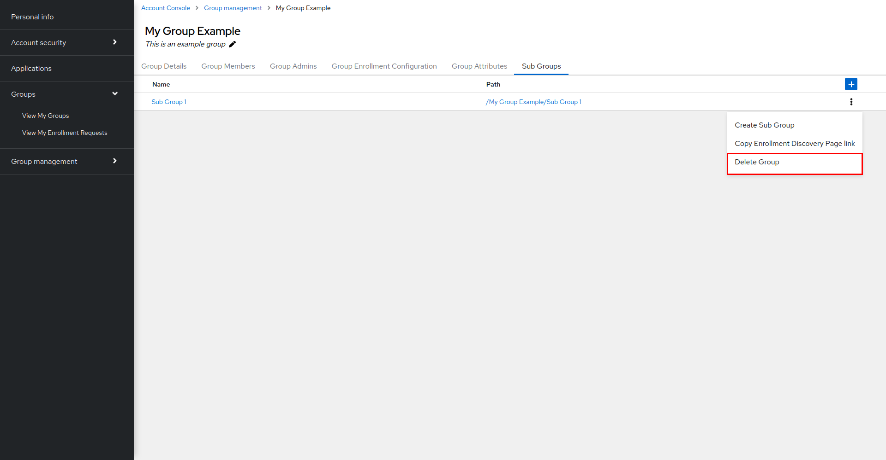

## Membership Managment

### View Group Members

1. Login to [Keycloak Account Console](https://aai.egi.eu/auth/realms/id/account/#/) using any of the login credentials already linked to your account.
2. Locate your group in the [Group Management Page](https://aai.egi.eu/auth/realms/id/account/#/groups/admingroups) and access the Group Configuration Page by clicking it.

3. To view the existing members, select the Group Members tab. 
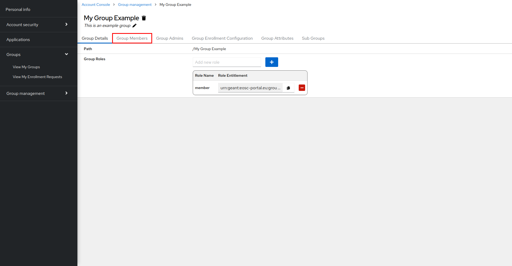
4. Group Members tab view
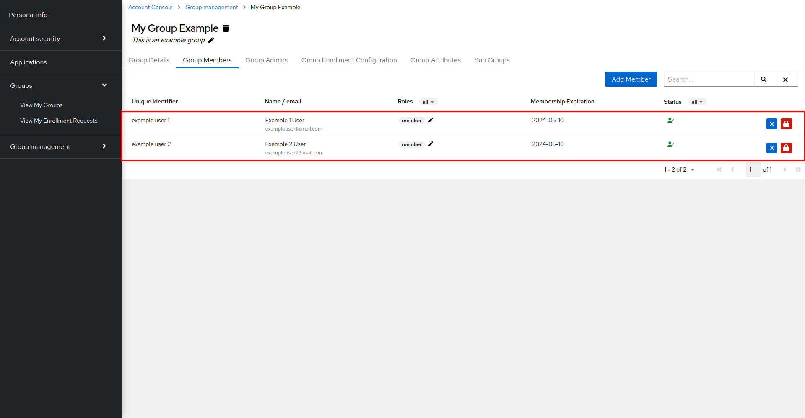

### Add Group Members

#### By Invitation / Direct Add

Users can be added to a group either by invitation or direct addition:

- By Invitation: Admins can send an email invitation to users. Upon receiving the invitation, users can log in to the Keycloak Account Console with their Check-in account to accept or reject the invitation.
- Direct Add: Admins can directly add new members by selecting users who are already registered and belong to a group where they have admin rights.

Sending an Invitation to a User or directly adding them the the group can be achieved by: 

1. Login to [Keycloak Account Console](https://aai.egi.eu/auth/realms/id/account/#/) using any of the login credentials already linked to your account.
2. Locate your group in the [Group Management Page](https://aai.egi.eu/auth/realms/id/account/#/groups/admingroups) and access the Group Configuration Page by clicking it.

3. Select the Group Members tab.

4. Click the Add Member button that opens the pop-up window.
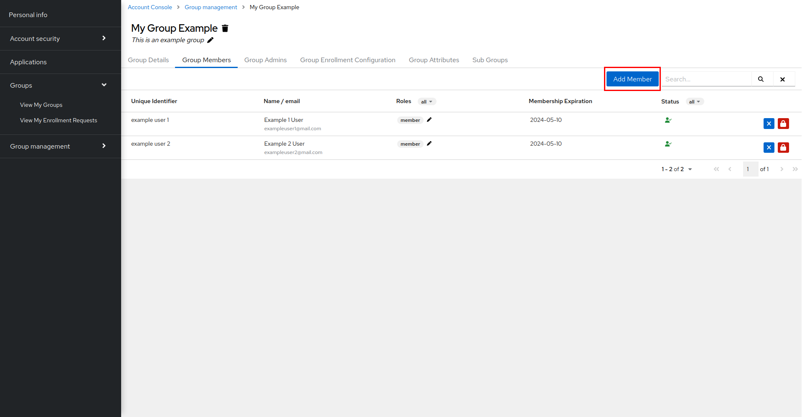
5. Select an Enrollment Configuration
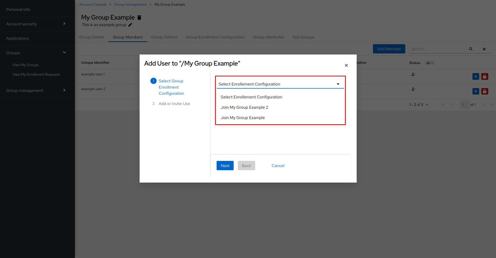
6. Select the role(s) that you want the user have in the Group and click Next
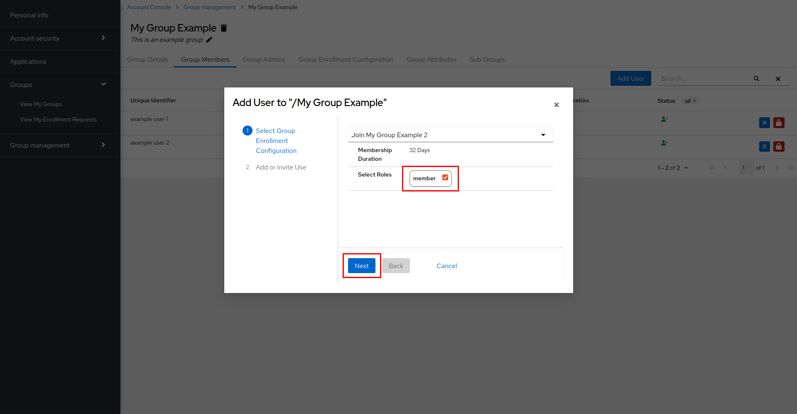
7. Select the user from the drop down selection input or enter an email address to send an Send Invitation. 
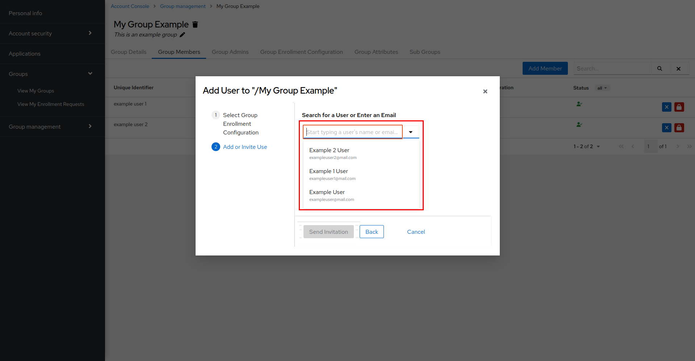
8. Select whether you want to send an invitation or to add User directly (if option is available) and Confirm.
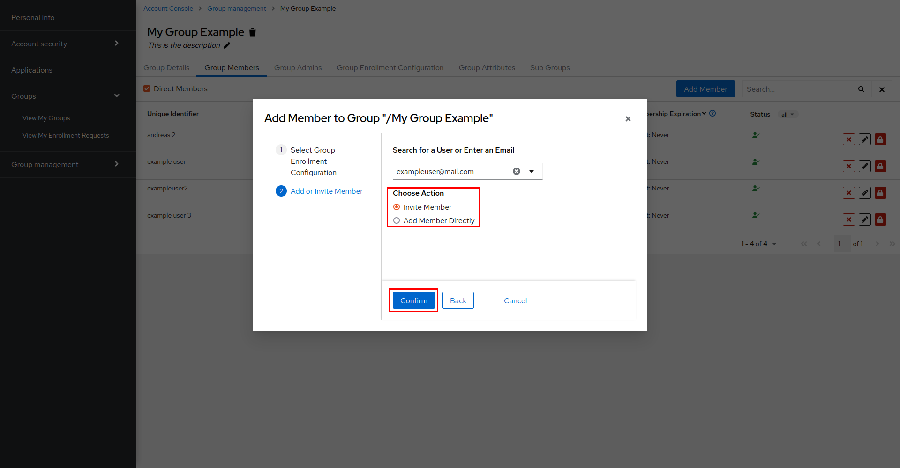

> **_NOTE:_**  Once a user accepts or reject an invitation email notification will be sent to admins of the group

#### By Enrollment Request

Users can be added to a group by creating an Enrollment Request. Enrollment Requests can be created through the [Enrollment Discovery Page](#enrollment-discovery-page) or a Direct Enrollment Link. The Enrollment Discovery has available all the visible and active enrollment flows and the Direct Enrollment Link points to a single Enrollment Flow that must be active. 

Α) Sharing the Enrollment Discovery Page Link following these steps:

1. Login to [Keycloak Account Console](https://aai.egi.eu/auth/realms/id/account/#/) using any of the login credentials already linked to your account.
2. Locate your group in the [Group Management Page](https://aai.egi.eu/auth/realms/id/account/#/groups/admingroups).

3. Select the more options and from the available options select the “Copy enrollment link to this group”admin-group-subgroups-main.png.
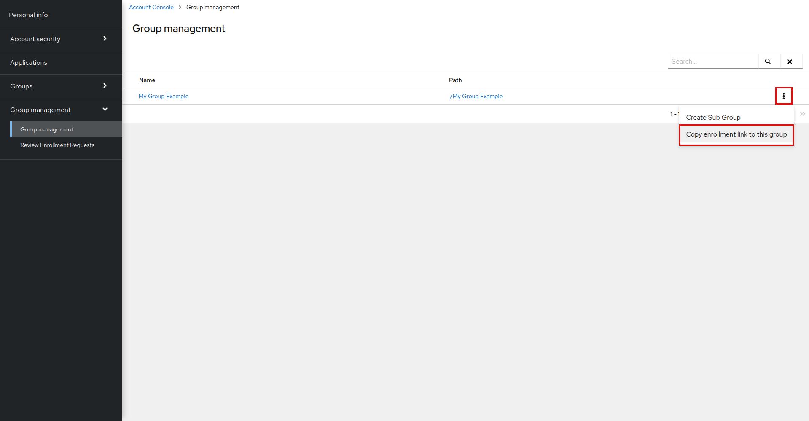
4. Share the copied Enrollment URL with the User. 

> **_NOTE:_** Once a user submits an enrollment request admins of the group will receive an email notification.

B) Sharing an Direct Enrollment Link to a specific Enrollment

1. Login to [Keycloak Account Console](https://aai.egi.eu/auth/realms/id/account/#/) using any of the login credentials already linked to your account.
2. Locate your group in the [Group Management Page](https://aai.egi.eu/auth/realms/id/account/#/groups/admingroups) and access the Group Configuration Page by clicking it.

3. Select the Group Enrollment Tab 
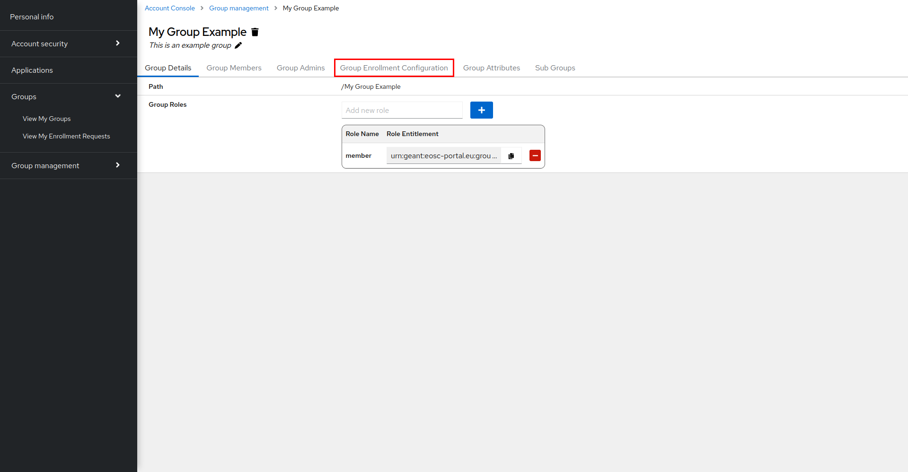
4. Locate the desired Enrollment making sure it is active
5. Select the more options and from the available options select the “Copy enrollment link to this group”.
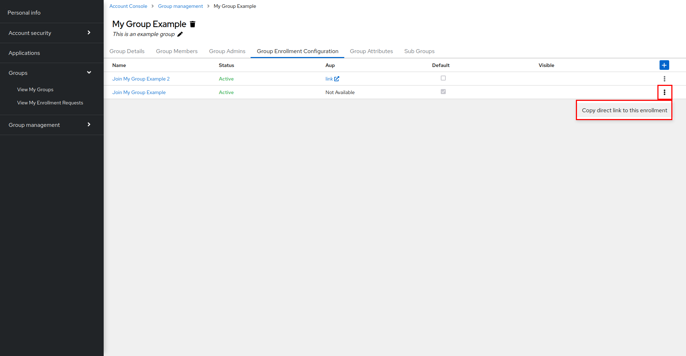
6. Share the copied Enrollment URL with the User. 

> **_NOTE:_** Once a user submits an enrollment request admins of the group will receive an email notification.

### Remove Member from Group

> **_NOTE:_** Removing a member from a group will also remove them from all Sub Groups.

1. Login to [Keycloak Account Console](https://aai.egi.eu/auth/realms/id/account/#/) using any of the login credentials already linked to your account.
2. Locate your group in the [Group Management Page](https://aai.egi.eu/auth/realms/id/account/#/groups/admingroups) and access the Group Configuration Page by clicking it.

3. Select the Group Members tab.

4. Locate the User you want to remove from the group
5. Click the X button and then the Yes button at the confirmation pop-up window
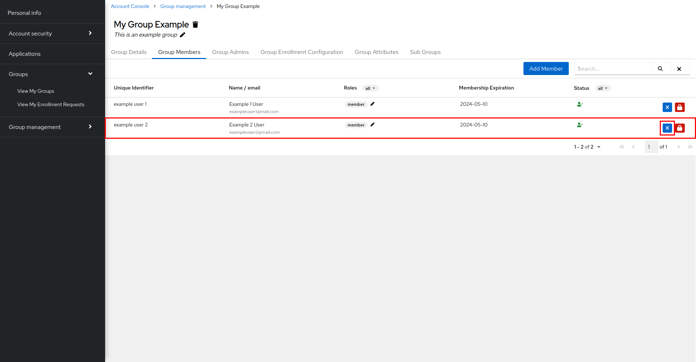

> **_NOTE:_**  Once a group member is removed admins of the group and the removed user will receive an email notification

### Manage Group Member Roles

1. Login to [Keycloak Account Console](https://aai.egi.eu/auth/realms/id/account/#/) using any of the login credentials already linked to your account.
2. Locate your group in the [Group Management Page](https://aai.egi.eu/auth/realms/id/account/#/groups/admingroups) and access the Group Configuration Page by clicking it.

3. Select the Group Members tab.

4. Locate the User you want to alter their roles.
5. Click the edit button.
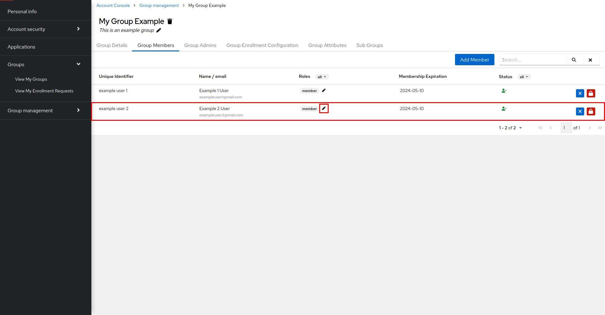
6. Alter their roles by selecting the desired ones from the available options.
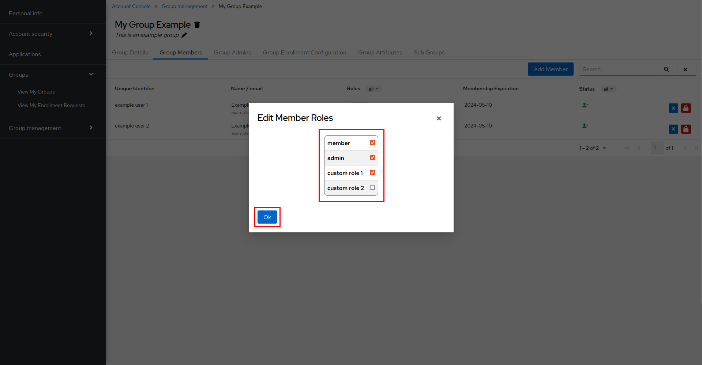
7. To save edited member roles click the Save button.

### Extend Group Member Membership
1. Login to [Keycloak Account Console](https://aai.egi.eu/auth/realms/id/account/#/) using any of the login credentials already linked to your account.
2. Locate your group in the [Group Management Page](https://aai.egi.eu/auth/realms/id/account/#/groups/admingroups) and access the Group Configuration Page by clicking it.

3. Select the Group Members tab.

4. Locate the User you want to alter their roles.
5. Click the edit button.

6. Alter the expiration date using the date picker.
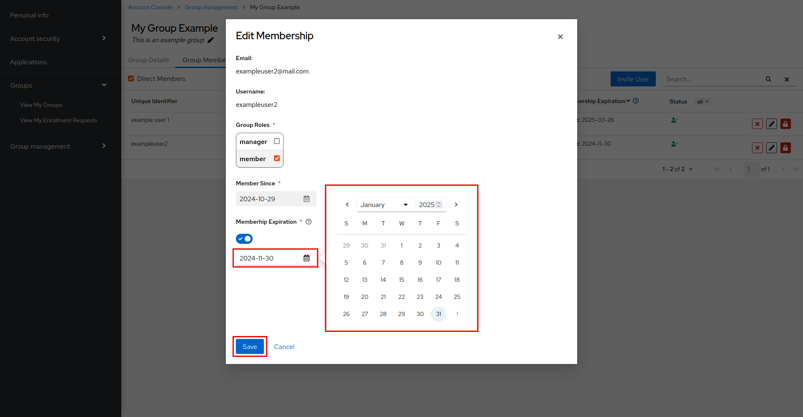
7. To save edited membership details click the Save button.

### Suspend or Activate Group Member
	
User memberships can be suspended or activated by a group admin by following these steps: 

1. Login to [Keycloak Account Console](https://aai.egi.eu/auth/realms/id/account/#/) using any of the login credentials already linked to your account.
2. Locate your group in the [Group Management Page](https://aai.egi.eu/auth/realms/id/account/#/groups/admingroups) and access the Group Configuration Page by clicking it.

3. Select the Group Members tab.

4. Locate the User you want to suspend or activate their membership.
5. Click the suspend/activate button to open the confirmation pop-up window.

6. Optionally provide a justification for your action that will be included in the notification sent to the User and the group Admins.
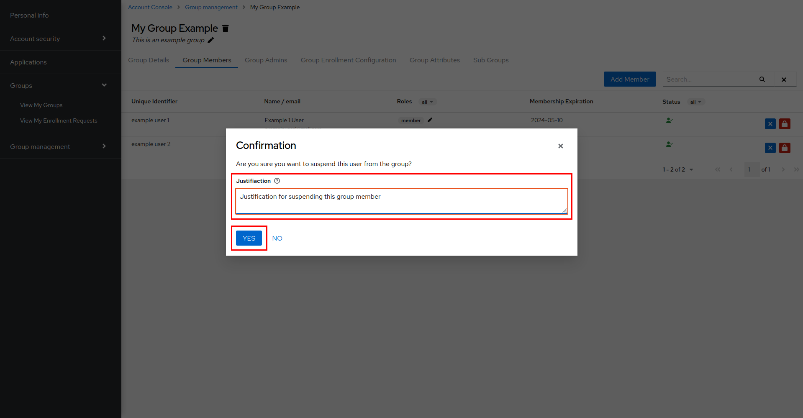
7. Click the YES button to submit your action

> **_NOTE:_**  Once a group member is activated/suspended, admins of the group and the user will receive an email notification.

## Admin Management

### View Group Admins

1. Login to [Keycloak Account Console](https://aai.egi.eu/auth/realms/id/account/#/) using any of the login credentials already linked to your account.
2. Locate your group in the [Group Management Page](https://aai.egi.eu/auth/realms/id/account/#/groups/admingroups) and access the Group Configuration Page by clicking it.

3. Select the Group Admins Tab.
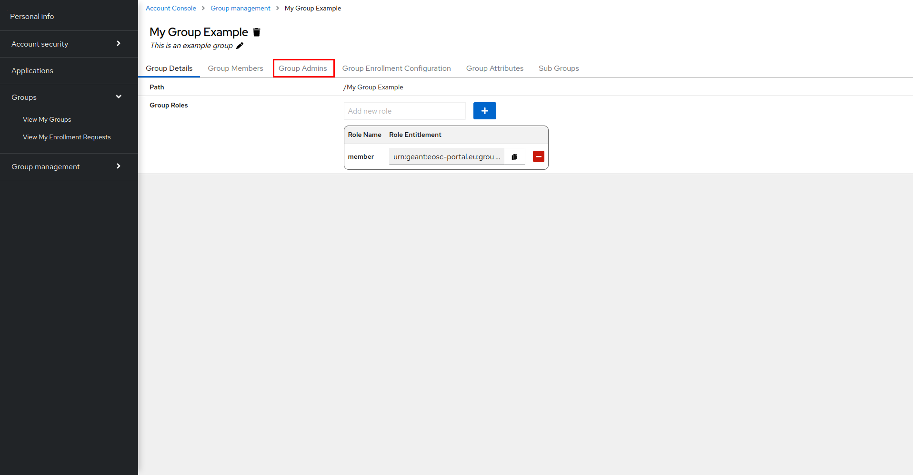
4. Group Admin details are available in list form.
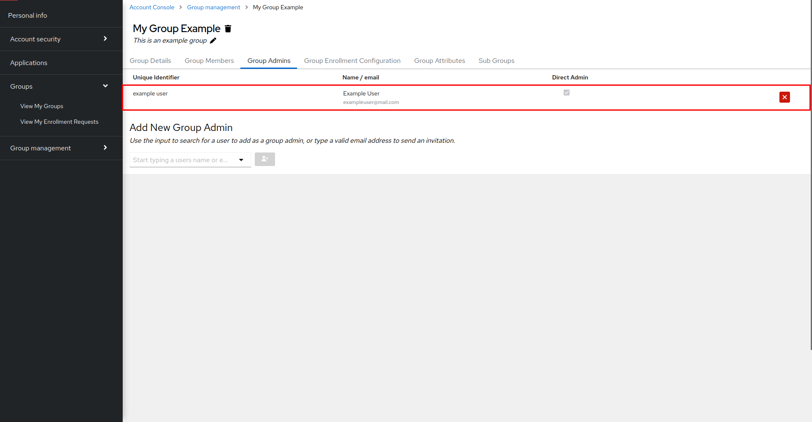

### Add Group Admin

1. Login to [Keycloak Account Console](https://aai.egi.eu/auth/realms/id/account/#/) using any of the login credentials already linked to your account.
2. Locate your group in the [Group Management Page](https://aai.egi.eu/auth/realms/id/account/#/groups/admingroups) and access the Group Configuration Page by clicking it.

3. Select the Group Admins Tab.

4. Use the input located in the Add New Group Admin section to search for a user to add as a group admin, or type a valid email address to send an invitation.   
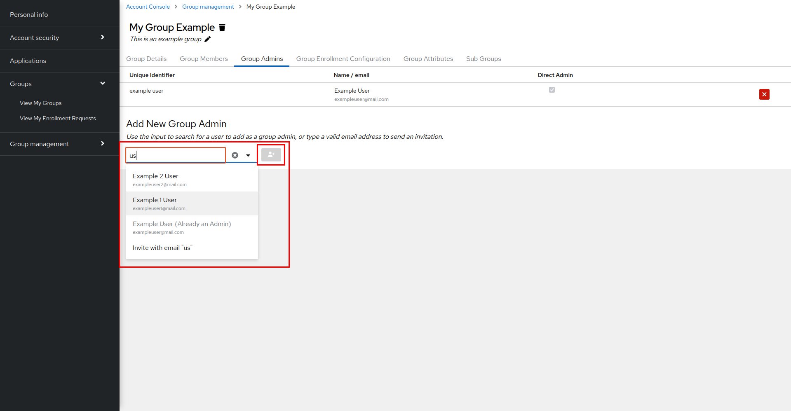

> **_NOTE:_**   Selecting a user discovered in the select input and will add the user immediately.

> **_NOTE:_**  Once a User accepts or rejects an invitation and when a user is added directly to a group group admins receive email notification

### Remove Group Admin

1. Login to [Keycloak Account Console](https://aai.egi.eu/auth/realms/id/account/#/) using any of the login credentials already linked to your account.
2. Locate your group in the [Group Management Page](https://aai.egi.eu/auth/realms/id/account/#/groups/admingroups) and access the Group Configuration Page by clicking it.

3. Select the Group Admins Tab.

4. Locate User you want to remove from being an admin and click the X button
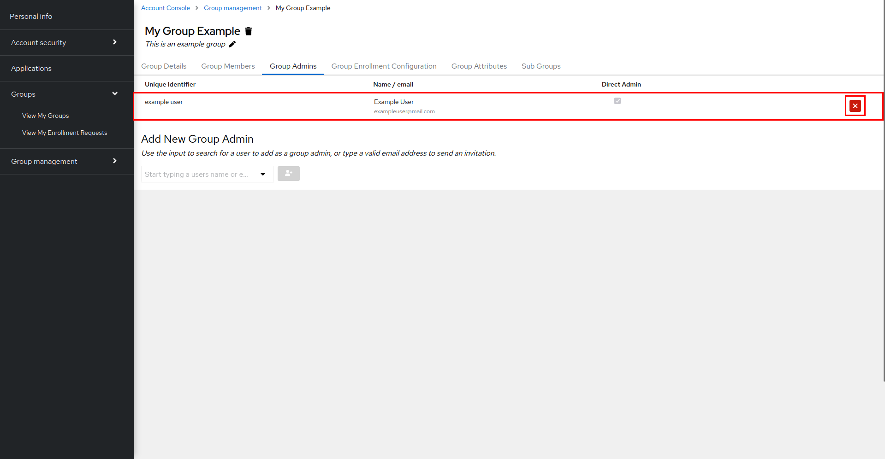
5. Click the YES button in the confirmation pop-up window
   
> **_NOTE:_** Once a group admin is removed from a group he and all other admins are sent an email notification

## Manage Enrollment Configurations

User enrols to a group using a specific enrollment, each enrollment has a configuration that defines the following things:

**Enrollment Name:** The identifying name of the enrollment.

**Membership Expiration:** The duration of the memberships of users enrolled with this enrollment. [See more](#membership-expiration)

**Start Date:** Allows for memberships to be activated in future time and not directly after an enrollment is completed.

**Requires Approval:** When enabled, enrollment requests submitted by users need to be approved by an administrator; otherwise, requests will be automatically approved.

**Comments:** If activated Users that are submitting an enrollment request need to also provide additional information.

**Acceptable Use Policy (AUP):** Acceptable Use Policy in the form of a URL.

**Available Roles:**  Available roles to users using this enrollment.

**Multiselect Roles:** If activated users using this enrollment can select multiple roles.

**Visible to non-members:** If activated the enrollment will be available in the Group [Enrollment Discovery Page](#enrollment-discovery-page).

**Is Active:** Only active enrollments can be used for user enrollments.

### Enrollment Discovery Page

Each group has a group enrollment discovery page where users can view all the available (visible) enrollment flows. Selecting an enrollment flow and using the submit button after filling the form creates an enrollment request. Enrollment requests can be used to create a new membership to a group or update an existing one. Always preselected is the default enrollment flow.

The Enrollment Discovery Page is accessed through a URL using the group path of a group following this format:

[https://aai.egi.eu/auth/realms/id/account/#/enroll?groupPath=/group/path/example](https://aai.egi.eu/auth/realms/id/account/#/enroll?groupPath=/group/path/example)

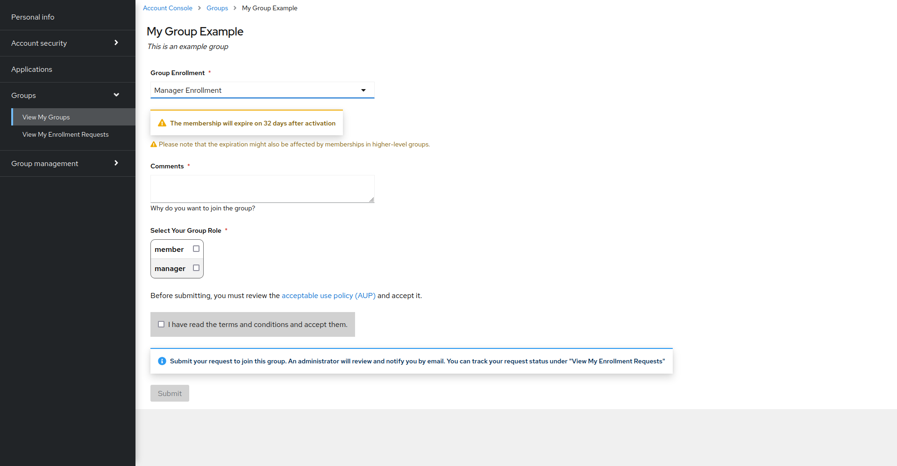

### Create Enrollment Configuration

1. Login to [Keycloak Account Console](https://aai.egi.eu/auth/realms/id/account/#/) using any of the login credentials already linked to your account.
2. Locate your group in the [Group Management Page](https://aai.egi.eu/auth/realms/id/account/#/groups/admingroups) and access the Group Configuration Page by clicking it.

3. Select the Group Enrollment Tab 

4. Click on the + button located in the table header to open the creation window
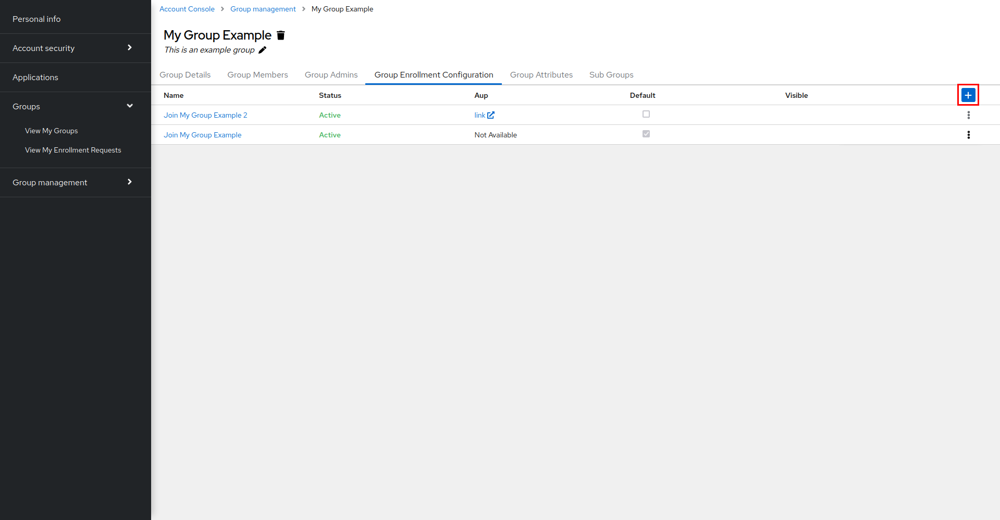
5. Fill the form with the necessary information and click the Create button to create the Enrollment Configuration

### Update Enrollment Configuration

1. Login to [Keycloak Account Console](https://aai.egi.eu/auth/realms/id/account/#/) using any of the login credentials already linked to your account.
2. Locate your group in the [Group Management Page](https://aai.egi.eu/auth/realms/id/account/#/groups/admingroups) and access the Group Configuration Page by clicking it.

3. Select the Group Enrollment Tab 

4. Locate the Enrollment Configuration you want to update in the list.
5. Select the Enrollment Configuration you want to update by clicking on it.
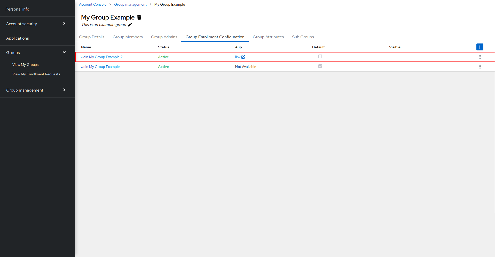
6. Edit the fields you want to update and click the SAVE button to update the Enrollment Configuration
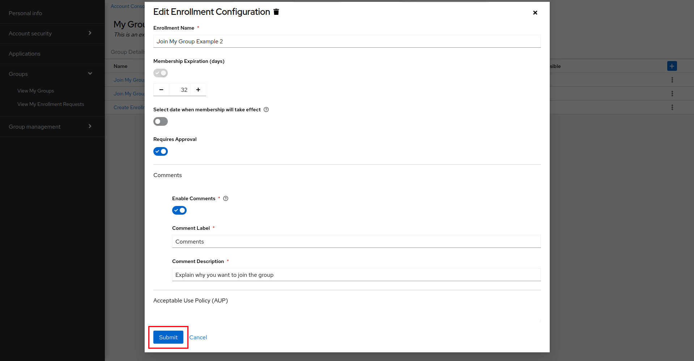

> **_NOTE:_** When updating an enrollment configuration, all ‘pending approval’ and ‘Waiting for reply’ enrollment requests with this configuration are archived.

### Delete Enrollment Configuration

1. Login to [Keycloak Account Console](https://aai.egi.eu/auth/realms/id/account/#/) using any of the login credentials already linked to your account.
2. Locate your group in the [Group Management Page](https://aai.egi.eu/auth/realms/id/account/#/groups/admingroups) and access the Group Configuration Page by clicking it.

3. Select the Group Enrollment Tab 

4. Locate the Enrollment Configuration you want to delete in the list.
5. Select the Enrollment Configuration you want to delete by clicking on it.

6. Click the trash icon next to the Enrollment Configuration name.
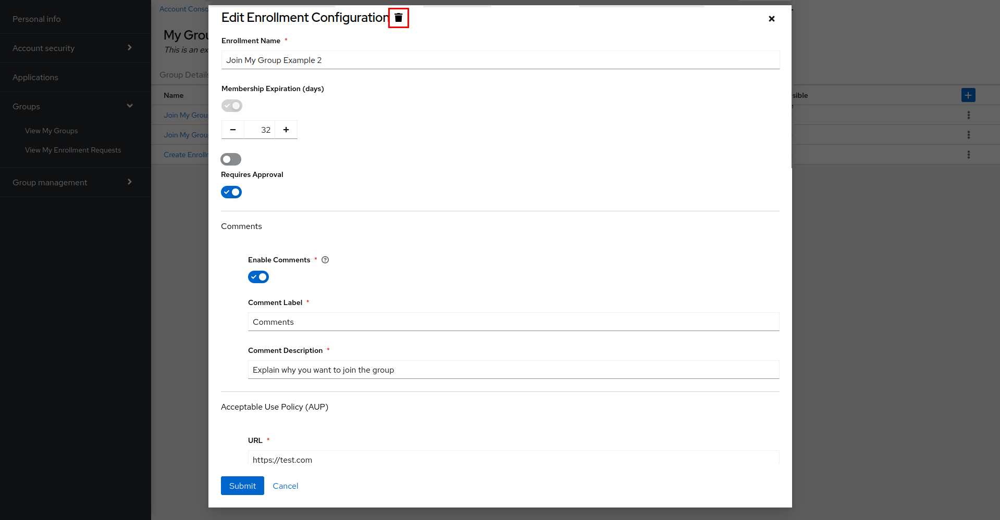 
7. Click the YES button to delete the Enrollment Configuration in the confirmation pop-up window. 

> **_NOTE:_** When deleting an enrollment configuration, all ‘pending approval’ and ‘Waiting for reply’ enrollment requests with this configuration are archived.

## Review Enrollment Request
All **enrollment requests**—no matter for the status—are accessible through the **Account Console** for Group admins. When a user submits an enrollment request to join a Group and the request requires approval, Group admins are notified via email. These notifications include a direct link to the request that needs to be reviewed, streamlining the approval process. Admins can view and manage these enrollment requests directly from their Account Console, making it easy to keep track of pending requests and process approvals in a timely manner.

To review an enrollment request follow these steps:

1. Login to [Keycloak Account Console](https://aai.egi.eu/auth/realms/id/account/#/) using any of the login credentials already linked to your account.
2. Access the [Review Enrollment Requests](https://aai.egi.eu/auth/realms/id/account/#/groups/groupenrollments) page available in the Group Management Section.
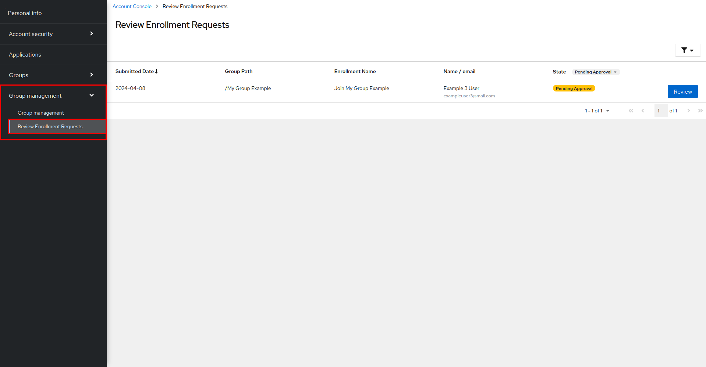
3. Locate the enrollment request In the list of all pending requests and click on the Review Button to open the Review Page.
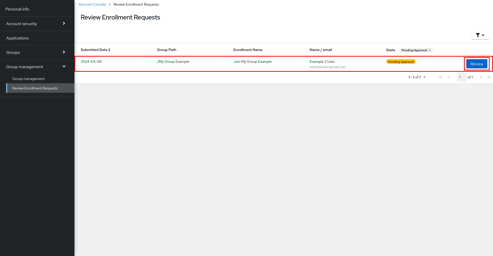
4. Check all the information about the User and his Membership.
5. Optionally Leave a justification comment for your Review Action.
6. Approve the request by clicking the green Approve button or reject it by clicking the red Reject button.
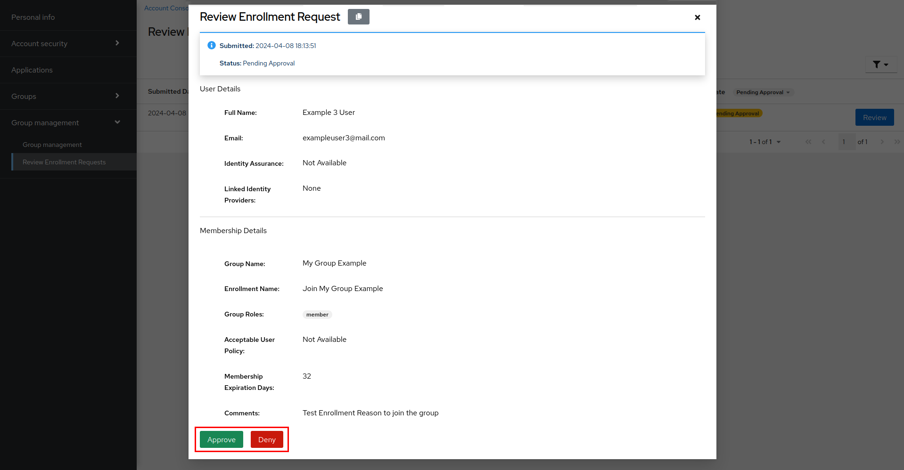

> **_NOTE:_** After approving or denying an enrollment request email notifications are sent to the requesting user and other administrators of the group

## Enrollment Request Details

Information Available when reviewing an enrollment request:

### General Details

**Submission Date:** Date and time of the submission of the request by the user.

**Enrollment Request State**: State of the request. (Pending Approval, Approved, Rejected, Self Reviewed, Archived)

### User Details
The User Details at the time the enrollment request was created:

**Full Name**: Full name of the user when the request was submitted.

**Email**: Email address of the user when the request was submitted.

**Authentication Providers**: Authentication provider(s) used by the user for submitting the request.

**Assurance**: Information for assessing the confidence level in the identity of the user when the request was submitted.

### Show Current User Details

**Full Name**: Current full name in the user profile

**Email**: Current email address in the user profile

**Linked Identity Providers**: Authentication providers linked to the user’s profile.

### Membership Details

**Group Name:** Name of the group

**Enrollment Name:** Name of the enrollment configuration used 

**Group Roles:** List of the roles that the user will acquire from this enrollment request

**Acceptable User Policy (AUP):** Link of the AUP that the user has approved

**Membership Expiration Days:** The duration of the membership in days. [See more](#membership-expiration)

**Comments (or custom name):** Additional information from the user submitting the request. 

