This page contains information about using Check-in for managing your Virtual
Organisation (VO). For joining a VO please look at
[Joining Virtual Organisation](../joining-virtual-organisation).

## Background

In simple terms a Virtual Organisation (VO) is just a group of users. In EGI VOs
are created to group researchers who aim to share resources across the EGI
Federation to achieve a common goal as part of a scientific collaboration. For a
more formal definition of VO please look at the
[EGI Glossary](https://ims.egi.eu/display/EGIG/Virtual+organisation).

You can browse existing VOs in the
[EGI Operations Portal](https://operations-portal.egi.eu/vo/a/list). For each VO
you can click on the _Details_ link to get more information. You can join an
existing VO either using the _enrollment URL_ or emailing VO managers.

If you are interested in creating your own VO, please see instructions in the
section [below](#vo-management).

## VO management

VOs in Check-in are represented as Collaborative Organisation Units (COUs). A
COU is more than just a group. It is the concept of groups combined with
membership management and advanced enrolment workflows. COUs can also be
organised in a hierarchical structure for creating groups or subgroups within a
VO.

It is assumed that VO managers and members have already registered their EGI
Check-in account (A step-by-step guide is provided in this [link](../signup).

### Registering your VO

Any person who can authenticate to the
[Operations Portal](https://operations-portal.egi.eu/) using their EGI Check-in
account can register a new VO.

The person initiating the registration is called the **VO manager**. After the
VO is set up and operational, the VO manager is the person who is primarily
responsible for the operation of the VO and for providing sufficient information
about VO activities for EGI and for VO members (to both people and sites).

A step-by-step guide for the VO registration process is provided in the
procedure
[PROC14 VO Registration](https://confluence.egi.eu/display/EGIPP/PROC14+VO+Registration).

### Viewing VO members

1. Login to [Check-in registry](https://aai.egi.eu/registry) using any of the
   login credentials already linked to your EGI account.

1. To view the existing members, expand the **People** drop down menu and click
   on **_VO-NAME_ Population** (for example, **vo.example.org Population**)

   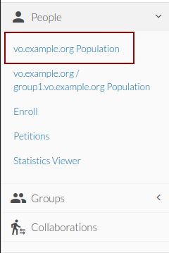

1. Then you are able to see all the VO members.

   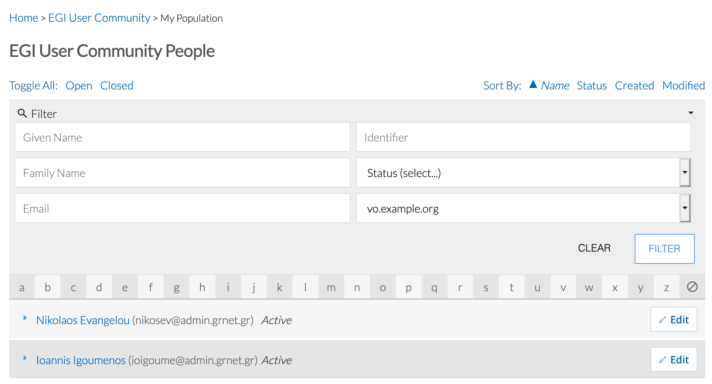

### VO enrollment URLs

Vo enrollments URLs are essential for someone who wants to enroll to a VO.

Users can request membership in your VO by following the VO enrollment URL. The
enrollment URL has the following form:

`https://aai.egi.eu/registry/co_petitions/start/coef:##` where `##` is the
unique numeric identifier for the enrollment flow of your VO.

The VO Manager can insert this URL in an invitation email and send it directly
to the users who want to join the VO. Also, it can be used in any registration
web page as an href of a button or image etc.

The VO enrollment URL can be found both at the Operations Portal and EGI
Check-in Registry. At the Operations Portal VO List, by quickly searching for
the VO name and clicking on the Details.

At EGI Check-in Registry:

1. Login to [Check-in registry](https://aai.egi.eu/registry) using any of the
   login credentials already linked to your EGI account.

1. Expand the **People** drop down menu and click **Enroll**.

   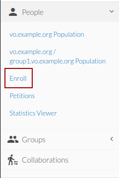

1. Copy the **Begin** link of the Enrollment flow of the VO you want the user to
   join and send it to the user

   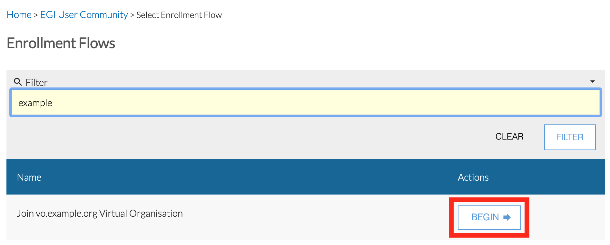

1. Once the user submits the VO membership request, the **Role Attributes**
   section of their profile page will include the new VO membership role in
   **Pending Approval** status

   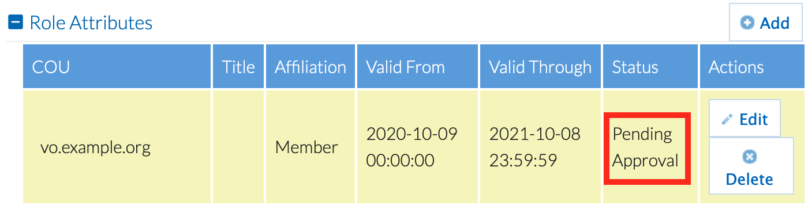

1. Once the VO manager accepts the new member, the **Role Attributes** section
   of the user's profile page will include the VO membership role in **Active**
   status

   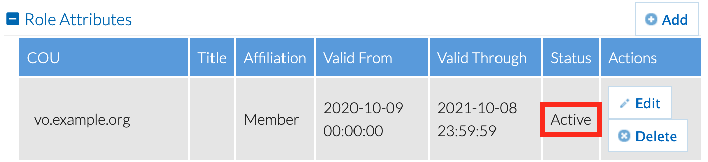

### Reviewing VO membership requests

Once a user submits a VO membership petition, all VO managers are notified with
an email containing a link to the petition. Any of the VO managers can then
review the petition and either **approve** or **deny** the request.

When a user requests membership to a VO, all VO managers will receive an email,
containing the petition URL.

Except from email, they will receive a notification on their COmanage profile.
At the top right corner clicking the bell icon someone can see all the
notifications.

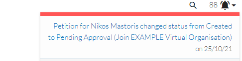

Clicking a notification message, you can find among others, the petition URL
inside the `Notification Email Body` field.

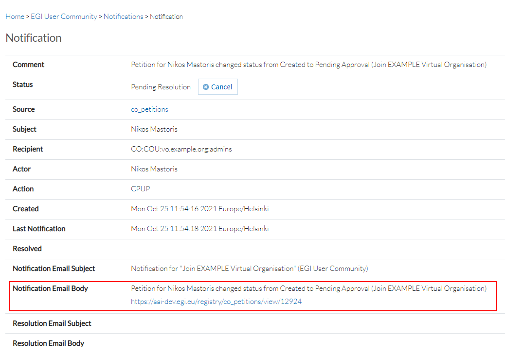

Clicking the petition URL either at mail you received either at the notification
message, you can review the request.

You can accept or deny the membership, and also provide a justification at the
textarea, below the two buttons. This field is optional. In case is filled, it
will also be sent to the user that made the request.

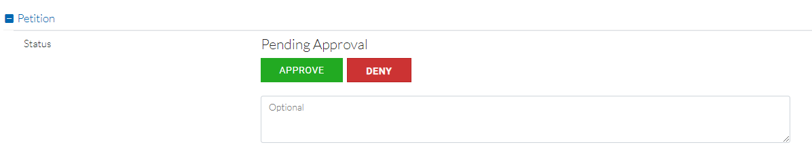

In the petition view you can also view user's assurance per linked identity
under `Assurance` section. More information about identity assurance can be
found [here](../../../../providers/check-in/sp#identity-assurance).

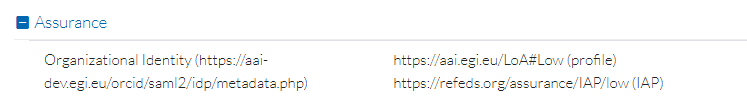

The complete user profile can be found by clicking the enrollee name under
`Attached Identities` (in Petition View).

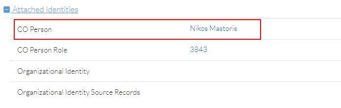

At user profile you can find also information about Organisation Identities. An
Organisation Identity, among others, includes information about `Certificates`
and `Assurances`.

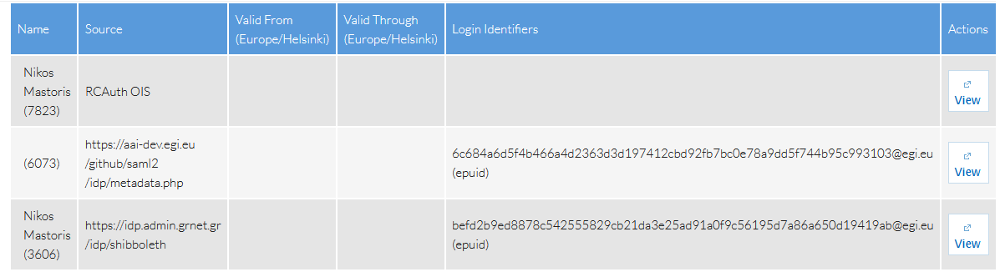

### Managing VO groups

VO groups can only be created by Check-in platform administrators. Please
contact `checkin-support` `<AT>` `mailman.egi.eu` indicating the following
information for every (sub)group that you need to add/remove to/from your VO:

- **VO name**
- **Group name**
- **Group description**
- Optional, **Group manager(s)**, i.e. the Check-in identifiers (in the form of
  `"xxxxxxx@egi.eu"`) of one or more users responsible for managing the VO group
  members. Group managers can also appoint other users as (sub)group managers.
  The manager(s) of the VO (or any parent group) are implicitly managers of the
  group. You can provide additional Check-in user identifiers to extend the list
  of group managers.
- Optional, **Parent VO group name** (in the case of a hierarchical group, e.g.
  `<VO>` --> `<PARENT_GROUP>` --> `<GROUP>`)

**Known limitation:** Group names must be unique so the names you suggest may
need to be adjusted by the Check-in administrators to guarantee their
uniqueness.

#### Adding members to VO groups

1. Login to [Check-in registry](https://aai.egi.eu/registry) using any of the
   login credentials already linked to your EGI account.

1. Then expand the **People** drop down menu and click **`<VO-NAME>`
   Population** (for example, **vo.example.org Population**)

   

1. Find the user you want to add to the VO Group and click **Edit**.

   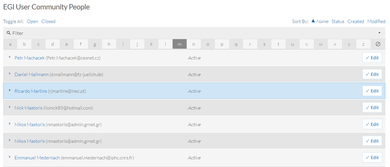

1. Click **Add** at the **Role Attributes** section of the user profile

   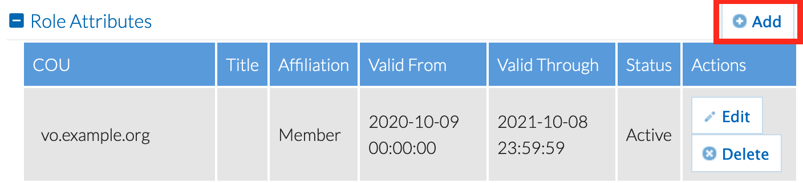

1. Fill in the fields in the form and click **Add**. The user now is a member of
   the new VO group. For more information about Affiliation and Role fields you
   can see below at section **Managing Affiliation and Role of VO Member**

   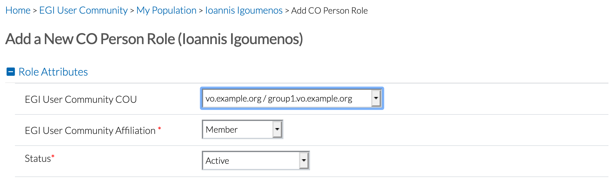

### Removing members

From the VO members list (see [Viewing VO members](#viewing-vo-members) above):

1. Click **Edit** on the person that is going to be removed.

   

1. Under **Role Attributes** click **Delete** on the right of the COU entry of
   interest (for example, vo.example.com). On success the selected row will be
   removed. In this example we removed the **vo.geoss.eu** that we previously
   added.

   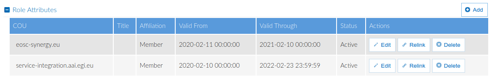

### Managing Affiliation and Role of VO Member

User's **Affiliation** to a VO, as defined in
[RFC4512](https://software.internet2.edu/eduperson/internet2-mace-dir-eduperson-201602.html#eduPersonAffiliation),
has eight permissible values. These are faculty, student, staff, alum, member,
affiliate, employee, library-walk-in. EGI Check-in assigns to all user's the
affiliation Member by default, during the VO(COU) enrollment process. This value
is immutable for the user but editable for the VO administrator. As a result, if
there is a change of status the administrator can always step in and change it
appropriately. Additionally, the user's **Role** in a VO is the **EGI User
Community Title** column, in Co Person Role's View. This column can be either a
custom text value; or a value chosen from a drop down list. The drop down list
administration is an EGI Check-in CO administrator task and can not be managed
by any VO admin.

#### Update User's VO affiliation

1. Navigate to Co Person Role view
   

1. Choose Affiliation from drop down list
   

#### Update User's VO Role

1. Navigate to Co Person Role view
   

1. Choose Role from drop down list, if available, or add custom text if no list
   is present. 

Subsequently, EGI Check-in uses the CO Person's group membership and role
information in order to construct the eduPersonEntitlement values, in short
entitlements. These URN-formatted attributes can be used for representing group
membership, as well as to indicate rights to resources. According to the
[AARC-G002 specification](https://aarc-community.org/guidelines/aarc-g002), a
user that is a member of the VO vo.example.org, and has the role supervisor,
obtains the following entitlements:

- `urn:mace:egi.eu:group:vo.example.org:role=member#aai.egi.eu`

- `urn:mace:egi.eu:group:vo.example.org:role=supervisor#aai.egi.eu`

### Managing COU Admin members

COU Admin Groups are used to determine COU Administrators. Admin Groups are
automatically created when a COU is created. The default name for COU admin
groups is

`CO:COU:<COU_Name>:admins`

For example `CO:COU:vo.example.org:admins`

- A CO Person can be a member, an owner, both, or neither. Specifically:
  - COU Admin Group members can manage COU members
  - Approve or decline membership petitions

A CO Person is added to a COU Admin Group if the following requirements are met:

1. CO Person is declared as VO administrator in the VO's ID Card, under the
   [Operations Portal](https://operations-portal.egi.eu/vo/a/list)

1. A request is made to the Check-in Support Unit via a
   [EGI Helpdesk ticket](../../../../internal/helpdesk/user-guide/).

### Expiration Policy

VO membership expires within a given time, typically a year after the VO member
joins the VO. VO members receive a notification from
[EGI Check-in Notifications](mailto:noreply@faai.grnet.gr) with the subject
"vo.example.org membership will expire soon" warning them that their membership
will expire four weeks before expiration. The notification email is sent on a
weekly basis and includes all the instructions needed by VO members in order to
reapply for a membership. If the VO member does not take any action to renew
their membership, a final notification email is sent when the VO membership
expires. Please note that a user with expired membership is not eligible for VO
membership entitlements and as a result the user will not have access to VO
resources relying on these entitlements.

## VO API

### API v2

Check-in provides a REST API that allows clients to:

- manage membership information only for the VOs they are authoritative for
- get VO group information only for the VOs they are authoritative for

Membership Features:

- Members of the VO are identified via their EGI Check-in Community User
  Identifier (CUID)
- Membership can be limited to a specified period
- All
  [REFEDS](https://wiki.refeds.org/display/STAN/eduPerson+2020-01#eduPerson202001-eduPersonAffiliation)
  membership affiliations are supported
- Role titles are supported
- Different membership status values are supported, namely `Active`, `Expired`,
  `Deleted`, `Suspended`
- Check-in automatically changes the membership status from `Active` to
  `Expired` beyond the validity period

#### Endpoints for VO Groups

<!--
// jscpd:ignore-start
-->

<!-- prettier-ignore -->



```shell
# Export VO API Base URL parameter
$ export VO_API_BASE_URL=https://aai.egi.eu/registry/cous.json
# Export CO ID parameter.
# The CO ID is the number part of the API username prefix.
# e.g. for the username `co_2.test`, the CO_ID is `2`
$ export CO_ID=2
```

 

```shell
# Export VO API Base URL parameter
$ export VO_API_BASE_URL=https://aai-demo.egi.eu/registry/cous.json
# Export CO ID parameter.
# The CO ID is the number part of the API username prefix.
# e.g. for the username `co_2.test`, the CO_ID is `2`
$ export CO_ID=2
```

 

```shell
# Export VO API Base URL parameter
$ export VO_API_BASE_URL=https://aai-dev.egi.eu/api/cous.json
# Export CO ID parameter.
# The CO ID is the number part of the API username prefix.
# e.g. for the username `co_2.test`, the CO_ID is `2`
$ export CO_ID=2
```

 

<!--
// jscpd:ignore-end
-->

#### Endpoints for VO Memberships

<!--
// jscpd:ignore-start
-->

<!-- prettier-ignore -->



```shell
# Export VO API Base URL parameter
$ export VO_API_BASE_URL=https://aai.egi.eu/api/v2/VoMembers
# Export CO ID parameter.
# The CO ID is the number part of the API username prefix.
# e.g. for the username `co_2.test`, the CO_ID is `2`
$ export CO_ID=2
```

 

```shell
# Export VO API Base URL parameter
$ export VO_API_BASE_URL=https://aai-demo.egi.eu/api/v2/VoMembers
# Export CO ID parameter.
# The CO ID is the number part of the API username prefix.
# e.g. for the username `co_2.test`, the CO_ID is `2`
$ export CO_ID=2
```

 

```shell
# Export VO API Base URL parameter
$ export VO_API_BASE_URL=https://aai-dev.egi.eu/api/v2/VoMembers
# Export CO ID parameter.
# The CO ID is the number part of the API username prefix.
# e.g. for the username `co_2.test`, the CO_ID is `2`
$ export CO_ID=2
```

 

<!--
// jscpd:ignore-end
-->

#### Connection Parameters

The `API username` and `API password` will be assigned by the EGI Check-in team
when you request REST API access. In order to obtain REST API credentials you
need to email your request to
[EGI Check-in Support](mailto:checkin-support@mailman.egi.eu) with Subject
`Request REST API access for <vo_name> VO`. Make sure you indicate the instance
of EGI Check-in (production, demo or development) hosting the VO you request
access to. Only VO managers can request REST API credentials for a given VO.

#### Authentication

The REST client is authenticated via username/password credentials transmitted
over HTTPS using the Basic Authentication scheme. More sophisticated
authentication mechanisms, such as OpenID Connect/OAuth 2.0 access tokens, may
be supported in the future.

#### VO Groups Methods

##### Retrieving all VO groups details

{}
The Request will NOT fetch all the groups contained in a VO
(i.e. the subgroups) but all the EGI's groups (VOs) existing
in Check-in
{}

```shell
$ curl -vX GET $VO_API_BASE_URL?coid=$CO_ID \
         --user "example-client":"veryverysecret"
```

output:

```json
{
   "ResponseType": "Cous",
   "Version": "1.0",
   "Cous": [
      {
         "Version": "1.0",
         "Id": 123,
         "CoId": 2,
         "Name": "vo.example.org",
         "Description": "Example Virtual Organisation",
         "Lft": 109,
         "Rght": 112,
         "Created": "2020-09-09 08:17:51",
         "Modified": "2020-09-09 08:17:51",
         "Revision": 0,
         "Deleted": false,
         "ActorIdentifier": "actoridentifier@egi.eu",
         "Metadata": [
            {
               "Type": "mailman"
            }
         ]
      },
      {...},
      {...}
   ]
}
```

{}
The `ID` field represents the "ID" of the record in the database.
{}

{}
The `ActorIdentifier` field represents the user who modified
the record in the database
{}

{}
The `Metadata` object contains extra information about the VO group.
For example this group is identified as a group used to support Mailman
integration. More Types are supported or can be requested by the VO
admins.
The `type` field can be used as a query parameter and allows the filtering
of the available VOs, managed by a VO admin, by that types. The how to can
be found in the Request below.
{}

<!--
// jscpd:ignore-start
-->

The JSON object `Metadata` encapsulates additional VO group information like the
`type`.

<!--
// jscpd:ignore-end
-->

Response Format:

| HTTP Status        | Description             | Response Body |
| ------------------ | ----------------------- | ------------- |
| 200 OK             | Role Returned           | JSON response |
| 400 Bad Request    | CO ID unknown           |               |
| 401 Unauthorized   | Authentication Required |               |
| 500 Other error    | Unknown Error           |               |

##### Retrieving all VO groups details filtered by Group type

```shell
$ curl -vX GET $VO_API_BASE_URL?coid=$CO_ID&dept=mailman \
         --user "example-client":"veryverysecret"
```

output:

```json
{
   "ResponseType": "Cous",
   "Version": "1.0",
   "Cous": [
      {
         "Version": "1.0",
         "Id": 123,
         "CoId": 2,
         "Name": "vo.example.org",
         "Description": "Example Virtual Organisation",
         "Lft": 109,
         "Rght": 112,
         "Created": "2020-09-09 08:17:51",
         "Modified": "2020-09-09 08:17:51",
         "Revision": 0,
         "Deleted": false,
         "ActorIdentifier": "actoridentifier@egi.eu",
      },
   ]
}
```

<!--
// jscpd:ignore-start
-->

Response Format:

| HTTP Status        | Description             | Response Body |
| ------------------ | ----------------------- | ------------- |
| 200 OK             | Role Returned           | JSON response |
| 400 Bad Request    | CO ID unknown           |               |
| 401 Unauthorized   | Authentication Required |               |
| 500 Other error    | Unknown Error           |               |

<!--
// jscpd:ignore-end
-->

##### Retrieving VO Group details by VO name

```shell
$ curl -vX GET $VO_API_BASE_URL?coid=$CO_ID&name=vo.example.org \
         --user "example-client":"veryverysecret"
```

output:

```json
{
   "ResponseType": "Cous",
   "Version": "1.0",
   "Cous": [
      {
         "Version": "1.0",
         "Id": 123,
         "CoId": 2,
         "Name": "vo.example.org",
         "Description": "Example Virtual Organisation",
         "Lft": 109,
         "Rght": 112,
         "Created": "2020-09-09 08:17:51",
         "Modified": "2020-09-09 08:17:51",
         "Revision": 0,
         "Deleted": false,
         "ActorIdentifier": "actoridentifier@egi.eu",
         "Metadata": [
            {
               "Type": "mailman"
            }
         ]
      },
   ]
}
```

<!--
// jscpd:ignore-start
-->

Response Format:

| HTTP Status        | Description             | Response Body |
| ------------------ | ----------------------- | ------------- |
| 200 OK             | Role Returned           | JSON response |
| 400 Bad Request    | CO ID unknown           |               |
| 401 Unauthorized   | Authentication Required |               |
| 404 COU/VO unknown | COU/CO name not found   |               |
| 500 Other error    | Unknown Error           |               |

<!--
// jscpd:ignore-end
-->

#### VO Memberships Methods

##### Adding a Member to a VO

Adding a user to a VO requires specifying the user's EGI Check-in CUID, the
name of the VO (e.g. `vo.example.org`), the status (`Active`) and the valid
from/through dates. All these parameters are mandatory. Here is an example
using curl (see example `add.json` file below):

```shell
$ curl -vX POST $VO_API_BASE_URL.json \
         --user "example-client":"veryverysecret" \
         --data @add.json \
         --header "Content-Type: application/json"
```

`add.json`:

```json
{
   "RequestType": "CoPersonRoles",
   "Version": "1.0",
   "CoPersonRoles": [
      {
      "Version": "1.0",
      "Person": {
         "Type": "CO",
         "Identifier": {
            "Type": "epuid",
            "Id": "01234567890123456789@egi.eu"
         }
      },
      "Cou": {
         "CoId": "2",
         "Name": "vo.example.org"
      },
      "Affiliation": "member",
      "Title": "Engineer",                   // Optional
      "Status": "Active",
      "ValidFrom": "2022-02-16 11:19:38",    // Optional
      "ValidThrough": "2022-05-16 11:19:38"  // Optional
      }
   ]
}
```

{}
`Title` field is Optional and designates a custom Role name.
{}

{}
`ValidFrom` and `ValidThrough` fields are Optional and designate the Role validity period.
As soon as the `ValidThrough` date is passed the Check-in Registry will expire the membership.
{}

<!--
// jscpd:ignore-start
-->

Response Format:

| HTTP Status            | Description                            | Response Body                  |
| ---------------------- | -------------------------------------- | ------------------------------ |
| 201 Added              | Role Added                             | add.json response              |
| 400 Bad Request        | Role Request not provided in post body |                                |
| 400 Invalid Fields     | An error in one more fields            | Response with failing field(s) |
| 401 Unauthorized       | Authentication Required                |                                |
| 403 COU Does not exist | The specified COU does not exists      |                                |
| 500 Other error        | Unknown Error                          |                                |

<!--
// jscpd:ignore-end
-->

##### Retrieve VO membership information

Retrieving the VO membership information for a given EGI Check-in CUID:

```shell
$ curl -vX GET $VO_API_BASE_URL/co/$CO_ID/cou/vo.example.org/identifier/01234567890123456789@egi.eu.json \
         --user "example-client":"veryverysecret"
```

output:

```json
{
   "RequestType": "CoPersonRoles",
   "Version": "1.0",
   "CoPersonRoles": [
      {
      "Version": "1.0",
      "Person": {
         "Type": "CO",
         "Id": 1111
      },
      "CouId": 13,
      "Affiliation": "member",
      "Title": "Pilot",
      "Status": "Active",
      "Created": "2023-02-16 11:19:38",
      "Modified": "2023-02-16 11:20:27",
      "Revision": 3,
      "Deleted": false,
      "ActorIdentifier": "co_2.test"
      }  
   ]
}
```

{}
"ID" field of `Person` json object represents the "ID" of the User(Person)
in Check-in Registry database. It can easily found from the URL of the CO Person
Canvas View.
{}

<!--
// jscpd:ignore-start
-->

Beyond the `valid_through` date, the status will be automatically changed to
`Expired`. So, when querying for VO membership information, it's important to
check that the status is actually set to `Active` for each of the identified
VOs.

<!--
// jscpd:ignore-end
-->

Response Format:

| HTTP Status                 | Description                  | Response Body |
| --------------------------- | ---------------------------- | ------------- |
| 200 OK                      | Role Returned                | json response |
| 400 Bad Request             | CO ID unknown                |               |
| 401 Unauthorized            | Authentication Required      |               |
| 404 COU/VO unknown          | COU/CO name not found        |               |
| 404 Person unknown          | Person Identifier not found  |               |
| 404 Identifier type unknown | Identifier type is not valid |               |
| 500 Other error             | Unknown Error                |               |

##### Retrieving all VO members

```shell
$ curl -vX GET $VO_API_BASE_URL/co/$CO_ID/cou/vo.example.org.json \
         --user "example-client":"veryverysecret"
```

output:

```json
{
   "RequestType": "CoPersonRoles",
   "Version": "1.0",
   "CoPersonRoles": [
      {
         "Version": "1.0",
         "Person": {
            "Type": "CO",
            "Id": 1111,
            "EmailAddress": [
               {
                  "type": "official",
                  "mail": "ioigoume@mailinator.com",
                  "verified": true
               }
            ],
            "Identifier": [
               {
                  "type": "epuid",
                  "identifier": "12345678901234566778@example.org"
               },
               {
                  "type": "uid",
                  "identifier": "iigoumenos"
               }
            ],
            "Name": [
               {
                  "type": "official",
                  "given": "Ioannis",
                  "family": "Igoumenos",
                  "middle": null
               }
            ]
         },
         "CouId": 13,
         "Affiliation": "member",
         "Title": "Pilot",
         "Status": "Active",
         "Created": "2022-02-16 11:19:38",
         "Modified": "2022-02-16 11:20:27",
         "Revision": 2,
         "Deleted": false,
         "ActorIdentifier": "co_2.test"
      },
      {...},
      {...}
   ]
}
```

<!--
// jscpd:ignore-start
-->

Beyond the `valid_through` date, the status will be automatically changed to
`Expired`. So, when querying for VO membership information, it's important to
check that the status is actually set to `Active` for each of the identified
VOs.

<!--
// jscpd:ignore-end
-->

Response Format:

| HTTP Status        | Description             | Response Body |
| ------------------ | ----------------------- | ------------- |
| 200 OK             | Role Returned           | json response |
| 400 Bad Request    | CO ID unknown           |               |
| 401 Unauthorized   | Authentication Required |               |
| 404 COU/VO unknown | COU/CO name not found   |               |
| 500 Other error    | Unknown Error           |               |

##### Updating/Editing a VO membership record

```shell
$ curl -vX PUT $VO_API_BASE_URL/15.json \
         --user "example-client":"veryverysecret"  \
         --data @update.json \
         --header "Content-Type: application/json"
```

The request body is the same as the one used for adding new members but
update requires:

- using `PUT` instead of `POST`.
- provide the Role ID as part of the request URL

`update.json` request body example:

```json
{
  "RequestType": "CoPersonRoles",
  "Version": "1.0",
  "CoPersonRoles": [
    {
      "Version": "1.0",
      "Person": {
        "Type": "CO",
        "Id": "171"                         // VO Member Registry ID
      },
      "Cou": {
        "CoId": "2",                        // CO ID has to be 2
        "Name": "vo.example.org"            // VO name
      },
      "Affiliation": "member",
      "Title": "engineer",                  // Custom Role Title
      "ValidFrom": "2022-11-20 23:00:00",
      "ValidThrough": "2023-11-07 23:00:00",
      "Status": "Active"                    // Status can be Active,Deleted,Expired, etc
    }
  ]
}
```

<!--
// jscpd:ignore-start
-->

Response Format:

| HTTP Status            | Description                            | Response Body                  |
| ---------------------- | -------------------------------------- | ------------------------------ |
| 200 OK                 | Role Updated                           |                                |
| 400 Bad Request        | Role Request not provided in post body |                                |
| 400 Invalid Fields     | An error in one more fields            | Response with failing field(s) |
| 401 Unauthorized       | Authentication Required                |                                |
| 403 COU Does not exist | The specified COU does not exists      |                                |
| 500 Other error        | Unknown Error                          |                                |

<!--
// jscpd:ignore-end
-->

##### Removing VO member

{} Removing a VO membership is an update
action where the status of the role is set to `Deleted`. {}

Response Format:

| HTTP Status      | Description             | Response Body |
| ---------------- | ----------------------- | ------------- |
| 200 OK           | Role Returned           | json response |
| 401 Unauthorized | Authentication Required |               |
| 404 Role unknown | Role name not found     |               |
| 500 Other error  | Unknown Error           |               |

### API v1 (DEPRECATED)

Check-in provides a REST API that allows clients to manage membership
information only for the VOs they are authoritative for.

Features:

- Members of the VO are identified via their EGI Check-in Community User
  Identifier (CUID)
- Membership can be limited to a specified period
- Different membership status values are supported, namely `Active`, `Expired`,
  `Deleted`
- Check-in automatically changes the membership status from `Active` to
  `Expired` beyond the validity period

<!-- markdownlint-disable no-duplicate-header -->

#### Authentication

<!-- markdownlint-enable no-duplicate-header -->

The REST client is authenticated via username/password credentials transmitted
over HTTPS using the Basic Authentication scheme. More sophisticated
authentication mechanisms, such as OpenID Connect/OAuth 2.0 access tokens, may
be supported in the future.

<!-- markdownlint-disable no-duplicate-header -->

#### Methods

<!-- markdownlint-enable no-duplicate-header -->

1. Adding a user to a VO requires specifying the user's EGI Check-in CUID, the
   name of the VO (e.g. `vo.example.org` in the case of LToS), the status
   (`Active`) and the valid from/through dates. All these parameters are
   mandatory. Here is an example using curl (see example `add.json` file below):

   ```shell
   $ curl -vX POST https://aai.egi.eu/api/v1/VoMembers \
          --user "example-client":"veryverysecret" \
          --data @add.json \
          --header "Content-Type: application/json"
   ```

   `add.json`:

   ```json
   {
     "RequestType": "VoMembers",
     "Version": "1.0",
     "VoMembers": [
       {
         "Version": "1.0",
         "VoId": "vo.example.org",
         "Person": {
           "Type": "CO",
           "Id": "01234567890123456789@egi.eu"
         },
         "Status": "Active",
         "ValidFrom": "2017-05-21",
         "ValidThrough": "2017-06-21"
       }
     ]
   }
   ```

1. Retrieving the VO membership information for a given EGI Check-in CUID:

   ```shell
   $ curl -vX GET https://aai.egi.eu/api/v1/VoMembers/01234567890123456789@egi.eu \
          --user "example-client":"veryverysecret"
   ```

   output:

   ```json
   [
     {
       "id": 85,
       "epuid": "01234567890123456789@egi.eu",
       "vo_id": "vo.example.org",
       "valid_from": "2017-05-20T22:00:00.000Z",
       "valid_through": "2017-06-21T22:00:00.000Z",
       "status": "Active"
     }
   ]
   ```

   Beyond the `valid_through` date, the status will be automatically changed to
   `Expired`. So, when querying for VO membership information, it's important to
   check that the status is actually set to `Active` for each of the identified
   VOs (see the `vo_id` attribute)

1. Updating existing VO membership record:

   ```shell
   $ curl -vX PUT https://aai.egi.eu/api/v1/VoMembers \
          --user "example-client":"veryverysecret"  \
          --data @update.json \
          --header "Content-Type: application/json"
   ```

   The request body is the same as the one used for adding new members but
   update requires using `PUT` instead of `POST`.

1. Removing VO member:

Same as the update but requires setting the membership status to `Deleted`

## LDAP

EGI Check-in provides read access to the members of the VO(s) through the
Lightweight Directory Access Protocol (LDAP).

There are two entity types in the LDAP:

- People: Users of EGI Check-in, expressed as `inetOrgPerson` (with additional
  attributes/schemas).

- Groups of collaboration members, expressed as `groupOfMembers` (with
  additional attributes/schema).

<!-- markdownlint-disable no-duplicate-header -->

### Connection Parameters

<!-- markdownlint-enable no-duplicate-header -->

|                  | Production environment                     | Demo environment                                | Development environment                        |
| ---------------- | ------------------------------------------ | ----------------------------------------------- | ---------------------------------------------- |
| **LDAP address** | ldaps://ldap.aai.egi.eu:636/               | ldaps://ldap.aai-demo.egi.eu:636/               | ldaps://ldap.aai-dev.egi.eu:636/               |
| **Base DN**      | dc=\<vo_name\>,dc=ldap,dc=aai,dc=egi,dc=eu | dc=\<vo_name\>,dc=ldap,dc=aai-demo,dc=egi,dc=eu | dc=\<vo_name\>,dc=ldap,dc=aai-dev,dc=egi,dc=eu |

**Bind DN**: \<provided by EGI Check-in support\>

The `Bind DN` and `Bind Password` will be assigned by the EGI Check-in team when
you request LDAP access. In order to obtain LDAP credentials you need to email
your request to [EGI Check-in Support](mailto:checkin-support@mailman.egi.eu)
with Subject `Request LDAP access for <vo_name> VO`. Make sure you indicate the
instance of EGI Check-in (production, demo or development) hosting the VO you
request access to. Only VO managers can request LDAP credentials for a given VO.

### Entities

#### User

Users are present in the `ou=people` subtree.

| Attribute                     | Description                                                               | Example                                                                                               |
| ----------------------------- | ------------------------------------------------------------------------- | ----------------------------------------------------------------------------------------------------- |
| `objectClass`                 |                                                                           | `inetOrgPerson`, `eduPerson`, `voPerson`, `eduMember`, `ldapPublicKey`                                |
| `voPersonId`                  | Community User Identifier (`voPersonID`)                                  | `befd2b9ed8878c542555829cb21da3e25ad91a0f9cg54gsdcs35htf@egi.eu`                                      |
| `uid`                         | user ID                                                                   | `john.doe`                                                                                            |
| `cn`                          | Full name                                                                 | `John Doe`                                                                                            |
| `displayName`                 | Full name                                                                 | `John Doe`                                                                                            |
| `givenName`                   | First name                                                                | `John`                                                                                                |
| `sn`                          | Last name                                                                 | `Doe`                                                                                                 |
| `mail`                        | Email address                                                             | `john.doe@mail.com`                                                                                   |
| `edupersonUniqueID`           | Community User Identifier (see also `voPersonId`)                         | `befd2b9ed8878c542555829cb21da3e25ad91a0f9cg54gsdcs35htf@egi.eu`                                      |
| `eduPersonPrincipalName`      | A scoped identifier for a person. The value is the same as the            | `befd2b9ed8878c542555829cb21da3e25ad91a0f9cg54gsdcs35htf@egi.eu`                                      |
| `eduPersonEntitlement`        | URN that indicates a set of rights to specific resources                  | urn:mace:egi.eu:group:vo.example.org:role=member#aai.egi.eu                                           |
| `sshPublicKey`                | SSH public key                                                            |                                                                                                       |
| `isMemberOf`                  | Group memberships                                                         | `CO:COU:vo.example.org:members`                                                                       |
| `voPersonCertificateDN`       | The Subject Distinguished Name of an X.509 certificate held by the person | `voPersonCertificateDN;scope-cert1: CN=John Doe A251,O=Example,C=US,DC=cilogon,DC=org`                |
| `voPersonCertificateIssuerDN` | The Subject Distinguished Name of the X.509 certificate issuer            | `voPersonCertificateIssuerDN;scope-cert1: CN=CILogon Basic CA 1, O=CILogon, C=US, DC=cilogon, DC=org` |

#### Group

Groups are present in the `ou=groups` subtree.

| Attribute          | Description                               | Example                                                                     |
| ------------------ | ----------------------------------------- | --------------------------------------------------------------------------- |
| `objectClass`      |                                           | `groupofNames`, `eduMember`                                                 |
| `cn`               | Common name                               | `CO:COU:vo.example.org:members`                                             |
| `description`      | The description of group                  | `CO:COU:vo.example.org Members`                                             |
| `member`           | The members of this group (multivalued)   | `voPersonID=befd2b9ed8878c542555829cb21da3e25ad91a0f9cg54gsdcs35htf@egi.eu` |
| `businessCategory` | The VO/group type (multivalued, optional) | `mailman`                                                                   |
