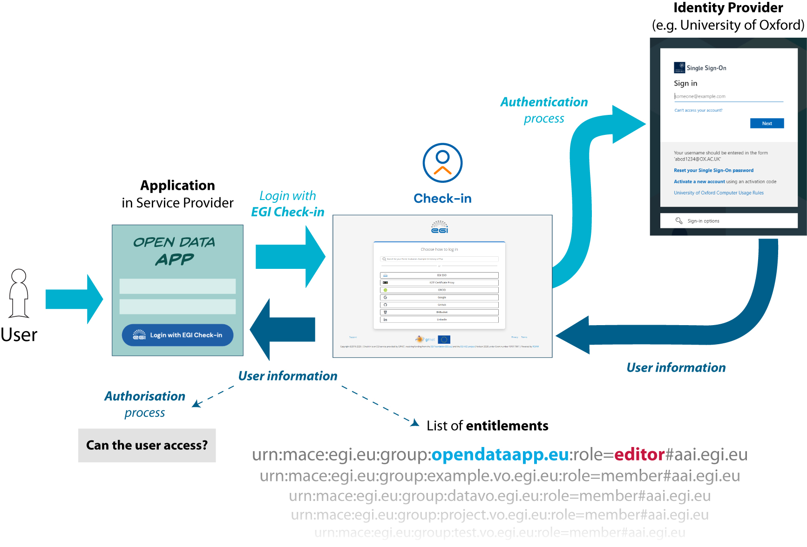
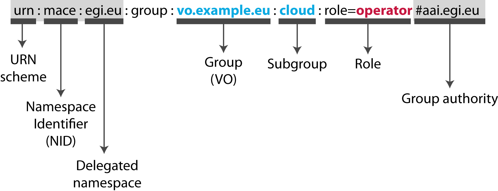

**Authorisation** is the mechanism handling permissions and access control.
While authentication deals with the identification of a user, authorisation
determines and enforces what a user can do in the system.

This is depicted in the figure below, where a user access an application and
authenticates through Check-in. If the authentication is successful, Check-in
will share agreed user information with the application. As part of this
information are **the entitlements** of the user, which encode the group and
role membership of the user.

Services and applications typically use membership information to **authorise
user access** to protected resources, so the entitlements play a relevant role
in the authorisation task.

## Entitlements

An entitlement is simply a string that encodes some user membership.
Entitlements are formated as **URN**s, in this format:

`<NAMESPACE>:group:<VO>[:<SUBGROUP>*][:role=<ROLE>]#<GROUP-AUTHORITY>`

This format is described in the
[AARC-G069](https://aarc-community.org/guidelines/aarc-g069/) specification:

Using this information, an application can determine that the user belongs to
the the group "cloud" of the VO "vo.example.eu" and has the "operator" role
assigned. With this, the application can make an authorisation decision whether
or not to allow the user to access some resource or perform some action.

- If a user has two roles in a group, then two different entitlements will be
  released for the user. For example, a user with roles "cloud_operator" and
  "data_operator" in the same group will have these entitlements:

`urn:mace:egi.eu:group:project.vo.egi.eu:role=data_operator#aai.egi.eu`

`urn:mace:egi.eu:group:project.vo.egi.eu:role=cloud_operator#aai.egi.eu`

- When a user is not a member of a specific VO or group, or if the user's
  membership has expired, the entitlement for this VO/group will not be released
  by Check-in.
