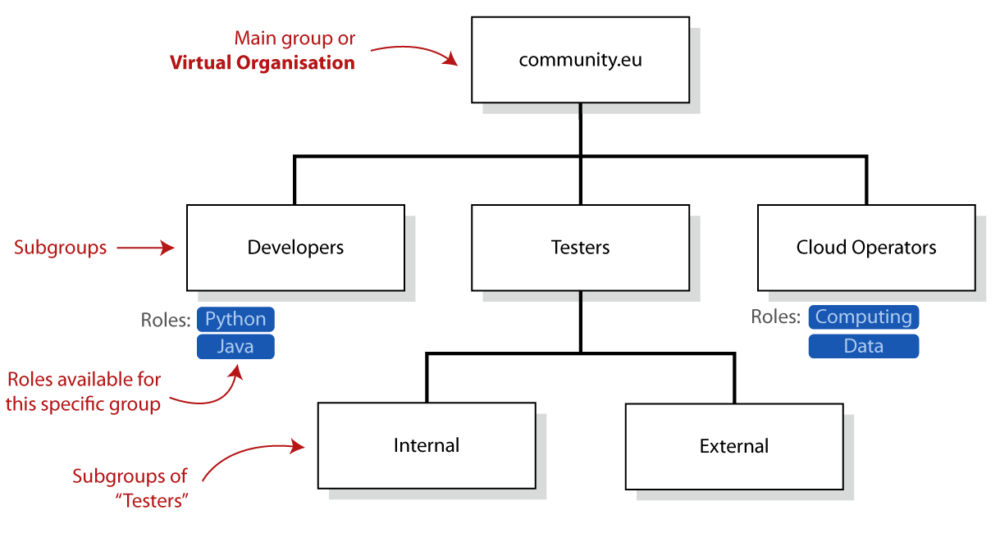

Check-in allows you to organise your community based on two concepts:

- **Groups**, representing a collection of users.
- **Roles**, which are **specific for each group** and can be assigned to users
  individually.

Your community will be represented by a main group, often known as
[**Virtual Organisation**](../) (VO). Inside your VO, you can have subgroups,
and these can also have subgroups, creating a hierarchy.

Operationally, a VO can be considered a group as any other, with the
particularity that it has a special behaviour (VOs cannot be deleted, and
their membership must be renewed at least once every year), and that it is the
root group, the highest group in its hierarchy. The hierarchy can be expressed
as a “**group path**”. For example, the group path of the “External” group of
the image is _/community.eu/Testers/External_.

Groups and roles allow you to manage authorisation. When a user belongs to a
group or is assigned a role, he/she receives an **entitlement**, which is a
string describing a permission the user has. For example, an entitlement looks
like:

    urn:mace:egi.eu:group:engineering.vo.egi.eu:role=member#aai.egi.eu

representing that the user is a “member” of the VO “engineering.vo.egi.eu”. See
"[Authorisation using VO information](../authorisation)" for more details about
entitlements.

Using these entitlements, an application can then make authorisation decisions
based on the membership in a group. For example, to establish that only members
of the group “cloud operators” can create virtual machines and manage
infrastructure.

## Structure of a group

Groups have two types of users:

- **Group Admins**, who manage all aspects of the group, as well as any
  sub-groups in the hierarchy, including roles, membership, and settings. Groups
  can have one or more administrators.
- **Group members**, who are the users that belong to the group.

Roles are defined per group and can be used to assign specific permissions
within the group to users. Users inside a group can have one or more roles, but
they must have **at least one role within the group**. By default, the role
“member” exists for all groups.

The Group Admin of the VO is sometimes called “**VO Manager**”.

A Group Admin is also considered to be an administrator of all subgroups of the
group (becoming an “indirect admin” for the subgroups), so these administration
permissions propagate down the group hierarchy.

