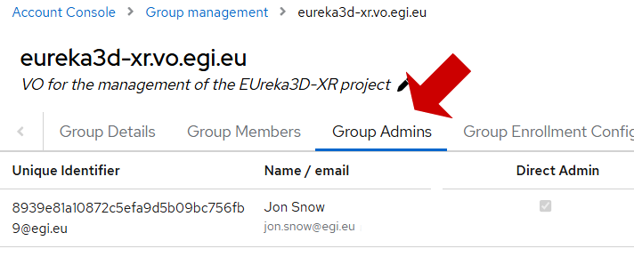
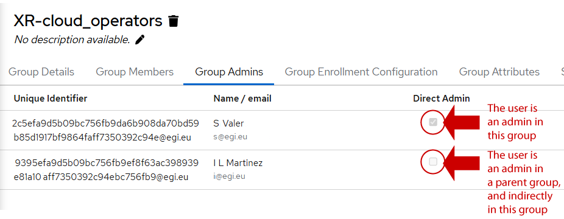
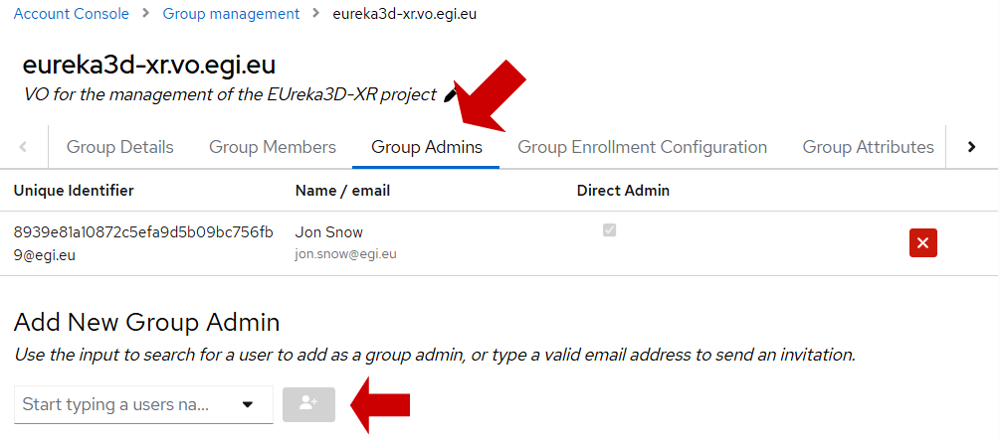
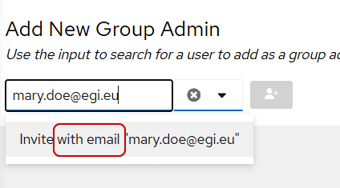
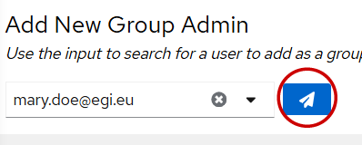
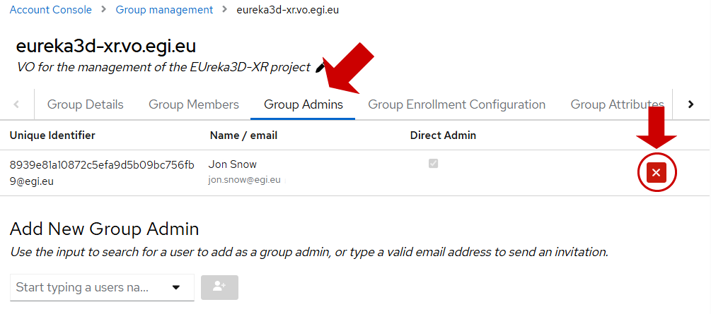

Access the
[Group Management page](https://aai.egi.eu/auth/realms/id/account/#/groups/admingroups)
and navigate the hierarchy of groups to locate the group where the administrator
must be added. Click on the group and then on the “Group Admins” tab.

{.img-screenshot}

This will list all the administrators of the group, including details about the
group admin being a direct admin or not. A **direct admin** has been added for
this specific group. An **indirect admin** is an administrator that obtained the
permissions as part of the group hierarchy: Group Admins become
[indirect administrators of all the subgroups of the group](../#structure-of-a-group).

{.img-screenshot}

## Adding administrators to a group

Admins can be added in the “Add New Group Admin” section.

{.img-screenshot}

To add an administrator, add the name or email of the user to locate him/her and
click on the button. The user **will become an administrator immediately**.

{} To add a user directly, the user must
be part of a group in which you are a Group Admin. {}

If the user is not part of any group you manage, then you will not be able to
locate the user by name, and **an email invitation will have to be sent** to
his/her email address. Just specify the email address in the box. A message will
indicate that the user will be invited through an email.

{.img-screenshot}

Once you click on “Invite with email…. “, the icon of the button will change,
indicating that an invitation will be sent by email. The user will become an
administrator **just after the invitation is accepted**.

{.img-screenshot}

{} Being a Group Admin is a status local
to Check-in, so Check-in does not release any specific entitlement for
administrators. If an application needs to verify an administrator, this should
be modelled with a specific “administrator” role or subgroup. {}

## Removing administrators from a group

Administrators can be removed by using the cross icon in the “Group Admins” tab.

{.img-screenshot}
