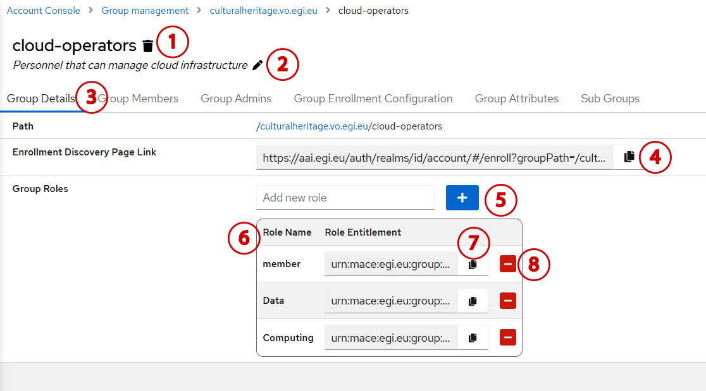
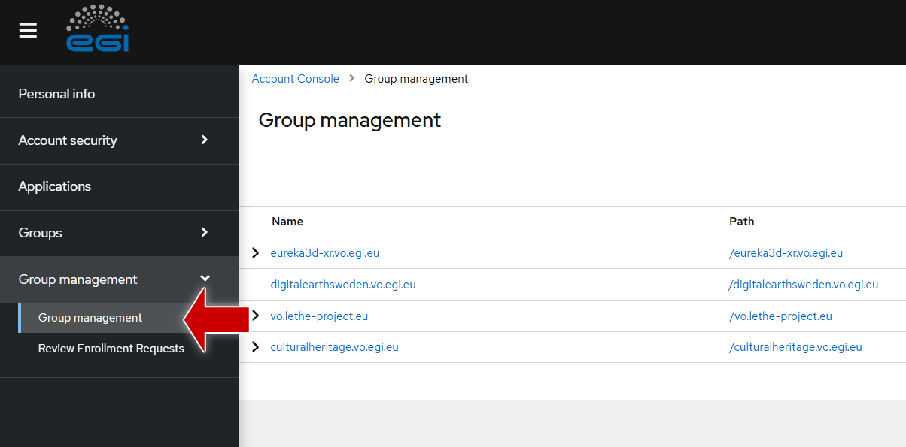
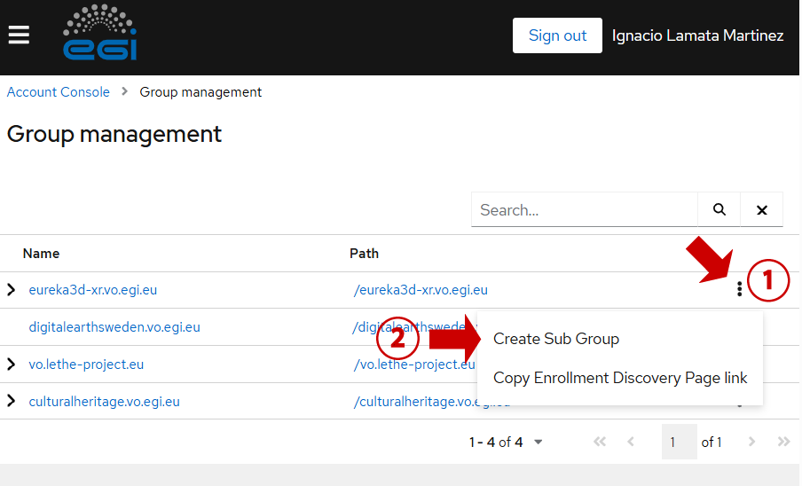
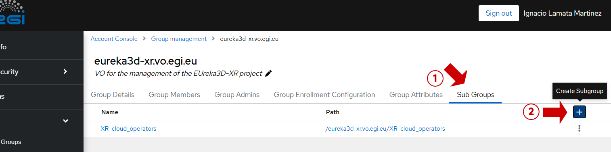
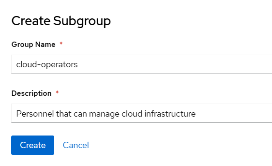
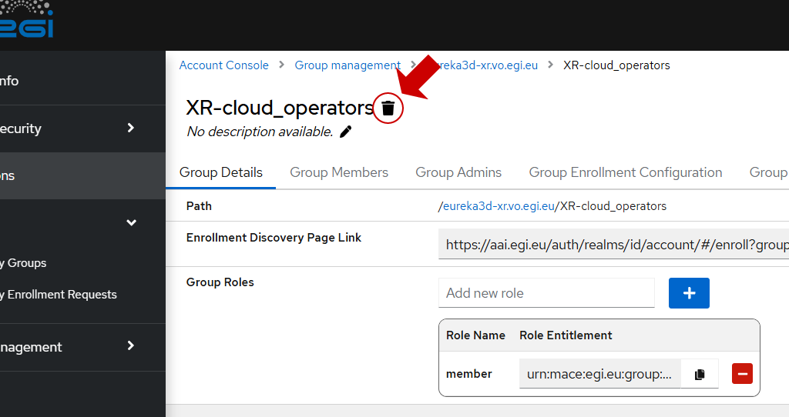
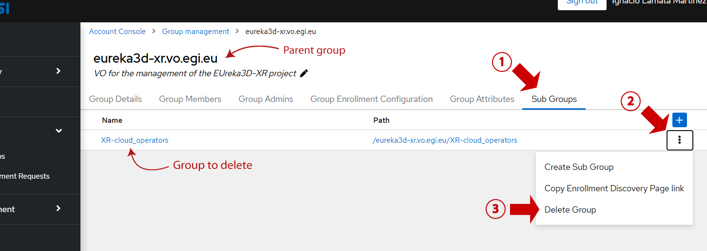

## Group information

When clicking on a group from the
[Group Management page](https://aai.egi.eu/auth/realms/id/account/#/groups/admingroups),
the following group information is shown.

 {.img-screenshot}

1.  The name of the group, together with an icon to delete the group.
2.  The description of the group, together with an icon to modify it.
3.  The menu for the group. The “Group Details” contain the basic information of
    the group. There are other tabs to show different information about the
    groups: its members, its administrators, its enrolment flows (for users to
    join the group), its custom attributes and its subgroups.
4.  The default link to request membership in the group, with a button to copy
    the link. When a user follows the link, he/she will be presented with the
    Enrolment Discovery Page, which offers all publicly available
    [enrolment flows](../members/#group-enrolments) to join the group (those
    enrolments with the attribute “Visible” enabled).
5.  A section to [add new roles](../roles/#creating-group-roles) for the group.
6.  The list of roles available for the group, containing the name of the role
    and the entitlement.
7.  A button to copy the entitlement. The entitlement is the string that
    applications receive from the user information when he/she has the role
    assigned.
8.  A button to [delete the role](../roles/#deleting-group-roles).

## Creating groups

To create a group, access the
[Group Management page](https://aai.egi.eu/auth/realms/id/account/#/groups/admingroups)
and navigate the hierarchy of groups to locate where you want to create a
subgroup.

 {.img-screenshot}

Using the three-dot menu on the right of the parent group, click on “Create Sub
Group”.

 {.img-screenshot}

Alternatively, you can use the “Create Sub Group” option from the “Sub Groups”
tab of any group.

{.img-screenshot}

Fill in the details and the group will be created.

 {.img-screenshot}

## Deleting groups

To delete a group, access the
[Group Management page](https://aai.egi.eu/auth/realms/id/account/#/groups/admingroups)
and navigate the hierarchy of groups. Locate the group you want to delete and
click on it.

 {.img-screenshot}

Use the “trash” icon to delete the group.

 {.img-screenshot}

{} The "trash" icon will not be
available if the group has any subgroups .A group cannot be deleted if it has
any associated subgroup. {}

Alternatively, you can delete a group from its parent group, by using the “Sub
Groups” tab. Using the three-dot menu on the right of the group to be deleted,
click on “Delete Group”.

 {.img-screenshot}

{} VOs (the root groups) cannot be
deleted through the interface. {}
