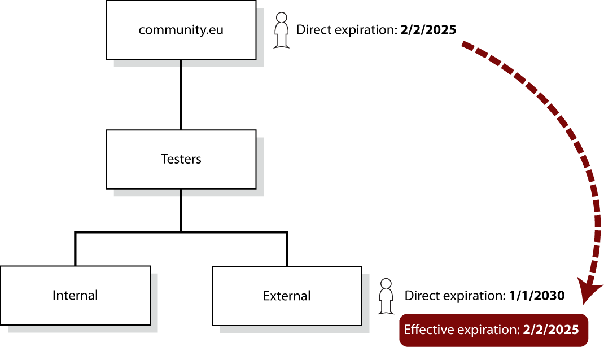

Users can join a group to become members of the group. This membership can be
limited by time, if desired. The exception is for the VO group (the root group),
whose membership is always limited to a maximum of one year and must be renewed
by the user at the end of that period.

Users will have one or more roles inside a group. A default “member” role may
exist and be assigned if no other role is specified, but this role is not
required to be a group member – any role qualifies a user as a member.

The list of group members can be found in the “Group Members” tab of a group.
You can access the desired group from the
[Group Management page](https://aai.egi.eu/auth/realms/id/account/#/groups/admingroups).
The Group Members tab shows the list of users belonging to the group, together
with other useful information.

 {.img-screenshot}

1. The “Direct Members” allows to visualise only direct members or all members
   (direct + indirect). Direct members are those that are explicit members of
   the group, whereas indirect members are those that inherited membership from
   a subgroup. If a user has been only added as a member of a group, he/she will
   be categorised as an indirect member of the parent groups.

   

   Herein, unchecking the “Direct Members” option from the view of the VO **group
   will display the entire VO population**. Note that unchecking this option will
   add a new informative column called "Group Path" to specify the group to which
   the user belongs. This may generate duplicate entries for users who are members
   of several subgroups.

2. The **Unique User Identifier** is the string that uniquely identifies a user,
   and it is made of a long alphanumerical string suffixed by “@egi.eu”.
3. Name / email shows the full name and email address of the user.
4. The roles that the user has in the group. Note that users can have more than
   one role assigned in the group but must have at least one assigned. There is
   a filter button to display only users with a certain role.
5. The date when the user membership started.
6. The date when the user membership will stop working. When the membership is
   close to expire an indication will be displayed.

    {.img-screenshot}

7. A user can be one of these three [membership states](#membership-status):

    **Active** {.img-icon}

    **Suspended** {.img-icon}

    **Pending** {.img-icon}

   Additionally, there is a filter option to show users that have only a certain
   status.

8. The “Add Member” button can be used to add new members, as explained
   [below](/#adding-users-to-a-group-manually).
9. The “Search” field can be used to filter users by Unique Identifier, Name or
   email.
10. There are three action buttons:
    - Remove, to [remove a user from the group](#removing-a-user-from-a-group).
    - Edit, to
    - [change some aspect of the user membership](#change-a-user-membership).
    - Suspend, to [revoke user’s permissions](#removing-a-user-from-a-group).

## Membership status

A user in a group can be in one of these three states:

a.  **Active**, when the user is a full
member of the group and receives all entitlements (the permissions) associated
with the roles that he/she has assigned in the group. {.img-icon}

b.  **Suspended**, when a user has been
revoked from the group, either by an membership expiration date or manually by
an administrator. The user maintains a symbolic membership since he/she will not
receive any entitlements of any of the roles assigned to him/her. Suspension is
detailed in the Section [Removing a user](#removing-a-user-from-a-group).
{.img-icon}

c.  **Pending**, when a user has been
accepted to join a group at a specific future time. The user will become Active
automatically at the defined date. Alternatively, administrators can force the
Active membership manually before the defined time. This is discussed in the
[creation of enrolments](#creation-of-group-enrolments). {.img-icon}

For a user to join a group, a group enrolment must be used.

### Membership expiration

When the user membership in a group expires, the user becomes
[suspended](#membership-status) in that group. Users have membership expiration
dates defined for every group they belong to. However, the membership in a group
is conditioned by expiration dates in any parent group. If the user membership
expires in a parent group, the membership of a child group will be also
suspended.

This leads to two types of membership expiration: **direct** and **effective**.

- **Direct** is the expiration date that the user explicitly has in the group.
- **Effective** is the practical expiration date, which is different from the
  direct expiration date if the user has an earlier expiration time in a parent
  group.

Membership expiration dates can be found in the “Group Members” tab. The
effective dates are shown only when the expiration of a parent date comes before
the direct expiration date of the current group. A link will be shown to make it
easier to see which group is responsible for the effective date.

 {.img-screenshot}

When a membership is close to expire for a user, Group Admins will have the
option to extend it by using the “Extend” button directly.

 {.img-screenshot}

## Group Enrolments

Group enrolments are used **when a user joins a group**. Enrolments are
**preconfigured workflows** to add users into a specific group. An enrolment is
defined **within a group**, and specifies things such as:

- For how long the user membership in a group will last.
- When the membership becomes operational (it can be immediately or at a future
  time).
- If the membership request must be automatically approved without human
  intervention or manually approved by an administrator.
- If the user must provide some sort of information when requesting membership
  in the group.
- If the group enrolment should be publicly available or not (defined by the
  “Visible” attribute) when the user access the default link to join a group.
- The Acceptable Use Policy (AUP) to join the group.
- What roles are available to the user when joining the group.

When a user first joins a group, he/she must always follow an enrolment. When a
group is created, a default enrolment is also created together with it. This
default enrolment can be changed at any time, and multiple enrolments can be
created for the same group, each of them with different enrolment conditions.

To see the enrolments defined for a group, access the
[Group Management page](https://aai.egi.eu/auth/realms/id/account/#/groups/admingroups),
locate the desired group and click on it. Its enrolments can be found in the
“Group Enrolment Configuration” tab.

 {.img-screenshot}

### Default Group Enrolment

Every group has a default enrolment to join the group, which is marked in the
list of enrolment configurations.

 {.img-screenshot}

To change it, just click on the three-dot menu on the right of the enrolment
entry and use the option “Set this enrolment as default”.

 {.img-screenshot}

{} The AUP of the enrolment created by
default for a VO (the root group) uses the “AUP text” defined in the
[VO ID Card](../../#how-to-create-your-own-virtual-organisation). Note that this
text cannot be modified, so if you need to update this AUP, you will need to
change the URL to point to the updated version of the AUP. {}

### Creation of Group Enrolments

To create an enrolment, access the “Group Enrolment Configuration” tab and click
on the “+” button.

 {.img-screenshot}

This will open a form for the creation of the enrolment.

{.img-screenshot}

The necessary information for the enrolment creation is the following:

1. A name for the enrolment.
2. The number of days that the membership will last for the user, once he/she
   joins the group.

    {.img-screenshot}

   The VO (or root group) must have an expiration date of 365 days or less, but
   other subgroups can have any length, including no expiration. However, consider
   that this expiration will be also
   [affected by the expiration of any parent group](#membership-expiration) in the
   group hierarchy. When a VO expiration is longer than 365 days, an error message
   will be shown.

   
   {.img-screenshot}

   Enrolments with no expiration dates get a warning, just to make sure that this
   was your intention.

   
   {.img-screenshot}

3. A future date when the membership should start. This option is useful to
   control when the access to the group will be granted for a user. A user
   joining a group with a future membership date, will be in a
   [pending status](#membership-status).

   
   {.img-screenshot}

4. Enrolment requests may be either approved automatically or manually approved
   by an administrator. This attribute specifies if the request needs a manual
   approval from a Group Admin (which is normally recommended). If it does, a
   Group Admin will have to approve the user request. If not, any user that
   requests it will be automatically approved and will become a member as soon
   as the request is received.
5. This attribute defines any extra information that must be collected from the
   user in the request. The information can be customised with a label and a
   description. The label will be presented to the user (e.g. the label could be
   “Reason to join the group”) and the description should explain the user how
   to fill in the comment field. The user will visualise this information as
   shown in the following image.

    {.img-screenshot}

6. The link for the Acceptable Use Policy of the group. This link will be
   presented to the user and its acceptance must be acknowledged as a
   requirement to join the group.
7. The group roles that the user can have assigned when joining the group. These
   roles will be presented to the user, who will decide which role(s) to
   request. There is an option to allow the user to accept only one role or
   multiple roles.
8. This attribute controls if this enrolment should be publicly available or
   not. If this attribute is checked, users following the
   [default enrolment link](#default-group-enrolment) of the group will be able
   to choose the enrolment to join the group.

    {.img-screenshot}

9. If the enrolment is enabled or disabled. This is useful to disable an
   enrolment temporarily, instead of deleting it.

### Modification of Group Enrolments

To modify an existing enrolment, access the enrolment data by clicking on the
name of the enrolment.

 {.img-screenshot}

This will open a window with the enrolment data, which can be modified. After
finishing your modifications, click “Submit” to save changes.

### Deletion of Group Enrolments

To delete an enrolment, first access the enrolment data by clicking on the name
of the enrolment.

 {.img-screenshot}

In the window with the enrolment data, click on the “trash” button to delete it.

 {.img-screenshot}

## Adding users to a group

There are three main ways to add a user to a group:

- [By user request](#adding-users-by-user-request). The user must know an
  enrolment URL to request membership. This URL is generally sent by a Group
  Admin or found on a Website or application.
- [By invitation](#adding-users-by-invitation), where a Group Admin sends an
  invitation to the user email address.
- [By direct registration](#adding-users-by-direct-registration) by a Group
  Admin. To do so, the user must belong to one of the groups managed by the
  Group Admin and the group should not need any AUP acceptance.

Both the user request and the invitation create an enrolment request, which may
need [approval](#approving-group-membership-requests) from a Group Admin,
depending on how [the enrolment was created](#creation-of-group-enrolments). The
direct registration does not need an extra approval, since the user registration
is already done by a Group Admin.

{} When a user joins a group, one or
more roles are assigned to them. If the enrolment request is submitted by the
user, one or more roles will be chosen by the user, within the permitted roles
defined in the enrolment configuration. If the user is directly added by a Group
Admin, the roles will be selected by the Group Admin, also according to the
roles permitted by the enrolment configuration. {}

### Adding users by user request

Users can request to join a group. To do so, they should either contact an
administrator or use the link of any group enrolment. This link can be sent to
users via email or placed on a Website or in an application.

As a Group Admin, the enrolment link can be obtained from different ways:

- To copy the “Enrolment Discovery Page” link access the list of VOs in the
  [Group Management page](https://aai.egi.eu/auth/realms/id/account/#/groups/admingroups).
  Navigate the hierarchy of groups to locate the desired group and click on the
  three-dot menu on the right of the group. Finally, click on “**Copy Enrolment
  Discovery Page link**”.

 {.img-screenshot}

The Enrolment Discovery Page will let the user choose which enrolment to use
from those publicly available (those with the
“[Visible to non-members](#creation-of-group-enrolments)” attribute enabled).
Once the user follows the link, the specific enrolment can be selected from the
“Group Enrolment” field.

{.img-screenshot}

- Another option is to access any group and access the “Group Enrolment
  Configuration” tab. This will list all existing enrolments. Locate the desired
  group and click on the three-dot menu on the right of the group. Finally,
  click on “**Copy Group Enrolment Direct Link**”. This link will use this
  specific enrolment, no other option will be given to the user. Herein, it is
  **not necessary** that the enrolment has the attribute “Visible to
  non-members“ enabled.

 {.img-screenshot}

When the user accesses an enrolment URL, they will find the enrolment page to
collect additional information for the membership request.

{.img-screenshot}

The information requested will depend on how the enrolment
[was created](#creation-of-group-enrolments). The example enrolment above
requires an “Explanation to join the Data activity” (1) that the user must fill
in (2). The selection of the group role (3) is always mandatory and, in the
example, this enrolment only accepts the “Data” role. Some enrolments may give
users the option to choose one or more roles.

Once submitted, the user will get an entry for the pending request under the
menu option “Groups > View My Enrolment Requests”.

 {.img-screenshot}

### Adding users by invitation

Group Admins can send invitations to users to join a group. Once accepted, the
user will become a member of the group.

To send an invitation, access the
[Group Management page](https://aai.egi.eu/auth/realms/id/account/#/groups/admingroups),
locate the desired group, click on it and access the “Group Members” tab. Click
on the “Add Member” button.

 {.img-screenshot}

The first step is to select one of the available enrolment configurations.

 {.img-screenshot}

Then, select the role(s) for the user for this invitation and click “**Next**”.

{.img-screenshot}

Input the user email address and click on “**Send invite to this email
address**…”.

 {.img-screenshot}

Finally, make sure that the “Choose Action” is set to “**Invite Member**” and
click “**Confirm**”.

 {.img-screenshot}

### Adding users by direct registration

Group Admins can directly add a user in a group without the user interaction.
For this, two prerequisites are necessary:

1. The user **must be known**, meaning that he/she must be a member of any of
   the groups of the Group Admin.
2. The group **must not have any AUP** in place, since the Group Admin cannot
   accept any Acceptable Use Policy in the name of the user.

If these two prerequisites cannot be met, you need
[to invite](#adding-users-by-invitation) the user instead.

If the user is added directly in a group, **the user will be informed** that
he/she has been added to the group.

To add a user directly, access the
[Group Management page](https://aai.egi.eu/auth/realms/id/account/#/groups/admingroups),
locate the desired group, click on it and access the “Group Members” tab. Click
on the “Add Member” button.

 {.img-screenshot}

The first step is to select one of the available enrolment configurations.

 {.img-screenshot}

Then, select the role(s) for the user for this invitation and click “**Next**”.

{.img-screenshot}

Finally, input the name or email address of the user. If the user is not known,
you cannot add the user directly and you will need to
[send an invitation](#adding-users-by-invitation). If the user is known, you
will be able to click on “**Add Member Directly**” and then “**Confirm**”. The
user will be notified and will be immediately made a member of the group.

 {.img-screenshot}

The user will be notified of this and will become immediately a member of the
group.

### Approving group membership requests

Once the user has submitted a request to join a group, the Group Admins will get
a notification by email and the request will be visible as “Pending Approval”
under the menu option “Group management > Review Enrolment Requests”.

 {.img-screenshot}

Following the link from the notification email or clicking on the “Review”
button of the request, will show the basic information of the request, which is
necessary to assess whether to approve or reject the request. This information
includes:

- Full name
- Email address
- Username / identifier
- Identification of the identity provider that authenticated the user (such as
  the University of Oxford, Google, LinkedIn, etc).
- The Assurance of the user. This is a compendium of different attributes to
  support the assessment of the request. It includes for example if the user has
  authenticated with a low assurance organisation (such as Google, where
  everyone can create a user account) or a high assurance organisation (e.g.
  when they have some control over the user real identity).

{.img-screenshot}

Group Admins should review the request information and Approve or Deny the
request subsequently.

{} As a Group Admin, it is important
that you verify all the information provided by Check-in to evaluate if you
should approve or reject a membership request. Consider that enrolment URLs are
not secret, and malicious actors may try to gain access to your resources and
data. ONLY approve requests of users according to the rules that govern your
community. {}

## Change a user membership

User membership can be edited to
[change the roles](../roles/#assigning-or-removing-group-roles-tofrom-users) of
the user or the membership expiration. To edit the user membership, locate the
user in the “Group Members” tab of the group and click on the Edit icon on the
right of the user entry.

 {.img-screenshot}

This will open a dialog where some aspects of the user membership can be
modified.

## Removing a user from a group

The membership of a user can be deactivated from a group in three ways:

- Automatically, when the group membership of the user
  [naturally expires](#membership-expiration). The membership in a VO (the root
  group) must normally be renovated every year.
- When the user is manually suspended by a Group Admin.
- When the user is manually removed from the group by a Group Admin.

Users that are **removed** from the group are completely deleted from the group
and they do not receive any permissions associated with the group from that
point. If they need to join the group again, they will need to follow a group
enrolment again. Users that are **suspended** also do not receive any
permissions associated with the group, but they stay listed in the group members
and could recover its membership status.

{} When a user is suspended in a group,
he/she also becomes suspended of any child group in the group hierarchy.
{}

To manually suspend a user’s membership, access the “Group Members” tab of the
group, locate the user that you want to remove and click on the lock button on
the right of the user entry.

 {.img-screenshot}

A justification for this suspension can be specified. This justification will be
sent to the user by email.

{.img-screenshot}

{} When a user is suspended, the
administrators of the group and the user will be notified. {}

To manually remove a user from a group, access the “Group Members” tab of the
group, locate the user that you want to remove and click on the cross button on
the right of the user entry.

 {.img-screenshot}
