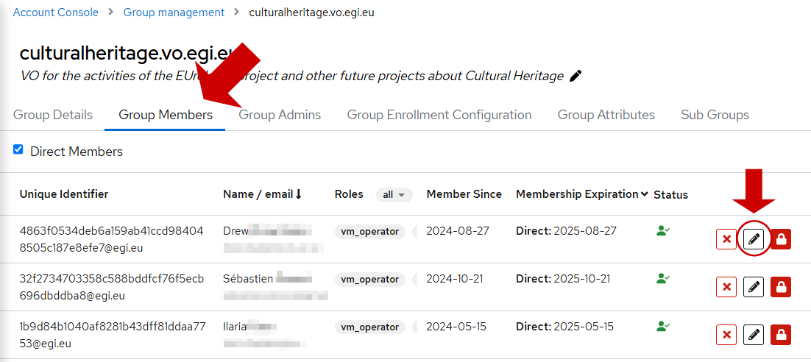

Roles are created and are valid within a specific group. Access the group
through the
[Group Management page](https://aai.egi.eu/auth/realms/id/account/#/groups/admingroups).
The roles defined for a group are listed in the “Group Details” tab, under the
“Group Roles” section.

 {.img-screenshot}

## Creating group roles

To create a role, add a role name in the field and click on the “+” button.

 {.img-screenshot}

You will get a dialog to confirm the creation of the role.

## Deleting group roles

To delete a role, click on the “-“ button on the right of a role entry.

 {.img-screenshot}

{} A role cannot be deleted from a group
if it is assigned to any member. {}

## Assigning or removing group roles to/from users

Users can get a role assigned in two ways:

- When the user joins a group, either from the configuration of the enrolment
  they follow to join [a group](../groups/#group-information), an
  [invitation link](../members/#adding-users-to-a-group-by-invitation) or when
  an administrator
  [adds a user manually](../members/#adding-users-to-a-group-manually) in a
  group.
- By manually assigning the user’s roles when the user already belongs to a
  group.

To assign or remove a role to/from a user manually, visit the “Group Members”
tab of the group. The Edit icon on the right of the user can be used to modify
the user’s roles.

 {.img-screenshot}

In this example, the user only has the “Data” role assigned to him.

 {.img-screenshot}

Click on the Edit icon button on the right of the user and edit the roles in the
“Group Roles” section.

 {.img-screenshot}

This will open a form with the user information. Scroll to the “Group Roles”
section and check or uncheck roles as desired. Remember that the user must have
at least one role assigned in the group.

 {.img-screenshot}

Save changes and the user will now show the new role configuration. In this
case, the “Computing” role has been added. The same procedure can be followed to
remove roles from the user.

 {.img-screenshot}
