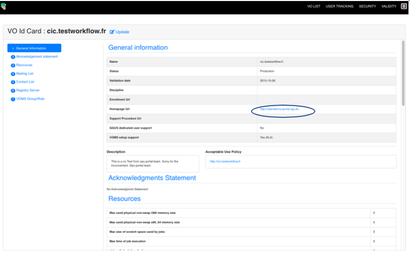
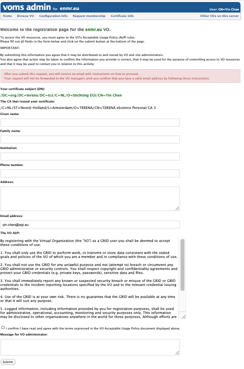

## Authentication

Some EGI services authentication is based on
[X.509](https://tools.ietf.org/html/rfc5280) certificates. The certificates are
issued by Certification Authorities (CAs) part of the
[EUGridPMA](https://www.eugridpma.org/) federation which is also part of
[IGTF](https://www.igtf.net/) (International Global Trust Federation).

The role of a Certification Authority (CA) is to guarantee that users are who
they claim to be and are entitled to own their certificate. It is up to the
users to discover which CA they should contact. In general, CAs are organised
geographically and by research institutes. Each CA has its own procedure to
release certificates.

EGI sites, endpoints and tools accept certificates part of the
[EUGridPMA](https://www.eugridpma.org/) distribution. If your community VO is
enabled on that site, your certificate will be accepted by that site since all
certificates are recognized at site level.

Usually, a certificate can be installed by command-line tools, but they can also
be stored in the web browser to access EGI web tools and services.

### Get a Certificate

The [list of EGI recognised CAs](http://www.eugridpma.org/members/worldmap/)
provides a clickable map to find your nearby CA. Several of these offer the
option to get an 'eScience Personal' certificate online from the Terena
Certificate Service CA.
[Check the countries where this is available](https://www.terena.org/activities/tcs/participants.html).

If eScience Personal certificate is not available in your country, then request
a certificate from a regular [IGTF CA](https://www.igtf.net/pmamap). The request
is normally generated using either a web-based interface or console commands.
Details of which type of request a particular CA accepts can be found on each
CA's site.

For a web-based certificate request, a form must usually be filled in with
information such as the name of the user, home institute, etc. After submission,
a pair of private and public keys are generated, together with a request for the
certificate containing the public key and the user data. The request is then
sent to the CA, while the private key stays in the browser, hence the same
browser must be used to retrieve the certificate once it is issued.

Users must usually install the CA root certificate in their browser first. This
is because the CA has to sign the user certificate using its private key, and
the user's browser must be able to validate the signature.

For some CAs, the certificate requests are generated using a command line
interface. The details of the exact command and the requirements of each CA will
vary and can be found on the CA's site.

Once received the request, the CA will have to confirm your authenticity through
your certificate. This usually involves a physical meeting or a phone call with
a Registration Authority (RA). A RA is delegated by the CA to verify the
legitimacy of a request, and approve it if it is valid. The RA is usually
someone at your home institute, and will generally need some kind of ID to prove
your identity.

### Install a Certificate

After approval, the certificate is generated and delivered to you. This can be
done via email, or by giving instructions to you to download it from a web page.

#### Browser installation

Install the certificate in your browser. If you don’t know how to upload your
certificate in your browser have a look at the
[examples](https://ca.cern.ch/ca/Help/).

#### Host installation

To use EGI services with your certificate, you must first save your certificate
to disk.

The received certificate will usually be in one of two formats:

- _Privacy Enhanced Mail Security Certificate (PEM)_ with extension `.pem` or
- _Personal Information Exchange File (PKCS12)_ with extensions `.p12` or
  `.pfx`.

The latter is the most common for certificates exported from a browser (e.g.
Internet Explorer, Mozilla and Firefox), but the `PEM` format is currently
needed on EGI user interface. The certificates can be converted from one format
to the other using the `openssl` command.

If the certificate is in `PKCS12` format, then it can be converted to `PEM`
using `pkcs12`:

1. First you will need to create the private key, use `-nocerts`. Open your
   terminal, enter the following command:

   ```sh
   openssl pkcs12 -nocerts -in my_cert.p12 -out userkey.pem
   ```

   where:

   | Filename       | Description                         |
   | -------------- | ----------------------------------- |
   | `my_cert.p12`  | is the input PKCS12 format file;    |
   | `userkey.pem`  | is the output private key file;     |
   | `usercert.pem` | is the output PEM certificate file. |

   When prompted to `“Enter Import Password”`, simply press enter since no
   password should have been given when exporting from keychain. When prompted
   to `“Enter PEM pass phrase”`, enter the pass phrase of your choice, e.g.
   `1234`.

1. Now you can create the certificate, use `-clcerts`, (use `-nokeys` here will
   not output private key), and the command is:

   ```sh
   openssl pkcs12 -clcerts -nokeys -in my_cert.p12 -out usercert.pem
   ```

   When prompted to `“Enter Import Password”`, simply press enter since no
   password should have been given when exporting from keychain.

   For further information on the options of the pkcs12 command, consult
   `man pkcs12`

It is strongly recommended that the names of all these files are kept as shown.
Once in PEM format, the two files, `userkey.pem` and `usercert.pem`, should be
copied to a _User Interface (UI)_. For example, the ‘standard’ location for Mac
would be `.globus` directory in your `$HOME`. I.e. `$HOME/.globus/`

### Renewing the Certificate

CAs issue certificates with a limited duration (usually one year); this implies
the need to renew them periodically. The renewal procedure usually requires that
the certificate holder sends a request for renewal signed with the old
certificate and/or that the request is confirmed by a phone call; the details
depend on the policy of the CA. The certificate usually needs to be renewed
before the old certificate expires; CAs may send an email to remind users that
renewal is necessary, but users should try to be aware of the renewal date, and
take appropriate action if they are away for extended periods of time.

### Taking Care of Private Keys

A private key is the essence of your identity. Anyone who steals it can
impersonate the owner and if it is lost, it is no longer possible to do
anything. Certificates are issued personally to individuals, and must never be
shared with other users. To user EGI services, users must agree to an Acceptable
Use Policy, which among other things requires them to keep their private key
secure.

On a UNIX UI, the certificate and private key are stored in two files. Typically
they are in a directory called `$HOME/.globus` and are named `usercert.pem` and
`userkey.pem`, and it is strongly recommended that they are not changed. The
certificate is public and world-readable, but the key must only be readable by
the owner. The key should be stored on a disk local to the user's UI rather
than, for example, an NFS-mounted disk. If a certificate has been exported from
a browser, a PKCS12-format file (`.p12` or `.pfx`), which contains the private
key, will have been locally stored and this file must be either encrypted,
hidden or have its access rights restricted to only the owner.

If a private key is stored under the Andrew File System (AFS), access is
controlled by the AFS Access Control Lists (ACL) rather than the normal file
permissions, so users must ensure that the key is not in a publicly-readable
area.

Web browsers also store private keys internally, and these also need to be
protected. The details vary depending on the browser, but password protection
should be used if available; this may not be the default (it is not with
Internet Explorer). The most secure mode is one in which every use of the
private key needs the password to be entered, but this can cause problems as
some sites ask for the certificate many times. Reaching a compromise between
security and convenience is vital here, so that neither come too short.

It is important not to lose the private key, as this implies loss of all access
to the services, and registration will have to be started again from scratch.
Having several securely protected copies in different places is strongly
advised, so the certificate can be used from a web browser and several UI
machines.

A private key stored on a UI must be encrypted, meaning that a passphrase must
be typed whenever it is used. A key must never be stored without a passphrase.
The passphrase should follow similar rules to any computer password. Users
should be aware of the usual risks, like people watching them type or
transmitting the passphrase over an insecure link.

## Authorisation

The sites authorise the access to their resources to a VO according to their own
access policies, resource location, how many resources is the VO allowed to use.
There are finer authorization policies, including groups, roles, in this way,
the users can be structured in a VO. So, it is not a 0/1 authorization policy.

The community has full control of the access to the VO according to community
authorization policies. The VO membership, groups and roles are managed by VO
managers (Privileged VO members) independently by using the Virtual Organization
Membership Service (VOMS).

### VOMS

The Virtual Organization Membership Service (VOMS) is an attribute authority
which serves as central repository for VO user authorization information,
providing support for sorting users into group hierarchies, keeping track of
their roles and other attributes in order to issue trusted attribute
certificates and SAML assertions used in the Grid environment for authorization
purposes. VOMS is composed of two main components:

- the VOMS core service, which issues attribute certificates to authenticated
  clients
- the VOMS Admin service, which is used by VO manager to administer VOs and
  manage user membership details.

How does it work? Usually, users submit tasks/jobs to the infrastructure that
are attached with their own credential, and the credential is attached with a
proxy certificate that is a short-term credential signed with the user
certificate and is extended with the VO attributes. In general speaking, a user
credential is just an ID, and a proxy contains the VO details, so a resource
site by receiving the proxy can recognize that the user is part of such a VO
with such a role from such a group. A user can be part of multiple VO, thus can
generate multiple proxies.

### Register to a VO

Visit [Operation Portal](https://operations-portal.egi.eu) to search for
existing VOs

1. If there are any community VOs matching your requirements (with _Registry
   System_ is _VOMS_), then click _Action_-> _Details_ to look at the VO
   information. In the _VO ID Card_ page, click the link for _Enrollment URL_,
   it will take you to the VO VOMS page. **You should have already discussed
   with the EGI support team, they would help you to contact the VO managers and
   get approval for your access.** 

1. If there are no relevant VOs, you can send a request
   [to register a new VO](ttps://operations-portal.egi.eu/vo/registration).
   (Note, for EGI services, you should request for `VOMS configuration`, once VO
   is configured, you will be notified about your VO VOMS link). More
   information can be found at
   [Guideline for VO registration](https://confluence.egi.eu/display/EGIPP/PROC14+VO+Registration).
   **Again, this is usually guided by the EGI support team. You should already
   have a meeting with them to discuss your requirements. They will help you to
   get resources from EGI providers, and sign
   [SLA](https://confluence.egi.eu/display/EGISLM/EGI+OLA+SLA+framework) with
   you.**

1. Request your VO membership at VO VOMS page. You will have to enter required
   information and then wait for approval.

   

## Creating a proxy

### VOMS configuration

Every VO needs two different pieces of information:

- the `vomses` configuration files, where the details of the VO are stored (e.g.
  name, server, ports). These are stored by default at `/etc/vomses` and are
  normally named following this convention: `<vo name>.<server name>` (e.g. for
  fedcloud.egi.eu VO, you would have `fedcloud.egi.eu.voms1.grid.cesnet.cz` and
  `fedcloud.egi.eu.voms2.grid.cesnet.cz`.
- the `.lsc` files that describe the trust chain of the VOMS server. These are
  stored at `/etc/grid-security/vomsdir/<vo name>` and there should be one file
  for each of the VOMS server of the VO.

You can check specific configuration for your VO at the
[Operations portal](https://operations-portal.egi.eu/vo/a/list). Normally each VOMS
server has a _Configuration Info_ link where the exact information to include in
the `vomses` and `.lsc` files is shown.

### Proxy creation

Once you have the VO information configured (`vomses` and `.lsc`) and your
certificate available in your `$HOME/.globus` directory you can create a VOMS
proxy to be used with clients with:

```sh
voms-proxy-init --voms <name of the vo> --rfc
```

See for example, using `fedcloud.egi.eu` VO:

<!-- markdownlint-disable line-length -->

```sh
voms-proxy-init --voms fedcloud.egi.eu --rfc
Enter GRID pass phrase:
Your identity: /DC=org/DC=terena/DC=tcs/C=NL/O=EGI/OU=UCST/CN=Enol Fernandez
Creating temporary proxy ......................................................... Done
Contacting  voms1.grid.cesnet.cz:15002 [/DC=cz/DC=cesnet-ca/O=CESNET/CN=voms1.grid.cesnet.cz] "fedcloud.egi.eu" Done
Creating proxy ................................................................... Done

Your proxy is valid until Mon Feb  4 23:37:21 2019
```

<!-- markdownlint-enable line-length -->
