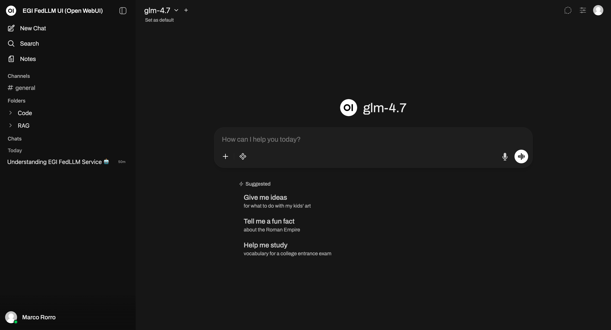

## Overview

FedLLM is an EGI service that provides access to Large Language Models (LLMs) through:

- A web-based chat interface: [chat.ai.egi.eu](https://chat.ai.egi.eu/)
- An OpenAI-compatible API: [llm.ai.egi.eu](https://llm.ai.egi.eu/)

The service enables users to generate and analyse text,
run retrieval-augmented generation (RAG) workflows,
and integrate AI capabilities into scientific applications.

## Access and Authentication

Access is managed through EGI Check-in:

1. Create an [EGI account](../../aai/check-in/signup)
2. Enrol in a supported Virtual Organisation (VO) such as
[vo.fedllm.egi.eu](https://aai-demo.egi.eu/auth/realms/id/account/#/enroll?groupPath=/vo.fedllm.egi.eu)
3. Access the service via [chat.ai.egi.eu](https://chat.ai.egi.eu/)
4. To use the API, generate an API key from the web interface (Account settings → Create a new secret key)
5. Use the API key to access the [llm.ai.egi.eu](https://llm.ai.egi.eu/) API endpoints

## Using AI Models

### Web Interface

After logging into the web interface:

- Select a model from the dropdown menu
- Enter your prompt in the input field
- Submit the request to receive a response



### API Usage

You can retrieve a list of available models:

```shell
curl https://llm.ai.egi.eu/v1/models \
  -H "Authorization: Bearer $API_KEY" | jq .
```

You can then send a request using one of the available models:

 ```shell
curl https://llm.ai.egi.eu/v1/chat/completions \
  -H "Authorization: Bearer $API_KEY" \
  -H "Content-Type: application/json" \
  -d '{
    "model": "gpt-oss-120b",
    "messages": [
      { "role": "user", "content": "Hello!" }
    ]
  }' | jq .
```

For detailed API specifications, refer to the
[API reference](https://developers.openai.com/api/reference/overview).
Note that not all endpoints are supported.

For client access and development, refer to the [LiteLLM SDK](https://docs.litellm.ai/docs/#litellm-python-sdk)
or the [OpenAI Client Libraries](https://developers.openai.com/api/docs/libraries/).

<!--
## Service options

### LLMs for Researchers

- Shared service access
- Standard quotas (requests per minute, tokens per minute)

### LLMs for Communities

- Dedicated deployments
- Custom models and quotas
- Integration with community services

### On-premises LLMs

- Deployment on community-owned infrastructure
- Full control over models and data
-->
## High-level Service architecture

The FedLLM service is composed of the following components:

- **Web interface** (Open WebUI): user interaction and API key management
- **API gateway** (LiteLLM): OpenAI-compatible interface and routing
- **Inference backend** (e.g. vLLM): execution of LLM workloads on GPU resources

User data is processed only for service delivery and is not retained or reused for training.

## Usage considerations

- Available models may vary depending on your VO
- Usage may be subject to quotas and rate limits
