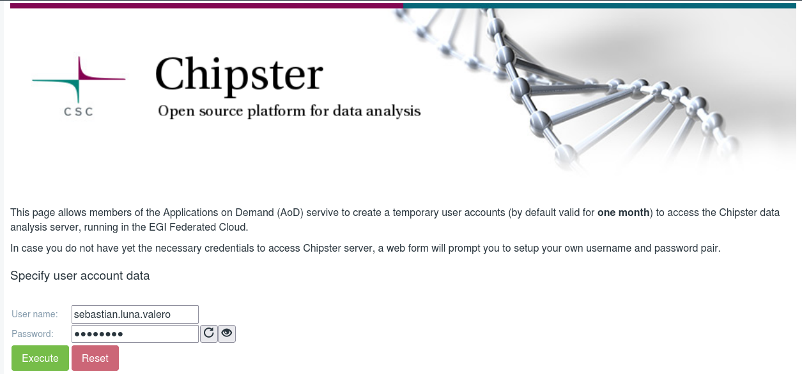
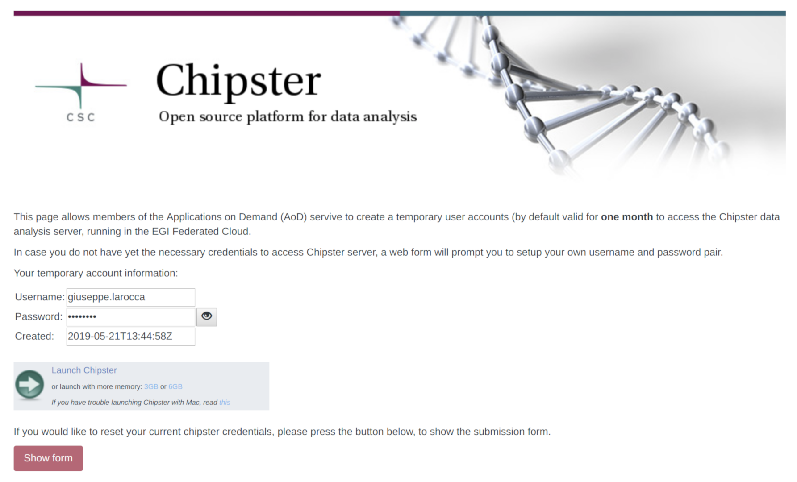

[Chipster](http://chipster.csc.fi/) is a user-friendly software for analysing
high-throughput sequencing and microarray data, provided as part of EGI\'s
Applications on Demand service.

The software contains over 400 analysis tools and a large collection of
reference genomes.

Users can save and share automatic analysis workflows, and visualize data
interactively using for example the built-in genome browser.

## EGI Chipster

The Chipster testbed configured at [CESGA](https://www.cesga.es/) offers:

- 8 vCPU cores,
- 32GB of RAM,
- 1TB of block storage in /data,
- Software and tools are in available under the `/cvmfs/tools_*` partition,
- Chipster (v3.16.3).

For accessing this testbed you need to be a member of the
[Applications on Demand](../).

## Create/Review a temporary account

Go to
[Chipster entry in Science Software on Demand Portal](https://fgsg.egi.eu/egissod/web/ssod/chipster-accounts)
and log in with your [EGI Check-In account](../../check-in)

The first time you log in, you need to generate a temporary password by clicking
on the _\"Execute\"_ button, as shown below.

Please refresh the web page after your password has been successfully generated.
Once the page is reloaded (see screenshot below) you are presented with a link
to access the
[Chipster server](http://chipster.aod.fedcloud.eu:8081/chipster.jnlp) that you
can access with the new credentials.

If your account has expired the Science Gateway will automatically generate a
new password for you. Just click on the _\"Show form\"_ button to manage your
credentials.

{}

Please provide appropriate acknowledgement of the use of this service in your
scientific publications. Here is an example:

**This work used the EGI Applications on Demand service, which is co-funded by
the EOSC-hub project (grant number 777536)** {}
