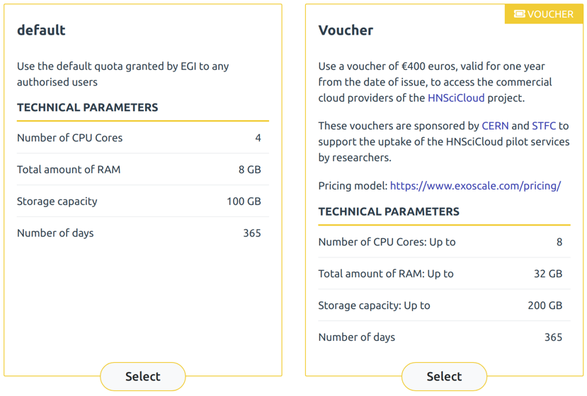
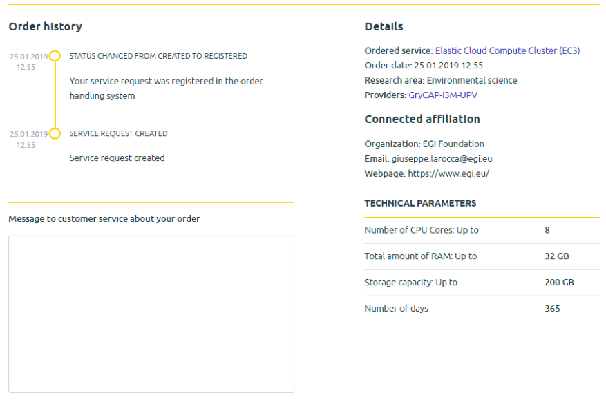
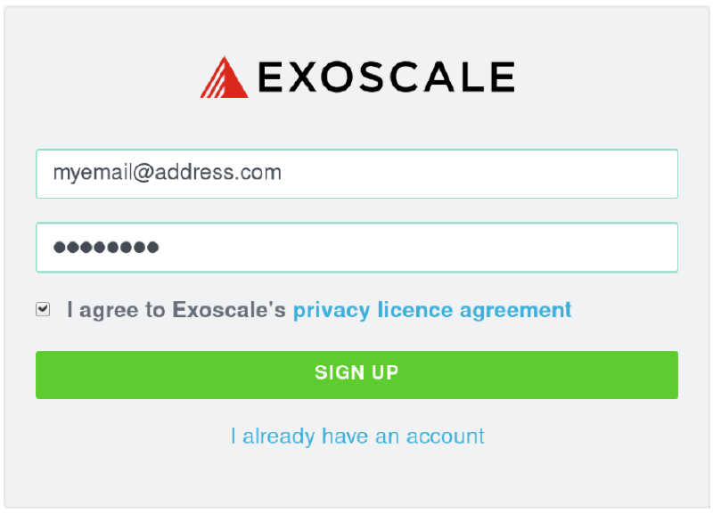
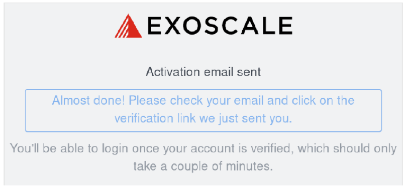
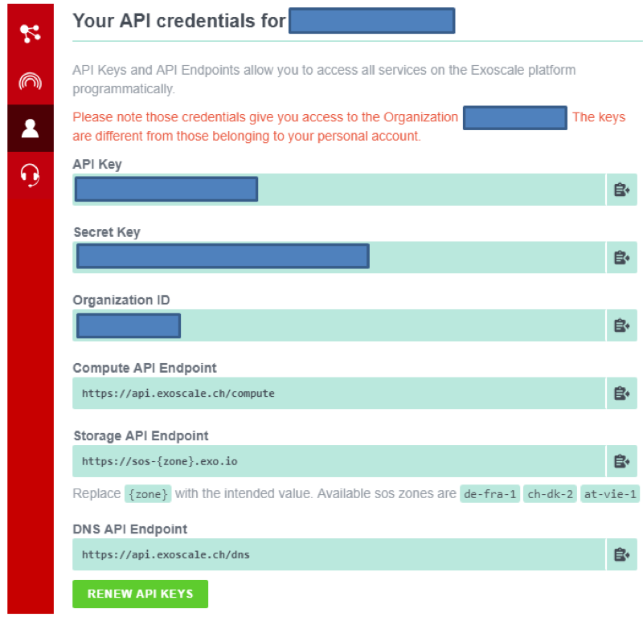
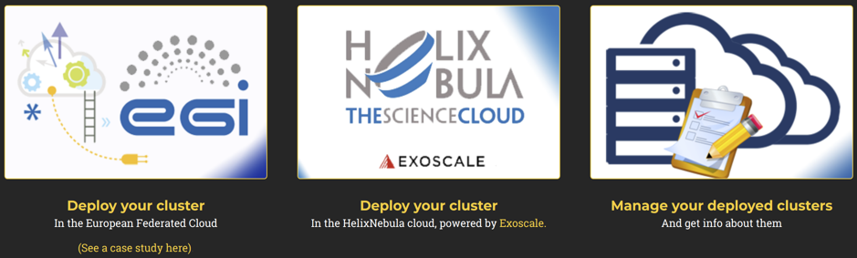
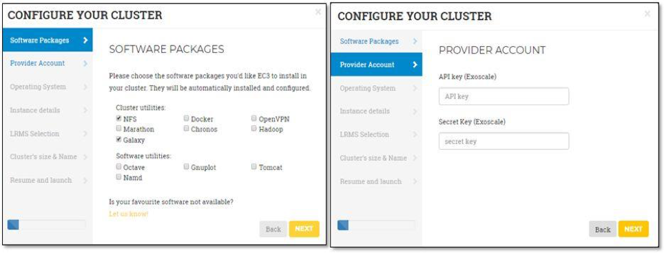

In this section we describe how users can easily discover the
[EGI Applications on Demand (AoD)](https://www.egi.eu/services/applications-on-demand/)
service published in the
[EOSC portal Marketplace](https://marketplace.eosc-portal.eu/) and submit a
service-order request to deploy an elastic virtual cluster on the HNSciCloud
pilot services. The virtual cluster will be deployed and configured with the
requested software packages using the
[Elastic Cloud Compute Cluster (EC3)](https://servproject.i3m.upv.es/ec3-ltos/)
portal.

## Submit a service-order request through the EOSC Portal Marketplace

The [EOSC Portal Marketplace](https://marketplace.eosc-portal.eu/) is a single
entry point where users can navigate the EOSC service catalogue, discover a
service of interest, get information about it, and place an order in a few
clicks by specifying the service requested along with the quantity, quality and
duration.

All the available services of the EOSC Marketplace are grouped in 8 main
categories and no authentication is required to browse and discover the list of
services published in the marketplace.

Exoscale vouchers can be used when selecting he Elastic Cloud Compute Cluster
(EC3) platform from the list of available services by submitting a service-order
request.

Placing orders in the EOSC Marketplace requires the user to authenticate. There
are two login options: use your personal academic credentials or use EGI
Check-in service. The first time you login into the marketplace requires some
extra information to be provided to configure the marketplace account.

Two different service options are available for EC3:

To deploy the virtual cluster on the HNSciCloud pilot services, select the
voucher option and click on _Next_ and provide additional information for
profiling the order (e.g. the motivation for requesting the service).

Users with an existing Exoscale voucher to redeem can provide the voucherID
during the submission request. Otherwise, a valid voucherID will be provided
once the order if processed and accepted.

Once the service order is submitted, the marketplace will send a notification
via email. Users can at any time the status of their orders through the user
dashboard. This dashboard shows the history of service order(s) submitted.

**The service order request will be processed within 3 working days**. The user
will be notified of the outcome of the evaluation via email.

## Voucher redemption

In case the service order is accepted:

- The user will be notified by the Marketplace with the instructions to redeem
  the voucher (in case it was not provided), generate a client and secret keys
  and access the Elastic Cloud Compute Cluster (EC3) portal.
- To redeem an Exoscale voucher, open the provided voucher link included in the
  email sent by the Marketplace within a web browser.
- A typical link looks
  like:<https://portal.exoscale.com/register?coupon=XXXXXXX>
- Enter the email address and password you wish to use. Accept the terms and hit
  sign up.

- A validation email is sent. Check out your mailbox and click on the
  verification link.

- Choose "for team projects" and fill your details. Choose your "Company or team
  name" and submit the form.

## Access to the Exoscale dashboard

Access the [Exoscale dashboard](https://portal.exoscale.com/) and check the
tenant settings (click in the User profile on the left)

## Check the voucher credit

Access the [Exoscale dashboard](https://portal.exoscale.com/). The voucher
credit is shown in the top-right of the dashboard. In case voucher credit is
going to expire, a notification email will be sent by the dashboard.

## Deploy a virtual cluster on the Exoscale commercial resources

Through a "job wizard" interface (see Figures below) the user can login to the
Elastic Cloud Compute Cluster (EC3) portal and configure the virtual cluster
with the related tools and applications to be deployed on top of Infrastructure
as a Service (IaaS). The cluster is composed by a front node, where a batch job
scheduler is running, and a number of compute nodes. These compute nodes will be
dynamically deployed and provisioned to fit increasing load, and un-deployed
when they are in idle status. The installation and configuration of the cluster
is performed by means of the execution of Ansible receipts.

## Acknowledgement and report feedback

The user **MUST** acknowledge the EOSC-hub and the HNSciCloud projects in the
scientific publications/presentations benefiting from the service. The following
acknowledgement statement can be used for this purpose:

\"This work used the EGI Applications on Demand service, which is co-funded by
the EOSC-hub project (grant number 777536). The HNSciCloud project (grant
number 687614) is also sponsoring the service, allowing users to access the
HNSciCloud services pilot for limited scale usage using the voucher scheme
provided by Exoscale.\"

## Report feedback

To report feedback on the Exoscale vouchers, please fill in the following web
form: <https://forms.gle/cVT7JRd4TFxZiYmQ8>
