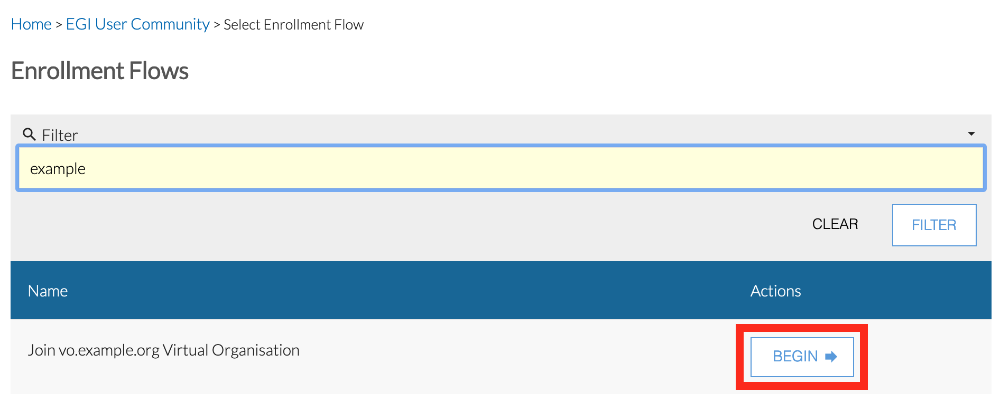

Virtual Organisations (VOs) in Check-in are represented as Collaborative Organisation Units (COUs).

In order to join a Virtual Organisation you must have an EGI account. If you
don't have, then first [sign up for an EGI account](../signup/).

1. Login to [Check-in registry](https://aai.egi.eu/registry) with your EGI account.

1. Expand the **People** drop down menu and click **Enroll**.

   

1. Click the **Begin** link of the Enrollment flow of the VO you want to
   join

   

1. Click the **Begin** button to start the Enrollment flow

   

1.
    a. If there are no pending petitions the enrollment flow will continue as usual.

    b. If there is one pending petition:

      b1. If its status is in Pending Approval you will see a page similar to this:

      

      Where you can:

      * Click the **Notify Approver(s) Again** button and a reminder email will be sent to approver(s)

      * Click **Proceed with new enrollment**, so a new enrollment flow will start

      * Click **Delete and proceed with new enrollment**.
      In this case, the pending petition will be deleted and a new enrollment flow will be created.

    b2. If its status is not in `Pending Approval`, `Pending Confirmation` or
    `Finalized` you will see a page similar to this:

    

    Where you can:

    * Click the **Resume** button and continue the enrollment flow

    * Click **Proceed with new enrollment**, so a new enrollment flow will start

    * Click **Delete and proceed with new enrollment**.
    In this case, the pending petition will be deleted and a new enrollment flow will start.
  
    c. If there is more than one pending petition related to the enrollment flow:

    

    Where you can:
    * Click the **View** Button of each petition and review it. (see (b) use case above)

    * Click **Proceed with new enrollment** and a new enrollment flow will start
