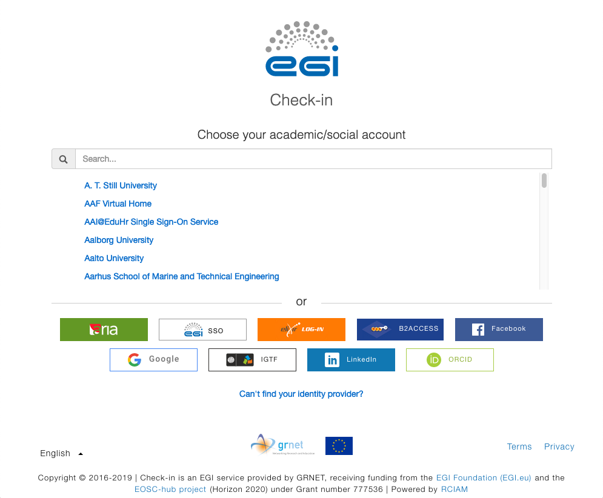
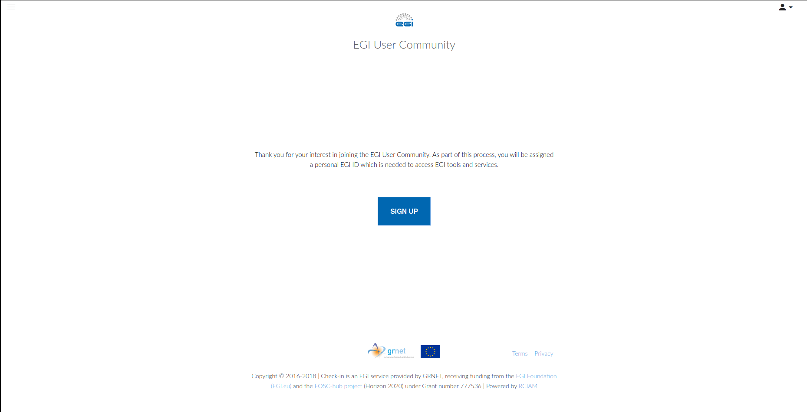
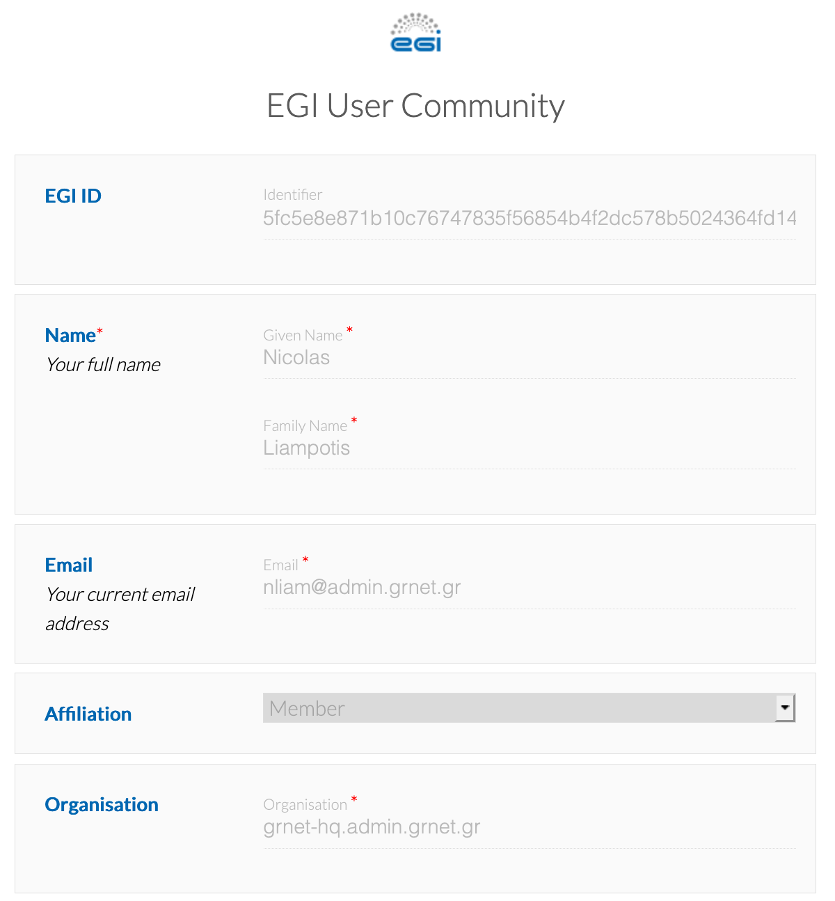
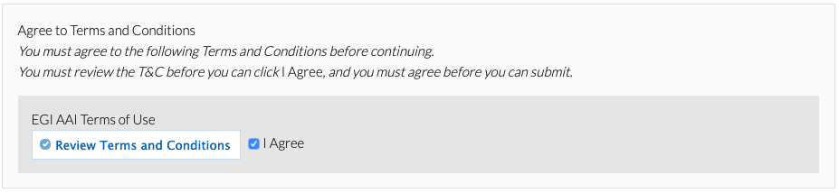

You need to sign up for an account for accessing the EGI serives. As part of
this process you will be assigned a personal unique **EGI ID** which will be
then used across all EGI tools and services. Follow the instructions below
to get started:

1. Go to https://aai.egi.eu/signup. This will show you the identity provider
   discovery page: browse through the list of Identity Providers to find your
   Home Organisation, *or, alternatively,* type the name of your Home
   Organisation in the search box. Note that the names are localised based on
   the selected language.

   

1. Enter your login credentials to authenticate yourself with your Home
   Organisation

1. After successful authentication, you may be prompted by your Home
   Organisation to consent to the release of personal information to the
   **EGI AAI Service Provider Proxy**.

1. After successful authentication, you will be redirected to the EGI account
   registration form. On the introductory page, click **Begin** to start the
   registration process.

   

1. EGI requires some basic information from you, depending on the attributes
   released by your Identity Provider, you may need to provide the values
   of the missing attributes.

   

1. On the registration form, click **Review Terms and Conditions** ([Acceptable
   Use Policy and Conditions of Use - EGI AUP](https://documents.egi.eu/document/2623))

1. If you agree to the Terms of Use, select the **I Agree** option.
   *Important: You will not be able to agree to the terms until you review
   them.*

   

1. Finally, click **Submit** to submit your request. *Important: You will
   not be able to submit your request until you agree to the terms.*

1. After submitting your request, Check-in will send you an email with a
   verification link. After you click that link, you'll be taken to the request
   confirmation page. *Important: If you do not find the email in your Inbox,
   please check your Spam or Junk folder for an email from "EGI AAI
   Notifications". If you do find the email in these folders, mark the email
   as "safe" or "not spam" to ensure that you receive any future notifications
   about your EGI ID.*

1. After reviewing your request, click **Confirm** and re-authenticate
   yourself using the Identity Provider you selected before.

1. In the case of the **Sign Up** registration, you need to wait for an
   EGI User Sponsor to approve your request to join the EGI User Community.
   Upon approval, EGI AAI will send you a notification email.

Note: After your registration has been completed, you can manage your profile
through the [EGI Account Registry portal](https://aai.egi.eu/registry).
