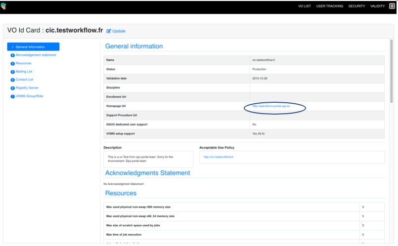
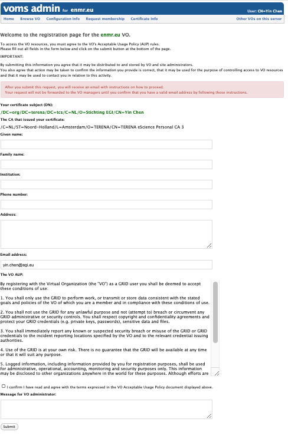

## Authentication
Some EGI services authentication is based on [X509](https://tools.ietf.org/html/rfc5280)
certificates. The certificates are issued by Certification Authorities (CAs)
part of the [EUGridPMA](https://www.eugridpma.org/) federation which is also
part of [IGTF](https://www.igtf.net/) (International Global Trust Federation).

The role of a Certification Authorities (CA) is to guarantee that users are who
they claim to be and are entitled to own their certificate. It is up to the
users to discover which CA they should contact. In general, CAs are organised
geographically and by research institutes. Each CA has its own procedure to
release certificates.

EGI sites, endpoints and tools accept certificates part of the
[EUGridPMA](https://www.eugridpma.org/) distribution. If your community VO is
enabled on that site, your certificate will be accepted by that site since all
certificates are recognized at site level.

Usually, a certificate can be installed by command line tools, but they can
also be stored in the web browser to access EGI web tools and services.

### Get a Certificate

The [list of EGI recognised CAs](http://www.eugridpma.org/members/worldmap/)
provides a clickable map to find your nearby CA.  Several of these offer the
option to get an 'eScience Personal' certificate online from the Terena
Certificate Service CA. [Check the countries where this is
available](https://www.terena.org/activities/tcs/participants.html).

If eScience Personal certificate is not available in your country, then
obtain a certificate from a regular [IGTF CA](https://www.igtf.net/pmamap).
Once received the request, the CA will have to confirm your authenticity through
your certificate. This usually involves a physical meeting or a phone call with
a Registration Authority (RA). A RA is delegated by the CA to verify the
legitimacy of a request, and approve it if it is valid. The RA is usually
someone at your home institute, and will generally need some kind of ID to
prove your identity.

More information can be found at [info](https://wiki.egi.eu/wiki/USG_Getting_Certificate#Requesting_the_Certificate).

### Install a Certificate

After approval, the certificate is generated and delivered to you.
This can be done via e-mail, or by giving instructions to you to download it
from a web page.

### Browser installation
Install the certificate in your browser. If you don’t know how to upload your
certificate in your browser have a look at the [examples](https://ca.cern.ch/ca/Help/).

### Install a Grid Host Certificate

To use EGI services with your certificate, you must first save your certificate
to disk.

The received certificate will usually be in one of two formats:
- _Privacy Enhanced Mail Security Certificate (PEM)_ with extension `.pem` or
- _Personal Information Exchange File (PKCS12)_ with extensions `.p12` or `.pfx`.

The latter is the most common for certificates exported from a browser
(e.g. Internet Explorer, Mozilla and Firefox), but the `PEM` format is
currently needed on EGI user interface. The certificates can be converted from
one format to the other using the `openssl` command.
If the certificate is in `PKCS12` format, then it can be converted to `PEM`
using `pkcs12`:

1. First you will need to create the private key, use `-nocerts`. Open your
   terminal, enter the following command:

   ``` shell
   $ openssl pkcs12 -nocerts -in my_cert.p12 -out userkey.pem
   ```

   where:

   File Name      | Description
   ---------------|-------------------------------
   `my_cert.p12`  |is the input PKCS12 format file;
   `userkey.pem`  |is the output private key file;
   `usercert.pem` |is the output PEM certificate file.

   When prompted to `“Enter Import Password”`, simply press enter since no
   password should have been given when exporting from keychain.
   When prompted to `“Enter PEM pass phrase”`, enter the pass phrase of your
   choice, e.g. `1234`.

2. Now you can create the certificate, use `-clcerts`,  (use `-nokeys` hereu
   will not output private key), and the command is:

   ``` shell
   $ openssl pkcs12 -clcerts -nokeys -in my_cert.p12 -out usercert.pem
   ```

   When prompted to `“Enter Import Password”`, simply press enter since no
   password should have been given when exporting from keychain.

   For further information on the options of the pkcs12 command, consult
   `man pkcs12`

It is strongly recommended that the names of all these files are kept as shown.
Once in PEM format, the two files, `userkey.pem` and `usercert.pem`, should be
copied to a _User Interface (UI)_. For example, the ‘standard’ location for
Mac would be `.globus` directory in your `$HOME`. I.e. `$HOME/.globus/`

More information can be found at: [info](https://ca.cern.ch/ca/Help/)

## Authorisation

The sites authorise the access to their resources to a VO according to
their own access policies, resource location, how many resources is the VO
allowed to use. There are finer authorization policies, including groups,
roles, in this way, the users can be structured in a VO. So, it is not a 0/1
authorization policy.

The community has full control of the access to the VO according to community
authorization policies. The VO membership, groups and roles are managed by
VO managers (Privileged VO members) independently by using the Virtual
Organization Membership Service (VOMS).

### VOMS

The Virtual Organization Membership Service (VOMS) is an attribute authority
which serves as central repository for VO user authorization information,
providing support for sorting users into group hierarchies, keeping track ofu
their roles and other attributes in order to issue trusted attribute
certificates and SAML assertions used in the Grid environment for authorization
purposes. VOMS is composed of two main components:

* the VOMS core service, which issues attribute certificates to authenticated clients
* the VOMS Admin service, which is used by VO manager to administer VOs and manage user membership details.

How does it work? Usually, users submit tasks/jobs to the infrastructure that
are attached with their own credential, and the credential is attached with a
proxy certificate that is a short-term credential signed with the user
certificate and is extended with the VO attributes. In general speaking, a user
credential is just an ID, and a proxy contains the VO details, so a resource
site by receiving the proxy can recognize that the user is part of such a VO
with such a role from such a group. A user can be part of multiple VO, thus can
generate multiple proxies.

### Register to a VO
Visit [Operation Portal](https://operations-portal.egi.eu) to search for
existing VOs

1. If there are any community VOs matching your requirements (with
   _Registry System_ is _VOMS_), then click _Action_-> _Details_ to look at
   the VO information. In the _VO Id Card_ page, click the link for
   _Enrollment Url_, it will take you to the VO VOMS page.
   __You should have already discussed with the EGI support team, they would
   help you to contact the VO managers and get approval for your access.__
   

1. If there are no relevant VOs, you can send a request [to register a
   new VO](ttps://operations-portal.egi.eu/vo/registration). (Note, for EGI
   services, you should request for `VOMS configuration`, once VO is
   configured, you will be notified about your VO VOMS link). More information
   can be found at [Guideline for VO registration](https://wiki.egi.eu/wiki/PROC14_VO_Registration).
   **Again, this is usually guided by the EGI support team. You should already
   have a meeting with them to discuss your requirements. They will help you to
   get resources from EGI providers, and sign [SLA](https://wiki.egi.eu/wiki/EGI_OLA_SLA_framework#Service_Level_Agreemens) with you.**

1. Request your VO membership at VO VOMS page. You will have to enter required
   information and then wait for approval. For example, you can
   [register to the EGI catch-all vo _fedcloud.egi.eu_](https://perun.metacentrum.cz/perun-registrar-cert/?vo=fedcloud.egi.eu):

   

## Creating a proxy

### VOMS configuration

Every VO needs two different pieces of information:

-   the `vomses` configuration files, where the details of the VO are
    stored (e.g. name, server, ports). These are stored by default at
    `/etc/vomses` and are normally named following this convention:
    `<vo name>.<server name>` (e.g. for fedcloud.egi.eu VO, you would
    have `fedcloud.egi.eu.voms1.grid.cesnet.cz` and
    `fedcloud.egi.eu.voms2.grid.cesnet.cz`.
-   the `.lsc` files that describe the trust chain of the VOMS server.
    These are stored at `/etc/grid-security/vomsdir/<vo name>` and there
    should be one file for each of the VOMS server of the VO.

You can check specific configuration for your VO at the [Operations
portal](https://operations-portal.egi.eu/vo). Normally each VOMS server
has a *Configuration Info* link where the exact information to include
in the `vomses` and `.lsc` files.

### Proxy creation

Once you have the VO information configured (`vomses` and `.lsc`) and
your certificate available in your `$HOME/.globus` directory you can
create a VOMS proxy to be used with clients with:

``` {.console}
voms-proxy-init --voms <name of the vo> --rfc
```

See for example, using `fedcloud.egi.eu` VO:

``` {.console}
voms-proxy-init --voms fedcloud.egi.eu --rfc
Enter GRID pass phrase:
Your identity: /DC=org/DC=terena/DC=tcs/C=NL/O=EGI/OU=UCST/CN=Enol Fernandez
Creating temporary proxy ......................................................... Done
Contacting  voms1.grid.cesnet.cz:15002 [/DC=cz/DC=cesnet-ca/O=CESNET/CN=voms1.grid.cesnet.cz] "fedcloud.egi.eu" Done
Creating proxy ................................................................... Done

Your proxy is valid until Mon Feb  4 23:37:21 2019
```
