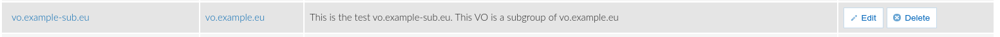
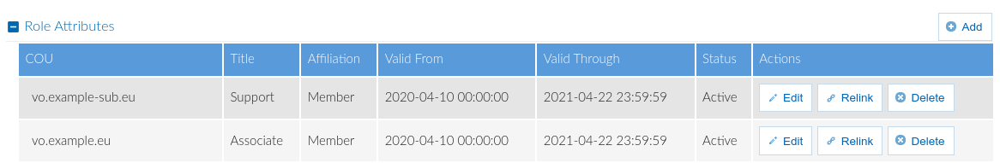

According to [AARC-G002](https://aarc-community.org/guidelines/aarc-g002/) the
information about the groups a user is a member of is commonly used by Service
Providers in order to authorise user access to protected resources.The entity
responsible for disseminating this information is the EGI Check-in AAI proxy and
the format used is that of a URN namespace, called eduPersonEntitlement, that is
uniformly interpreted across infrastructures.

The general form of the eduPersonEntitlement string is:

`<NAMESPACE>:group:<VO>[:<GROUP>*][:role=<ROLE>]#<GROUP-AUTHORITY>`

As a result, an eduPersonEntitlement string informing the Service Provider that
the user has the role Associate in the vo.example.eu VO (modelled as a COU) is:

`urn:mace:egi.eu:group:vo.example.eu:role=associate#aai.egi.eu`

## Entitlement Construction

For the case of the CO Person with a profile/canvas, like the one provided
above, we expect to get entitlements for all the entries listed under the tab
Role Attributes. Additionally, we will get entitlements for all the General
Purpose(GP) Groups enlisted under the tab Groups. These GP Groups have no
prefix, neither CO: nor CO:COU, and no postfix, neither active nor all.

### VO(COU)

For each entry in the table Role Attributes, that is in status **Active** or
**Grace Period**, we create one eduPersonEntitlement for each different Role and
for the Affiliation. For example, the CO Person from above is affiliated as
Member to the VO vo.example.eu and has been assigned the role of an Associate.
This will generate two entitlements as:

`urn:mace:egi.eu:group:vo.example.eu:role=associate#aai.egi.eu`

`urn:mace:egi.eu:group:vo.example.eu:role=member#aai.egi.eu`

### VO Groups (sub COUs)

There are occasions where we need a VO to be organized in subgroups. For example
vo.example.eu contains the sub-COU vo.example-sub.eu.

The CO Person is affiliated as member and with the Role of Support in the VO
sub-group vo.example-sub.eu:

In such occasions the eduPersonEntitlement will have the following structure:

`urn:mace:egi.eu:group:vo.example.eu:vo.example-sub.eu:role=support#aai.egi.eu`

`urn:mace:egi.eu:group:vo.example.eu:vo.examples-sub.eu:role=member#aai.egi.eu`
