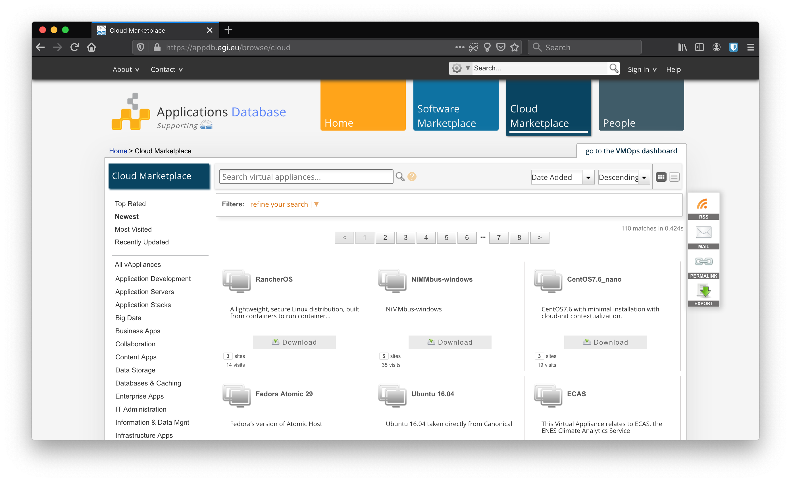

Users of the EGI Cloud create Virtual Machines (VMs) on the providers. Those VMs
are started from images: templates for the root volume of the running instances,
i.e. operating system and applications available initially on a VM. The AppDB
collects the Virtual Machine Images available on the service as Virtual
Appliances (VA).

Any user can register new Virtual Appliances at the AppDB, these are then
managed by special VO members that curate which appliances are available to
their VO.

## AppDB Cloud Marketplace



The [AppDB](https://appdb.egi.eu) is a browsable catalogue of Virtual Appliances
that users can start at the providers. You can find below a set of reference
guides for the catalogue:

- [How to register a VA?](https://wiki.appdb.egi.eu/main:faq:how_to_register_a_virtual_appliance):
  any registered user can register VAs in AppDB for anyone to download or for
  making them available at the EGI Cloud providers once a VO adds it to the
  _VO-wide image list_.
- Once registered, VAs can be managed as described in the
  [VA management guide](https://wiki.appdb.egi.eu/main:guides:guide_for_managing_virtual_appliance_versions_using_the_portal).
- VO managers select VAs to be available at the providers following the
  [VO-wide image list management](https://wiki.appdb.egi.eu/main:guides:manage_vo-wide_image_lists).

Check the full list of
[Cloud marketplace guides](https://wiki.appdb.egi.eu/main:guides#cloud_marketplace)
and
[Cloud marketplace FAQ](https://wiki.appdb.egi.eu/main:faq#cloud_marketplace)
for more information about the AppDB features.

## Custom images

Packaging your application in a custom VM image is a suggested solution in one
of the following cases:

- your particular OS flavor is not available at AppDB;
- installation of your application is very complex and time-consuming for being
  performed during contextualization; or
- you want to reduce the number of \'moving-parts\' of your software stack and
  follow an _immutable infrastructure_ approach for deploying your application.

Custom VM images can be crafted in different ways. The two main possibilities
are:

- start from scratch, creating a virtual machine, installing an OS and the
  software on top of it, then taking the virtual machine OS disk as custom
  image; or
- dump an existing disk from a running VM or physical server and modify it, if
  needed, to run on a virtualisation platform.

In this guide we will focus on the first option, because it tends to produce
cleaner images and reduces the risks of hardware conflicts. Snapshotting may be
also restricted by the cloud providers or by security policies.

Advantages:

- Possibility to build the virtual disk directly from a legacy machine, dumping
  the contents of the disk.
- Possibility to speed-up the deployment for applications with complex and big
  installation packages. This because you do not need to install the application
  at startup, but the application is already included in the machine.

Disadvantages:

- Building a virtual disk directly from a legacy machine poses a set of
  compatibility issues with hardware drivers, which usually differs from a
  virtual and physical environment and even between different virtual
  environments.
- You need to keep your machine updated. Outdated VM disk images may take a long
  time to startup due to the need to download and install the latest OS updates.
- If you are using special drivers or you are not packaging correctly the disk,
  your custom VM image may not run (or run slowly) on different cloud providers
  based on different virtualisation technologies.
- VM images on public clouds are sometimes public, thus be aware of installing
  proprietary software on custom images, since other users may be able to run
  the image or download it.
- In general, the effort to implement this solution is higher than the basic
  contextualization.

### Image size and layout

The larger the VM image, the longer it will take to be distributed to the
providers and the longer it will take to be started on the infrastructure. As a
general rule, always try to make images as smaller as possible following these
guidelines:

- **DO NOT** include (big) data in your image. There are other mechanisms for
  accessing data from your VM (block/object storage,
  [CVMFS](https://www.gridpp.ac.uk/wiki/RALnonLHCCVMFS))

- **DO NOT** include (big) empty space or swap in your image. Extra space for
  your computation or swap can be added with block storage once the VM is booted
  or using VM flavors that have extra disk allocated for your VM.

- **DO NOT** install un-needed software. Tools like GUI are of no-use in most
  cases since you will have no access to the graphical console of the VM.

- **DO** adjust the size of the images as much as possible. As stated above,
  empty space can be allocated on runtime easily.

- **DO** use compressed image formats, like qcow2 or vmdk (used in OVA) to
  minimize the size of the image. Preferred format for images in EGI is OVA as
  it\'s standardised.

- **DO** fill with `0` the empty disk space of your image so when compressed it
  can be significantly reduced, e.g. using:

  ```{.console}
  dd if=/dev/zero of=/bigemptyfile bs=4096k
  rm -rf /bigemptyfile
  ```

- **DO** use a single partition (no /boot, no swap) for the disk layout and
  avoid LVM. This will allow the cloud provider to easily resize your partition
  when instantiated and to modify files in it if needed.

### Contextualization and credentials

{}

**Do NOT include any credentials on your images**.

{}

You should never include any kind of credentials on your images, instead you
should use contextualization.
[cloud-init](https://cloudinit.readthedocs.io/en/latest/) is a tool that will
simplify the contextualization process for you. This is widely available as
packages in major OS distributions and is supported by all the providers of the
EGI Cloud and most of the commercial providers.

[cloud-init](https://cloudinit.readthedocs.io/en/latest/) documentation contains
detailed examples on how to create users, run scripts, install packages and
several other actions supported by the tool.

For complex setups, especially when applications involve multiple VMs it may be
useful to use cloud-init to bootstrap some
[Configuration Management Software](https://en.wikipedia.org/wiki/Comparison_of_open-source_configuration_management_software)
that will manage the configuration of the VMs during runtime.

### Security

- **Always remove all default passwords and accounts from your VM.**
- Disable all services unless necessary for the intended tasks.
- Make sure the firewall configuration (iptables for Linux, also on IPv6) is
  minimally open.
- Put no shared credentials (passwords) in any image.

You should also follow the best practice guides for each service that\'s exposed
to the outside world. See for example guides for:

- [ssh](http://wiki.centos.org/HowTos/Network/SecuringSSH)
- [tomcat](https://www.owasp.org/index.php/Securing_tomcat)

See also
[AWS security Best Practices](https://aws.amazon.com/whitepapers/aws-security-best-practices/)

### Tools

Whenever possible, automate the process of creating your images. This will allow
you to:

- get reproducible results
- avoid tedious manual installation steps
- quickly produce updated versions of your images.

EGI uses [packer](https://packer.io) as a tool for automating the creation of
our base images. This tool can use [VirtualBox](https://www.virtualbox.org/) as
a hypervisor for the creation of the images and guarantees identical results
under different platforms and providers.

Check the
[fedcloud-vmi-templates github repo](https://github.com/EGI-Foundation/fedcloud-vmi-templates)
with all the packer recipes used to build our images and re-use them as needed
for your images.
