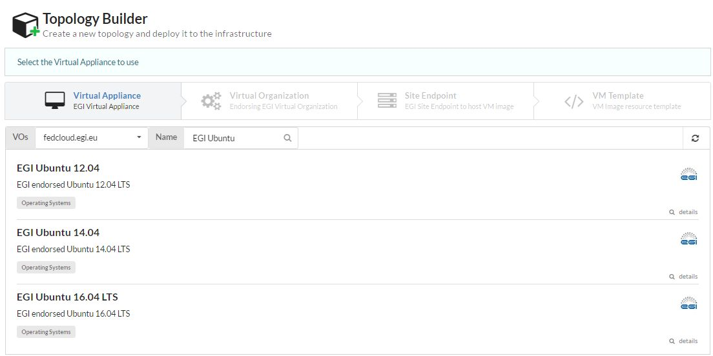
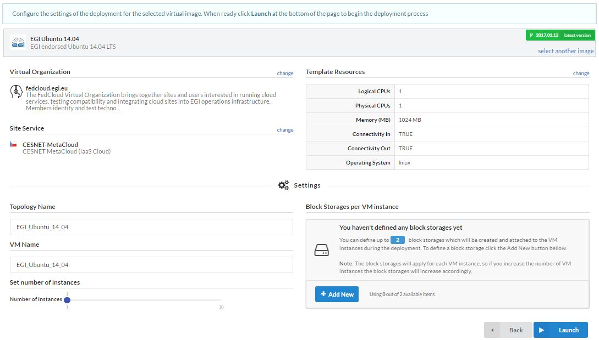
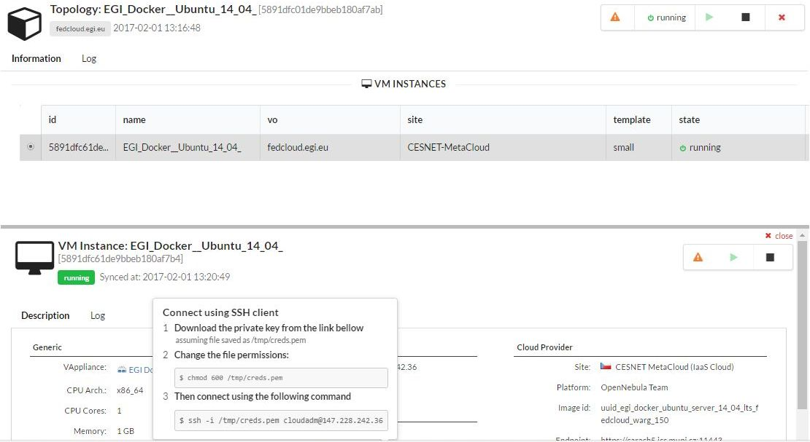

The [EGI Application Database (AppDB)](https://appdb.egi.eu/) includes a web GUI
for management of Virtual Machines (VMs) on the federated infrastructure.

This GUI is available for a set of
[selected VOs](https://wiki.appdb.egi.eu/main:faq:which_vos_are_supported_by_the_vmops_dashboard).
If your VO is not listed and you are interested in getting support, please
[open a ticket](https://ggus.eu) or contact us at `support _at_ egi.eu`.

## Main user features

- User identification with Check-in, with customised view of the VAs and
  resource providers based on the VO membership of the user.
- Management of VMs in _topologies_, containing one or more instances of a given
  VA.
- Attachment of additional block storage to the VM instances.
- Start/Stop VMs without destroying the VM (for all VMs of a topology or for
  individual instances within a topology)
- Single control of topologies across the whole federation.

## Quick start

1. Log into the [VMOps dashboard](https://dashboard.appdb.egi.eu/vmops) using
   EGI Check-in.

1. Click on \"Create a new VM Topology\" to start the topology builder, this
   will guide you through a set of steps:

   1. Select the Virtual Appliance you want to start, these are the same shown
      in the [AppDB Cloud Marketplace](https://appdb.egi.eu/browse/cloud), you
      can use the search field to find your VA;

      

   1. select the VO to use when instantiating the VA;

   1. select the provider where to instantiate the VA; and finally

   1. select the template (VM instance type) of the instance that will determine
      the number of cores, memory and disk space used in your VM.

1. Now you will be presented with a summary page where you can further customise
   your VM by:

   - Adding more VMs to the topology
   - Adding block storage devices to the VMs
   - Define contextualisation parameters (e.g. add new users, execute some
     script)

     

1. Click on \"Launch\" and your deployment will be submitted to the
   infrastructure.

The topology you just created will appear on your \"Topologies\" with all the
details about it, clicking on a VM of a topology will give you details about its
status and IP. VMOps will create a default `cloudadm` user for you and create
ssh-key pair for login (you can create as many users as needed with the
contextualisation options of the wizard described above).

VMOps was presented in one of the [EGI Webinars](https://www.egi.eu/webinars/)
in 2020. The [indico page](https://indico.egi.eu/event/5272/) contains more
details and there is also a video recording available on
[Youtube](https://youtu.be/0YuuKA_4pSM).
