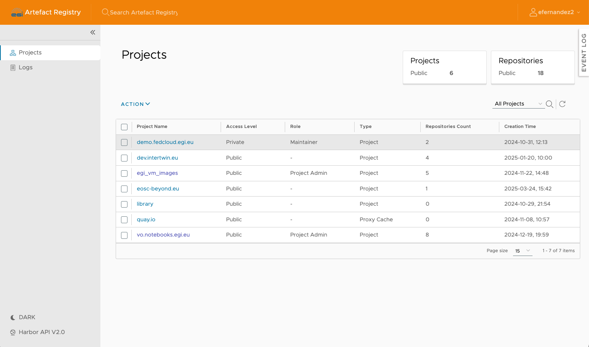
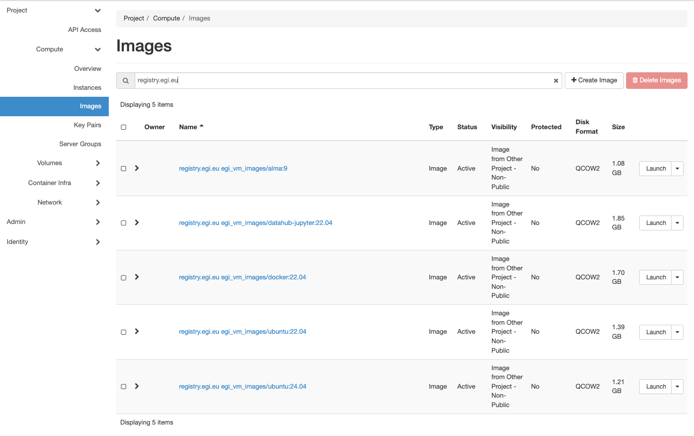

Users of the EGI Cloud create Virtual Machines (VMs) on the providers. Those VMs
are started from images: templates for the root volume of the running instances,
i.e. operating system and applications available initially on a VM. The Artefact
Registry collects the Virtual Machine Images available on the providers.

## Artefact Registry



The [Artefact Registry](https://registry.egi.eu) is a OCI-compliant catalogue of
artefacts (including container images, VM images and helm charts) based on
[Harbor](https://goharbor.io/) where users can upload their images.

Images in the Artefact Registry are organised into projects where images are
pushed to. Access to projects is granted based on the membership and role of
users within a VO. For a given project, only users with the appropriate roles
can perform certain operations.

### EGI images

EGI produces a set of basic images that are automatically synced to all the
providers and available for all the supported VOs.

These images are built automatically using [packer](https://packer.io) and
[Ansible](https://docs.ansible.com/) and uploaded to a dedicated project named
`egi_vm_images` at the Artefact Registry. Build scripts, packer templates, and
ansible playbooks are available in the
[fedcloud-vmi-templates GitHub repository](https://github.com/EGI-Federation/fedcloud-vmi-templates).
The images are built regularly to avoid any potential vulnerabilities.

EGI images have minimal OS installation with
[cloud-init](https://cloudinit.readthedocs.io/en/latest/) for contextualization
and follow the `registry.egi.eu egi_vm_images/<image name>:<version>` naming
convention.



### Custom VO images

#### VO project in Artefact Registry

The Artefact Registry can store VM and container images. Besides the
`egi_vm_images` projects, VOs can request their project in the Artefact Registry
for storing custom images that include software needed to support the VOs
activities. For doing so, open [Helpdesk](https://helpdesk.ggus.eu) ticket as
follows:

- Group: Artefact Registry (select Second Level/Services/EGI Services and
  Service Components/Artefact Registry)
- Ticket body:

  ```plaintext
  Dear Artefact Registry,

  I'd like to request a new project for VO `<name of the VO>`.
  The entitlement to authorize read-only (list, pull) access is `<entitlement to use>`.
  The entitlement to authorize write (list, pull, push) access is `<entitlement to use>`.

  Thanks!
  ```

Once the project is created, you will be able to login and manage artefacts.

#### Uploading to the registry

The Artefact Registry can store arbitrary binary artifacts and those matching
the expected metadata will be synced to the sites. For uploading the images, any
OCI registry compliant tool can be used. We rely on [`oras`](https://oras.land)
for uploading the EGI images.

Images must have a `eu.egi.cloud.tag` annotation in their manifest for them to
be synced and the following additional annotations are expected to be available:

- `org.openstack.glance.disk_format`: with the disk format of the image (e.g.
  `raw` or `qcow2`)
- `org.openstack.glance.container_format`: with the glance container format
  (`bare` should be used in most cases), see
  [glance documentation](https://docs.openstack.org/glance/latest/user/formats.html).
- `eu.egi.cloud.image.title`: Human readable title.
- `eu.egi.cloud.description`: A description of the image.
- `org.openstack.glance.architecture`: Image architecture.
- `org.openstack.glance.os_distro`: OS distro name (e.g. `ubuntu`).
- `org.openstack.glance.os_version`: OS version (e.g. `24.04` for Ubuntu 24.04).
- `org.openstack.glance.os_type`: OS type (e.g. `linux`).

For the upload, you need to:

1. Login to the registry, you can find credentials in your registry profile:

```shell
oras login -u <user> registry.egi.eu
```

2. Prepare an
   [annotation file](https://oras.land/docs/how_to_guides/manifest_annotations/#using-a-json-file)
   with the expected metadata. You can find below an example for an AlmaLinux
   image file named `alma-9.qcow2`. It also includes a `$manifest` entry with
   annotation of the manifest itself.

```json
{
  "$manifest": {
    "org.opencontainers.image.revision": "7b98c834862f2e7e342fad7f9e175ea8c74aa4f3",
    "org.opencontainers.image.source": "https://github.com/EGI-Federation/fedcloud-vmi-templates"
  },
  "alma-9.qcow2": {
    "eu.egi.cloud.image.title": "EGI Alma 9 image",
    "org.openstack.glance.architecture": "x86_64",
    "org.openstack.glance.os_distro": "alma",
    "org.openstack.glance.os_type": "linux",
    "org.openstack.glance.os_version": "9",
    "org.openstack.glance.disk_format": "qcow2",
    "eu.egi.cloud.tag": "2025-06-10-7b98c834",
    "org.openstack.glance.container_format": "bare"
  }
}
```

3. Upload the image and the annotation file:

```shell
oras push --annotation-file <annotation json> \
     registry.egi.eu/<project_name>/<repository>:<tag> \
     <image file>
```

#### Building your own image

Packaging your application in a custom VM image is a suggested solution in one
of the following cases:

- your particular OS flavor is not available;
- installation of your application is very complex and time-consuming for being
  performed during contextualization; or
- you want to reduce the number of \'moving-parts\' of your software stack and
  follow an _immutable infrastructure_ approach for deploying your application.

Custom VM images can be crafted in different ways. The two main possibilities
are:

- start from scratch, creating a virtual machine, installing an OS and the
  software on top of it, then taking the virtual machine OS disk as custom
  image; or
- dump an existing disk from a running VM or physical server and modify it, if
  needed, to run on a virtualisation platform.

In this guide we will focus on the first option, because it tends to produce
cleaner images and reduces the risks of hardware conflicts. Snapshotting may be
also restricted by the cloud providers or by security policies.

Advantages:

- Possibility to build the virtual disk directly from a legacy machine, dumping
  the contents of the disk.
- Possibility to speed-up the deployment for applications with complex and big
  installation packages. This because you do not need to install the application
  at startup, but the application is already included in the machine.

Disadvantages:

- Building a virtual disk directly from a legacy machine poses a set of
  compatibility issues with hardware drivers, which usually differs from a
  virtual and physical environment and even between different virtual
  environments.
- You need to keep your machine updated. Outdated VM disk images may take a long
  time to startup due to the need to download and install the latest OS updates.
- If you are using special drivers or you are not packaging correctly the disk,
  your custom VM image may not run (or run slowly) on different cloud providers
  based on different virtualisation technologies.
- VM images on public clouds are sometimes public, thus be aware of installing
  proprietary software on custom images, since other users may be able to run
  the image or download it.
- In general, the effort to implement this solution is higher than the basic
  contextualization.

##### Image size and layout

The larger the VM image, the longer it will take to be distributed to the
providers and the longer it will take to be started on the infrastructure. As a
general rule, always try to make images as smaller as possible following these
guidelines:

- **DO NOT** include (big) data in your image. There are other mechanisms for
  accessing data from your VM ([block](../block-storage/)/
  [object](../../../data/storage/object-storage/) storage,
  [CVMFS](../../software-distribution))

- **DO NOT** include (big) empty space or swap in your image. Extra space for
  your computation or swap can be added with block storage once the VM is booted
  or using VM flavors that have extra disk allocated for your VM.

- **DO NOT** install un-needed software. Tools like GUI are of no-use in most
  cases since you will have no access to the graphical console of the VM.

- **DO** adjust the size of the images as much as possible. As stated above,
  empty space can be allocated on runtime easily.

- **DO** use compressed image formats, like qcow2 or vmdk (used in OVA) to
  minimize the size of the image. Preferred format for images in EGI is OVA as
  it\'s standardised.

- **DO** fill with `0` the empty disk space of your image so when compressed it
  can be significantly reduced, e.g. using:

  ```shell
  dd if=/dev/zero of=/bigemptyfile bs=4096k
  rm -rf /bigemptyfile
  ```

- **DO** use a single partition (no /boot, no swap) for the disk layout and
  avoid LVM. This will allow the cloud provider to easily resize your partition
  when instantiated and to modify files in it if needed.

##### Contextualization and credentials

{}

**Do NOT include any credentials on your images**.

{}

You should never include any kind of credentials on your images, instead you
should use contextualization.
[cloud-init](https://cloudinit.readthedocs.io/en/latest/) is a tool that will
simplify the contextualization process for you. This is widely available as
packages in major OS distributions and is supported by all the providers of the
EGI Cloud and most of the commercial providers.

[cloud-init](https://cloudinit.readthedocs.io/en/latest/) documentation contains
detailed examples on how to create users, run scripts, install packages and
several other actions supported by the tool.

For complex setups, especially when applications involve multiple VMs it may be
useful to use cloud-init to bootstrap some
[Configuration Management Software](https://en.wikipedia.org/wiki/Comparison_of_open-source_configuration_management_software)
that will manage the configuration of the VMs during runtime.

##### Security

- **Always remove all default passwords and accounts from your VM.**
- Disable all services unless necessary for the intended tasks.
- Make sure the firewall configuration (iptables for Linux, also on IPv6) is
  minimally open.
- Put no shared credentials (passwords) in any image.

You should also follow best practice guides for each service that's exposed to
the outside world. See also
[AWS security Best Practices](https://aws.amazon.com/whitepapers/aws-security-best-practices/)

##### Tools

Whenever possible, automate the process of creating your images. This will allow
you to:

- Get reproducible results
- Avoid tedious manual installation steps
- Quickly produce updated versions of your images

Check out the
[fedcloud-vmi-templates GitHub repository](https://github.com/EGI-Federation/fedcloud-vmi-templates)
for examples of images that can be built in a completely automated workflow
using `packer` and GitHub Actions.
